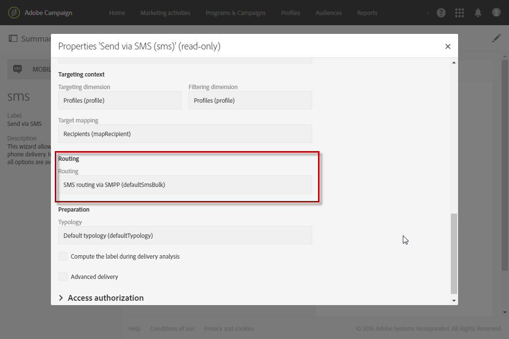

# SMS メッセージについて{#about-sms-messages}

Adobe Campaignでは、SMS （ショートメッセージサービス）メッセージを配信できます。

>[!NOTE]
>
>SMS チャネルはアドオンです。 使用許諾契約書を確認してください。

SMS メッセージの場合、テキスト形式のメッセージのみを作成、変更およびパーソナライズできます。 SMS メッセージは、送信前にプレビューすることもできます。

SMS メッセージの長さは、GSM エンコーディングの場合は160文字、Unicodeの場合は70文字に制限されます。 ただし、特定の特殊文字がメッセージの長さに影響を与える場合があります。 詳しくは、[SMS エンコーディング &#x200B;](../../administration/using/configuring-sms-channel.md#sms-encoding--length-and-transliteration)の節を参照してください。

SMS メッセージは、**[!UICONTROL Marketing activities]** メニュー、キャンペーン、またはワークフローから作成できます。[SMS メッセージの作成](../../channels/using/creating-an-sms-message.md)を参照してください。

携帯電話にSMS メッセージを配信するには、次のものが必要です。

* **[!UICONTROL Bulk delivery]**&#x200B;モードで&#x200B;**[!UICONTROL Mobile (SMS)]**&#x200B;チャネルに設定された&#x200B;**[!UICONTROL Routing]**&#x200B;外部アカウント。 詳しくは、[ルーティング](../../administration/using/configuring-sms-channel.md#defining-an-sms-routing)の節を参照してください。
* この外部アカウントに正しくリンクされている配信テンプレート。

**関連トピック：**

* [テンプレートの管理](../../start/using/marketing-activity-templates.md)
* [SMS 設定](../../administration/using/configuring-sms-channel.md#defining-an-sms-routing)
* [SMS レポート](../../reporting/using/sms-report.md)
* [Campaign Standard モバイルガイド](../../channels/using/get-started-communication-channels.md)

## SMS 配信テンプレート {#sms-delivery-template}

Adobe Campaignでは、モバイルデバイス向けの配信テンプレートを提供しています。 このテンプレートは、**[!UICONTROL Mobile (SMS)]** チャネルに使用される外部アカウントに正しくリンクされている必要があります。 アクセスして修正するには：

1. 詳細メニューから&#x200B;**[!UICONTROL Resources]** > **[!UICONTROL Templates]** > **[!UICONTROL Delivery templates]**&#x200B;を選択します。
1. マウスを使用して&#x200B;**[!UICONTROL Send via SMS]** テンプレートにカーソルを合わせ、「**要素を複製**」オプションを選択します。
1. 新しいテンプレートを選択します。
1. 「**[!UICONTROL Edit properties]**」ボタンをクリックします。
1. テンプレートプロパティの&#x200B;**[!UICONTROL Advanced parameters]** セクションで、SMSの配信に使用する外部アカウントにテンプレートがリンクされていることを確認します。

   

**関連トピック：**

* [テンプレートの管理](../../start/using/marketing-activity-templates.md)
