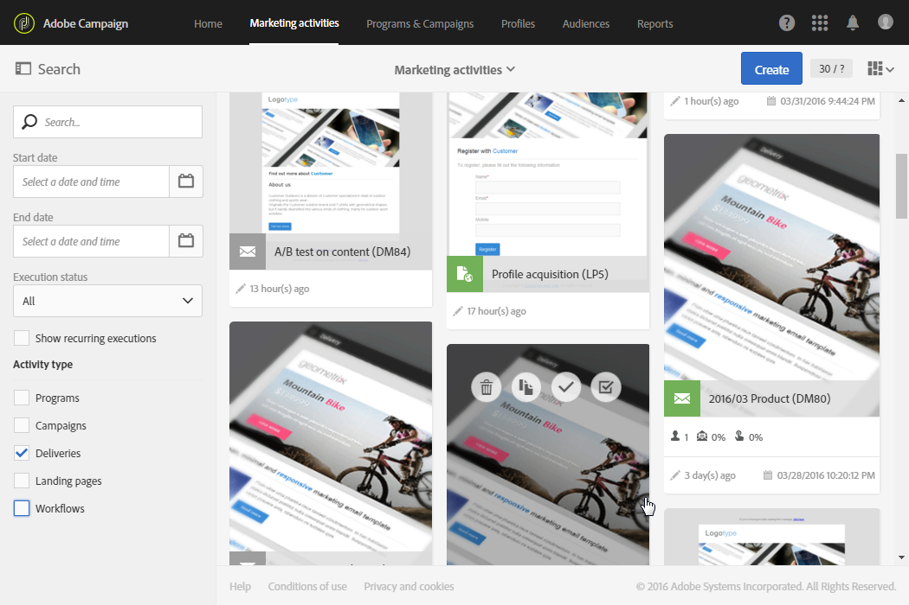

# メッセージへのアクセス{#accessing-messages}

ターゲット設定、メッセージの作成とパーソナライズ、通信の実行、関連する操作レポートなど、一連の高度な機能にアクセスできます。

メッセージにアクセスできます。

* キャンペーン内で
* Adobe Campaignホームページから
* マーケティング活動のリストから

## キャンペーン内のメッセージへのアクセス {#accessing-messages-in-campaigns}

キャンペーンのマーケティングアクティビティのリストにアクセスするには：

1. 上部ナビゲー **[!UICONTROL Marketing activities]** ションバーからに移動します。
1. Select **[!UICONTROL Marketing activities > Marketing plans > Programs & Campaigns]**.

   また、ホームページからカードを直 **[!UICONTROL Programs & Campaigns]** 接クリックすることもできます。 キャンペーンの詳細については、「プログラムとキャンペーン [」を参照してください](../../start/using/programs-and-campaigns.md) 。

1. プログラムを選択し、キャンペーンを選択します。

   

1. ドロップダウン **[!UICONTROL Summary]** リストをクリックします。
1. メッセージ **[!UICONTROL Search]** の表示方法（名前、日付、ステータス）をフィルターするには、をクリックします。

   定期的なメッセージをフィルタリングするには、対応するボックスをオンにします。

## メッセージリストへのアクセス {#accessing-the-message-list}

結合されたすべてのキャンペーンからマーケティングアクティビティの完全なリストにアクセスするには：

1. 上部ナビ **[!UICONTROL Marketing activities]** ゲーションバーからを選択します。

   ホームページのカードからもア **[!UICONTROL Marketing activities]** クセスできます。 マーケティングアクティビティのリストについて詳しくは、「マーケティングアクティビティの管 [理」の節を参照してくださ](../../start/using/marketing-activities.md#creating-a-marketing-activity) い。

1. マーケティングアクティビティを（名前、日付、ステータスまたはアクティビティタイプで）フィルタリングするには、マーケテ **[!UICONTROL Search]** ィングアクティビティのリストの左にあるフィールドを使用します。

## メッセージのライフサイクル {#message-life-cycle}

メッセージのステータスは、リスト内の特定の色で表されます。 使用可能なステータスは次のとおりです。

* **[!UICONTROL Editing]** （グレー）:メッセージを編集中です。
* **[!UICONTROL In progress]** （青）:メッセージを送信中です。
* **[!UICONTROL Finished]** （緑）:送信がエラーなく終了しました。
* **[!UICONTROL Erroneous]** （赤）:メッセージの準備中または送信中に送信がキャンセルされたか、エラーが発生しました。

   >[!NOTE]
   >
   >アクションが必要な場合、例えばメッセージの送信を確認する必要がある場合などに、黄色の通知バナーがカードの上に表示されます。

