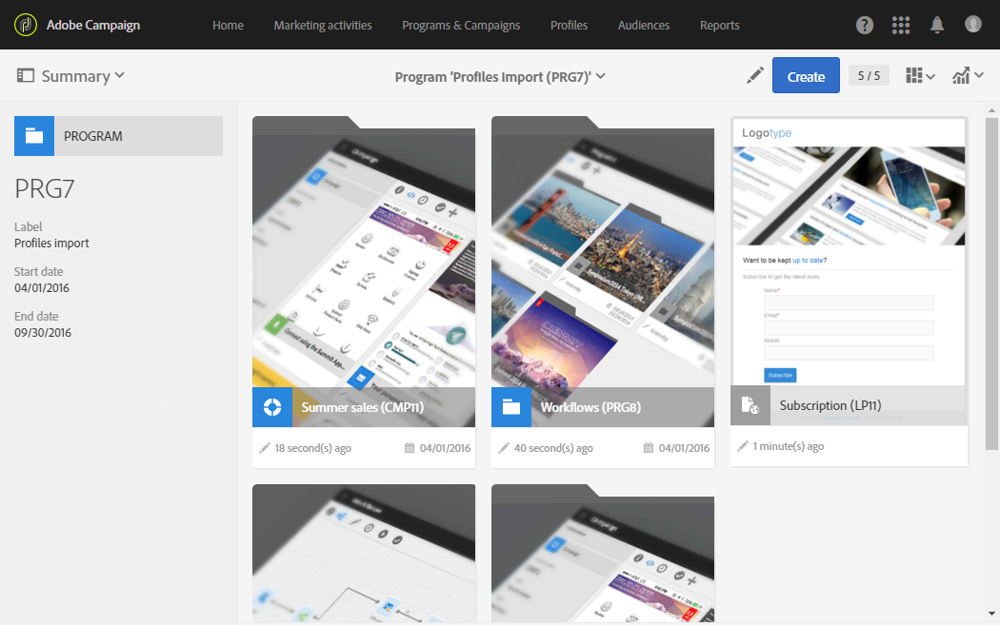

# Accessing messages{#accessing-messages}

ターゲット設定、メッセージの作成、パーソナライズ、関連する運用レポートへの通信の実行など、高度な機能のセットにアクセスできます。

メッセージにアクセスするには、次の手順に従います。

* キャンペーン内
* （Adobe Campaignホームページ）
* マーケティング活動のリストから

## Accessing messages in campaigns {#accessing-messages-in-campaigns}

キャンペーンのマーケティングアクティビティのリストにアクセスするには:

1. Go to **[!UICONTROL Marketing activities]** from the top navigation bar.
1. Select **[!UICONTROL Marketing activities > Marketing plans > Programs & Campaigns]**.

   You can also directly click the **[!UICONTROL Programs & Campaigns]** card from the home page. For more information on campaigns, refer to the [Programs and campaigns](../../start/using/programs-and-campaigns.md) section.

1. プログラムを選択し、キャンペーンを選択します。

   

1. **[!UICONTROL Summary]** ドロップダウンリストをクリックします。
1. Click **[!UICONTROL Search]** to filter the way messages are displayed (by name, date, or status).

   定期的なメッセージをフィルタリングするには、対応するボックスをチェックします。

## Accessing the message list {#accessing-the-message-list}

結合されたすべてのキャンペーンのマーケティングアクティビティの完全なリストにアクセスするには:

1. Select **[!UICONTROL Marketing activities]** from the upper navigation bar.

   You can also access it from the **[!UICONTROL Marketing activities]** card on the home page. For more information on the list of marketing activities, refer to the [Managing marketing activities](../../start/using/marketing-activities.md#creating-a-marketing-activity) section.

1. To filter the marketing activities (by name, date, status or activity type), use the **[!UICONTROL Search]** fields to the left of the list of marketing activities.

## Message life cycle {#message-life-cycle}

メッセージのステータスは、リスト内の特定の色で表されます。可能なステータスは次のとおりです。

* **[!UICONTROL Editing]** （グレー）:メッセージが編集中です。
* **[!UICONTROL In progress]** （青）:メッセージが送信されています。
* **[!UICONTROL Finished]** （緑色）:送信がエラーなしで終了しました。
* **[!UICONTROL Erroneous]** （赤）:送信がキャンセルされたか、メッセージの準備中または送信中にエラーが発生しました。

   >[!NOTE]
   >
   >メッセージの送信を確認する必要がある場合など、カードの上に黄色の通知バナーが表示される場合があります。

