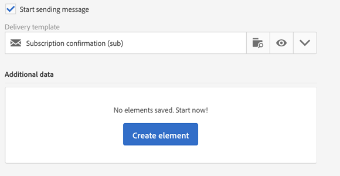
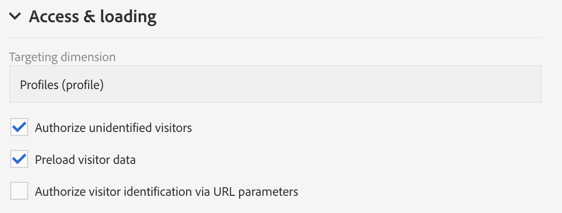

# ランディングページの設定 {#configuring-landing-page}

## ランディングページの送信の確認 {#confirm-a-landing-page-submission}

訪問者がランディングページを送信した場合に、アクションをトリガーするように設定できます。手順は次のとおりです。

1. ランディングページダッシュボードの  アイコンを使用してアクセスするランディングページのプロパティを編集し、「**[!UICONTROL Job]**」パラメーターを表示します。

   

1. 自動メッセージを送信するよう指定する場合（サービスのサブスクリプションを確認する場合など）、「**[!UICONTROL Specific actions]**」セクションで「**[!UICONTROL Start sending message]**」を選択します。その後、E メール配信テンプレートを選択する必要があります。

   確認メッセージがサービスレベルで既に設定されている場合は、複数の確認メッセージが送信されないように、この画面では確認メッセージを選択しないでください。「[サービスの設定](../../audiences/using/creating-a-service.md)」を参照してください。

1. ランディングページの送信時に追加のデータを保存できるようにするには、**[!UICONTROL Additional data]** を作成します。このデータは、ページの訪問者には表示されません。定数値のみが使用できます。

   

## ランディングページのサービスへのリンク {#linking-a-landing-page-to-a-service}

フォームをサービスにリンクして、ランディングページの検証時にプロファイルが特定のサービスに登録できるようにすることができます。

ランディングページをリンクするためのパラメーターを使用すると、実行するアクションのタイプと、ランディングページを特定のサービスにリンクするか、汎用にするかを指定できます。

リンクするサービスを選択するには、次の操作が必要です。

1. ランディングページダッシュボードの  アイコンを使用してアクセスするランディングページのプロパティを編集し、「**[!UICONTROL Job]**」パラメーターを表示します。

   

1. 「**[!UICONTROL Specific actions]**」ドロップダウンリストで「**[!UICONTROL Subscription]**」を選択します。

   

1. ランディングページを 1 件のサービスにリンクする場合は「**[!UICONTROL Specific service]**」を選択します。ランディングページで複数のサービスを使用する場合は、このオプションを選択しないでください。

   ランディングページを複数のサービスで使用する場合は、「**[!UICONTROL Specified service in the URL]**」オプションを使用します。そのため、サービスを設定する際はランディングページを参照する必要があります。

## 権限の設定とデータのプリロード {#setting-permissions-and-pre-loading-data}

ランディングページにアクセスできる人は、特定の訪問者（例えば、Campaign から送信されるメッセージ内のリンクからの訪問者）や特定の組織単位に限定することができます。
特定の訪問者に限定する場合は、ランディングページでその訪問者のデータをプリロードできます。手順は次のとおりです。

1. ランディングページダッシュボードの  アイコンを使用してアクセスするランディングページのプロパティを編集し、「**[!UICONTROL Access & loading]**」パラメーターを表示します。

   

1. 「**[!UICONTROL Preload visitor data]**」を選択します。

   ページの訪問者がデータベース内のプロファイルに該当する場合、データベースのデータがマップされているフォームのフィールドにその訪問者のデータが表示され、ランディングページのパーソナライゼーション要素が適用されます。

   

また、次のこともできます。

* 「**[!UICONTROL Authorize visitor identification via URL parameters]**」オプションを選択し、URL パラメーターを使用して訪問者を識別します。次に、読み込みキーを選択し、フィルターパラメーターを対応する URL のパラメーターとマッピングする必要があります。
* 「**[!UICONTROL Authorize unidentified visitors]**」オプションを使用して、ランディングページにアクセスするすべての訪問者を認証します。

ランディングページは、組織単位にリンクすることもできます。これにより、各種のランディングページへのユーザーのアクセスが定義されます。組織単位を割り当てるには、次の手順に従います。

1. 「**[!UICONTROL Edit properties]**」アイコンからランディングページのプロパティにアクセスします。

   

1. 「**[!UICONTROL Access authorization]**」を展開します。

1. ドロップダウンメニューをクリックし、組織単位を選択します。組織単位の作成方法の詳細については、この[ページ](../../administration/using/organizational-units.md)を参照してください。

   

1. 「**[!UICONTROL Created by]**」、「**[!UICONTROL Created]**」、「**[!UICONTROL Access authorization]**」、「**[!UICONTROL Last modified]**」の各フィールドは自動的に入力されます。

1. 「**[!UICONTROL Confirm]**」、「**[!UICONTROL Save]**」の順にクリックします。

これで、選択した組織単位内のユーザーのみがランディングページにアクセスして管理できるようになります。

## Google reCAPTCHA の設定 {#setting-google-recaptcha}

ランディングページで Google reCAPTCHA V3 を設定すると、ボットによるスパムや悪用からランディングページを保護できます。ランディングページで使用するには、まず外部アカウントを作成する必要があります。設定方法について詳しくは、この[節](../../administration/using/external-accounts.md#google-recaptcha-external-account)を参照してください。

設定した Google reCAPTCHA V3 外部アカウントは、ランディングページに追加できます。

1. ランディングページを公開する前に、ランディングページダッシュボードの  アイコンを使用してページのプロパティにアクセスします。

   

1. **[!UICONTROL Access & loading]** メニューを展開します。
1. 「**[!UICONTROL Use reCAPTCHA to protect your site from spam and abuse]**」オプションをオンにします。
1. 作成した Google reCAPTCHA 外部アカウントを選択します。

   

1. 「**[!UICONTROL Confirm]**」をクリックします。

ランディングページに Google reCAPTCHA が設定され、ページの下部に表示されます。

その後、Google reCAPTCHA は、ページでのユーザーのインタラクションに基づいてスコアを返します。スコアを確認するには、[Google 管理コンソール](https://g.co/recaptcha/admin)に接続します。
