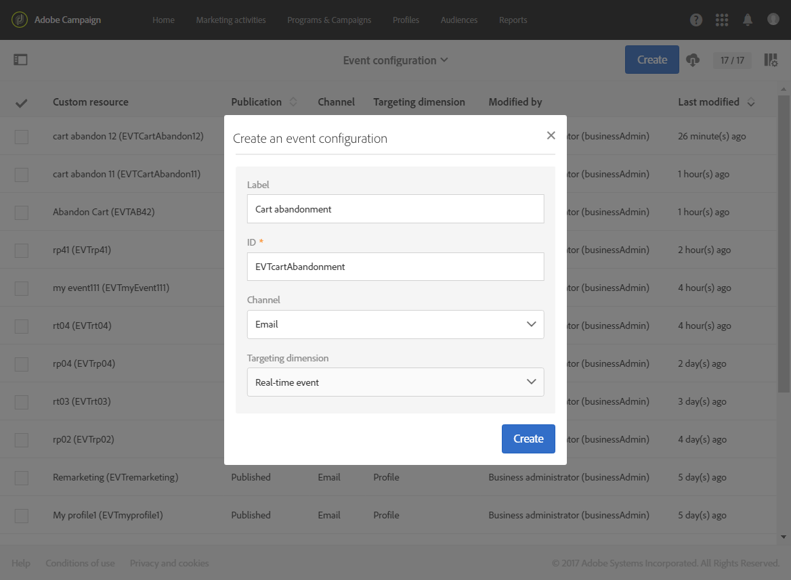
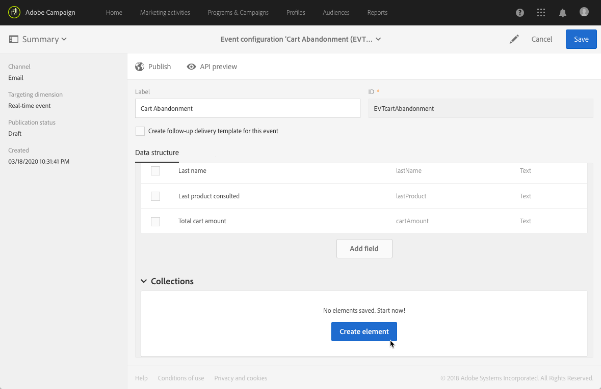
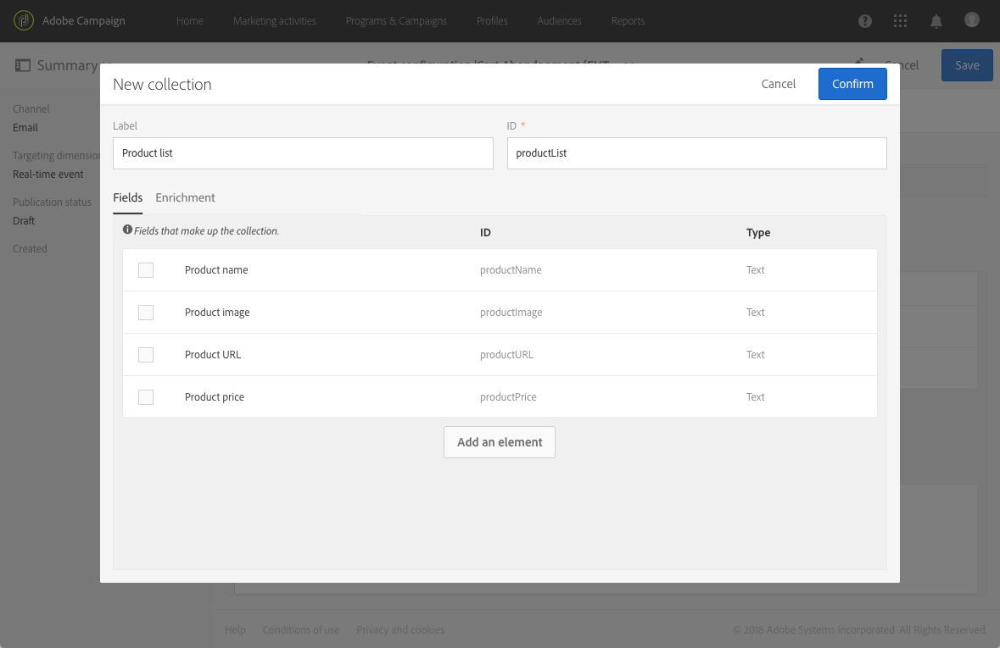
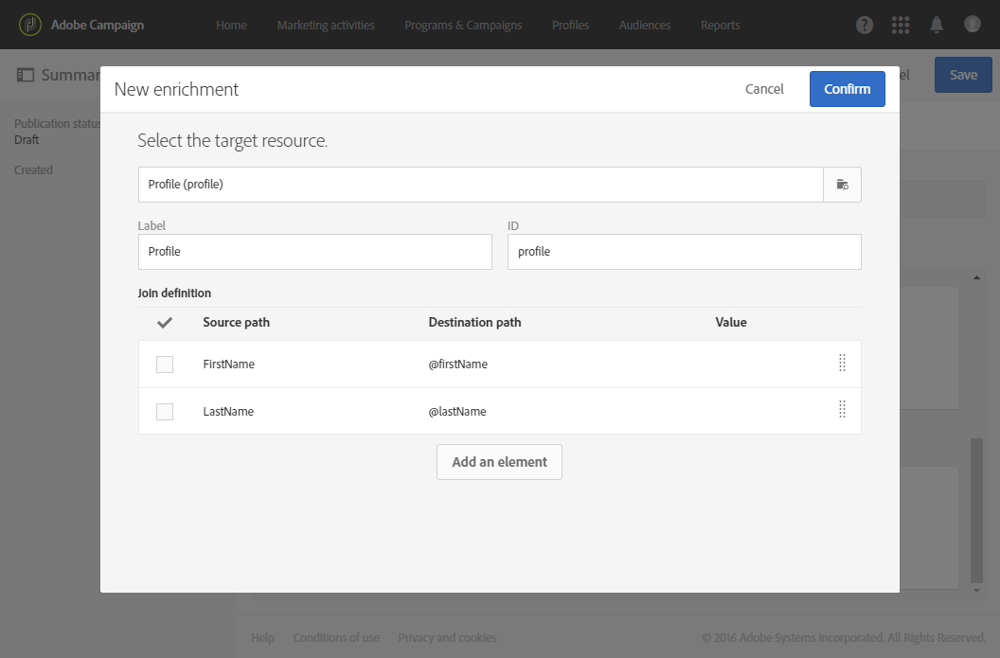
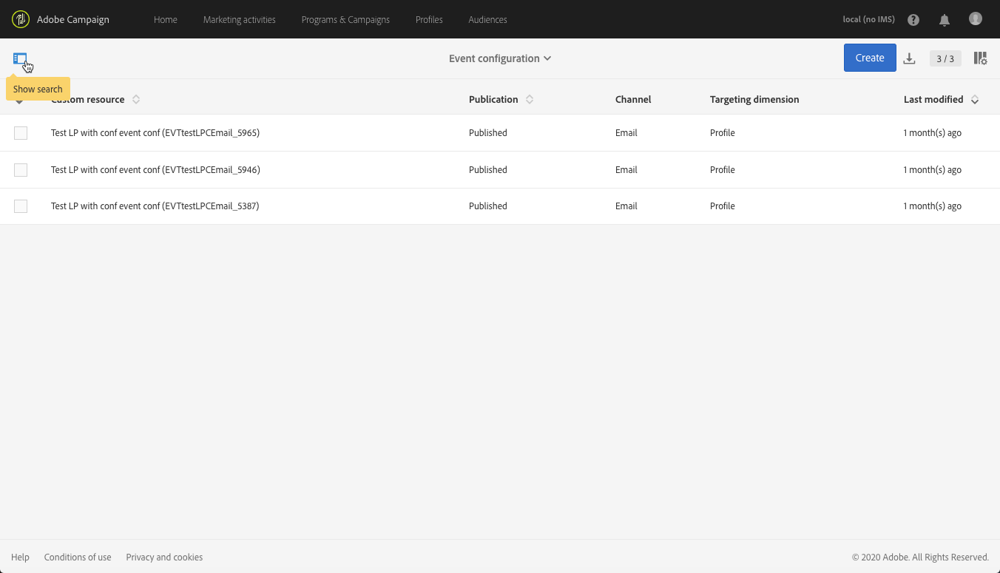

# トランザクションイベントの設定 {#configuring-transactional-event}

Adobe Campaignを使用してトランザクションメッセージを送信するには、まずイベントを作成および設定して、イベントデータの構造を記述する必要があります。

>[!IMPORTANT]
>
>[機能管理者](../../administration/using/users-management.md#functional-administrators) <!--being part of the **[!UICONTROL All]** [organizational unit](../../administration/using/organizational-units.md) -->のみが、イベント設定を作成および編集するための適切な権限を持っています。

設定は、送信するトランザクションメッセージの[&#x200B; タイプ &#x200B;](../../channels/using/getting-started-with-transactional-msg.md#transactional-message-types)と、使用するチャネルによって異なります。 詳しくは、[特定の設定](#transactional-event-specific-configurations)を参照してください。

設定が完了したら、イベントを公開する必要があります。 「[&#x200B; トランザクションイベントの公開](../../channels/using/publishing-transactional-event.md)」を参照してください。

## イベントの作成 {#creating-an-event}

イベントを開始するには、ニーズに合わせてイベントを作成します。

1. 左上隅の&#x200B;**Adobe** ロゴをクリックし、**[!UICONTROL Marketing plans]** > **[!UICONTROL Transactional messages]** > **[!UICONTROL Event configuration]**&#x200B;を選択します。
1. 「**[!UICONTROL Create]**」ボタンをクリックします。
1. イベントの&#x200B;**[!UICONTROL Label]**&#x200B;と&#x200B;**[!UICONTROL ID]**&#x200B;を入力してください。 **[!UICONTROL ID]** フィールドは必須であり、プレフィックス「EVT」で始める必要があります。 このプレフィックスを使用しない場合は、**[!UICONTROL Create]**&#x200B;をクリックすると自動的に追加されます。

   

   >[!IMPORTANT]
   >
   >IDは、EVT接頭辞を含めて64文字を超えることはできません。

1. トランザクションメッセージ **[!UICONTROL Email]**、**[!UICONTROL Mobile (SMS)]**&#x200B;または&#x200B;**[!UICONTROL Push notification]**&#x200B;の送信に使用するチャネルを選択します。 各イベントには1つのチャネルのみを使用でき、その後は変更できません。

1. 目的のイベント設定に対応するターゲティングディメンションを選択し、**[!UICONTROL Create]**&#x200B;をクリックします。

   イベントベースのトランザクションメッセージは、イベント自体に含まれるデータをターゲットにしますが、プロファイルベースのトランザクションメッセージは、Adobe Campaign データベースに含まれるデータをターゲットにします。 詳しくは、[特定の設定](#transactional-event-specific-configurations)を参照してください。

>[!NOTE]
>
>トランザクションイベントの数は、プラットフォームに影響を与える可能性があります。 最適なパフォーマンスを確保するには、未使用のイベントを削除します。 「[&#x200B; イベントの削除](../../channels/using/publishing-transactional-event.md#deleting-an-event)」を参照してください。

## イベント属性の定義 {#defining-the-event-attributes}

**[!UICONTROL Fields]** セクションで、イベントコンテンツに統合され、トランザクションメッセージのパーソナライズに使用できる属性を定義します。

フィールドを追加および変更する手順は、[&#x200B; カスタムリソース &#x200B;](../../developing/using/configuring-the-resource-s-data-structure.md#adding-fields-to-a-resource)と同じです。

>[!NOTE]
>
>多言語のトランザクションメッセージを作成する場合は、**[!UICONTROL AC_language]** IDで追加のイベント属性を定義します。 これは、イベントのトランザクションメッセージにのみ適用されます。 イベントが公開された後、多言語トランザクションメッセージのコンテンツを編集する手順は、多言語標準メールの場合と同じです。 [多言語メールの作成](../../channels/using/creating-a-multilingual-email.md)を参照してください。

## データ収集の定義 {#defining-data-collections}

イベントコンテンツに、複数の属性を含む要素のコレクションを追加できます。

このコレクションは、トランザクションメールで使用して、メッセージのコンテンツ（商品リスト [など）に](../../designing/using/using-product-listings.md)商品リスト を追加できます。価格、参照番号、数量などを含みます。 リストの各製品に一致します。

1. **[!UICONTROL Collections]** セクションで、「**[!UICONTROL Create element]**」ボタンをクリックします。

   

1. コレクションのラベルとIDを追加します。
1. リストの各製品のトランザクションメッセージに表示するすべてのフィールドを追加します。

   この例では、次のフィールドを追加しました。

   

1. 「**[!UICONTROL Enrichment]**」タブでは、コレクションの各項目をエンリッチメントできます。 これにより、対応する製品リストの要素を、Adobe Campaign データベースまたは作成した他のリソースの情報でパーソナライズできます。

>[!NOTE]
>
>コレクションの要素を強化する手順は、[&#x200B; イベントの強化](#enriching-the-transactional-message-content) セクションで説明した手順と同じです。 イベントをエンリッチメントすると、コレクションをエンリッチメントできなくなります。**[!UICONTROL Collections]** セクションで、コレクション自体にエンリッチメントを追加する必要があります。

イベントとメッセージが公開されると、このコレクションをトランザクションメッセージで使用できるようになります。

次に、この例のAPI プレビューを示します。

**関連トピック：**

* [イベントのプレビューと公開](../../channels/using/publishing-transactional-event.md#previewing-and-publishing-the-event)
* [トランザクションメッセージでの製品リストの使用](../../designing/using/using-product-listings.md)
* [トランザクションメッセージの公開](../../channels/using/publishing-transactional-message.md#publishing-a-transactional-message)

## イベントの充実 {#enriching-the-transactional-message-content}

メッセージをパーソナライズするために、Adobe Campaign データベースの情報を使用してトランザクションメッセージコンテンツを強化できます。 例えば、各受信者の姓またはCRM IDから、アドレスや生年月日などのデータやプロファイルテーブルに追加されたその他のカスタムフィールドを復元して、受信者に送信される情報をパーソナライズできます。

拡張&#x200B;**[!UICONTROL Profile and services Ext API]**&#x200B;からの情報を使用して、トランザクションメッセージのコンテンツを強化できます。 詳しくは、[APIの拡張：拡張機能の公開](../../developing/using/step-2-publish-the-extension.md)を参照してください。

この情報は新しいリソースに保存することもできます。 その場合、リソースは直接または別のテーブルを介して&#x200B;**[!UICONTROL Profile]**&#x200B;または&#x200B;**[!UICONTROL Service]** リソースにリンクする必要があります。 例えば、以下の設定では、**[!UICONTROL Product]** リソースが&#x200B;**[!UICONTROL Product]** リソースにリンクされている場合、製品カテゴリやIDなどの&#x200B;**[!UICONTROL Profile]** リソースからの情報を使用して、トランザクションメッセージのコンテンツを強化できます。

リソースの作成と公開について詳しくは、[このセクション &#x200B;](../../developing/using/key-steps-to-add-a-resource.md)を参照してください。

1. **[!UICONTROL Enrichment]** セクションで、「**[!UICONTROL Create element]**」ボタンをクリックします。

   

1. メッセージをリンクするリソースを選択します。 この場合は、**[!UICONTROL Profile]** リソースを選択します。

   

1. **[!UICONTROL Create element]** ボタンを使用して、選択したリソースのフィールドを、以前にイベントに追加したフィールドの1つにリンクします（[&#x200B; イベント属性の定義](#defining-the-event-attributes)を参照）。

   

   >[!NOTE]
   >
   >複数の受信者（複数のプロファイルに同じ値を持つことができるフィールドなど）を選択できる条件を定義した場合、複数のプロファイルがターゲットにされることはありません。

1. この例では、**[!UICONTROL Last name]**&#x200B;と&#x200B;**[!UICONTROL First name]** フィールドを、**[!UICONTROL Profile]** リソースの対応するフィールドと照合します。

   

   **[!UICONTROL Service]** リソースを使用して、トランザクションメッセージのコンテンツを強化することもできます。 サービスについて詳しくは、[このセクション &#x200B;](../../audiences/using/creating-a-service.md)を参照してください。

1. [&#x200B; プロファイルベースのイベント &#x200B;](#profile-based-transactional-messages)を作成または編集する場合、**[!UICONTROL Targeting enrichment]** セクションで、配信実行時にメッセージターゲットとして使用されるエンリッチメントを選択します。

   

   >[!NOTE]
   >
   >エンリッチメントを作成し、**[!UICONTROL Profile]** リソースに基づいてターゲティングエンリッチメントを選択することは、プロファイルベースのイベントでは必須です。

イベントとメッセージが公開されると、このリンクを使用すると、トランザクションメッセージのコンテンツを充実させることができます。

**関連トピック：**

* [イベントのプレビューと公開](../../channels/using/publishing-transactional-event.md#previewing-and-publishing-the-event)
* [トランザクションメッセージのパーソナライズ](../../channels/using/editing-transactional-message.md#personalizing-a-transactional-message)
* [トランザクションメッセージの公開](../../channels/using/publishing-transactional-message.md#publishing-a-transactional-message)

## トランザクションイベントの検索 {#searching-transactional-events}

作成済みのトランザクションイベントにアクセスして検索するには、次の手順に従います。

1. 左上隅の&#x200B;**Adobe** ロゴをクリックし、**[!UICONTROL Marketing plans]** > **[!UICONTROL Transactional messages]** > **[!UICONTROL Event configuration]**&#x200B;を選択します。
1. 「**[!UICONTROL Show search]**」ボタンをクリックします。

   

1. **[!UICONTROL Publication status]**&#x200B;でフィルタリングできます。 これにより、例えば、公開されたイベントのみを表示できます。
1. **[!UICONTROL Last event received]**&#x200B;を使用してイベントをフィルタリングすることもできます。 例えば、「10」と入力すると、最後に受信したイベントが10日以上前のイベント設定のみが表示されます。 これにより、特定の期間に非アクティブだったイベントを表示できます。

   

   >[!NOTE]
   >
   >デフォルト値は0です。 すべてのイベントが表示されます。

## 特定の設定 {#transactional-event-specific-configurations}

トランザクションイベントの設定は、送信するトランザクションメッセージの[&#x200B; タイプ &#x200B;](../../channels/using/getting-started-with-transactional-msg.md#transactional-message-types)と、使用するチャネルによって異なる場合があります。

次の節では、目的のトランザクションメッセージに従って設定する特定の設定について詳しく説明します。 イベントを設定する一般的な手順について詳しくは、[&#x200B; イベントの作成](#creating-an-event)を参照してください。

### イベントベースのトランザクトメッセージ {#event-based-transactional-messages}

イベントをターゲティングしたイベントトランザクションメッセージを送信できます。この種類のトランザクションメッセージには、プロファイル情報が含まれません。配信ターゲットは、イベント自体に含まれるデータによって定義されます。

イベントベースのトランザクションメッセージを送信するには、まず、イベント自体&#x200B;**に含まれる** データをターゲットとするイベントを作成して設定する必要があります。

1. イベント設定を作成する際に、**[!UICONTROL Real-time event]** ターゲティングディメンションを選択します（[&#x200B; イベントの作成](#creating-an-event)を参照）。
1. トランザクションメッセージをパーソナライズするには、イベントにフィールドを追加します（[&#x200B; イベント属性の定義](#defining-the-event-attributes)を参照）。
1. イベントベースのトランザクションメッセージでは、送信されたイベント内のデータのみを使用して、受信者とメッセージコンテンツのパーソナライゼーションを定義する必要があります。

   ただし、Adobe Campaign データベースの追加情報を使用する場合は、トランザクションメッセージコンテンツをエンリッチメントできます（[&#x200B; トランザクションメッセージコンテンツのエンリッチメント &#x200B;](#enriching-the-transactional-message-content)を参照）。

1. イベントをプレビューして公開します（[&#x200B; イベントのプレビューと公開](../../channels/using/publishing-transactional-event.md#previewing-and-publishing-the-event)を参照）。

   イベントをプレビューする際、REST APIには、選択したチャネルに従って、メールアドレス、携帯電話、またはプッシュ通知固有の属性を指定する属性が含まれます。

   イベントが公開されると、新しいイベントにリンクされたトランザクションメッセージが自動的に作成されます。 イベントがトランザクションメッセージの送信をトリガーにするには、作成したばかりのメッセージを[modify](../../channels/using/editing-transactional-message.md)および[publish](../../channels/using/publishing-transactional-message.md)する必要があります。

1. イベントをweb サイトに統合します（[&#x200B; イベントトリガーの統合](../../channels/using/getting-started-with-transactional-msg.md#integrate-event-trigger)を参照）。

### プロファイルベースのトランザクションメッセージ {#profile-based-transactional-messages}

顧客プロファイルに基づいてトランザクションメッセージを送信できます。これにより、マーケティングタイポロジルールを適用し、購読解除リンクを含め、メッセージをグローバル配信レポートに追加し、カスタマージャーニーで活用できます。

プロファイルベースのトランザクションメッセージを送信するには、まず、Adobe Campaign データベース **から** データをターゲットとするイベントを作成して設定する必要があります。

1. イベント設定を作成する際に、**[!UICONTROL Profile event]** ターゲティングディメンションを選択します（[&#x200B; イベントの作成](#creating-an-event)を参照）。
1. トランザクションメッセージをパーソナライズするには、イベントにフィールドを追加します（[&#x200B; イベント属性の定義](#defining-the-event-attributes)を参照）。 エンリッチメントを作成するには、少なくとも1つのフィールドを追加する必要があります。 Adobe Campaign データベースのパーソナライゼーションフィールドを使用できるので、**名**&#x200B;や&#x200B;**姓**&#x200B;などの他のフィールドを作成する必要はありません。
1. イベントを&#x200B;**[!UICONTROL Profile]** リソースにリンクするためにエンリッチメントを作成し（[&#x200B; イベントのエンリッチメント &#x200B;](#enriching-the-transactional-message-content)を参照）、このエンリッチメントを&#x200B;**[!UICONTROL Targeting enrichment]**&#x200B;として選択します。

   >[!IMPORTANT]
   >
   >この手順は、プロファイルベースのイベントでは必須です。

1. イベントをプレビューして公開します（[&#x200B; イベントのプレビューと公開](../../channels/using/publishing-transactional-event.md#previewing-and-publishing-the-event)を参照）。

   イベントをプレビューする際、REST APIには、**[!UICONTROL Profile]** リソースから取得されるため、電子メールアドレス、携帯電話、またはプッシュ通知固有の属性を指定する属性が含まれていません。

   イベントが公開されると、新しいイベントにリンクされたトランザクションメッセージが自動的に作成されます。 イベントがトランザクションメッセージの送信をトリガーにするには、作成したばかりのメッセージを[modify](../../channels/using/editing-transactional-message.md)および[publish](../../channels/using/publishing-transactional-message.md)する必要があります。

1. イベントをweb サイトに統合します（[&#x200B; イベントトリガーの統合](../../channels/using/getting-started-with-transactional-msg.md#integrate-event-trigger)を参照）。

<!--
### Transactional SMS messages {#transactional-sms}

The steps to configure an  event to send an SMS transactional message are the same as for the email channel. The only differences are as follows:

* When creating the corresponding event, you need to select the **[!UICONTROL Mobile (SMS)]** channel.

* When previewing the event corresponding to an event-based transactional SMS, the REST API contains an attribute specifying the mobile phone instead of the email address.

* The specificities to edit the content of an SMS transactional message are the same as for a [standard SMS](../../channels/using/about-sms-and-push-content-design.md).
-->

### トランザクションプッシュ通知 {#transactional-push-notifications}

2種類のトランザクションプッシュ通知を送信できます。
* モバイルアプリケーションからの通知の受信をオプトインしたすべてのユーザーに対する、匿名のトランザクションプッシュ通知。 [&#x200B; イベントベースのトランザクションプッシュ通知の設定](../../channels/using/transactional-push-notifications.md#event-based-transactional-push-notifications)を参照してください。
* モバイルアプリケーションを購読しているAdobe Campaign プロファイルへのトランザクションプッシュ通知。 [&#x200B; プロファイルベースのトランザクションプッシュ通知の設定](../../channels/using/transactional-push-notifications.md#profile-based-transactional-push-notifications)を参照してください。

>[!IMPORTANT]
>
>トランザクションプッシュ通知を送信できるようにするには、それに応じてAdobe Campaignを設定する必要があります。 [&#x200B; モバイルアプリケーションの設定](../../administration/using/configuring-a-mobile-application.md)を参照してください。

### フォローアップメッセージ {#follow-up-messages}

特定のトランザクションメッセージを受信した顧客にフォローアップメッセージを送信できます。

フォローアップメッセージの送信を許可するイベントを設定する手順については、[この節](../../channels/using/follow-up-messages.md#configuring-an-event-to-send-a-follow-up-message)で詳しく説明しています。
