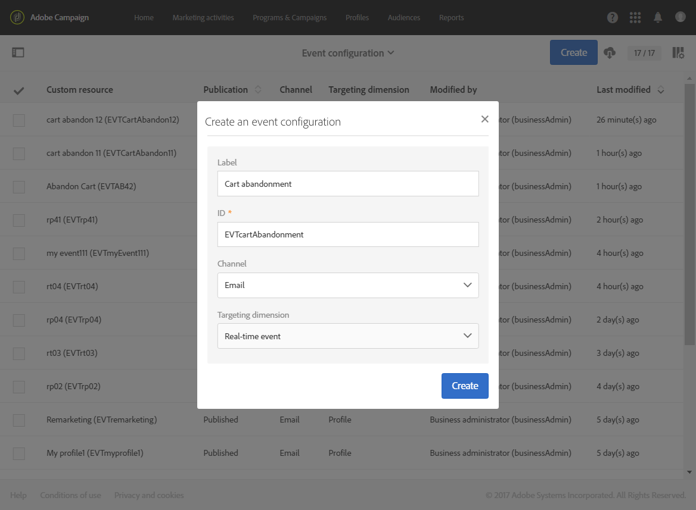

# トランザクションイベントの設定 {#configuring-transactional-event}

トランザクションメッセージをAdobe Campaignで送信するには、まずイベントを作成し設定することで、イベントデータの構造を説明する必要があります。

>[!IMPORTANT]
>
>のみ [機能管理者](../../administration/using/users-management.md#functional-administrators) <!--being part of the **[!UICONTROL All]** [organizational unit](../../administration/using/organizational-units.md) -->イベント設定を作成および編集するための適切な権限を持っている。

設定は、 [トランザクションメッセージのタイプ](../../channels/using/getting-started-with-transactional-msg.md#transactional-message-types) を送信し、使用するチャネルで送信します。 詳しくは、 [特定の設定](#transactional-event-specific-configurations).

設定が完了したら、イベントを公開する必要があります。 詳しくは、 [トランザクションイベントの公開](../../channels/using/publishing-transactional-event.md).

## イベントの作成 {#creating-an-event}

開始するには、必要に応じてイベントを作成します。

1. 次をクリック： **Adobe** ロゴ（左上隅）に移動し、「 **[!UICONTROL Marketing plans]** > **[!UICONTROL Transactional messages]** > **[!UICONTROL Event configuration]**.
1. 「**[!UICONTROL Create]**」ボタンをクリックします。
1. を入力します。 **[!UICONTROL Label]** および **[!UICONTROL ID]** イベントの この **[!UICONTROL ID]** フィールドは必須で、プレフィックス「EVT」で始まる必要があります。 このプレフィックスを使用しない場合、「 **[!UICONTROL Create]**.

   

   >[!IMPORTANT]
   >
   >ID は、EVT プレフィックスを含めて 64 文字以下にする必要があります。

1. トランザクションメッセージの送信に使用するチャネルを選択します **[!UICONTROL Email]**, **[!UICONTROL Mobile (SMS)]** または **[!UICONTROL Push notification]**. 各イベントで使用できるチャネルは 1 つだけで、後で変更することはできません。

1. 目的のイベント設定に対応するターゲティングディメンションを選択し、 **[!UICONTROL Create]**.

   イベントベースのトランザクションメッセージのターゲットデータはイベント自体に含まれるデータに対して、プロファイルベースのトランザクションメッセージのターゲットデータはAdobe Campaignデータベースに含まれるデータに対して設定されます。 詳しくは、 [特定の設定](#transactional-event-specific-configurations).

>[!NOTE]
>
>トランザクションイベントの数は、プラットフォームに影響を与える可能性があります。 最適なパフォーマンスを確保するには、未使用のイベントを必ず削除してください。 詳しくは、 [イベントの削除](../../channels/using/publishing-transactional-event.md#deleting-an-event).

## イベント属性の定義 {#defining-the-event-attributes}

内 **[!UICONTROL Fields]** 「 」セクションで、イベントコンテンツに統合され、トランザクションメッセージのパーソナライズに使用できる属性を定義します。

フィールドの追加と変更の手順は、 [カスタムリソース](../../developing/using/configuring-the-resource-s-data-structure.md#adding-fields-to-a-resource).

>[!NOTE]
>
>多言語トランザクションメッセージを作成する場合は、 **[!UICONTROL AC_language]** ID。 これは、イベントトランザクションメッセージにのみ適用されます。 イベントが公開された後の多言語トランザクションメッセージのコンテンツを編集する手順は、多言語標準 E メールの場合と同じです。 詳しくは、 [多言語 E メールの作成](../../channels/using/creating-a-multilingual-email.md).

## データコレクションの定義 {#defining-data-collections}

イベントコンテンツに要素のコレクションを追加し、各要素自体に複数の属性を含めることができます。

このコレクションは、トランザクション E メールで使用して、 [製品リスト](../../designing/using/using-product-listings.md) メッセージのコンテンツ（価格、参照番号、数量などを含む製品のリストなど）に追加します。 リストの各製品に対して

1. 内 **[!UICONTROL Collections]** セクションで、 **[!UICONTROL Create element]** 」ボタンをクリックします。

   

1. コレクションのラベルと ID を追加します。
1. リストの各製品のトランザクションメッセージに表示するすべてのフィールドを追加します。

   この例では、次のフィールドを追加しました。

   

1. この **[!UICONTROL Enrichment]** 「 」タブを使用すると、コレクションの各項目をエンリッチメントできます。 これにより、対応する製品リストの要素を、Adobe Campaignデータベースや作成した他のリソースからの情報を使用してパーソナライズできます。

>[!NOTE]
>
>コレクションの要素をエンリッチメントする手順は、 [イベントのエンリッチメント](#enriching-the-transactional-message-content) 」セクションに入力します。 イベントをエンリッチメントすると、次のコレクションのエンリッチメントはできなくなります。コレクション自体にエンリッチメントを追加する必要があるのは、 **[!UICONTROL Collections]** 」セクションに入力します。

イベントとメッセージが公開されると、このコレクションをトランザクションメッセージで使用できるようになります。

この例の API プレビューを次に示します。

**関連トピック：**

* [イベントのプレビューと公開](../../channels/using/publishing-transactional-event.md#previewing-and-publishing-the-event)
* [トランザクションメッセージでの製品リストの使用](../../designing/using/using-product-listings.md)
* [トランザクションメッセージの公開](../../channels/using/publishing-transactional-message.md#publishing-a-transactional-message)

## イベントのエンリッチメント {#enriching-the-transactional-message-content}

トランザクションメッセージのコンテンツをAdobe Campaignデータベースの情報でエンリッチメントして、メッセージをパーソナライズできます。 各受信者の姓または CRM ID から、例えば、住所や生年月日などのデータや、プロファイルテーブルに追加された他のカスタムフィールドなどのデータを収集して、送信される情報をパーソナライズできます。

トランザクションメッセージのコンテンツを拡張された **[!UICONTROL Profile and services Ext API]**. 詳しくは、 [API の拡張：拡張機能のパブリッシュ](../../developing/using/step-2--publish-the-extension.md)

この情報は、新しいリソースに保存することもできます。 その場合、リソースは **[!UICONTROL Profile]** または **[!UICONTROL Service]** リソースは、直接または別のテーブルを使用して取得できます。 例えば、以下の設定では、トランザクションメッセージのコンテンツを **[!UICONTROL Product]** リソース ( **[!UICONTROL Product]** リソースは **[!UICONTROL Profile]** リソース。

リソースの作成と公開について詳しくは、 [この節](../../developing/using/key-steps-to-add-a-resource.md).

1. 内 **[!UICONTROL Enrichment]** セクションで、 **[!UICONTROL Create element]** 」ボタンをクリックします。

   

1. メッセージをリンクするリソースを選択します。 この場合、 **[!UICONTROL Profile]** リソース。

   

1. 以下を使用： **[!UICONTROL Create element]** ボタンを使用して、選択したリソースのフィールドを、イベントに以前追加したフィールドの 1 つにリンクします ( [イベント属性の定義](#defining-the-event-attributes)) をクリックします。

   

1. この例では、 **[!UICONTROL Last name]** そして **[!UICONTROL First name]** フィールドに、 **[!UICONTROL Profile]** リソース。

   

   また、 **[!UICONTROL Service]** リソース。 サービスについて詳しくは、 [この節](../../audiences/using/creating-a-service.md).

1. を作成または編集している場合 [プロファイルベースのイベント](#profile-based-transactional-messages)、 **[!UICONTROL Targeting enrichment]** 「 」セクションで、配信の実行時にメッセージのターゲットとして使用するエンリッチメントを選択します。

   

   >[!NOTE]
   >
   >エンリッチメントを作成し、 **[!UICONTROL Profile]** リソースは、プロファイルベースのイベントでは必須です。

イベントとメッセージが公開されると、このリンクを使用してトランザクションメッセージのコンテンツをエンリッチメントできます。

**関連トピック：**

* [イベントのプレビューと公開](../../channels/using/publishing-transactional-event.md#previewing-and-publishing-the-event)
* [トランザクションメッセージのパーソナライズ機能](../../channels/using/editing-transactional-message.md#personalizing-a-transactional-message)
* [トランザクションメッセージの公開](../../channels/using/publishing-transactional-message.md#publishing-a-transactional-message)

## トランザクションイベントの検索 {#searching-transactional-events}

作成済みのトランザクションイベントにアクセスして検索するには、次の手順に従います。

1. 次をクリック： **Adobe** ロゴ（左上隅）に移動し、「 **[!UICONTROL Marketing plans]** > **[!UICONTROL Transactional messages]** > **[!UICONTROL Event configuration]**.
1. 「**[!UICONTROL Show search]**」ボタンをクリックします。

   

1. 次の項目でフィルタリングできます。 **[!UICONTROL Publication status]**. これにより、例えば、公開されたイベントのみを表示できます。
1. また、 **[!UICONTROL Last event received]**. 例えば、10 と入力した場合は、10 日以上前に受け取った最後のイベントを含むイベント設定のみが表示されます。 これにより、特定の期間非アクティブになったイベントを表示できます。

   

   >[!NOTE]
   >
   >デフォルト値は 0 です。 すべてのイベントが表示されます。

## 特定の設定 {#transactional-event-specific-configurations}

トランザクションイベントの設定は、 [トランザクションメッセージのタイプ](../../channels/using/getting-started-with-transactional-msg.md#transactional-message-types) （イベントまたはプロファイル）を送信し、使用するチャネルで送信します。

次の節では、目的のトランザクションメッセージに応じて設定する特定の設定について詳しく説明します。 イベントを設定する一般的な手順について詳しくは、 [イベントの作成](#creating-an-event).

### イベントベースのトランザクションメッセージ {#event-based-transactional-messages}

イベントをターゲットにしたイベントトランザクションメッセージを送信できます。この種類のトランザクションメッセージには、プロファイル情報が含まれません。配信ターゲットは、イベント自体に含まれるデータによって定義されます。

イベントベースのトランザクションメッセージを送信するには、まず、 **イベント自体に含まれるデータ**.

1. イベント設定を作成する際に、 **[!UICONTROL Real-time event]** ターゲティングディメンション ( [イベントの作成](#creating-an-event)) をクリックします。
1. トランザクションメッセージをパーソナライズするために、イベントにフィールドを追加します ( [イベント属性の定義](#defining-the-event-attributes)) をクリックします。
1. イベントベースのトランザクションメッセージでは、受信者とメッセージコンテンツのパーソナライゼーションを定義するために、送信イベント内のデータのみを使用することが想定されています。

   ただし、Adobe Campaignデータベースの追加情報を使用する場合は、トランザクションメッセージの内容をエンリッチメントできます ( [トランザクションメッセージコンテンツのエンリッチメント](#enriching-the-transactional-message-content)) をクリックします。

1. イベントをプレビューして公開します ( [イベントのプレビューと公開](../../channels/using/publishing-transactional-event.md#previewing-and-publishing-the-event)) をクリックします。

   イベントをプレビューする際、REST API には、選択したチャネルに応じて、E メールアドレス、携帯電話、またはプッシュ通知に特有の属性を指定する属性が含まれます。

   イベントが公開されると、新しいイベントにリンクされたトランザクションメッセージが自動的に作成されます。 イベントでトランザクションメッセージのトリガー送信を実行するには、次の手順を実行する必要があります。 [変更](../../channels/using/editing-transactional-message.md) および [公開](../../channels/using/publishing-transactional-message.md) 作成されたばかりのメッセージ。

1. イベントを Web サイトに統合する ( [イベントトリガーの統合](../../channels/using/getting-started-with-transactional-msg.md#integrate-event-trigger)) をクリックします。

### プロファイルベースのトランザクションメッセージ {#profile-based-transactional-messages}

顧客プロファイルに基づいてトランザクションメッセージを送信し、マーケティングタイポロジルールを適用し、購読解除リンクを含めて、メッセージをグローバル配信レポートに追加して、カスタマージャーニーで活用できます。

プロファイルベースのトランザクションメッセージを送信するには、まずイベントのターゲット設定を作成して設定する必要があります **Adobe Campaignデータベースからのデータ**.

1. イベント設定を作成する際に、 **[!UICONTROL Profile event]** ターゲティングディメンション ( [イベントの作成](#creating-an-event)) をクリックします。
1. トランザクションメッセージをパーソナライズするために、イベントにフィールドを追加します ( [イベント属性の定義](#defining-the-event-attributes)) をクリックします。 エンリッチメントを作成するには、少なくとも 1 つのフィールドを追加する必要があります。 他のフィールド ( **名** および **姓** Adobe Campaignデータベースのパーソナライゼーションフィールドを使用できるようになります。
1. イベントを **[!UICONTROL Profile]** リソース ( [イベントのエンリッチメント](#enriching-the-transactional-message-content)) をクリックし、このエンリッチメントを選択します。 **[!UICONTROL Targeting enrichment]**.

   >[!IMPORTANT]
   >
   >この手順は、プロファイルベースのイベントでは必須です。

1. イベントをプレビューして公開します ( [イベントのプレビューと公開](../../channels/using/publishing-transactional-event.md#previewing-and-publishing-the-event)) をクリックします。

   イベントをプレビューする際、REST API には、電子メールアドレス、携帯電話、またはプッシュ通知に特有の属性を指定する属性が含まれていません。これは、 **[!UICONTROL Profile]** リソース。

   イベントが公開されると、新しいイベントにリンクされたトランザクションメッセージが自動的に作成されます。 イベントでトランザクションメッセージのトリガー送信を実行するには、次の手順を実行する必要があります。 [変更](../../channels/using/editing-transactional-message.md) および [公開](../../channels/using/publishing-transactional-message.md) 作成されたメッセージ

1. イベントを Web サイトに統合する ( [イベントトリガーの統合](../../channels/using/getting-started-with-transactional-msg.md#integrate-event-trigger)) をクリックします。

<!--### Transactional SMS messages {#transactional-sms}

The steps to configure an  event to send an SMS transactional message are the same as for the email channel. The only differences are as follows:

* When creating the corresponding event, you need to select the **[!UICONTROL Mobile (SMS)]** channel.

* When previewing the event corresponding to an event-based transactional SMS, the REST API contains an attribute specifying the mobile phone instead of the email address.

* The specificities to edit the content of an SMS transactional message are the same as for a [standard SMS](../../channels/using/about-sms-and-push-content-design.md).-->

### トランザクションプッシュ通知 {#transactional-push-notifications}

次の 2 種類のトランザクションプッシュ通知を送信できます。
* モバイルアプリケーションからの通知の受信をオプトインしたすべてのユーザーに対する匿名トランザクションプッシュ通知。 詳しくは、 [イベントベースのトランザクションプッシュ通知の設定](../../channels/using/transactional-push-notifications.md#event-based-transactional-push-notifications).
* モバイルアプリケーションを購読したAdobe Campaignプロファイルに対するトランザクションプッシュ通知。 詳しくは、 [プロファイルベースのトランザクションプッシュ通知の設定](../../channels/using/transactional-push-notifications.md#profile-based-transactional-push-notifications).

>[!IMPORTANT]
>
>トランザクションプッシュ通知を送信できるようにするには、それに応じてAdobe Campaignを設定する必要があります。 詳しくは、 [モバイルアプリケーションの設定](../../administration/using/configuring-a-mobile-application.md).

### フォローアップメッセージ {#follow-up-messages}

特定のトランザクションメッセージを受け取った顧客にフォローアップメッセージを送信できます。

フォローアップメッセージを送信するイベントを設定する手順について詳しくは、 [この節](../../channels/using/follow-up-messages.md#configuring-an-event-to-send-a-follow-up-message).
