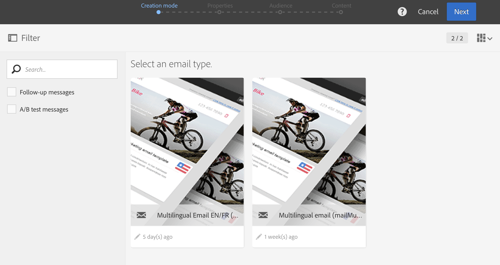

# Creating a multilingual email{#creating-a-multilingual-email}

複数言語の異なる言語を使用して、複数の言語の電子メールをプロファイルに送信できます。各プロファイルは、電子メールのバリエーションを優先言語で受け取ります。

これを行うには、多言語電子メールテンプレートがあることを確認してください。If not, learn how to create one in [this section](../../start/using/creating-a-multilingual-template.md).

オーディエンスは、完了した言語情報のプロファイルに基づいています。

1. [多言語テンプレートに基づいて新しい電子メールを作成](../../start/using/creating-a-multilingual-template.md)します。

   

1. 標準の電子メールと同様に、電子メールの一般的なプロパティとターゲットオーディエンスを定義します。Refer to the [Creating audiences](../../audiences/using/creating-audiences.md) section.
1. 作成ウィザードの4つ目の手順で、バリアントオプションを定義します。[多言語テンプレートに](../../start/using/creating-a-multilingual-template.md) 既にすべての適切なパラメータが含まれている場合は、ボタンを **[!UICONTROL Create]** 直接クリックできます。

   

   If needed, add variants using the **[!UICONTROL Add an element]** button. **[!UICONTROL Default]** variantを削除しないでください。When set to **[!UICONTROL default]**, [the profile's preferred language](../../audiences/using/creating-profiles.md) is used to choose the variant. You can also set the **[!UICONTROL Default]** variant to any other language.

1. 電子メールの作成の確認:電子メールダッシュボードが表示されます。
1. 各バリアントの電子メールコンテンツを定義します。選択したテンプレートに応じて、複数の件名、複数の送信者名、複数の異なるコンテンツを定義できます。ドロップダウンメニューを使用して、要素の異なるバリエーション間を移動します。For more information, consult the [content editor](../../designing/using/about-email-content-design.md) section.

   

1. メッセージをテストして検証します。Refer to the [Sending proof](../../sending/using/managing-test-profiles-and-sending-proofs.md#sending-proofs) section.
1. Schedule the send with the **[!UICONTROL Send after confirmation option]**.
1. 電子メールを送信すると、そのログおよびレポートにアクセスしてキャンペーンの成功を測定できます。For more on reporting, refer to [this section](../../reporting/using/about-dynamic-reports.md).

