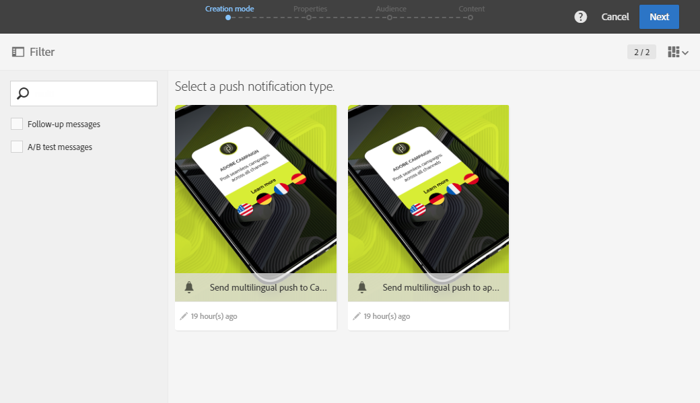
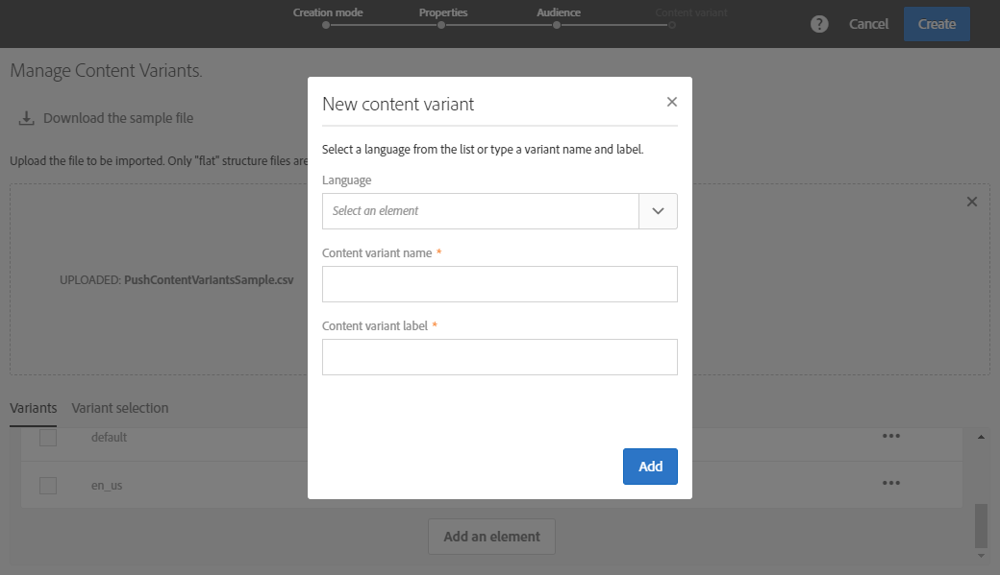
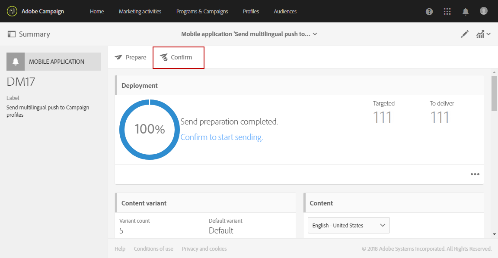
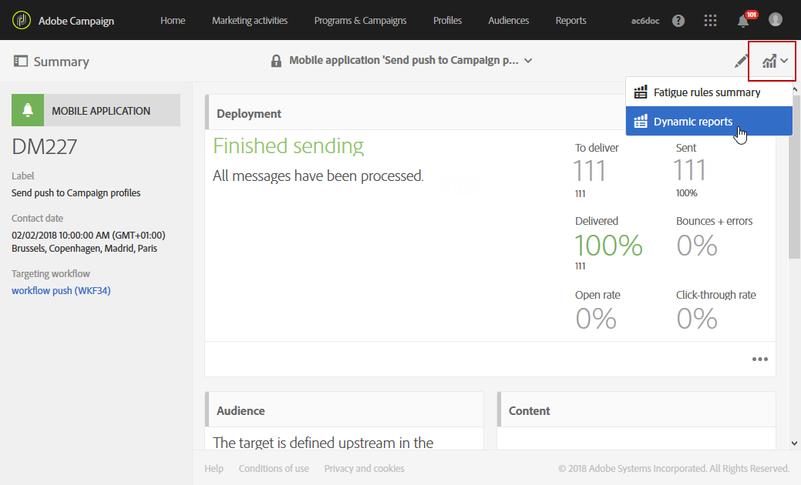

# 多言語プッシュ通知の作成{#creating-a-multilingual-push-notification}

## 多言語プッシュ通知について{#about-multilingual-push-notification}

ユーザーの好みの言語と地域に基づいてメッセージを送信し、プッシュ通知コンテンツをパーソナライズします。 多言語のプッシュ通知コンテンツのバリエーションをコンテンツエディターで直接読み込み、多言語のプッシュ通知を1つの配信で送信できます。

この機能は、プッシュ通知に使用される配信テンプレートに応じて、受信者のプロファイルで指定された優先言語またはモバイルアプリ購読者のシステム言語設定のどちらかを利用します。 特定のユーザーの言語環境設定が入力されていない場合、多言語プッシュ通知の作成時に定義されたデフォルトのバリアントが使用されます。 プロファイルとサブスクライバの管理方法の詳細については、[ガイド](../../audiences/using/get-started-profiles-and-audiences.md)を参照してください。

プッシュ通知配信で多言語コンテンツバリアントを使用するには、次の手順に従います。

* [手順1:多言語コンテンツバリアントのアップロード](#step-1--upload-multilingual-content-variant)
* [手順2:多言語コンテンツのバリアントを使用してプレビューを行い、プッシュ通知を最終処理します](#step-2--preview-and-finalize-a-push-notification-using-multilingual-content-variants)
* [手順3:多言語プッシュ通知配信の送信と分析](#step-3--send-and-analyze-multilingual-push-notification-delivery)

## 手順1:多言語コンテンツバリアントのアップロード{#step-1--upload-multilingual-content-variant}

多言語プッシュ通知をパーソナライズする前に、まず多言語配信テンプレートにコンテンツバリアントをアップロードし、配信を作成する必要があります。

>[!NOTE]
>
>各言語バリアントに手動でバリアントを作成する場合は、この手順をスキップすることもできます。

1. **[!UICONTROL Marketing activities]**&#x200B;で、**[!UICONTROL Create]**&#x200B;ボタンをクリックし、**[!UICONTROL Push notification]**&#x200B;を選択します。
1. モバイルアプリケーションを購読しているAdobe Campaignプロファイルをターゲットする場合はテンプレート&#x200B;**[!UICONTROL Send multilingual push to Campaign profiles]**&#x200B;を選択し、モバイルアプリケーションからの通知の受信に同意しているすべてのユーザーにプッシュ通知を送信する場合はテンプレート&#x200B;**[!UICONTROL Send multilingual push to app subscriber]**&#x200B;を選択します。

   

1. プッシュ通知プロパティを入力し、**[!UICONTROL Associate a Mobile App to a delivery]**&#x200B;フィールドでモバイルアプリを選択します。

   ドロップダウンには、SDK V4とAdobe Experience PlatformSDKの両方のアプリケーションが表示されます。

1. **[!UICONTROL Audiences]**&#x200B;ウィンドウで、クエリをドラッグ&amp;ドロップしてオーディエンスを微調整します。

   追加されるクエリは、選択したテンプレートに応じて異なります。**[!UICONTROL Send multilingual push to Campaign profiles]**&#x200B;テンプレートを選択した場合は、モバイルアプリケーションの既知の受信者をクエリできます。 一方、**[!UICONTROL Send multilingual push to app subscriber]**&#x200B;テンプレートを選択した場合は、オプトインした特定のアプリのすべての購読者をクエリできます。
   >[!NOTE]
   >
   >特定の言語を使用するオーディエンスをターゲットする場合は、CSVファイルでターゲット言語をすべてリストする必要があります。

   

1. **[!UICONTROL Manage Content Variants]**&#x200B;ウィンドウで、ファイルをドラッグ&amp;ドロップするか、コンピューターからファイルを選択します。

   ファイルはUTF8エンコードである必要があり、**[!UICONTROL Download the sample file]**&#x200B;オプションをクリックすると見つかる特定のレイアウトが必要です。 また、ロケール値には正しい構文を使用する必要があります。 ファイル形式とサポートされているロケールについて詳しくは、[テクノテート](https://docs.adobe.com/content/help/ja-JP/campaign-standard/using/communication-channels/push-notifications/generating-csv-multilingual-push.translate.html)を参照してください。

   

1. ファイルをアップロードすると、言語のバリアントが自動的に&#x200B;**[!UICONTROL Variants]**&#x200B;タブに入力されます。 対象ユーザーに優先言語が指定されていない場合、デフォルトコンテンツバリアントとなる&#x200B;**[!UICONTROL Default variant]**&#x200B;をファイル内に指定できます。

   

1. **[!UICONTROL Variant selection]**&#x200B;タブには、配信テンプレートに応じてどの言語の優先順位を考慮するかを決定するスクリプトが用意されています。 これは標準搭載のスクリプトで、変更を行う必要はありません。
1. 読み込んだファイルに存在しないバリアントをさらに追加する場合は、**[!UICONTROL Add an element]**&#x200B;ボタンをクリックし、必要な数の新しい言語バリアントを追加します。

   ファイルからアップロードされたバリアント以外のバリアントを追加すると、コンテンツはこの言語にリンクされません。 配信ダッシュボードでコンテンツを直接編集する必要があります。

   

1. 設定が完了したら、**[!UICONTROL Create]**&#x200B;をクリックします。 **[!UICONTROL Content variant]**&#x200B;ウィンドウに戻って、配信ダッシュボードから変更を加えることができます。

   

開始が多言語プッシュ通知を個人化できるようになりました。

## 手順2:多言語コンテンツバリアント{#step-2--preview-and-finalize-a-push-notification-using-multilingual-content-variants}を使用してプレビューし、プッシュ通知を最終処理します。

コンテンツバリアントを含むファイルをアップロードした後、プッシュ通知配信から様々なバリアントをプレビューできるようになりました。

ファイルからアップロードされたバリアントに加えて、さらに多くのバリアントを作成および編集することもできます。

1. 配信ダッシュボードの&#x200B;**[!UICONTROL Content]**&#x200B;ウィンドウで、ドロップダウンを使用して、選択した言語に応じてプッシュ通知コンテンツをプレビューできます。

   

1. 特定の言語に対してコンテンツバリアントが指定されていない場合は、プレビューの下のベルのアイコンをクリックして、開始に対してこの言語バリアントにコンテンツを追加します。

   **[!UICONTROL Content]**&#x200B;ウィンドウをクリックすると、プッシュ通知は、ドロップダウンで選択した言語のコンテンツを表します。 このウィンドウで行った変更は、1つの言語にのみ影響します。

1. コンテンツバリアントをクリックして、パーソナライゼーションフィールドなどを使ってさらにカスタマイズすることもできます。

   プッシュ通知のカスタマイズ方法について詳しくは、を参照してください。

   

1. 言語バリアントを追加または削除する場合は、**[!UICONTROL Content variant]**&#x200B;ウィンドウをクリックします。

   新しい言語を追加すると、追加した言語にリンクされたプッシュ通知にコンテンツを手動で追加する必要があることに注意してください。

   

これで、多言語プッシュ通知配信を送信する準備が整いました。

## 手順3:多言語プッシュ通知配信{#step-3--send-and-analyze-multilingual-push-notification-delivery}を送信および分析

これで、多言語コンテンツバリアントのプッシュ通知をユーザーに送信する準備が整いました。

1. 送信の準備中に開始を発生させるには、**[!UICONTROL Prepare]**&#x200B;ボタンをクリックします。
1. 警告なしで準備が完了したら、**[!UICONTROL Confirm]**&#x200B;ボタンをクリックして、多言語プッシュを送信する開始を送信できます。

   

1. プッシュ通知が正常に送信されたら、**[!UICONTROL Reports]**&#x200B;アイコンをクリックし、**[!UICONTROL Dynamic reports]**&#x200B;をクリックして配信の成功を分析します。

   

1. 「**[!UICONTROL Push notification report]**」を選択します。
1. **[!UICONTROL Variant]**&#x200B;ディメンションをパネルにドラッグ&amp;ドロップして、データのフィルタリングを開始します。

   

受信者に対する多言語プッシュ通知配信の影響を測定できるようになりました。

**関連トピック：**

* [プッシュ通知レポート](../../reporting/using/push-notification-report.md)
* [ワークフロー内でのプッシュ通知の送信](../../automating/using/push-notification-delivery.md)
* [1つのワークフローで多言語オーディエンスにアクセス](https://helpx.adobe.com/jp/campaign/kb/simplify-campaign-management.html#Engageyourcustomersateverystep)
