# 多言語プッシュ通知の作成{#creating-a-multilingual-push-notification}

## 多言語プッシュ通知について {#about-multilingual-push-notification}

顧客が好む言語や地域にもとづいてメッセージを送信することで、プッシュ通知コンテンツをパーソナライズできます。 多言語プッシュ通知コンテンツのバリエーションをコンテンツエディターに直接読み込み、1回の配信で多言語プッシュ通知を送信できます。

この機能は、プッシュ通知に使用する配信テンプレートに応じて、受信者のプロファイルで指定された優先言語またはモバイルアプリ購読者のシステム言語の環境設定を活用します。 特定のユーザーの言語設定が入力されていない場合、多言語プッシュ通知の作成時に定義されたデフォルトのバリアントがシステムで使用されます。 プロファイルとサブスクライバーの管理方法について詳しくは、この[ ガイド ](../../audiences/using/get-started-profiles-and-audiences.md)を参照してください。

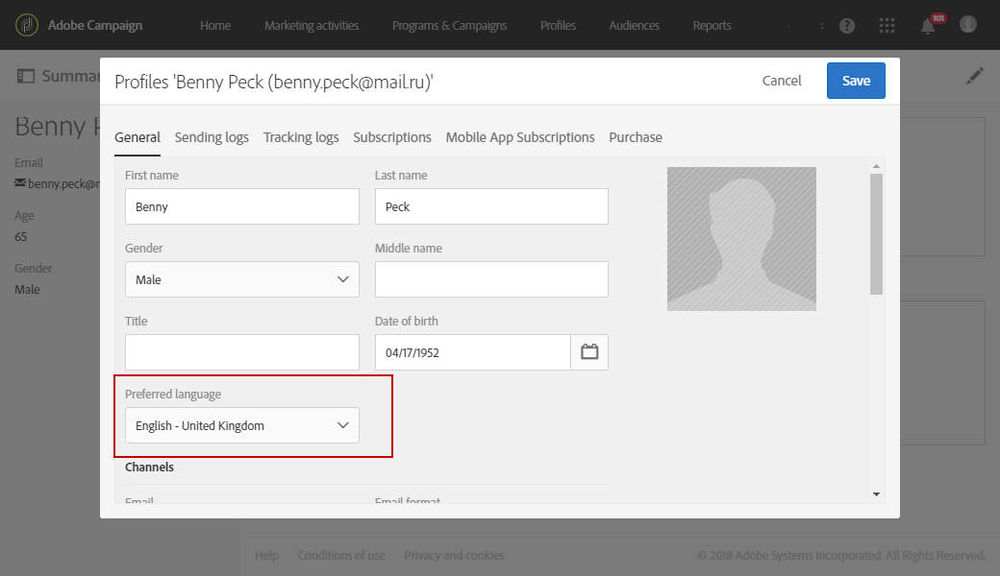

プッシュ通知配信に多言語コンテンツのバリエーションを使用するには、次の手順に従います。

* [ステップ 1：多言語コンテンツのバリエーションをアップロードする](#step-1--upload-multilingual-content-variant)
* [ステップ 2：多言語コンテンツのバリエーションを使用してプッシュ通知をプレビューし、最終調整する](#step-2--preview-and-finalize-a-push-notification-using-multilingual-content-variants)
* [ステップ 3：多言語プッシュ通知配信の送信と分析](#step-3--send-and-analyze-multilingual-push-notification-delivery)

## ステップ 1：多言語コンテンツのバリエーションをアップロードする {#step-1--upload-multilingual-content-variant}

多言語プッシュ通知をパーソナライズする前に、まず多言語配信テンプレートにコンテンツのバリエーションをアップロードし、配信を作成する必要があります。

>[!NOTE]
>
>言語バリエーションごとに手動でバリエーションを作成する場合は、この手順をスキップすることもできます。

1. **[!UICONTROL Marketing activities]**&#x200B;で「**[!UICONTROL Create]**」ボタンをクリックし、「**[!UICONTROL Push notification]**」を選択します。
1. モバイルアプリケーションを購読しているAdobe Campaign プロファイルをターゲットにする場合は、テンプレート **[!UICONTROL Send multilingual push to Campaign profiles]**&#x200B;を選択します。または、モバイルアプリケーションからの通知の受信をオプトインしたすべてのユーザーにプッシュ通知を送信する場合は、テンプレート **[!UICONTROL Send multilingual push to app subscriber]**&#x200B;を選択します。

   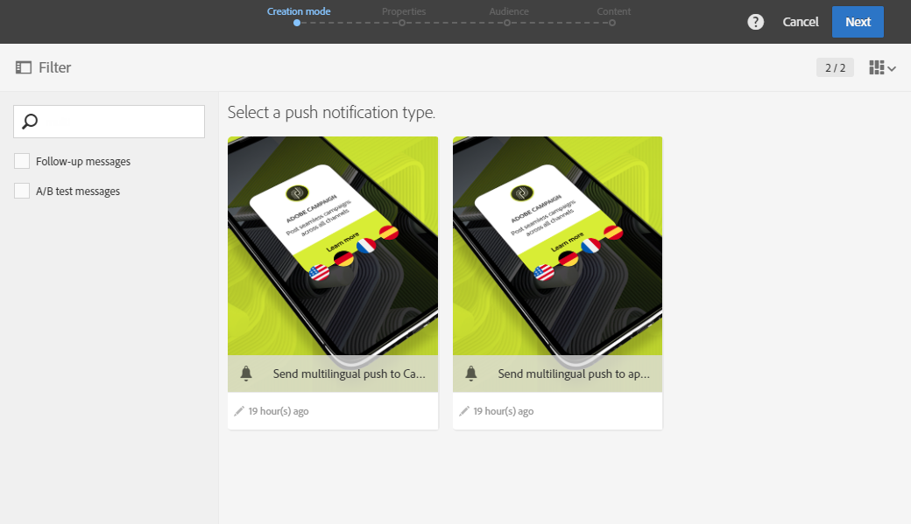

1. プッシュ通知のプロパティを入力し、**[!UICONTROL Associate a Mobile App to a delivery]** フィールドでモバイルアプリを選択します。

   ドロップダウンには、SDK V4とAdobe Experience Platform SDKの両方のアプリケーションが表示されます。

1. **[!UICONTROL Audiences]** ウィンドウで、クエリをドラッグ&amp;ドロップして、オーディエンスを微調整します。

   追加されるクエリは、選択したテンプレートによって異なります。**[!UICONTROL Send multilingual push to Campaign profiles]** テンプレートを選択した場合、モバイルアプリケーションの既知の受信者をクエリできます。 一方、**[!UICONTROL Send multilingual push to app subscriber]** テンプレートを選択した場合、オプトインした特定のアプリのすべてのサブスクライバーに対してクエリを実行できます。
   >[!NOTE]
   >
   >特定の言語でオーディエンスをターゲティングする場合は、CSV ファイルにすべてのターゲット言語をリストアップする必要があります。

   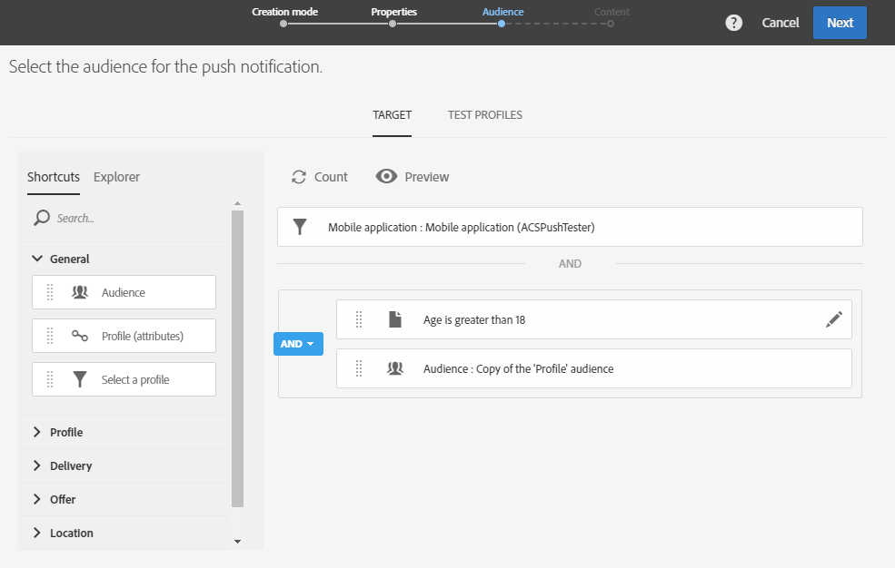

1. **[!UICONTROL Manage Content Variants]** ウィンドウで、ファイルをドラッグ&amp;ドロップするか、コンピューターからファイルを選択します。

   ファイルはUTF8 エンコードされている必要があり、**[!UICONTROL Download the sample file]** オプションをクリックして見つけることができる特定のレイアウトが必要です。 また、ロケール値に適切な構文を使用する必要があります。 ファイル形式とサポートされているロケールについて詳しくは、この[ ページ ](../../channels/using/generating-csv-multilingual-push.md)を参照してください。

   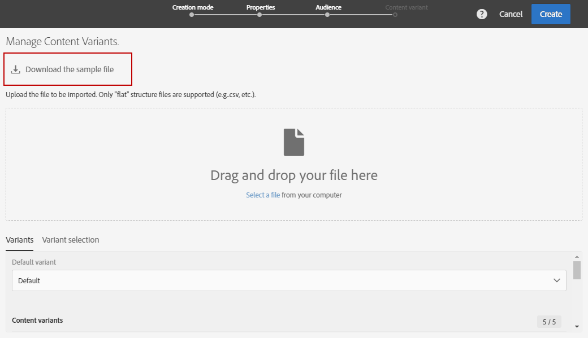

1. ファイルをアップロードすると、言語のバリエーションが&#x200B;**[!UICONTROL Variants]** タブに自動的に入力されます。 対象ユーザーに優先言語が指定されていない場合は、デフォルトのコンテンツバリアントとなる&#x200B;**[!UICONTROL Default variant]**&#x200B;をファイルに指定できます。

   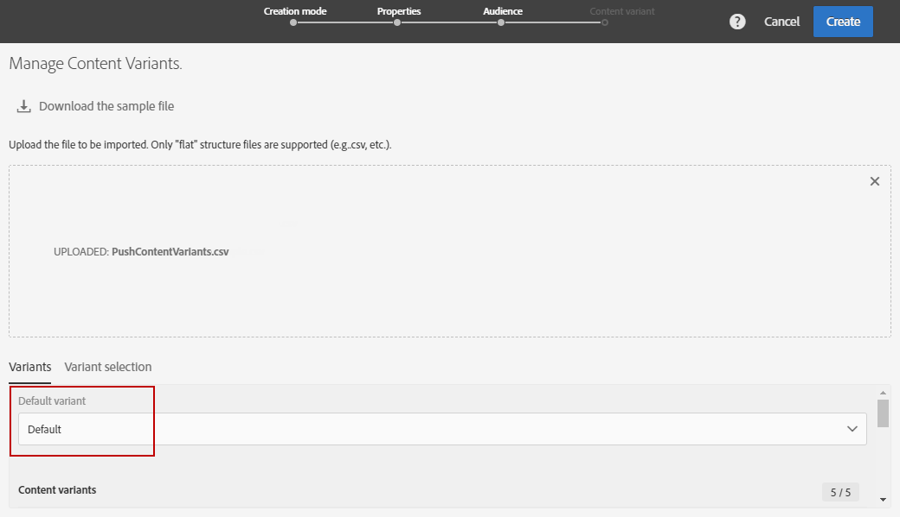

1. 「**[!UICONTROL Variant selection]**」タブには、配信テンプレートに応じて、考慮する言語設定を決定するスクリプトが表示されます。 これは、変更を加える必要のない、すぐに使用できるスクリプトです。
1. 読み込んだファイルに存在しないバリエーションをさらに追加する場合は、**[!UICONTROL Add an element]** ボタンをクリックして、必要に応じて新しい言語バリエーションを追加できます。

   ファイルからアップロードされたバリエーション以外のバリエーションを追加しても、この言語にリンクされるコンテンツはありません。 配信ダッシュボードで直接コンテンツを編集する必要があります。

   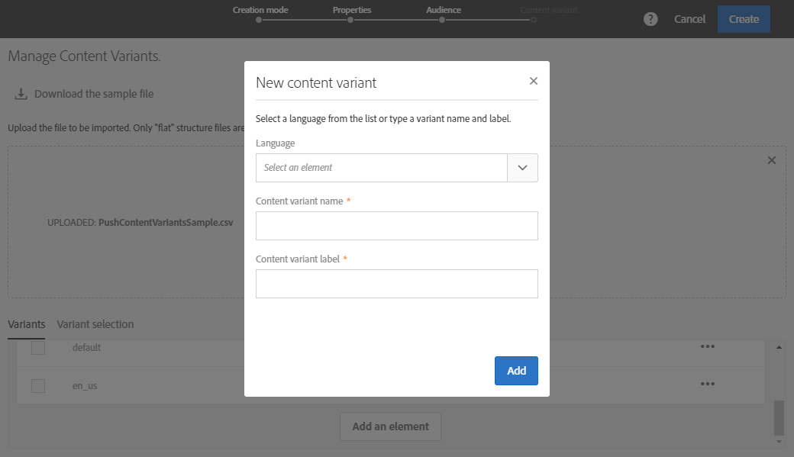

1. 設定が完了したら、**[!UICONTROL Create]**&#x200B;をクリックします。 いつでも&#x200B;**[!UICONTROL Content variant]** ウィンドウに戻って、配信ダッシュボードからいくつかの変更を行うことができます。

   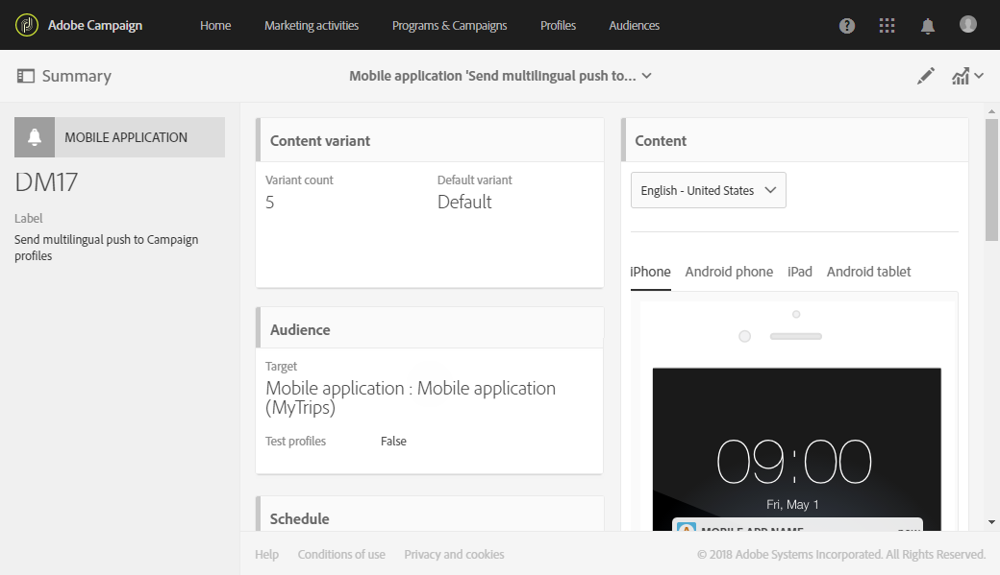

多言語プッシュ通知のパーソナライズを開始できるようになりました。

## ステップ 2：多言語コンテンツのバリエーションを使用してプッシュ通知をプレビューし、最終調整する {#step-2--preview-and-finalize-a-push-notification-using-multilingual-content-variants}

コンテンツのバリエーションを含むファイルをアップロードした後、プッシュ通知配信からさまざまなバリエーションをプレビューできるようになりました。

ファイルからアップロードされたバリエーションに加えて、より多くのバリエーションを作成および編集することもできます。

1. 配信ダッシュボードの&#x200B;**[!UICONTROL Content]** ウィンドウで、ドロップダウンを使用すると、選択した言語に応じてプッシュ通知コンテンツをプレビューできます。

   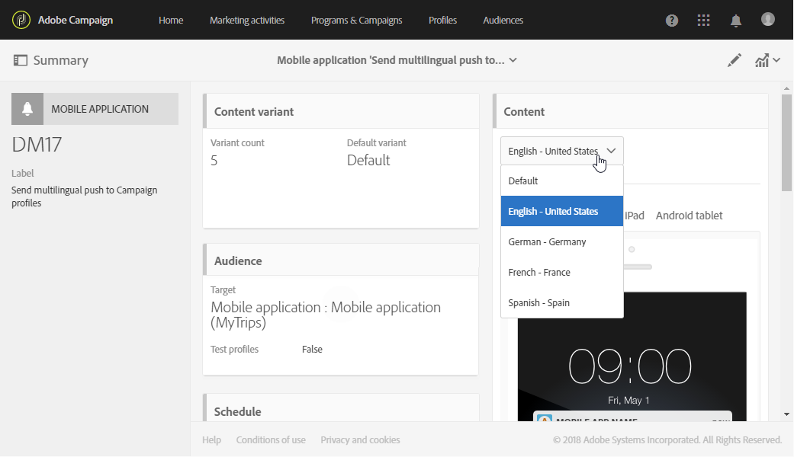

1. 特定の言語にコンテンツバリエーションが指定されていない場合は、プレビューの下にあるベルアイコンをクリックして、この言語バリエーションにコンテンツを追加します。

   **[!UICONTROL Content]** ウィンドウをクリックすると、プッシュ通知はドロップダウンで選択した言語のコンテンツを表します。 このウィンドウで行われた変更は、1つの言語にのみ影響します。

1. また、コンテンツのバリエーションをクリックして、パーソナライゼーションフィールドなどでさらにカスタマイズすることもできます。

   プッシュ通知のカスタマイズ方法について詳しくは、この[ セクション ](../../channels/using/customizing-a-push-notification.md)を参照してください。

   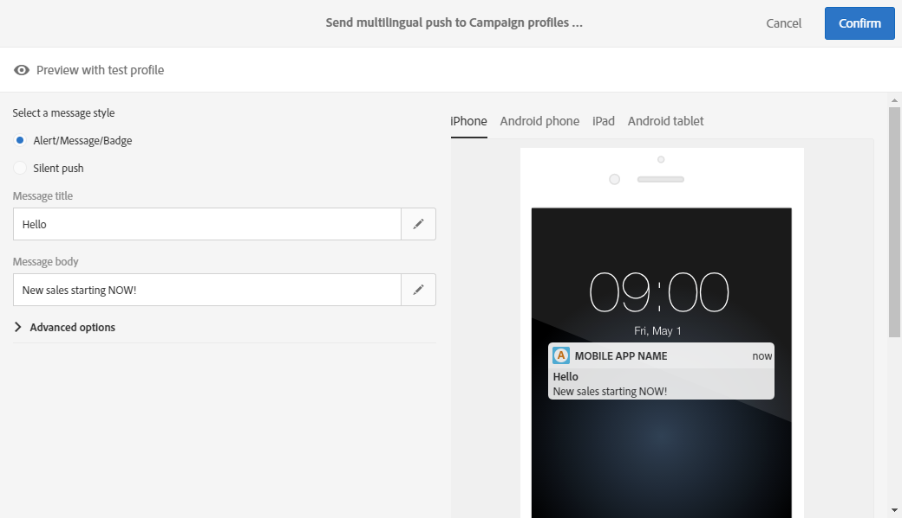

1. 言語のバリエーションを追加または削除する場合は、**[!UICONTROL Content variant]** ウィンドウをクリックします。

   新しい言語を追加すると、追加された言語にリンクされたプッシュ通知にコンテンツを手動で追加する必要があります。

   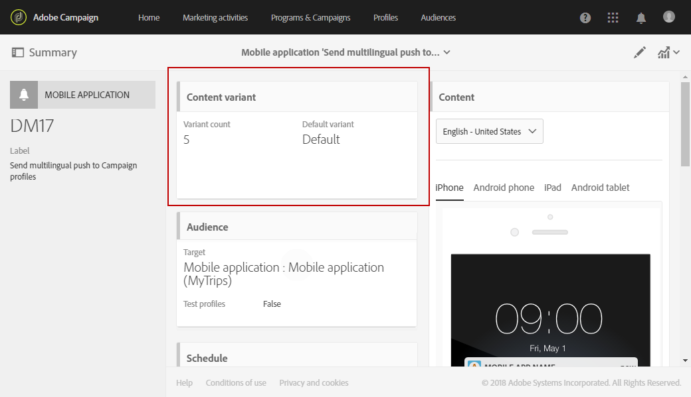

多言語プッシュ通知配信を送信する準備ができました。

## ステップ 3：多言語プッシュ通知配信の送信と分析 {#step-3--send-and-analyze-multilingual-push-notification-delivery}

多言語コンテンツのバリエーションのプッシュ通知をユーザーに送信する準備が整いました。

1. 送信の準備を開始するには、**[!UICONTROL Prepare]** ボタンをクリックします。
1. 警告なしで準備が完了したら、**[!UICONTROL Confirm]** ボタンをクリックして、多言語プッシュの送信を開始できます。

   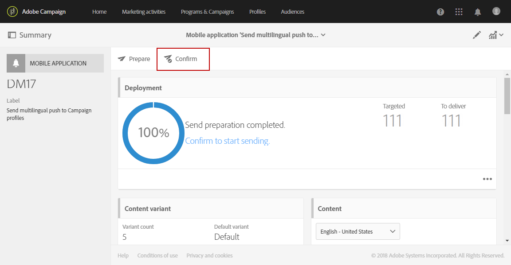

1. プッシュ通知を正常に送信した後、**[!UICONTROL Reports]** アイコンをクリックし、**[!UICONTROL Dynamic reports]**&#x200B;をクリックして、配信の成功を分析します。

   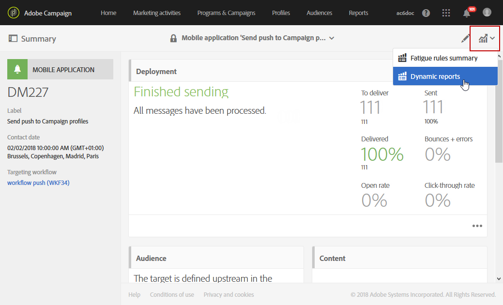

1. 「**[!UICONTROL Push notification report]**」を選択します。
1. **[!UICONTROL Variant]** ディメンションをパネルにドラッグ&amp;ドロップして、データのフィルタリングを開始します。

   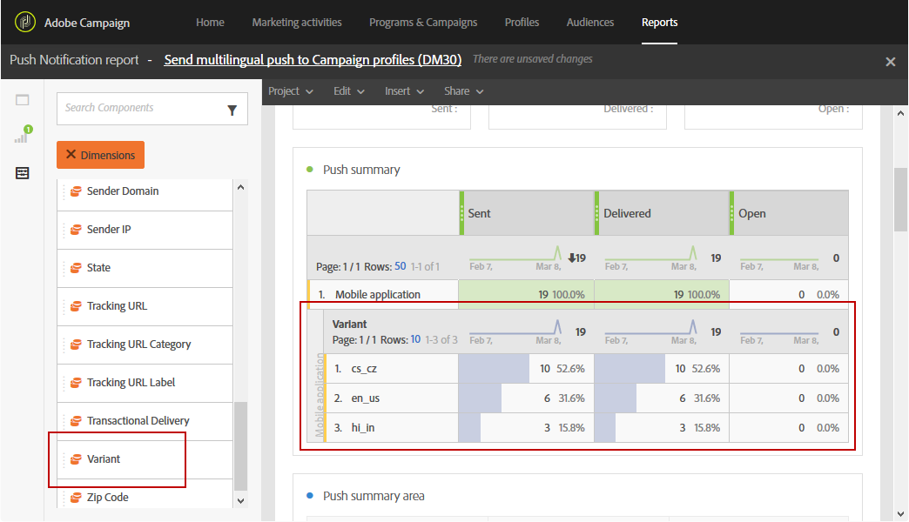

多言語プッシュ通知配信が受信者に与える影響を測定できるようになりました。

**関連トピック：**

* [プッシュ通知レポート](../../reporting/using/push-notification-report.md)
* [ワークフロー内でのプッシュ通知の送信](../../automating/using/push-notification-delivery.md)
