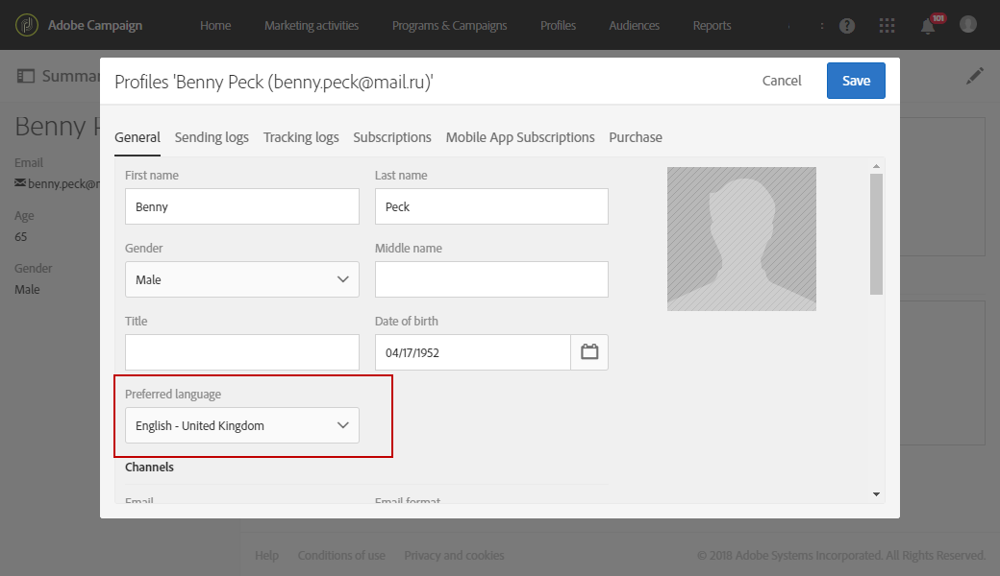

# 多言語プッシュ通知の作成{#creating-a-multilingual-push-notification}

## 多言語プッシュ通知について {#about-multilingual-push-notification}

ユーザーの好みの言語と地域に基づいてメッセージを送信し、プッシュ通知コンテンツをパーソナライズします。 多言語のプッシュ通知コンテンツのバリエーションをコンテンツエディターで直接読み込み、多言語のプッシュ通知を1つの配信で送信できます。

この機能は、プッシュ通知に使用される配信テンプレートに応じて、受信者のプロファイルで指定された優先言語またはモバイルアプリ購読者のシステム言語設定のどちらかを利用します。 特定のユーザーの言語環境設定が入力されていない場合、多言語プッシュ通知の作成時に定義されたデフォルトのバリアントが使用されます。 プロファイルとサブスクライバの管理方法の詳細については、この [ガイドを参照してください](../../audiences/using/get-started-profiles-and-audiences.md)。

プッシュ通知配信で多言語コンテンツバリアントを使用するには、次の手順に従います。

* [手順1:多言語コンテンツバリアントのアップロード](#step-1--upload-multilingual-content-variant)
* [手順2:多言語コンテンツのバリアントを使用してプレビューを行い、プッシュ通知を最終処理します](#step-2--preview-and-finalize-a-push-notification-using-multilingual-content-variants)
* [手順3:多言語プッシュ通知配信の送信と分析](#step-3--send-and-analyze-multilingual-push-notification-delivery)

## 手順1:多言語コンテンツバリアントのアップロード {#step-1--upload-multilingual-content-variant}

多言語プッシュ通知をパーソナライズする前に、まず多言語配信テンプレートにコンテンツバリアントをアップロードし、配信を作成する必要があります。

>[!NOTE]
>
>各言語バリアントに手動でバリアントを作成する場合は、この手順をスキップすることもできます。

1. で、ボタン **[!UICONTROL Marketing activities]**&#x200B;をクリックし、 **[!UICONTROL Create]** を選択し **[!UICONTROL Push notification]**&#x200B;ます。
1. モバイルアプリケーションを購読しているAdobe Campaignプロファイルをターゲットする **[!UICONTROL Send multilingual push to Campaign profiles]****[!UICONTROL Send multilingual push to app subscriber]** 場合、またはを選択して、モバイルアプリケーションからの通知の受信を選択しているすべてのユーザーにプッシュ通知を送信します。

   

1. Enter your push notification properties and select your mobile app in the **[!UICONTROL Associate a Mobile App to a delivery]** field.

   ドロップダウンには、SDK V4とAdobe Experience PlatformSDKの両方のアプリケーションが表示されます。

1. ウィンドウで、クエリをドラッグ&amp;ドロップしてオーディエンスを微調整します。 **[!UICONTROL Audiences]**

   追加されるクエリは、選択したテンプレートに応じて異なります。テンプレートを選択した場合は、モバイルアプリケーションの既知の受信者をクエリできます。 **[!UICONTROL Send multilingual push to Campaign profiles]** 一方、テンプレートを選択した場合は、 **[!UICONTROL Send multilingual push to app subscriber]** オプトインした特定のアプリのすべてのサブスクライバーをクエリできます。
   >[!NOTE]
   >
   >特定の言語を使用するオーディエンスをターゲットする場合は、CSVファイルでターゲット言語をすべてリストする必要があります。

   

1. ウィンドウで、ファイルをドラッグ&amp;ドロップするか、コンピューターからファイルを選択します。 **[!UICONTROL Manage Content Variants]**

   ファイルはUTF8エンコードである必要があり、 **[!UICONTROL Download the sample file]** オプションをクリックすると見つかる特定のレイアウトが必要です。 また、ロケール値には正しい構文を使用する必要があります。 ファイル形式とサポートされているロケールについて詳しくは、この [テクノロジーを参照してください](https://docs.adobe.com/content/help/ja-JP/campaign-standard/using/communication-channels/push-notifications/generating-csv-multilingual-push.translate.html)。

   

1. ファイルをアップロードすると、言語バリアントが **[!UICONTROL Variants]** タブに自動的に入力されます。 対象ユーザーに優先言語が指定されていない場合、デフォルトコンテンツバリアント **[!UICONTROL Default variant]** となるファイル内にを指定できます。

   

1. この **[!UICONTROL Variant selection]** タブには、配信テンプレートに応じてどの言語設定を考慮するかを決定するスクリプトが用意されています。 これは標準搭載のスクリプトで、変更を行う必要はありません。
1. 読み込んだファイルに存在しないバリアントをさらに追加する場合は、ボタンをクリックし、必要な数の新しい言語バリアントを追加 **[!UICONTROL Add an element]** します。

   ファイルからアップロードされたバリアント以外のバリアントを追加すると、コンテンツはこの言語にリンクされません。 配信ダッシュボードでコンテンツを直接編集する必要があります。

   

1. 設定が完了 **[!UICONTROL Create]** したら、をクリックします。 配信ダッシュボードからいつでもウィン **[!UICONTROL Content variant]** ドウに戻って変更を加えることができます。

   

開始が多言語プッシュ通知を個人化できるようになりました。

## 手順2:多言語コンテンツのバリアントを使用してプレビューを行い、プッシュ通知を最終処理します {#step-2--preview-and-finalize-a-push-notification-using-multilingual-content-variants}

コンテンツバリアントを含むファイルをアップロードした後、プッシュ通知配信から様々なバリアントをプレビューできるようになりました。

ファイルからアップロードされたバリアントに加えて、さらに多くのバリアントを作成および編集することもできます。

1. 配信ダッシュボードの **[!UICONTROL Content]** ウィンドウで、ドロップダウンリストを使用して、選択した言語に応じてプッシュ通知コンテンツをプレビューできます。

   

1. 特定の言語に対してコンテンツバリアントが指定されていない場合は、プレビューの下のベルのアイコンをクリックして、開始に対してこの言語バリアントにコンテンツを追加します。

   ウィンドウをクリックすると、プッシュ通知は、ドロップダウンで選択した言語のコンテンツを表します。 **[!UICONTROL Content]** このウィンドウで行った変更は、1つの言語にのみ影響します。

1. コンテンツバリアントをクリックして、パーソナライゼーションフィールドなどを使ってさらにカスタマイズすることもできます。

   For more information on how to customize your push notification, refer to this [section](../../channels/using/customizing-a-push-notification.md).

   

1. 言語バリアントを追加または削除する場合は、 **[!UICONTROL Content variant]** ウィンドウをクリックします。

   新しい言語を追加すると、追加した言語にリンクされたプッシュ通知にコンテンツを手動で追加する必要があることに注意してください。

   

これで、多言語プッシュ通知配信を送信する準備が整いました。

## 手順3:多言語プッシュ通知配信の送信と分析 {#step-3--send-and-analyze-multilingual-push-notification-delivery}

これで、多言語コンテンツバリアントのプッシュ通知をユーザーに送信する準備が整いました。

1. 送信の準備を開始するには、 **[!UICONTROL Prepare]** ボタンをクリックします。
1. 警告なしで準備が完了したら、ボタンをクリックして、多言語プッシュを送信する開始を **[!UICONTROL Confirm]** 送信できます。

   

1. プッシュ通知が正常に送信されたら、 **[!UICONTROL Reports]** アイコンをクリックし、配信の成功 **[!UICONTROL Dynamic reports]** を分析します。

   

1. 「**[!UICONTROL Push notification report]**」を選択します。
1. ディメンションをパネルにドラッグ&amp;ドロップして、データのフィルタリングを開始します。 **[!UICONTROL Variant]**

   

受信者に対する多言語プッシュ通知配信の影響を測定できるようになりました。

**関連トピック：**

* [プッシュ通知レポート](../../reporting/using/push-notification-report.md)
* [ワークフロー内でのプッシュ通知の送信](../../automating/using/push-notification-delivery.md)
* [1つのワークフローで多言語オーディエンスにアクセス](https://helpx.adobe.com/jp/campaign/kb/simplify-campaign-management.html#Engageyourcustomersateverystep)
