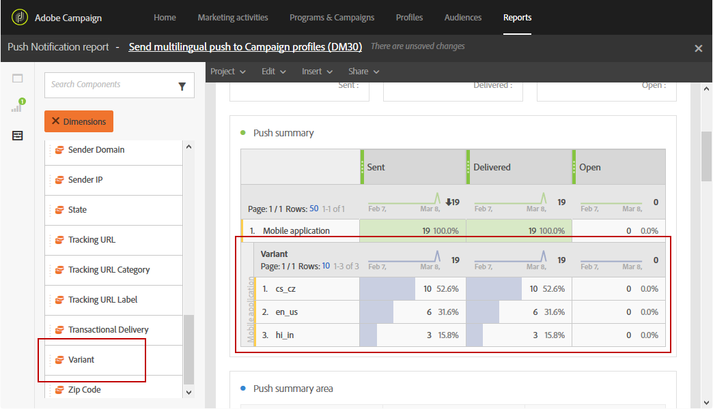

# 多言語プッシュ通知の作成{#creating-a-multilingual-push-notification}

## 多言語プッシュ通知について {#about-multilingual-push-notification}

ユーザーの優先言語および地域に基づいてメッセージを送信することで、プッシュ通知コンテンツをパーソナライズします。 多言語プッシュ通知のコンテンツバリアントをコンテンツエディターに直接読み込んで、多言語プッシュ通知を 1 つの配信で送信できます。

この機能は、プッシュ通知に使用される配信テンプレートに応じて、受信者のプロファイルで指定された優先言語またはモバイルアプリ購読者のシステム言語環境設定のいずれかを活用します。 特定のユーザーに対して言語の環境設定が入力されていない場合、多言語プッシュ通知の作成時に定義されたデフォルトのバリアントが使用されます。 プロファイルと購読者の管理方法について詳しくは、この [&#x200B; ガイド &#x200B;](../../audiences/using/get-started-profiles-and-audiences.md) を参照してください。

プッシュ通知配信に多言語コンテンツのバリアントを使用するには、次の手順に従います。

* [手順 1：多言語コンテンツバリアントのアップロード](#step-1--upload-multilingual-content-variant)
* [手順 2：多言語コンテンツのバリアントを使用したプッシュ通知のプレビューと最終処理](#step-2--preview-and-finalize-a-push-notification-using-multilingual-content-variants)
* [手順 3：多言語プッシュ通知配信を送信および分析する](#step-3--send-and-analyze-multilingual-push-notification-delivery)

## 手順 1：多言語コンテンツバリアントのアップロード {#step-1--upload-multilingual-content-variant}

多言語プッシュ通知をパーソナライズする前に、まず多言語配信テンプレートにコンテンツのバリアントをアップロードして、配信を作成する必要があります。

>[!NOTE]
>
>各言語バリアントに対して手動でバリアントを作成する場合も、この手順をスキップできます。

1. **[!UICONTROL Marketing activities]** で「**[!UICONTROL Create]**」ボタンをクリックし、「**[!UICONTROL Push notification]**」を選択します。
1. モバイルアプリケーションを購読しているAdobe Campaign プロファイルをターゲットにする場合はテンプレート **[!UICONTROL Send multilingual push to Campaign profiles]** を選択します。または、モバイルアプリケーションからの通知の受信をオプトインしたすべてのユーザーにプッシュ通知を送信する場合はテンプレート **[!UICONTROL Send multilingual push to app subscriber]** を選択します。

   

1. プッシュ通知のプロパティを入力し、「**[!UICONTROL Associate a Mobile App to a delivery]**」フィールドでモバイルアプリを選択します。

   ドロップダウンに、SDK V4 とAdobe Experience Platform SDK の両方のアプリケーションが表示されることに注意してください。

1. **[!UICONTROL Audiences]** ウィンドウで、クエリをドラッグ&amp;ドロップして、オーディエンスを微調整します。

   追加されるクエリは、選択したテンプレートによって異なります。**[!UICONTROL Send multilingual push to Campaign profiles]** テンプレートを選択した場合、モバイルアプリケーションの既知の受信者に対してクエリを実行できます。 一方、**[!UICONTROL Send multilingual push to app subscriber]** テンプレートを選択した場合は、オプトインした特定のアプリのすべての購読者をクエリできます。
   >[!NOTE]
   >
   >特定の言語でオーディエンスをターゲットにする場合は、CSV ファイルのすべてのターゲット言語をリストする必要があります。

   

1. **[!UICONTROL Manage Content Variants]** ウィンドウで、ファイルをドラッグ&amp;ドロップするか、コンピューターからファイルを選択します。

   ファイルは UTF8 でエンコードする必要があり、「**[!UICONTROL Download the sample file]**」オプションをクリックすると表示される特定のレイアウトが必要です。 また、ロケール値に対しては適切な構文を使用する必要があります。 ファイル形式とサポートされているロケールについて詳しくは、この [&#x200B; ページ &#x200B;](../../channels/using/generating-csv-multilingual-push.md) を参照してください。

   

1. ファイルをアップロードすると、言語のバリアントが「**[!UICONTROL Variants]**」タブに自動的に入力されます。 ターゲットユーザーに優先言語が指定されていない場合、ファイルにデフォルトのコンテンツバリアントとなる **[!UICONTROL Default variant]** を指定できます。

   

1. 「**[!UICONTROL Variant selection]**」タブには、配信テンプレートに応じて考慮する言語の環境設定を決定するスクリプトが表示されます。 これは標準のスクリプトで、変更を加える必要はありません。
1. 読み込んだファイルに存在しないバリアントをさらに追加する場合は、「**[!UICONTROL Add an element]**」ボタンをクリックし、必要な数の新しい言語バリアントを追加します。

   ファイルからアップロードされたもの以外のバリアントを追加しても、この言語にリンクされるコンテンツはありません。 コンテンツは、配信ダッシュボードで直接編集する必要があります。

   

1. 設定が完了したら、「**[!UICONTROL Create]**」をクリックします。 いつでも、**[!UICONTROL Content variant]** のウィンドウに戻って、配信ダッシュボードから変更を加えることができます。

   

これで、多言語プッシュ通知のパーソナライズを開始できます。

## 手順 2：多言語コンテンツのバリアントを使用したプッシュ通知のプレビューと最終処理 {#step-2--preview-and-finalize-a-push-notification-using-multilingual-content-variants}

コンテンツバリアントを含むファイルをアップロードしたら、プッシュ通知配信から様々なバリアントをプレビューできるようになりました。

ファイルからアップロードしたバリアントに加えて、より多くのバリアントを作成および編集することもできます。

1. 配信ダッシュボードの **[!UICONTROL Content]** ウィンドウにあるドロップダウンで、選択した言語に応じてプッシュ通知コンテンツをプレビューできます。

   

1. コンテンツバリアントが特定の言語に指定されていない場合は、プレビューの下にあるベルのアイコンをクリックして、この言語バリアントにコンテンツを追加します。

   プッシ **[!UICONTROL Content]** 通知ウィンドウをクリックすると、ドロップダウンで選択された言語のコンテンツがプッシュ通知に表示されます。 このウィンドウで行った変更は、1 つの言語にのみ影響します。

1. また、コンテンツバリアントをクリックして、パーソナライゼーションフィールドなどを使用してさらにカスタマイズすることもできます。

   プッシュ通知のカスタマイズ方法について詳しくは、この [&#x200B; 節 &#x200B;](../../channels/using/customizing-a-push-notification.md) を参照してください。

   

1. 言語のバリアントを追加または削除する場合は、**[!UICONTROL Content variant]** ウィンドウをクリックします。

   新しい言語を追加する場合は、追加した言語にリンクされているプッシュ通知にコンテンツを手動で追加する必要があります。

   

これで、多言語プッシュ通知配信を送信する準備が整いました。

## 手順 3：多言語プッシュ通知配信を送信および分析する {#step-3--send-and-analyze-multilingual-push-notification-delivery}

これで、多言語コンテンツバリアントのプッシュ通知をユーザーに送信する準備が整いました。

1. 送信の準備を開始するには、「**[!UICONTROL Prepare]**」ボタンをクリックします。
1. 警告なしで準備が完了したら、「**[!UICONTROL Confirm]**」ボタンをクリックして、多言語プッシュの送信を開始できます。

   

1. プッシュ通知が正常に送信されたら、**[!UICONTROL Reports]** のアイコンをクリックし、を **[!UICONTROL Dynamic reports]** リックして配信の成功を分析します。

   

1. 「**[!UICONTROL Push notification report]**」を選択します。
1. **[!UICONTROL Variant]** ディメンションをパネルにドラッグ&amp;ドロップして、データのフィルタリングを開始します。

   

多言語プッシュ通知配信が受信者に与える影響を測定できるようになりました。

**関連トピック：**

* [プッシュ通知レポート](../../reporting/using/push-notification-report.md)
* [ワークフロー内でのプッシュ通知の送信](../../automating/using/push-notification-delivery.md)
