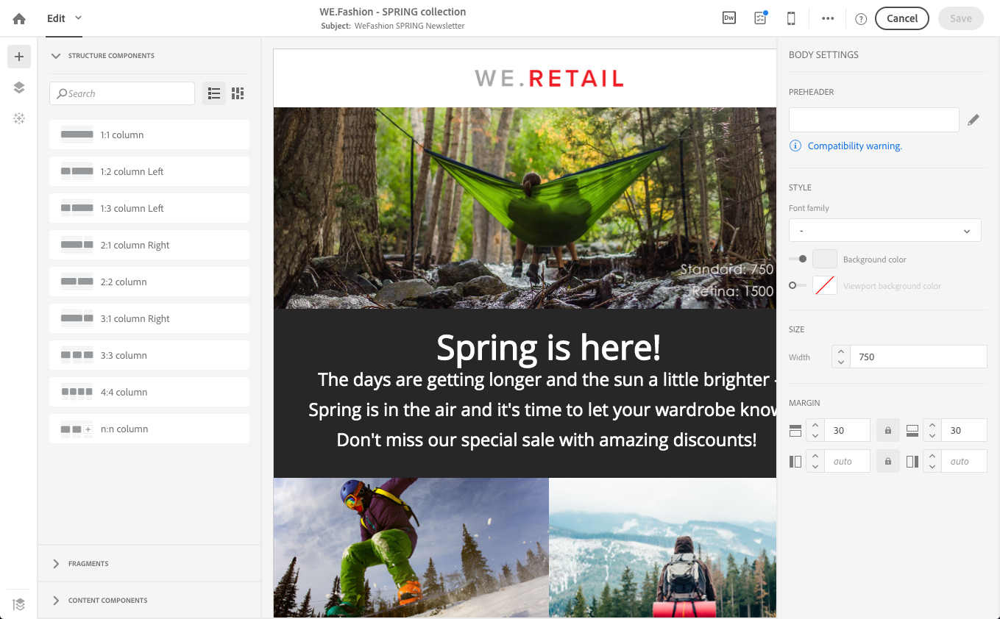

# メールの作成{#creating-an-email}

[ キャンペーン ](../../start/using/marketing-activities.md#creating-a-marketing-activity)、Adobe Campaign [ ホームページ ](../../start/using/interface-description.md#home-page)、または[ マーケティングアクティビティリスト ](../../start/using/marketing-activities.md#about-marketing-activities)からメールを作成できます。 ワークフローから1回限りのメールと定期的なメールを作成することもできます。

 [ビデオでこの機能を確認する](#video)

1. メールマーケティングアクティビティの作成を開始したら、使用するテンプレートを選択します。

   デフォルトでは、各マーケティングアクティビティに対して複数のテンプレートから選択できます。 これにより、ニーズに応じて特定のパラメーターを事前設定したり、配信にブランドを割り当てたりすることができます。 詳しくは、[ テンプレートの管理](../../start/using/marketing-activity-templates.md)を参照してください。

   

   >[!NOTE]
   >
   >フォローアップおよび A/B テストテンプレートは、デフォルトで非表示になっています。 表示する場合は、左側のチェックボックス（**[!UICONTROL Filter]**&#x200B;横パネル）をオンにします。

1. メールの一般的なプロパティを入力します。 **ラベル** フィールドに名前を入力し、IDを編集できます。

   >[!NOTE]
   >
   >アクティビティ名とそのIDの両方がインターフェイスに表示されますが、メッセージ受信者には表示されません。
   >
   >例えばAdobe Analyticsと統合する場合などに、ID フィールドに空白が含まれていないことを確認して、差異を回避します。

   キャンペーンコンテンツに表示される説明を追加できます。

   

   >[!NOTE]
   >
   >ホームページまたはマーケティングアクティビティのリストから、親キャンペーン内にメールを作成できます。 作成済みのキャンペーンから選択します。

1. ビジネス基準にもとづいて、メッセージのターゲットを定義します。 [ プロファイルについて](../../audiences/using/about-profiles.md)を参照してください。

   メッセージを検証するテストプロファイルを定義することもできます。 [テストプロファイルの管理](../../audiences/using/managing-test-profiles.md)を参照してください。

   

1. [電子メール Designer](../../designing/using/designing-content-in-adobe-campaign.md)を使用して、メッセージの内容、送信者名、件名を定義し、パーソナライズします。 詳しくは、[電子メールコンテンツデザインについて](../../designing/using/designing-content-in-adobe-campaign.md)を参照してください。

   

   メッセージは、定義済みのコンテンツテンプレートを使用するか、DreamweaverまたはAdobe Experience Managerを使用して直接デザインできます。 デザイナーではない人でも、用意されたコンテンツをアップロードしたり、URLから既存のコンテンツをインポートしたりできます。 詳しくは、[既存のコンテンツの選択](../../designing/using/using-existing-content.md)を参照してください。

1. メッセージをプレビューします。 [メッセージのプレビュー](../../sending/using/previewing-messages.md)を参照してください。
1. メールの作成を確認します。

   >[!NOTE]
   >
   >メールを保存できるようにするには、まずコンテンツを編集する必要があります。 この時点で&#x200B;**[!UICONTROL Cancel]**&#x200B;をクリックすると、ウィザードが完了せず、電子メールは作成されません。

   次に、メールダッシュボードが表示されます。 メッセージを確認し、[送信](../../sending/using/preparing-the-send.md)を準備できます。

   右上隅の&#x200B;**[!UICONTROL Edit properties]** ボタンを使用すると、メールのプロパティを編集できます。 例えば、配信準備時にラベルが計算されるように、メールを設定できます。  使用可能なパラメーターは、[このセクション ](../../administration/using/configuring-email-channel.md#list-of-email-properties)に記載されています。

   

1. 送信をスケジュールします。 [メッセージのスケジュール](../../sending/using/about-scheduling-messages.md)を参照してください。

   

1. メッセージのターゲットを分析する準備を整えます。 [送信準備](../../sending/using/confirming-the-send.md)を参照してください。

   

   >[!NOTE]
   >
   >過剰に配信を受けているプロファイルをキャンペーンから自動的に除外するグローバルなクロスチャネル疲労ルールを設定できます。 詳しくは、[疲労ルール ](../../sending/using/fatigue-rules.md)を参照してください。

1. 配達確認を送信してメッセージを確認および検証し、インボックスのレンダリングを監視します。 [ プルーフの送信](../../sending/using/sending-proofs.md)を参照してください。

   

1. メッセージを送信し、メッセージダッシュボードとログを通じて配信を確認します。 [ メッセージの送信](../../sending/using/confirming-the-send.md)を参照してください。

   

1. 配信レポートでメッセージの影響を測定。 レポートについて詳しくは、[このセクション ](../../reporting/using/about-dynamic-reports.md)を参照してください。

**関連トピック**：

* [ パーソナライズされた電子メールの作成](../../channels/using/key-steps-to-send-a-message.md) ステップバイステップガイド
* [Adobe CampaignとDreamweaverの統合](../../designing/using/using-integrations.md#editing-content-in-dreamweaver)
* [Adobe Experience Managerとの統合](../../integrating/using/integrating-with-experience-manager.md)

## チュートリアルビデオ {#video}

このビデオでは、メールの作成方法を説明します。

>[!VIDEO](https://video.tv.adobe.com/v/23721?quality=12)

その他のCampaign Standardのハウツー動画は[こちら](https://experienceleague.adobe.com/docs/campaign-standard-learn/tutorials/overview.html?lang=ja)でご覧いただけます。
