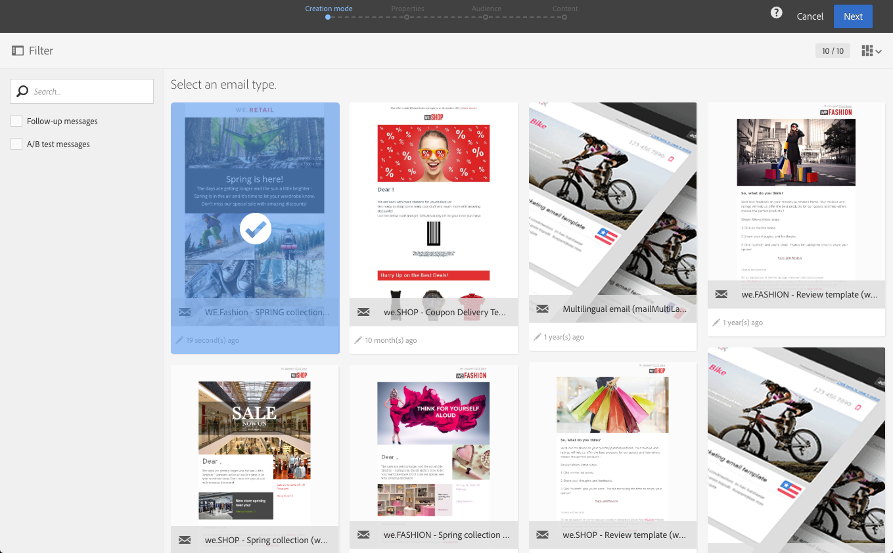

# 電子メールの作成{#creating-an-email}

電子メールは、 [キャンペーン](../../start/using/marketing-activities.md#creating-a-marketing-activity)、Adobe Campaignホームページ [、またはマーケティング](../../start/using/interface-description.md#home-page)アクティビティリスト [から作成できます](../../start/using/marketing-activities.md#about-marketing-activities)。 ワークフローから単一送信および定期的な電子メールを作成することもできます。

1. 電子メールマーケティングアクティビティの作成を開始したら、使用するテンプレートを選択します。

   デフォルトでは、各マーケティングテンプレートに対して複数のテンプレートからアクティビティできます。 これにより、ニーズに応じて特定のパラメーターを事前設定し、ブランドを配信に割り当てることができます。 詳しくは、テンプレートの管理を参 [照してください](../../start/using/marketing-activity-templates.md)。

   

   >[!NOTE]
   >
   >フォローアップおよびA/Bテストテンプレートは、デフォルトでは非表示になっています。 表示する場合は、左側（横パネル） **[!UICONTROL Filter]** のチェックボックスをオンにします。

1. 電子メールの一般的なプロパティを入力します。 「ラベル」フィールドに名前を入力し **て** 、IDを編集できます。 アクティビティ名とそのIDは両方ともインターフェイスに表示されますが、メッセージメッセージには表示されません受信者。

   ユーザーがユーザーのコンテンツに表示できる説明をキャンペーンできます。

   

   >[!NOTE]
   >
   >親キャンペーン内での電子メールの作成は、ホームページまたはマーケティングアクティビティのリストから行えます。 作成済みのキャンペーンから選択します。

1. メッセージのターゲットをビジネスの基準に基づいて定義します。 詳しくは、 [プロファイルの管理](../../audiences/using/about-profiles.md)。

   また、メッセージを検証するテストプロファイルを定義することもできます。 詳しくは、テ [ストプロファイルの管理](../../audiences/using/managing-test-profiles.md)。

   

1. 電子メールデザイナーを使用して、メッセージの内容、送信者名、件名を定義し、パーソナラ [イズしま](../../designing/using/designing-content-in-adobe-campaign.md)す。 For more on this, see [About email content design](../../designing/using/designing-content-in-adobe-campaign.md).

   

   定義済みのコンテンツテンプレートを使用して、またはDreamweaverまたはAdobe Experience Managerを使用して、メッセージを直接デザインできます。 デザイナーの気に入らない場合は、準備が整ったコンテンツをアップロードするか、URLから既存のコンテンツを読み込むこともできます。 詳しくは、 [既存のコンテンツの選択を参照してくださ](../../designing/using/using-existing-content.md)い。

1. メッセージのプレビュー. メッセージのプ [レビューを参照してくださ](../../sending/using/previewing-messages.md)い。
1. 電子メールの作成を確認します。

   >[!NOTE]
   >
   >電子メールを保存するには、まずコンテンツを編集する必要があります。 この時点でをク **[!UICONTROL Cancel]** リックしても、ウィザードは完了せず、電子メールは作成されません。

   電子メールダッシュボードが表示されます。 メッセージを確認し、送信の準備を [行うことができます](../../sending/using/preparing-the-send.md)。

   右上隅 **[!UICONTROL Edit properties]** のボタンを使用して、電子メールのプロパティを編集できます。 例えば、電子メールのラベルが配信の準備時に計算されるように、電子メールを設定できます。  Available parameters are listed in [this section](../../administration/using/configuring-email-channel.md#list-of-email-properties).

   

1. 送信のスケジュールを設定します。 詳しくは、メッ [セージのスケジュールを参照](../../sending/using/about-scheduling-messages.md)。

   

1. メッセージを分析するためのターゲット。 See [Preparing the send](../../sending/using/confirming-the-send.md).

   

   >[!NOTE]
   >
   >訪問者から過剰訪問のプロファイルを自動的に除外する、チャネル間の疲労ルールをグローバルに設定できます。 詳しくは、疲労ルールを参照し [てください](../../sending/using/fatigue-rules.md)。

1. 配達確認を送信して、メッセージを確認および検証し、インボックスのレンダリングを監視します。 「送信 [配達確認](../../sending/using/sending-proofs.md)」

   

1. メッセージを送信し、メッセージ配信とログでメッセージを確認します。 詳しくは、メッ [セージの送信を参照してくださ](../../sending/using/confirming-the-send.md)い。

   

1. メッセージの影響を測定する配信レポート。 For more on reporting, see [this section](../../reporting/using/about-dynamic-reports.md).

**関連トピック**：

* [電子メールビデオの作成](https://docs.adobe.com/content/help/en/campaign-learn/campaign-standard-tutorials/getting-started/create-email-from-homepage.html) （英語）
* [パーソナライズされた電子メール](https://helpx.adobe.com/campaign/kb/acs-get-started-with-emails.html) ・ステップ・バイ・ステップ・ガイドの作成
* [Adobe CampaignとDreamweaverの統合に関するビデオ](https://docs.adobe.com/content/help/en/campaign-learn/campaign-standard-tutorials/designing-content/email-designer/dreamweaver-integration.html) （英語のみ）
* [Adobe Experience Managerとの連携](../../integrating/using/integrating-with-experience-manager.md)
