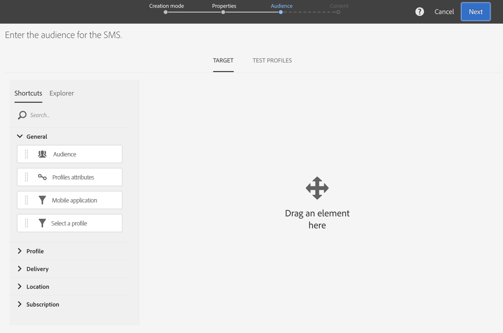

# SMS メッセージの作成{#creating-an-sms-message}

SMS配信の作成は、通常の電子メールの作成と非常に似ています。 次の手順で、この設定に固有の設定を説明します。チャネル その他のオプ [ションの詳細については](../../channels/using/creating-an-email.md) 、「電子メールの作成」を参照してください。

詳細なSMSパラメータの詳細については、 [SMS設定セクションを参照してください](../../administration/using/configuring-sms-channel.md) 。

SMSメッセージを作成して携帯電話に送信するには、次の操作が必要です。

* 外部アカウントで **[!UICONTROL Routing]** 設定された **[!UICONTROL Mobile (SMS)]** チャネルでのモ **[!UICONTROL Bulk delivery]** ード。 For more on this, refer to the [Routing](../../administration/using/configuring-sms-channel.md#defining-an-sms-routing) section.
* この配信テンプレートに正しくリンクされている外部アカウント。

1. SMS配信の作成 これは、Adobe Campaign [ホームページ](../../start/using/interface-description.md#home-page)、 [キャンペーン](../../start/using/marketing-activities.md#creating-a-marketing-activity) 、またはマーケティングアクティビティ [リストで行えます](../../start/using/programs-and-campaigns.md#creating-a-campaign)。

   ワークフローにSMSアクティビティを追加することもできます。 詳しくは、[ワークフロー](../../automating/using/sms-delivery.md)ガイドを参照してください。

   メッセージを作成する際に、最も重要な手順を示すウィザードが表示されます。 ウィザードを使用して定義した内容は、後でメッセージダッシュボードから編集できます。

1. 使用するテンプレートを選択します。 標準搭載のSMSテンプレートまたは独自のテンプレートのいずれかを選択できます。

   

   携帯電話に配信するには、配信テンプレートがSMSルーティング外部アカウントに正しくリンクされている必要があります。

1. SMSの一般的なプロパティを入力します。

   

   アクティビティラベルとそのIDは両方ともインターフェイスに表示されますが、メッセージメッセージには表示されません受信者。

1. ターゲットするオーディエンスを指定します。 ルールを定義して組み合わせることで、既存のオーディエンスを選択するか、ターゲットを直接選択することができます。

   

1. SMS追加の内容 SMSの作成が完了したら、配信ダッシュボードのセクシ **[!UICONTROL Content]** ョンをクリックして、コンテンツを定義することもできます。 SMSコンテンツ [デザインについてを参照してくださ](../../channels/using/about-sms-and-push-content-design.md)い。

   SMSメッセージの内容にパーソナライゼーションフィールドや条件テキストを挿入した場合、メッセージの長さは受信者によって異なります。 実際、これらの要因によって、GSMエンコーディングで考慮されない文字が導入される可能性があります。 これは、パーソナライゼーションが実行された後、メッセージの長さを評価する必要がある理由です。 See [Personalizing SMS messages](../../channels/using/personalizing-sms-messages.md).

   

1. メッセージの作成を確認します。 そのダッシュボードが表示されます。
1. 送信のスケジュールを設定します。 SMSは、メッセージの準備直後に手動で送信したり、スケジュールされた日に自動的に送信したりできます。 詳しくは、メッ [セージのスケジュールを参照](../../sending/using/about-scheduling-messages.md)。
1. メッセージの有効性、パーソナライゼーション、ターゲットを分析

   

   >[!NOTE]
   >
   >訪問者から過剰訪問のプロファイルを自動的に除外する、チャネル間の疲労ルールをグローバルに設定できます。 疲労ルー [ルを参照してくださ](../../sending/using/fatigue-rules.md)い。

1. 配達確認を送信して、メッセージを確認および検証し、インボックスのレンダリングを監視します。 送信配達確認  。
1. メッセージの送信を確認します。 送信は、定義した開始に従ってスケジュールを送信します。

   

メッセージが送信されます。 メッセージ配信とログでメッセージを確認できます。

送信が完了したら、組み込みのメッセージやカスタム開始を使用して、メッセージの影響を測定できます。配信レポート

**関連トピック：**

* [SMSとプッシュコンテンツエディションについて](../../channels/using/about-sms-and-push-content-design.md)
* [テンプレートの管理](../../start/using/marketing-activity-templates.md)
* [SMS配信ビデオの作成](https://docs.adobe.com/content/help/en/campaign-learn/campaign-standard-tutorials/communication-channels/mobile/sms/sms-delivery.html)

