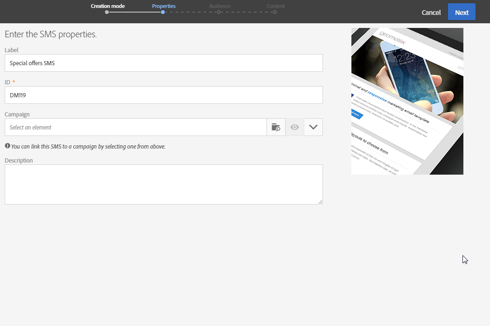

# SMS メッセージの作成{#creating-an-sms-message}

SMS配信の作成は、通常の電子メールの作成と非常に似ています。 次の手順では、このチャネルに固有の設定について説明します。 その他のオプ [ションの詳細については](../../channels/using/creating-an-email.md) 、「電子メールの作成」を参照してください。

詳細なSMSパラメータは、「 [SMS configuration](../../administration/using/configuring-sms-channel.md) 」セクションで説明します。

SMSメッセージを作成して携帯電話に送信するには、次の操作が必要です。

* モード **[!UICONTROL Routing]**を使用してチャネルに設定**[!UICONTROL Mobile (SMS)]** された外部アカウ **[!UICONTROL Bulk delivery]**ント。 For more on this, refer to the[Routing](../../administration/using/configuring-sms-channel.md#defining-an-sms-routing)section.
* この外部アカウントに正しくリンクされた配信テンプレート。

1. SMS配信を作成します。 これは、Adobe Campaignホームページ、キャンペーン [またはマーケティングア](../../start/using/interface-description.md#home-page)クティビティ [リスト](../../start/using/marketing-activities.md#creating-a-marketing-activity) から実行できます 。

   SMSアクティビティをワークフローに追加することもできます。 詳しくは、[ワークフロー](../../automating/using/sms-delivery.md)ガイドを参照してください。

   メッセージを作成する際に、最も重要な手順を示すウィザードが表示されます。 ウィザードを使用して定義した内容は、後でメッセージダッシュボードから編集できます。

1. 使用するテンプレートを選択します。 標準搭載のSMSテンプレートまたは独自のテンプレートのいずれかを選択できます。

   

   携帯電話に配信するには、配信テンプレートがSMSルーティング外部アカウントに正しくリンクされている必要があります。

1. SMSの一般的なプロパティを入力します。

   

   アクティビティのラベルとIDは両方ともインターフェイスに表示されますが、メッセージの受信者には表示されません。

1. ターゲットにするオーディエンスを指定します。 ルールを定義および組み合わせて、既存のオーディエンスを選択するか、訪問者を直接ターゲットにすることができます。

   

1. SMSにコンテンツを追加します。 また、SMSの作成が完了したら、配信ダッシュボ **[!UICONTROL Content]**ードのセクションをクリックして、コンテンツを定義することもできます。 SMSコンテンツ[デザインについてを参照してくださ](../../channels/using/about-sms-and-push-content-design.md)い。

   SMSメッセージのコンテンツにパーソナライゼーションフィールドまたは条件テキストを挿入した場合、メッセージの長さは受信者によって異なる場合があります。 実際、これらの要因によって、GSMエンコーディングで考慮されない文字が生じる可能性があります。 これは、パーソナライゼーションが実行された後にメッセージの長さを評価する必要がある理由です。 See [Personalizing SMS messages](../../channels/using/personalizing-sms-messages.md).

   

1. メッセージの作成を確認します。 そのダッシュボードが表示されます。
1. 送信をスケジュールします。 SMSは、メッセージの準備直後に手動で送信したり、スケジュールされた日に自動的に送信したりできます。 詳しくは、メッ [セージのスケジュールを参照してくださ](../../sending/using/about-scheduling-messages.md)い。
1. メッセージの有効性、パーソナライゼーション、およびターゲットを分析するための準備をします。

   

   >[!NOTE]
   >
   >キャンペーンから過剰に要求されるプロファイルを自動的に除外する、グローバルなチャネル間疲労ルールを設定できます。 疲労ル [ールを参照](../../administration/using/fatigue-rules.md)。

1. 校正を送信して、メッセージを確認および検証し、インボックスのレンダリングを監視します。 「証明の送信」 [の節を参照してください](../../sending/using/managing-test-profiles-and-sending-proofs.md#sending-proofs) 。
1. メッセージの送信を確認します。 定義したスケジュールに従って送信が開始されます。

   

メッセージが送信されます。 メッセージのダッシュボードとログを使用して、配信を確認できます。

送信が完了したら、組み込みの配信レポートまたはカスタム配信レポートを使用して、メッセージの影響を測定できます。

**関連トピック：**

* [SMSとプッシュコンテンツエディションについて](../../channels/using/about-sms-and-push-content-design.md)
* [テンプレートの管理](../../start/using/marketing-activity-templates.md)
* [SMS配信ビデオの作成](https://docs.adobe.com/content/help/en/campaign-learn/campaign-standard-tutorials/communication-channels/mobile/sms/sms-delivery.html) （英語のみ）

