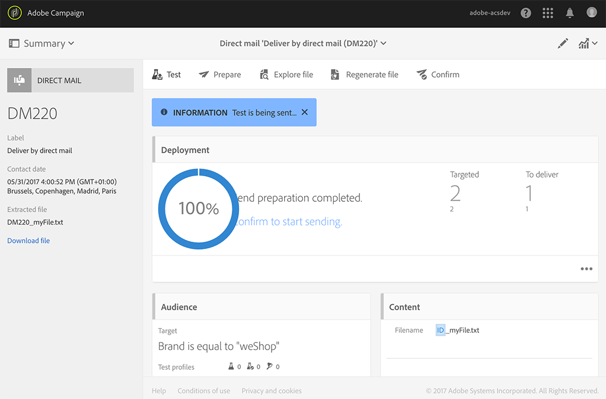

# ダイレクトメールの作成{#creating-the-direct-mail}

ダイレクトメール配信の作成方法は、通常の E メールの作成方法とよく似ています。次の手順では、このチャネルに固有の設定について説明します。その他のオプションについて詳しくは、[E メールの作成](../../channels/using/creating-an-email.md)を参照してください。

>[!NOTE]
>
>ワークフローにダイレクトメールアクティビティを追加することもできます。詳しくは、[ワークフロー](../../automating/using/direct-mail-delivery.md)ガイドを参照してください。

1. 新しいダイレクトメール配信を作成します。新しいダイレクトメール配信は、Adobe Campaign [ホームページ](../../start/using/interface-description.md#home-page)、[キャンペーン](../../start/using/marketing-activities.md#creating-a-marketing-activity)、[マーケティングアクティビティリスト](../../start/using/programs-and-campaigns.md#creating-a-campaign)のいずれかから作成できます。

   

1. そのまま使用できる&#x200B;**[!UICONTROL Direct mail]**&#x200B;テンプレートか、独自のテンプレートのいずれかを選択します。詳しくは、[テンプレートについて](../../start/using/marketing-activity-templates.md)の節を参照してください。

   

1. 配信の一般的なプロパティを入力します。

   

   >[!NOTE]
   >
   >アクティビティ名とアクティビティ ID は両方ともインターフェイスに表示されますが、メッセージ受信者には表示されません。
   >
   >例えば、Adobe Analyticsとの統合時など、不一致が生じるのを避けるために、ID フィールドに空白を含めないようにしてください。

1. 抽出ファイルに含めるオーディエンスと、テストおよびトラッププロファイルを定義します。[ダイレクトメールオーディエンスの定義](../../channels/using/defining-the-direct-mail-audience.md)を参照してください。

   

   >[!NOTE]
   >
   >オーディエンスの定義は、通常の E メールオーディエンスを定義する場合とよく似ています。[オーディエンスの作成](../../audiences/using/creating-audiences.md)を参照してください。

1. ファイルの内容（各プロファイルに含める列、ファイル構造、ヘッダーおよびフッター）を編集します。[ダイレクトメールコンテンツの定義](../../channels/using/defining-the-direct-mail-content.md)を参照してください。

   

1. 配信ダッシュボードの「**[!UICONTROL Schedule]**」セクションをクリックして、コンタクト日を定義します。ダイレクトメールの場合、コンタクト日の設定は必須です。詳しくは、[メッセージのスケジュールについて](../../sending/using/about-scheduling-messages.md)を参照してください。

   

1. テストプロファイルを追加すると（[テストおよびトラッププロファイルの追加](../../channels/using/defining-the-direct-mail-audience.md#adding-test-and-trap-profiles)を参照）、最終的なファイルを準備する前に配信をテストできます。選択したテストプロファイルのみを含んだサンプルファイルを作成できます。

   「**[!UICONTROL Test]**」をクリックして、サンプルファイルを生成します。クリック **[!UICONTROL Summary]**&#x200B;を選択し、左上隅で「 **[!UICONTROL Proofs]**. 画面の左側で、配達確認を選択して「**[!UICONTROL Download file]**」をクリックします。

   >[!NOTE]
   >
   >Adobe Campaign でファイルをエクスポートしてダウンロード可能にするには、**[!UICONTROL Export]**&#x200B;の役割が必要です。管理者にお問い合わせください。

   

1. 配信コンテンツ、オーディエンス、コンタクト日を定義したら、配信ダッシュボードの「**[!UICONTROL Prepare]**」ボタンをクリックします。

   

   タイポロジルールが適用されます。例えば、指定されていない郵送先住所はすべてターゲットから除外されます。プロファイルの情報で「**[!UICONTROL Address specified]**」チェックボックスがオンになっていることを確認する必要がある（[推奨事項](../../channels/using/about-direct-mail.md#recommendations)を参照）のは、このためですダイレクトメールのプロパティまたはテンプレートレベルで「**[!UICONTROL Maximum volume of message]**」を定義した場合は、それがここでも適用されます。

   

   >[!NOTE]
   >
   >過剰に配信を受けているプロファイルをキャンペーンから自動的に除外するグローバルなクロスチャネル疲労ルールを設定できます。[疲労ルール](../../sending/using/fatigue-rules.md)を参照してください。

1. 「**[!UICONTROL Explore file]**」をクリックして、ファイルの最初の 100 行をプレビューします。

   

   画面の左側で完全なファイルをローカルにダウンロードできます。ファイルをダウンロードすると、**[!UICONTROL Export audits]**&#x200B;メニューにログエントリが生成されます。エクスポートの監査について詳しくは、[エクスポートの監査](../../administration/using/auditing-export-logs.md)の節を参照してください。

   >[!NOTE]
   >
   >Adobe Campaign でファイルをエクスポートしてダウンロード可能にするには、**[!UICONTROL Export]**&#x200B;の役割が必要です。管理者にお問い合わせください。

   配信コンテンツを変更する必要がある場合は、「**[!UICONTROL Regenerate file]**」ボタンをクリックするだけで変更が反映されます。作成手順に戻る必要はありません。

   

1. ファイルが最終版であることを確認するには、配信ダッシュボードで「**[!UICONTROL Confirm]**」をクリックします。

   

これで、抽出ファイルをダイレクトメールプロバイダーに送信する準備ができました。ここで、次のいくつかのオプションがあります。

* ファイルを添付して通常の E メールで送信
* Campaign で送信：キャンペーン[ワークフロー](../../automating/using/direct-mail-delivery.md)内でダイレクトメールアクティビティを実行し「**[!UICONTROL Transfer file]**」を追加して、例えば FTP でファイルを送信します。詳しくは、[ファイル転送](../../automating/using/transfer-file.md)を参照してください。

プロバイダーは、誤ったアドレスのリストを取得し、この情報をAdobe Campaignに送信します。これにより、誤ったアドレスをブロックリスト自動的にします。 [送信者に返信](../../channels/using/return-to-sender.md)を参照してください。
