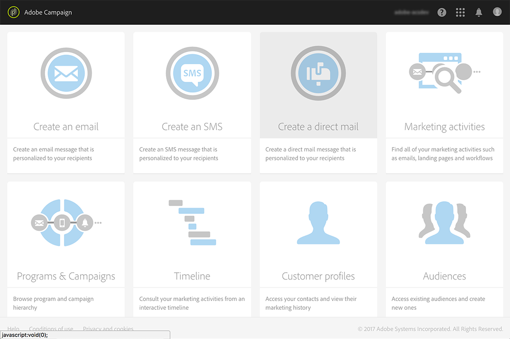

# ダイレクトメールの作成{#creating-the-direct-mail}

ダイレクトメール配信の作成は、通常の電子メールの作成と非常に似ています。 次の手順では、このチャネルに固有の設定について説明します。 その他のオプ [ションの詳細については](../../channels/using/creating-an-email.md) 、「電子メールの作成」を参照してください。

1. 新しいダイレクトメール配信を作成します。 Adobe Campaignホームページ、キャンペーンまたはマーケテ [ィングアクティビティリ](../../start/using/interface-description.md#home-page)ストから [1つ](../../start/using/marketing-activities.md#creating-a-marketing-activity) を作成できます 。

   >[!NOTE]
   >
   >また、ワークフローにダイレクトメール活動を追加することもできます。 詳しくは、[ワークフロー](../../automating/using/direct-mail-delivery.md)ガイドを参照してください。

   

1. そのまま使用できるテンプレートまたは独自のテンプ **[!UICONTROL Direct mail]**レートのいずれかを選択します。 テンプレートの詳細については、「テンプレートの管理」を参[照してくださ](../../start/using/marketing-activity-templates.md)い。

   

1. 配信の一般的なプロパティを入力します。

   

1. 抽出ファイルに含めるオーディエンスと、テストおよびトラッププロファイルを定義します。 See [Defining the direct mail audience](../../channels/using/defining-the-direct-mail-audience.md).

   

   >[!NOTE]
   >
   >オーディエンスの定義は、通常の電子メールオーディエンスの定義と非常に似ています。 オーディエ [ンスの作成を参照してくださ](../../audiences/using/creating-audiences.md)い。

1. ファイルの内容を編集します。各プロファイル、ファイル構造、ヘッダーおよびフッターに含める列。 See [Defining the direct mail content](../../channels/using/defining-the-direct-mail-content.md).

   

1. [配信]ダッシュボ **[!UICONTROL Schedule]**ードのセクションをクリックして、連絡日を定義します。 ダイレクトメールの場合、連絡先の日付は必須です。 詳しくは、送信のスケジュー[ルを参照してください](../../sending/using/about-scheduling-messages.md)。

   

1. テストプロファイルを追加した場合(「テス [トおよびトラッププロファイルの追加](../../channels/using/defining-the-direct-mail-audience.md#adding-test-and-trap-profiles)」を参照)は、最終ファイルを準備する前に配信をテストできます。 選択したテストプロファイルのみを含むサンプルファイルを作成できます。

   をクリックし **[!UICONTROL Test]**て、サンプルファイルを生成します。 左上隅**[!UICONTROL Summary]**&#x200B;にあるをクリックし、を選択します **[!UICONTROL Proofs]**。 画面の左側で、校正を選択し、をクリックします**[!UICONTROL Download file]**。

   >[!NOTE]
   >
   >役割は、 **[!UICONTROL Export]**Adobe Campaignがファイルをエクスポートし、ダウンロード可能にするために必要です。 管理者に問い合わせてください。

   

1. 配信コンテンツ、オーディエンス、および連絡日を定義したら、配信ダッシュボードのボ **[!UICONTROL Prepare]**タンをクリックして選択します。

   

   タイポロジルールが適用されます。 例えば、指定されていないすべての住所はターゲットから除外されます。 これが、プロファイルの情報のボックスがオンになってい **[!UICONTROL Address specified]**ることを確認する必要がある理由で[す(Recommendations](../../channels/using/about-direct-mail.md#recommendations)を参照)。 ダイレクトメールのプロパ**[!UICONTROL Maximum volume of message]** ティまたはテンプレートレベルで定義した場合は、ここでも適用されます。

   

   >[!NOTE]
   >
   >キャンペーンから過剰に要求されるプロファイルを自動的に除外する、グローバルなチャネル間疲労ルールを設定できます。 疲労ル [ールを参照](../../administration/using/fatigue-rules.md)。

1. をクリック **[!UICONTROL Explore file]**して、ファイルの最初の100行をプレビューします。

   

   完全なファイルは、画面の左側からローカルでダウンロードできます。 ファイルをダウンロードすると、メニューにログエントリが生成 **[!UICONTROL Export audits]**されます。 エクスポート監査の詳細については、「エクスポートの監査」を参照してください。

   >[!NOTE]
   >
   >役割は、 **[!UICONTROL Export]**Adobe Campaignがファイルをエクスポートし、ダウンロード可能にするために必要です。 管理者に問い合わせてください。

   配信コンテンツを変更する必要がある場合は、変更を考慮するためにボタンをク **[!UICONTROL Regenerate file]**リックするだけで済みます。 もう準備をしなくてもいい。

   

1. ファイルが最終版であることを確認するには、配信ダッシュボ **[!UICONTROL Confirm]**ードのをクリックします。

   

これで、抽出ファイルをダイレクトメールプロバイダに送信する準備が整いました。 この場合、次のいくつかのオプションがあります。

* 通常の電子メールでファイルを添付して送信
* キャンペーン経由で送信：キャンペーンワークフロー内でダイレクトメ [ールを実行し](../../automating/using/direct-mail-delivery.md) 、例えばFTP経由で **[!UICONTROL Transfer file]**ファイルを送信するためのを追加します。 詳しくは、[ファイルの転送を参照してくださ](../../automating/using/transfer-file.md)い。

プロバイダーは、エラーのあるアドレスのリストを取得し、この情報をAdobe Campaignに送信します。Adobe Campaignは、エラーのあるアドレスを自動的にブラックリストします。 See [Return to sender](../../channels/using/return-to-sender.md).
