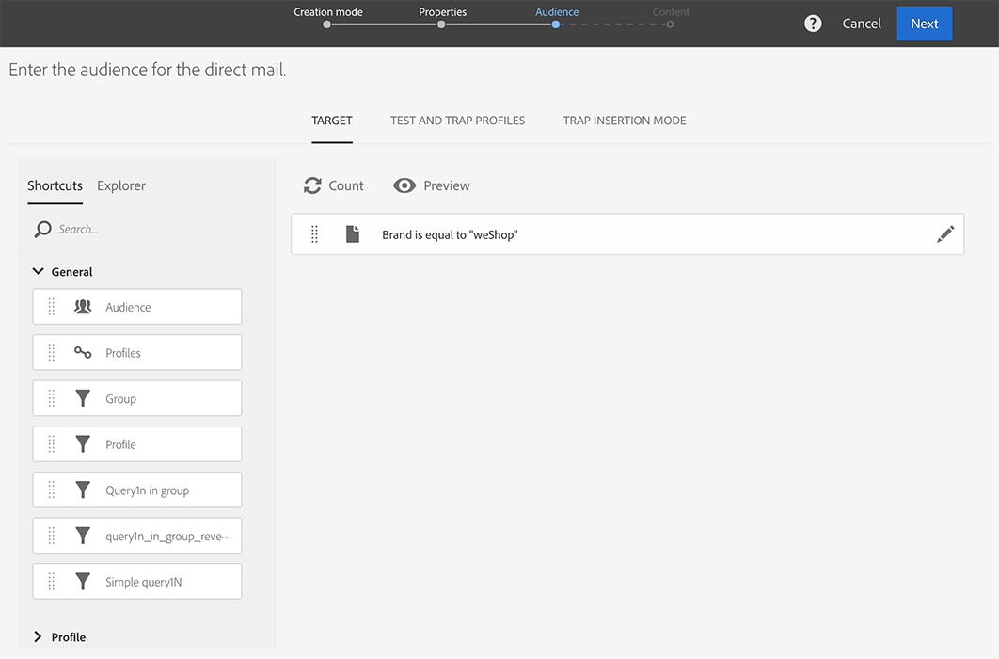
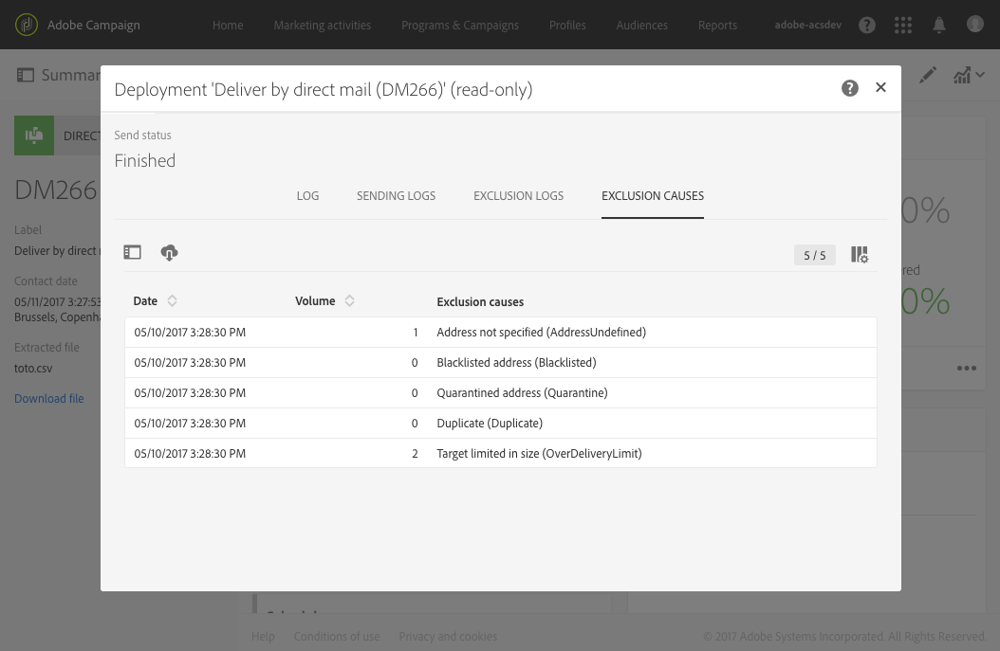
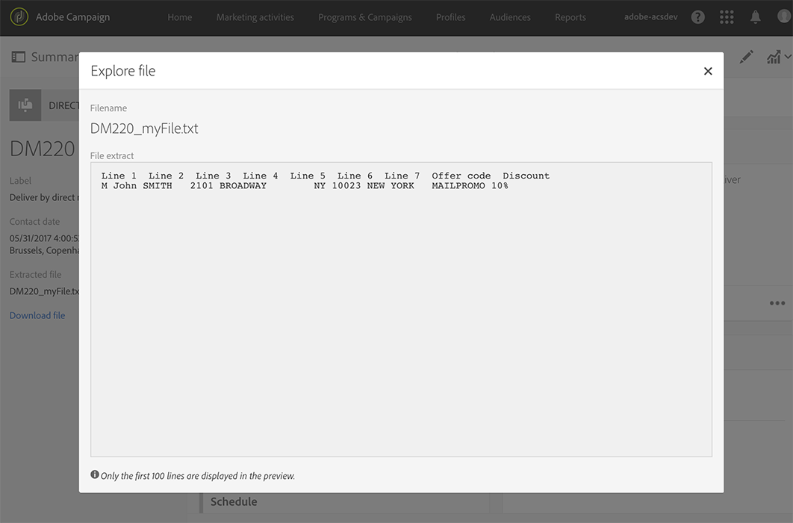

# ダイレクトメールの作成{#creating-the-direct-mail}

ダイレクトメール配信の作成方法は、通常の電子メールの作成方法と非常に似ています。 次の手順では、このチャネルに固有の設定について説明します。 その他のオプションの詳細については、 [「電子メールの作成](../../channels/using/creating-an-email.md) 」を参照してください。

1. 新しいダイレクトメール配信を作成します。 Adobe Campaign [ホームページ](../../start/using/interface-description.md#home-page)、 [キャンペーン](../../start/using/marketing-activities.md#creating-a-marketing-activity) 、または [マーケティングアクティビティリストから作成できます](../../start/using/programs-and-campaigns.md#creating-a-campaign)。

   >[!NOTE]
   >
   >ワークフローにダイレクトメールアクティビティを追加することもできます。 詳しくは、[ワークフロー](../../automating/using/direct-mail-delivery.md)ガイドを参照してください。

   

1. 標準搭載のテンプレートか、独自のテンプレートのいずれかを選択し **[!UICONTROL Direct mail]** ます。 テンプレートの詳細については、「テンプレートの [管理](../../start/using/marketing-activity-templates.md) 」を参照してください。

   

1. 配信の一般的なプロパティを入力します。

   

1. 抽出ファイルに含めるオーディエンスと、テストとトラップのプロファイルを定義します。 See [Defining the direct mail audience](../../channels/using/defining-the-direct-mail-audience.md).

   

   >[!NOTE]
   >
   >オーディエンスの定義は、通常の電子メールオーディエンスを定義するのと非常に似ています。 オーディエンスの [作成を参照してください](../../audiences/using/creating-audiences.md)。

1. ファイルの内容を編集します。 各プロファイル、ファイル構造、ヘッダーおよびフッターに含める列。 See [Defining the direct mail content](../../channels/using/defining-the-direct-mail-content.md).

   

1. 配信ダッシュボードの **[!UICONTROL Schedule]** セクションをクリックして、連絡先の日付を定義します。 ダイレクトメールの場合、連絡先の日付は必須です。 詳しくは、「送信の [スケジュール設定](../../sending/using/about-scheduling-messages.md)」を参照してください。

   

1. テストプロファイルを追加した場合(「テストプロファイルとトラップの [追加](../../channels/using/defining-the-direct-mail-audience.md#adding-test-and-trap-profiles)」を参照)は、最終ファイルを準備する前に配信をテストできます。 選択したテストプロファイルのみを含むサンプルファイルを作成できます。

   をクリックし **[!UICONTROL Test]** て、サンプルファイルを生成します。 左上隅 **[!UICONTROL Summary]**&#x200B;のをクリックし、を選択し **[!UICONTROL Proofs]**&#x200B;ます。 画面の左側で、配達確認を選択し、「on」をクリックし **[!UICONTROL Download file]**&#x200B;ます。

   >[!NOTE]
   >
   >この **[!UICONTROL Export]** 役割は、Adobe Campaignがファイルを書き出し、ダウンロード可能にするために必要です。 管理者に問い合わせてください。

   

1. 配信の内容、オーディエンス、連絡先の日付を定義したら、配信ダッシュボードの **[!UICONTROL Prepare]** ボタンをクリックします。

   

   タイポロジルールが適用されます。 例えば、指定されていないすべての住所はターゲットから除外されます。 このため、プロファイルの情報の **[!UICONTROL Address specified]** ボックスがオンになっていることを確認する必要があります( [Recommendationsを参照](../../channels/using/about-direct-mail.md#recommendations))。 ダイレクトメールのプロパティ **[!UICONTROL Maximum volume of message]** またはテンプレートレベルで定義した場合は、ここでも適用されます。

   

   >[!NOTE]
   >
   >訪問者から過剰ビルサイティングプロファイルを自動的に除外する、チャネル間の疲労ルールをグローバルに設定できます。 「 [疲労ルール](../../sending/using/fatigue-rules.md)」を参照してください。

1. をクリック **[!UICONTROL Explore file]** して、ファイルの最初の100行をプレビューします。

   

   完全なファイルは、画面の左側でローカルダウンロードできます。 ファイルをダウンロードすると、 **[!UICONTROL Export audits]** メニューにログエントリが生成されます。 エクスポート監査の詳細については、「 [監査エクスポート](../../administration/using/auditing-export-logs.md) 」の項を参照してください。

   >[!NOTE]
   >
   >この **[!UICONTROL Export]** 役割は、Adobe Campaignがファイルを書き出し、ダウンロード可能にするために必要です。 管理者に問い合わせてください。

   配信のコンテンツを変更する必要がある場合は、ボタンをクリックするだけで変更が反映され **[!UICONTROL Regenerate file]** ます。 準備を再度行う必要はない。

   

1. ファイルが最終版であることを確認するには、配信ダッシュボード **[!UICONTROL Confirm]** のをクリックします。

   

これで、ダイレクトメールプロバイダに抽出ファイルを送信する準備ができました。 この場合、次のいくつかのオプションがあります。

* ファイルを添付し、通常の電子メールで送信します。
* キャンペーンで送信： キャンペーン [ワークフロー内でダイレクトメールを実行し](../../automating/using/direct-mail-delivery.md) 、例えばFTP経由でファイルを送信する **[!UICONTROL Transfer file]** ためのをに追加します。 詳しくは、 [ファイルの転送を参照してください](../../automating/using/transfer-file.md)。

プロバイダは、誤ったアドレスのリストを検索し、この情報をAdobe Campaignに送信し、ブロックリストに対して、誤ったアドレスを自動的に付加する。 See [Return to sender](../../channels/using/return-to-sender.md).
