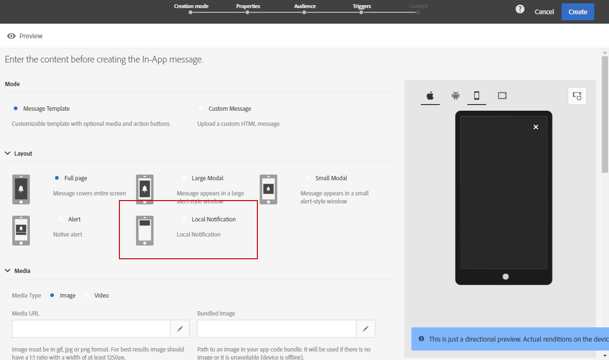

# アプリ内メッセージのカスタマイズ{#customizing-an-in-app-message}

アプリ内メッセージを微調整するために、Adobe Campaignでは、アプリ内メッセージのデザイン中に、一連の高度なオプションにアクセスできます。

アプリ内コンテンツエディターでは、アプリ内メッセージモードを2つ選択できます。

* [メッセージテンプレート](#customizing-with-a-message-template): このテンプレートを使用すると、画像やビデオ、アクションボタンを含むアプリ内を完全にカスタマイズできます。
* [Custom Message](#customizing-with-a-custom-html-message): このテンプレートを使用して、カスタムHTMLを読み込むことができます。

>[!NOTE]
>
> アプリ内メッセージのレンダリングは、Android API 19以降のバージョンでのみサポートされます。

**関連トピック：**

* [アプリ内メッセージの送信](../../channels/using/preparing-and-sending-an-in-app-message.md#sending-your-in-app-message)
* [アプリ内レポート](../../reporting/using/in-app-report.md)
* [ローカル通知追跡の実装](../../administration/using/local-tracking.md)

## メッセージテンプレートでのカスタマイズ {#customizing-with-a-message-template}

### レイアウト {#layout}

ドロップダウン **[!UICONTROL Layout]** には、メッセージングのニーズに応じて、次の4つの選択肢が用意されています。

* **[!UICONTROL Full page]**: このタイプのレイアウトは、オーディエンスデバイスの画面全体に適用されます。

   メディア（画像、ビデオ）、テキストおよびボタンのコンポーネントをサポートします。

* **[!UICONTROL Large modal]**: このレイアウトは、大きなアラートスタイルのウィンドウに表示されます。アプリはバックグラウンドに表示されたままです。

   メディア（画像、ビデオ）、テキストおよびボタンのコンポーネントをサポートします。

* **[!UICONTROL Small modal]**: このレイアウトは、小さなアラートタイプのウィンドウとして表示されます。アプリケーションはバックグラウンドで表示されます。

   メディア（画像、ビデオ）、テキストおよびボタンのコンポーネントをサポートします。

* **[!UICONTROL Alert]**: この種のレイアウトは、ネイティブのOS警告メッセージとして表示されます。

   サポートできるのは、テキストコンポーネントとボタンコンポーネントのみです。

* **[!UICONTROL Local notification]**: このタイプのレイアウトは、バナーメッセージとして表示されます。

   サウンド、テキスト、宛先のみをサポートします。 ローカル通知の詳細については、「ローカル通知メッセージタイプの [カスタマイズ](#customizing-a-local-notification-message-type)」を参照してください。

各タイプのレイアウトは、スマートフォン、タブレット、プラットフォーム（Android、iOSなど）別々のデバイスでプレビューでき、方向（横置き、縦置きなど）はコンテンツエディターの右側のウィンドウで確認できます。

### メディア {#media}

このドロップダウン **[!UICONTROL Media]** を使用すると、アプリ内メッセージにメディアを追加して、エンドユーザーを説得力のある体験を作成できます。

1. 画像とビデオ **[!UICONTROL Media Type]** の間で目的の画像を選択します。
1. メディアタイプについては、サポートされている形式に基づいて、URLを **[!UICONTROL Image]****[!UICONTROL Media URL]** フィールドに入力します。

   必要に応じて、デバイスがオフラインの場合に使用でき **[!UICONTROL Bundled image]** る、のパスを入力することもできます。

   

1. メディアタイプの場合は、 **[!UICONTROL Video]** フィールドにURLを入力し **[!UICONTROL Media URL]** ます。

   次に、ビデオがオーディエンスデバイス **[!UICONTROL Video poster]** でダウンロード中のとき、またはユーザーが再生ボタンをタップするまで、使用するユーザーを入力します。

   

### テキスト {#text}

必要に応じて、アプリ内メッセージにメッセージのタイトルとコンテンツを追加することもできます。 アプリ内メッセージをパーソナライズするために、様々なパーソナライゼーションフィールド、コンテンツブロックおよび動的テキストをコンテンツに追加できます。

1. ドロップダウンリストで、 **[!UICONTROL Text]** フィールドにタイトルを追加し **[!UICONTROL Message title]** ます。

   

1. フィ追加ールド内のコンテンツ。 **[!UICONTROL Message content]**
1. テキストをさらにパーソナライズするには、  アイコンをクリックしてパーソナライゼーションフィールドを追加します。

   

1. メッセージの内容を入力し、必要に応じてパーソナライゼーションフィールドを追加します。

   For more information on personalization field, refer to this [section](../../designing/using/personalization.md#inserting-a-personalization-field).

   

1. プレビューウィンドウでメッセージの内容を確認します。

   

### ボタン {#buttons}

アプリ内メッセージには、最大2つのボタンを追加できます。

1. ドロップダウンリストで、 **[!UICONTROL Buttons]****[!UICONTROL Primary]** カテゴリの最初のボタンのテキストを入力します。

   

1. 2つの操作のうちどれを主ボタン **[!UICONTROL Dismiss]** に割り当て **[!UICONTROL Redirect]** るかを選択します。
1. 必要に応じて、 **[!UICONTROL Secondary]** カテゴリでテキストを入力し、アプリ内に2つ目のボタンを追加します。
1. 2つ目のボタンに関連付けられているアクションを選択します。
1. アクションを選択した場合は、Web URLまたはディープリンクを **[!UICONTROL Redirect]** フィールドに入力し **[!UICONTROL Destination URL]** ます。

   

1. Web URLを入力するか、フィールドにリンクを入力します(アク **[!UICONTROL Destination URL]****[!UICONTROL Redirect]** ションを選択した場合)。
1. プレビューウィンドウで、またはプレビューボタンをクリックして、メッセージの内容を確認します。

   「アプリ内メッセージの [プレビュー](#previewing-the-in-app-message) 」ページを参照してください。

   

### 設定 {#settings}

1. カテゴリで、明るい色と暗い色の間の背景色を選択し **[!UICONTROL Settings]** ます。
1. アプリ内メッセージを閉じる方法をユーザーに提供する **[!UICONTROL Show close button]** オプションを持つ閉じるボタンを表示するかどうかを選択します。
1. このオプションを使用して、ボタンの配置を水平または垂直にするかどうかを選択し **[!UICONTROL Button alignment]** ます。
1. アプリ内メッセージを自動終了するか、数秒後に閉じないかを選択します。

   

## ローカル通知メッセージタイプのカスタマイズ {#customizing-a-local-notification-message-type}

ローカル通知は、特定の時間およびイベントに応じて、アプリによってのみトリガーされます。 ユーザーは、インターネットにアクセスできなくても、アプリで何かが起きていることをユーザーに通知します。
ローカル通知の追跡方法については、この [ページを参照してください](../../administration/using/local-tracking.md)。

ローカル通知をカスタマイズするには：

1. ページから **[!UICONTROL Content]** 、 **[!UICONTROL Local notification]** カテゴリでを選択 **[!UICONTROL Layout]** します。

   

1. カテゴリの下で、およびを入力し **[!UICONTROL Text]** ま **[!UICONTROL Message title]****[!UICONTROL Message content]**&#x200B;す。

   

1. 「 **[!UICONTROL Advanced option]****[!UICONTROL Wait to display]** カテゴリ」の下のフィールドで、イベントがトリガされた後にローカル通知が画面に表示される時間（秒）を選択します。
1. この **[!UICONTROL Sound]** フィールドに、ローカル通知を受信したときにモバイルデバイスが再生するサウンドファイルのファイル名と拡張子を入力します。

   サウンドファイルがモバイルアプリケーションのパッケージに定義されている場合、サウンドファイルは通知の配信時に再生されます。 それ以外の場合は、デバイスのデフォルトのサウンドが再生されます。

   

1. フィールドでローカル通知を操作する際に、ユーザーをリダイレクトする先を指定し **[!UICONTROL Deeplink URL]** ます。
1. キーと値のペアの形式でペイロード内のカスタムデータを渡すには、カスタムフィールドをローカル通知に追加します。 カテゴリで、 **[!UICONTROL Custom fields]** ボタンをクリックし **[!UICONTROL Create an element]** ます。
1. キーを入力 **[!UICONTROL Keys]** し、各キーに **[!UICONTROL Values]** 関連付けられているを入力します。

   カスタムフィールドの処理と目的は、モバイルアプリによって完全に決まります。

1. Appleのモバイルアプリケーションで使用可能な場合は、 **[!UICONTROL Apple options]** カテゴリの **[!UICONTROL Category]** フィールドに入力し、カスタムアクションのカテゴリIDを追加します。

## カスタムHTMLメッセージでのカスタマイズ {#customizing-with-a-custom-html-message}

>[!NOTE]
>
>カスタムHTMLメッセージは、コンテンツのパーソナライゼーションをサポートしていません。

この **[!UICONTROL Custom message]** モードでは、事前設定済みのHTMLメッセージの1つを直接読み込むことができます。

これを行うには、コンピューターからファイルをドラッグ&amp;ドロップまたは選択する必要があります。

ファイルには、「サンプルファイルを **ダウンロード** 」オプションをクリックして見つけられる特定のレイアウトが必要です。

また、Adobe Campaignでの読み込みを成功させるためのカスタムHTML要件のリストも確認できます。

HTMLを読み込むと、プレビューーウィンドウの異なるデバイスにファイルのプレビューが表示されます。

## Previewing the In-App message {#previewing-the-in-app-message}

アプリ内メッセージを送信する前に、テストプロファイルを使用してテストを実行し、配信を受け取ったターゲットオーディエンスに何が表示されるかを確認できます。

1. ボタンをクリックし **[!UICONTROL Preview]** ます。

   

1. ボタンをクリックし、テストプロファイルの1つを選択して、配信のプレビューを開始できます。 **[!UICONTROL Select a test profile]** For more information on test profiles, refer to this [section](../../audiences/using/managing-test-profiles.md).
1. Android、iPhone、タブレットなど、別のデバイスでメッセージを確認します。 また、パーソナライゼーションフィールドが適切なデータを取得しているかどうかを確認することもできます。

   

1. これで、メッセージを送信し、配信レポートの影響を測定できます。 For more on reporting, refer to [this section](../../reporting/using/in-app-report.md).

