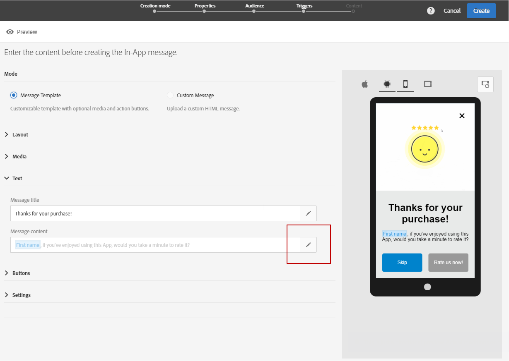

# アプリ内メッセージのカスタマイズ{#customizing-an-in-app-message}

Adobe Campaign では、アプリ内メッセージのデザイン中に、一連の詳細設定オプションにアクセスしてアプリ内メッセージを微調整できます。

アプリ内コンテンツエディターでは、アプリ内メッセージモードを次のいずれかに選択できます。

* [メッセージテンプレート](#customizing-with-a-message-template)：このテンプレートを使用すると、画像やビデオ、アクションボタンを含むアプリ内メッセージを完全にカスタマイズできます。
* [カスタムメッセージ](#customizing-with-a-custom-html-message)：このテンプレートを使用すると、カスタム HTML をインポートできます。

>[!NOTE]
>
> アプリ内メッセージのレンダリングは、Android API 19 以降のバージョンでのみサポートされます。

**関連トピック：**

* [アプリ内メッセージの送信](../../channels/using/preparing-and-sending-an-in-app-message.md#sending-your-in-app-message)
* [アプリ内レポート](../../reporting/using/in-app-report.md)
* [ローカル通知トラッキングの実装](../../administration/using/local-tracking.md)

## メッセージテンプレートを使用したカスタマイズ {#customizing-with-a-message-template}

### レイアウト {#layout}

**[!UICONTROL Layout]**&#x200B;ドロップダウンには、メッセージングのニーズに応じて、次の 4 つの選択肢が用意されています。

* **[!UICONTROL Full page]**：このタイプのレイアウトは、オーディエンスデバイスの画面全体に適用されます。

   メディア（画像、ビデオ）、テキストおよびボタンのコンポーネントをサポートします。

* **[!UICONTROL Large modal]**：このレイアウトは、大きなアラートスタイルのウィンドウに表示されます。アプリケーションはバックグラウンドに表示されます。

   メディア（画像、ビデオ）、テキストおよびボタンのコンポーネントをサポートします。

* **[!UICONTROL Small modal]**：このレイアウトは、小さなアラートタイプのウィンドウとして表示されます。アプリケーションはバックグラウンドで表示されます。

   メディア（画像、ビデオ）、テキストおよびボタンのコンポーネントをサポートします。

* **[!UICONTROL Alert]**：このタイプのレイアウトは、ネイティブの OS アラートメッセージとして表示されます。

   サポートできるのは、テキストコンポーネントとボタンコンポーネントのみです。

* **[!UICONTROL Local notification]**：このタイプのレイアウトは、バナーメッセージとして表示されます。

   サウンド、テキスト、宛先のみをサポートします。ローカル通知の詳細については、[ローカル通知メッセージタイプのカスタマイズ](#customizing-a-local-notification-message-type)を参照してください。

コンテンツエディターの右側のウィンドウでは、様々なデバイス（スマートフォンやタブレットなど）、様々なプラットフォーム（Android、iOS など）、異なる向き（横置きと縦置き）での各タイプのレイアウトをプレビューできます。

### メディア {#media}

**[!UICONTROL Media]**&#x200B;ドロップダウンを使用すると、アプリ内メッセージにメディアを追加して、エンドユーザーにとって魅力的なエクスペリエンスを作成できます。

1. 「**[!UICONTROL Media Type]**」で「Image」か「Video」のどちらかを選択します。
1. メディアタイプが&#x200B;**[!UICONTROL Image]**&#x200B;の場合は、サポートされている形式に基づいて、URL を「**[!UICONTROL Media URL]**」フィールドに入力します。

   必要に応じて、デバイスがオフラインの場合に使用できる、**[!UICONTROL Bundled image]**&#x200B;のパスを入力することもできます。

   

1. メディアタイプが&#x200B;**[!UICONTROL Video]**&#x200B;の場合は、「**[!UICONTROL Media URL]**」フィールドに URL を入力します。

   次に、ビデオがオーディエンスデバイスでダウンロード中に、またはユーザーが再生ボタンをタップするまで使用する&#x200B;**[!UICONTROL Video poster]**&#x200B;を入力します。

   

### テキスト {#text}

必要に応じて、アプリ内メッセージにメッセージのタイトルとコンテンツを追加することもできます。また、様々なパーソナライゼーションフィールド、コンテンツブロック、動的テキストをコンテンツに追加して、アプリ内メッセージをさらにパーソナライズすることができます。

1. **[!UICONTROL Text]**&#x200B;ドロップダウンで、「**[!UICONTROL Message title]**」フィールドにタイトルを追加します。

   

1. 「**[!UICONTROL Message content]**」フィ―ルドにコンテンツを追加します。
1. テキストをさらにパーソナライズするには、 アイコンをクリックしてパーソナライゼーションフィールドを追加します。

   

1. メッセージの内容を入力し、必要に応じてパーソナライゼーションフィールドを追加します。

   パーソナライゼーションフィールドについて詳しくは、[こちら](../../designing/using/personalization.md#inserting-a-personalization-field)を参照してください。

   

1. プレビューウィンドウでメッセージの内容を確認します。

   

### ボタン {#buttons}

アプリ内メッセージには、最大 2 つのボタンを追加できます。

1. **[!UICONTROL Buttons]**&#x200B;ドロップダウンで、「**[!UICONTROL Primary]**」カテゴリの最初のボタンのテキストを入力します。

   

1. **[!UICONTROL Dismiss]**&#x200B;と&#x200B;**[!UICONTROL Redirect]**&#x200B;のアクションのうち、どちらかを選択してプライマリボタンに割り当てます。
1. 必要に応じて、「**[!UICONTROL Secondary]**」カテゴリでテキストを入力し、アプリ内メッセージに 2 つ目のボタンを追加します。
1. 2 つ 目のボタンに関連付けるアクションを選択します。
1. **[!UICONTROL Redirect]**&#x200B;アクションを選択した場合は、「**[!UICONTROL Destination URL]**」フィールドに Web URL またはディープリンクを入力します。

   

1. **[!UICONTROL Redirect]**&#x200B;アクションを選択した場合は、「**[!UICONTROL Destination URL]**」フィールドに Web URL またはディープリンクを入力します。
1. プレビューウィンドウで、またはプレビューボタンをクリックして、メッセージの内容を確認します。

   [アプリ内メッセージのプレビュー](../../channels/using/preparing-and-sending-an-in-app-message.md#previewing-the-in-app-message)を参照してください。

   

### 設定 {#settings}

1. 「**[!UICONTROL Settings]**」カテゴリでは、明るい色または暗い色の背景色を選択します。
1. アプリ内メッセージを閉じるボタンを表示するかどうかを「**[!UICONTROL Show close button]**」オプションで選択します。
1. 「**[!UICONTROL Button alignment]**」オプションを使用して、ボタンの配置を水平または垂直に設定します。
1. アプリ内メッセージを数秒後に自動的に閉じるかどうかを選択します。

   

## ローカル通知メッセージタイプのカスタマイズ {#customizing-a-local-notification-message-type}

ローカル通知は、特定の時間に、またはイベントに応じて、アプリでのみトリガーできます。ユーザーがインターネットにアクセスしなくても、アプリで何かが起きていることが通知されます。ローカル通知の追跡方法については、[こちら](../../administration/using/local-tracking.md)を参照してください。

ローカル通知をカスタマイズするには：

1. **[!UICONTROL Content]**&#x200B;ページで、「**[!UICONTROL Layout]**」カテゴリから「**[!UICONTROL Local notification]**」を選択します。

   

1. 「**[!UICONTROL Text]**」カテゴリで「**[!UICONTROL Message title]**」と「**[!UICONTROL Message content]**」を入力します。

   

1. 「**[!UICONTROL Advanced option]**」カテゴリの「**[!UICONTROL Wait to display]**」フィールドで、イベントがトリガーされてからローカル通知が画面に表示されるまでの時間（秒）を選択します。
1. 「**[!UICONTROL Sound]**」フィールドには、ローカル通知を受信したときにモバイルデバイスが再生するサウンドファイルのファイル名（拡張子付き）を入力します。

   サウンドファイルがモバイルアプリケーションのパッケージに定義されている場合は、そのファイルが通知の配信時に再生されます。それ以外の場合は、デバイスのデフォルトのサウンドが再生されます。

   

1. ユーザーがローカル通知とやり取りする場合のリダイレクト先を「**[!UICONTROL Deeplink URL]**」フィールドに指定します。
1. キーと値のペアの形式でペイロード内のカスタムデータを渡すには、カスタムフィールドをローカル通知に追加します。「**[!UICONTROL Custom fields]**」カテゴリで、「**[!UICONTROL Create an element]**」ボタンをクリックします。
1. 「**[!UICONTROL Keys]**」を入力し、各キーに関連付けられている「**[!UICONTROL Values]**」を入力します。

   カスタムフィールドの扱い方と目的はモバイルアプリによって異なることに注意してください。

1. Apple のモバイルアプリケーションで使用可能な場合は、「**[!UICONTROL Apple options]**」カテゴリの「**[!UICONTROL Category]**」フィールドにカスタムアクションのカテゴリ ID を入力して追加します。

## カスタム HTML メッセージを使用したカスタマイズ {#customizing-with-a-custom-html-message}

>[!NOTE]
>
>カスタム HTML メッセージでは、コンテンツのパーソナライゼーションをサポートしていません。

**[!UICONTROL Custom message]**&#x200B;モードでは、事前設定済みの HTML メッセージを 1 つ直接インポートすることができます。

ファイルをドラッグ＆ドロップするかコンピューターから選択するだけで、インポートできます。

ファイルには、特定のレイアウトが必要です。そのレイアウトを表示するには、「**サンプルファイルをダウンロード**」オプションをクリックしてください。

また、Adobe Campaign に正常にインポートするためのカスタム HTML 要件のリストも確認できます。

HTML をインポートすると、様々なデバイスでのファイルのプレビューがプレビューウィンドウに表示されます。
