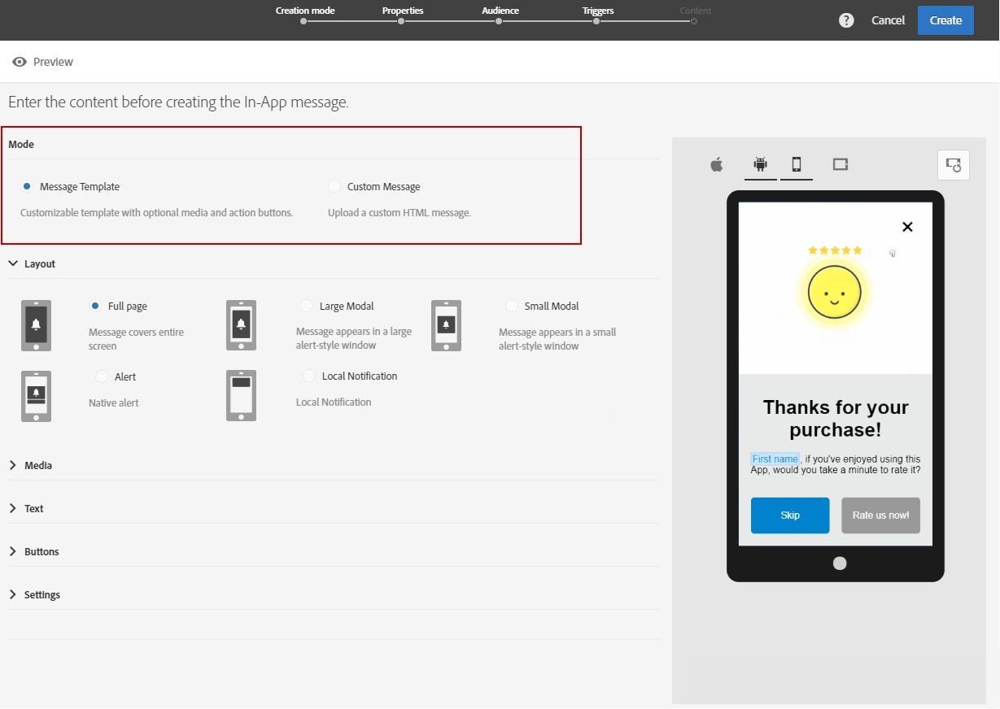

# アプリ内メッセージのカスタマイズ{#customizing-an-in-app-message}

アプリ内メッセージを微調整するために、Adobe Campaignでは、アプリ内メッセージのデザイン時に一連の高度なオプションにアクセスできます。

アプリ内コンテンツエディターでは、次の2つのアプリ内メッセージモードのいずれかを選択できます。

* [Message Template](../../channels/using/customizing-an-in-app-message.md#customizing-with-a-message-template):このテンプレートを使用すると、画像やビデオ、アクションボタンを使用してアプリ内を完全にカスタマイズできます。
* [Custom Message](../../channels/using/customizing-an-in-app-message.md#customizing-with-a-custom-html-message):このテンプレートを使用すると、カスタムHTMLを読み込むことができます。

**関連トピック：**

* [アプリ内メッセージの送信](../../channels/using/preparing-and-sending-an-in-app-message.md#sending-your-in-app-message)
* [アプリ内レポート](../../reporting/using/in-app-report.md)
* [ローカル通知追跡の実装](https://helpx.adobe.com/campaign/kb/local-notification-tracking.html)

## メッセージテンプレートを使用したカスタマイズ {#customizing-with-a-message-template}

### レイアウト {#layout}

ドロップダウ **[!UICONTROL Layout]** ンには、メッセージングのニーズに応じて、次の4つの異なるオプションが表示されます。

* **[!UICONTROL Full page]**:このタイプのレイアウトは、オーディエンスデバイスの画面全体をカバーします。

   メディア（画像、ビデオ）、テキストおよびボタンのコンポーネントをサポートします。

* **[!UICONTROL Large modal]**:このレイアウトは、大きなアラートスタイルのウィンドウに表示され、アプリケーションはバックグラウンドで表示されます。

   メディア（画像、ビデオ）、テキストおよびボタンのコンポーネントをサポートします。

* **[!UICONTROL Small modal]**:このレイアウトは、小さなアラートタイプのウィンドウとして表示され、アプリケーションはバックグラウンドで表示されます。

   メディア（画像、ビデオ）、テキストおよびボタンのコンポーネントをサポートします。

* **[!UICONTROL Alert]**:このタイプのレイアウトは、ネイティブのOS警告メッセージとして表示されます。

   テキストおよびボタンコンポーネントのみをサポートできます。

* **[!UICONTROL Local notification]**:このタイプのレイアウトは、バナーメッセージとして表示されます。

   サウンド、テキスト、宛先のみをサポートできます。 ローカル通知の詳細については、「ローカル通知メッセージ [タイプのカスタマイズ」を参照してくださ](../../channels/using/customizing-an-in-app-message.md#customizing-a-local-notification-message-type)い。

各タイプのレイアウトは、スマートフォン、タブレット、プラットフォーム（Android、iOSなど）でプレビューでき、コンテンツエディターの右ウィンドウで縦置きや横置きなどの方向でプレビューできます。

### メディア {#media}

このドロ **[!UICONTROL Media]** ップダウンを使用すると、アプリ内メッセージにメディアを追加して、エンドユーザーにとって魅力的なエクスペリエンスを作成できます。

1. 画像とビデ **[!UICONTROL Media Type]** オの間を選択します。
1. メディアタ **[!UICONTROL Image]** イプについては、サポートされている形式に基づ **[!UICONTROL Media URL]** いて、URLを入力します。

   必要に応じて、デバイスがオフラインの場合に使用で **[!UICONTROL Bundled image]** きる、のパスを入力することもできます。

   

1. メディアタ **[!UICONTROL Video]** イプのフィールドにURLを入力し **[!UICONTROL Media URL]** ます。

   次に、ビデオがオーディエ **[!UICONTROL Video poster]** ンスデバイスでダウンロード中の間、またはユーザーが再生ボタンをタップするまで、使用するユーザーを入力します。

   

### テキスト {#text}

必要に応じて、アプリ内メッセージにメッセージのタイトルとコンテンツを追加することもできます。 アプリ内メッセージをパーソナライズするには、コンテンツに異なるパーソナライゼーションフィールド、コンテンツブロックおよび動的テキストを追加します。

1. ドロップダウ **[!UICONTROL Text]** ンで、フィールドにタイトルを追加 **[!UICONTROL Message title]** します。

   

1. フィールドにコンテンツを追加 **[!UICONTROL Message content]** します。
1. テキストをさらにパーソナライズするには、アイコンをクリックし  てパーソナライゼーションフィールドを追加します。

   

1. メッセージの内容を入力し、必要に応じてパーソナライゼーションフィールドを追加します。

   For more information on personalization field, refer to this [section](../../designing/using/personalization.md#inserting-a-personalization-field).

   

1. プレビューウィンドウでメッセージの内容を確認します。

   

### ボタン {#buttons}

アプリ内メッセージには、最大2つのボタンを追加できます。

1. ドロップダ **[!UICONTROL Buttons]** ウンで、カテゴリ内の最初のボタンのテキストを入力し **[!UICONTROL Primary]** ます。

   

1. 2つのアクションのうちどれを選択し **[!UICONTROL Dismiss]** 、プラ **[!UICONTROL Redirect]** イマリボタンに割り当てるかを選択します。
1. 必要に応じ **[!UICONTROL Secondary]** て、カテゴリにテキストを入力して、アプリ内に2つ目のボタンを追加します。
1. 2つ目のボタンに関連付けられているアクションを選択します。
1. アクションを選択した場 **[!UICONTROL Redirect]** 合は、フィールドにWeb URLまたはディープリンクを入力 **[!UICONTROL Destination URL]** します。

   

1. アクションを選択した場合は、Web URLまたはデ **[!UICONTROL Destination URL]** ィープリンクをフィールドに入力 **[!UICONTROL Redirect]** します。
1. プレビューウィンドウで、または「プレビュー」ボタンをクリックして、メッセージの内容を確認します。

   アプリ内メッセ [ージのプレビューページを参照](../../channels/using/customizing-an-in-app-message.md#previewing-the-in-app-message) 。

   

### 設定 {#settings}

1. カテゴリ **[!UICONTROL Settings]** で、明暗の背景色を選択します。
1. 閉じるボタンとアプリ内メッセージを閉じる方法 **[!UICONTROL Show close button]** をユーザーに提供するオプションを選択します。
1. このオプションを使用して、ボタンの配置を水平または垂直にするかどうかを選 **[!UICONTROL Button alignment]** 択します。
1. アプリ内メッセージを数秒後に自動閉じるかどうかを選択します。

   

## ローカル通知メッセージタイプのカスタマイズ {#customizing-a-local-notification-message-type}

ローカル通知は、特定の時間とイベントに応じて、アプリによってのみトリガーされます。 ユーザーは、インターネットにアクセスできなくても、アプリで何かが起こっていることをユーザーに通知します。
ローカル通知の追跡方法については、このページを参照してく [ださい](https://helpx.adobe.com/campaign/kb/local-notification-tracking.html)。

ローカル通知をカスタマイズするには：

1. ページか **[!UICONTROL Content]** ら、カテゴリ **[!UICONTROL Local notification]** 内を選択し **[!UICONTROL Layout]** ます

   

1. カテゴリ **[!UICONTROL Text]** の下で、とを入力し **[!UICONTROL Message title]** ます **[!UICONTROL Message content]**。

   

1. カテゴリ **[!UICONTROL Advanced option]** のフィールドで、イ **[!UICONTROL Wait to display]** ベントがトリガされた後にローカル通知を画面に表示する時間（秒）を選択します。
1. このフィ **[!UICONTROL Sound]** ールドに、ローカル通知を受信したときにモバイルデバイスが再生するサウンドファイルのファイル名と拡張子を入力します。

   ファイルがモバイルアプリケーションのパッケージで定義されている場合、サウンドファイルは通知の配信時に再生されます。 それ以外の場合は、デバイスのデフォルトのサウンドが再生されます。

   

1. フィールドでローカル通知を操作する際にユーザーをリダイレクトする宛先を指定 **[!UICONTROL Deeplink URL]** します。
1. キーと値のペアの形式でペイロードにカスタムデータを渡すには、カスタムフィールドをローカル通知に追加します。 カテゴリ内 **[!UICONTROL Custom fields]** で、ボタンをクリック **[!UICONTROL Create an element]** します。
1. 各キーに関 **[!UICONTROL Keys]** 連付けら **[!UICONTROL Values]** れたを入力します。

   カスタムフィールドの処理と目的は、モバイルアプリによって完全に決まります。

1. カテゴリ **[!UICONTROL Apple options]** 内のフィールドに入力し、Appleのモバ **[!UICONTROL Category]** イルアプリケーションでカスタムアクションが使用可能な場合は、そのカテゴリIDを追加します。

## カスタムHTMLメッセージによるカスタマイズ {#customizing-with-a-custom-html-message}

>[!NOTE]
>
>カスタムHTMLメッセージは、コンテンツのパーソナライゼーションをサポートしていません。

このモ **[!UICONTROL Custom message]** ードでは、事前設定済みのHTMLメッセージの1つを直接読み込むことができます。

そのためには、ファイルをドラッグ&amp;ドロップするか、コンピューターから選択するだけで済みます。

ファイルには、「サンプルファイルをダウンロード」オプションをクリックして見つかる特定のレ **イアウトが必要です** 。

また、Adobe Campaignでのインポートを成功させるためのカスタムHTML要件のリストを確認することもできます。

HTMLを読み込むと、プレビューウィンドウの様々なデバイスでファイルのプレビューを見つけることができます。

## アプリ内メッセージのプレビュー {#previewing-the-in-app-message}

アプリ内メッセージを送信する前に、テストプロファイルを使用してテストを行い、配信を受け取ったターゲットのオーディエンスに対して表示される内容を確認できます。

1. Click the **[!UICONTROL Preview]** button.

   

1. ボタンをクリッ **[!UICONTROL Select a test profile]** クし、テストプロファイルの1つを選択して、配信のプレビューを開始します。 For more information on test profiles, refer to this [section](../../sending/using/managing-test-profiles-and-sending-proofs.md).
1. Android、iPhone、タブレットなど、様々なデバイスでメッセージを確認します。 また、パーソナライゼーションフィールドが正しいデータを取得しているかどうかを確認することもできます。

   

1. これで、メッセージを送信し、配信レポートでその影響を測定できます。 For more on reporting, refer to [this section](../../reporting/using/in-app-report.md).

