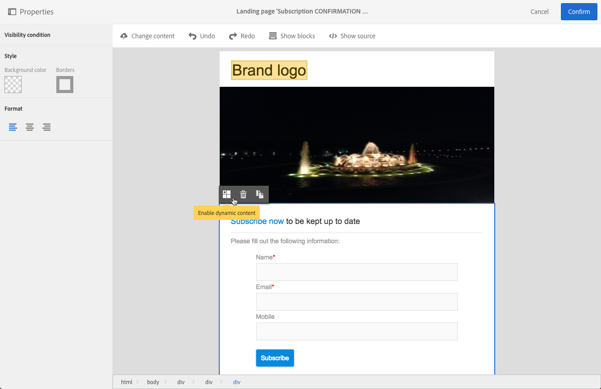

# ランディング·ページでの動的コンテンツの定義{#defining-dynamic-content-in-a-landing-page}

ランディング·ページで動的コンテンツを定義するには、ブレッドクラムを使用するか、要素を直接クリックしてブロックを選択します。

イメージなどの特定のブロックは、直接選択できません。 この場合は、ブレッドクラムを使用して親ブロックを選択します。 次に、イメージを含め、この親要素に含まれるすべての要素を修正できます。 この条件は、親ブロック内のすべての子要素に適用されます。

ブレッドクラムは、「≪ブロックの管理| [Managing blocks](../../channels/using/managing-landing-page-structure-and-style.md) |emdw≫」セクションに表示されます。

ランディング·ページで動的コンテンツを定義する次の手順は、Eメールの手順と同じです。 本項 [を参照](../../designing/using/personalization.md#defining-dynamic-content-in-an-email)。

>[!NOTE]
>
>バリアント要素の輪郭が赤の場合、式がまだ定義されていないことを意味します。

## ランディング·ページでの動的コンテンツのプレビュー {#previewing-dynamic-content-in-a-landing-page}

ブロックの異なるダイナミックコンテンツ間を移動できます。 これを行うには、次の手順に従います。

1. ブロックを選択します。

   イメージの右側と左側に矢印が表示されます。

1. 右矢印をクリックして、使用可能な動的コンテンツを参照します。

   

   最後に使用可能なダイナミックコンテンツに到達したか、最初に使用可能なダイナミックコンテンツに到達したかに応じて、両側の矢印が暗くなります。

   

1. ブロックに適用されているすべての条件を削除するには、そのブロックを選択し、アイコンをクリック **[!UICONTROL Disable dynamic content]** します。
1. 保持するダイナミックコンテンツを選択します。

   

パレットで、次の操作を行います。

* 式を入力した内容は、赤で表示されなくなり、灰色で表示されます。
* 現在選択されているコンテンツは青で表示されます。

