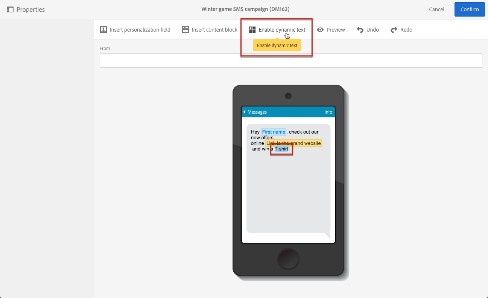
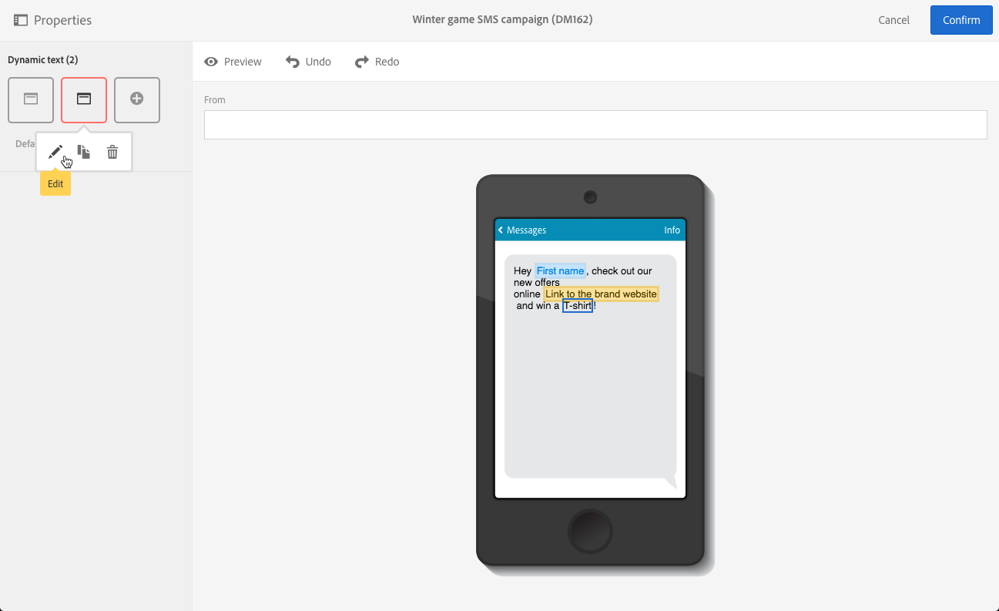

# ダイナミックテキストの定義{#defining-dynamic-text}

動的テキストは、動的コンテンツと同じように定義されます。 「[動的コンテンツの定義](../../designing/using/personalization.md#defining-dynamic-content-in-an-email)」セクションを参照してください。

>[!NOTE]
>
>SMSとプッシュ通知の場合は、動的テキストのみを定義できます。 ランディングページでは、動的コンテンツとテキストの両方を定義できます。 [電子メール Designer](../../designing/using/designing-content-in-adobe-campaign.md)で動的テキストを定義する場合は、[電子メールでの動的コンテンツの定義](../../designing/using/personalization.md#defining-dynamic-content-in-an-email)を参照してください。

サロゲートペアは、Unicode文字セットの基本多言語面に含まれていない文字であり、2 バイト（16 ビット）で保存することはできず、2 UTF-16文字にエンコードする必要があります。 これらのキャラクターには、いくつかのCJKのイデオグラフィック、ほとんどの絵文字、いくつかの言語が含まれています。
 これらの文字は、動的テキストの互換性に関する問題を引き起こす可能性があります。 メッセージを送信する前に、強力なテストを実行する必要があります。

次の例は、SMS メッセージで動的テキストを定義する方法を示しています。

1. メッセージまたはランディングページの本文のテキストを選択します。
1. 「**[!UICONTROL Enable dynamic text]**」をクリックします。

   

   **[!UICONTROL Dynamic text]** オプションがパレットに表示されます。 動的コンテンツと同じように設定されます。

1. バリエーションを選択。

   

1. このバリエーションの条件を定義します。

   

少なくとも1つのバリアントに対して条件を定義すると、ダイナミックテキストの周囲に紫色のフレームが表示されます。

