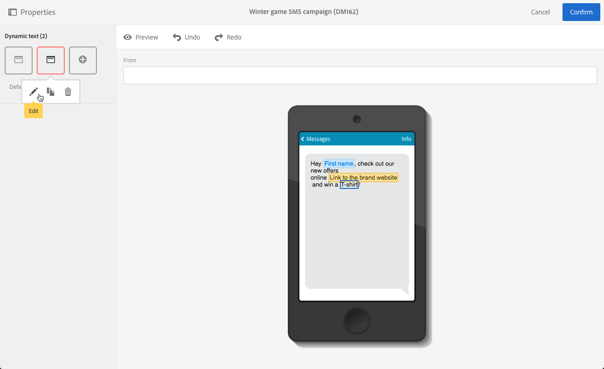

# ダイナミックテキストの定義{#defining-dynamic-text}

動的テキストは、動的コンテンツと同じ方法で定義されます。 詳しくは、 [動的コンテンツの定義](../../designing/using/personalization.md#defining-dynamic-content-in-an-email) 」セクションに入力します。

>[!NOTE]
>
>SMS およびプッシュの場合、ダイナミックテキストのみ定義できます。 ランディングページでは、動的コンテンツとテキストの両方を定義できます。 動的テキストを [メールデザイナー](../../designing/using/designing-content-in-adobe-campaign.md)を参照してください。 [E メールでの動的コンテンツの定義](../../designing/using/personalization.md#defining-dynamic-content-in-an-email).

サロゲートペア（Unicode 文字セットの基本多言語面に含まれない文字）は、2 バイト（16 ビット）で格納できず、2 つの UTF-16 文字にエンコードする必要があります。 これらの文字には、CJK のイデオグラフ、ほとんどの絵文字、一部の言語が含まれます。
 これらの文字は、ダイナミックテキストでいくつかの非互換性の問題を引き起こす可能性があります。 メッセージを送信する前に、強力なテストを実行する必要があります。

次の例は、SMS メッセージに動的テキストを定義する方法を示しています。

1. メッセージまたはランディングページの本文のテキストを選択します。
1. 「**[!UICONTROL Enable dynamic text]**」をクリックします。

   

   この **[!UICONTROL Dynamic text]** オプションがパレットに表示されます。 動的コンテンツと同じ方法で設定します。

1. バリアントを選択します。

   

1. このバリアントの条件を定義します。

   

少なくとも 1 つのバリアントに対して条件を定義すると、ダイナミックテキストの周囲に紫色の枠が表示されます。

