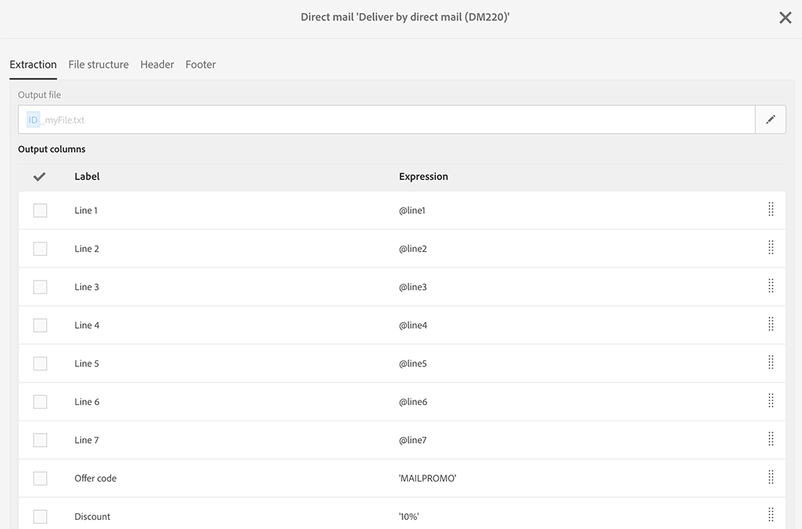

# ダイレクトメールの内容の定義{#defining-the-direct-mail-content}

作成ウィザードの最後の画面でコンテンツを定義するか、配信ダッシュボードの「 **Content** 」セクションをクリックします。

定義画 **[!UICONTROL Content]** 面は、ダイレクトメールチャネルに固有です。 このタブは、次の4つのタブに分かれています。 **[!UICONTROL Extraction]**、 **[!UICONTROL File structure]**、 **[!UICONTROL Header]** と **[!UICONTROL Footer]**。

## 抽出の定義 {#defining-the-extraction}

1. まず、書き出しファイルの名前を定義します。 フィールドの右にあるボタンをクリックし、目 **[!UICONTROL Output file]** 的のラベルを入力します。 パーソナライズ·フィールド、コンテンツ·ブロックおよびダイナミック·テキストを使用できます( [コンテンツの定義](../../designing/using/personalization.md#example-email-personalization)を参照)。 たとえば、ラベルに配信IDや抽出日を入力できます。

   

1. またはボタン **[!UICONTROL +]** をクリ **[!UICONTROL Add an element]** ックして、出力列を追加します。 では、 **[!UICONTROL Output columns]** 出力ファイルに書き出すプロファイル情報（列）を定義します。

   >[!CAUTION]
   >
   >この情報はダイレクトメールプロバイダにとって重要なので、プロファイルに郵送先住所が含まれていることを確認してください。 また、プロファイルの情報のチェックボ **[!UICONTROL Address specified]** ックスがオンになっていることを確認します。 「推奨事項 [」を参照](../../channels/using/about-direct-mail.md#recommendations)。

   

1. 必要な数の列を作成します。 列の式とラベルをクリックして、列を編集できます。

>[!NOTE]
>
>出力列の定義の詳細については、「ファイルの抽出」ワークフローアクティビティ [の項を参照](../../automating/using/extract-file.md) してください。

## ファイル構造の定義 {#defining-the-file-structure}

[フ **ァイル構造** ]タブでは、書き出すファイルの出力形式、日付形式、および数値形式を構成できます。

>[!NOTE]
>
>使用可能なオプションの詳細は、「ファイルの抽出」 [ワークフローアクティビティ](../../automating/using/extract-file.md) (Extract file workflow activity)セクションにあります。

## ヘッダーとフッターの定義 {#defining-the-header-and-footer}

場合によっては、書き出しファイルの先頭または末尾に情報を追加する必要があります。 この場合は、構成画 **[!UICONTROL Header]** 面のと **[!UICONTROL Footer]** タブを使 **[!UICONTROL Content]** 用します。

たとえば、ダイレクトメールプロバイダの場合、ファイルのヘッダに送信者情報を含めることができます。 配信のコンテキストで使用可能な情報を使用して、フッターとヘッダーをカスタマイズできます。 内容の定 [義を参照](../../designing/using/personalization.md#example-email-personalization)。

送信者のアドレスは、ダイレクトメールのプ **[!UICONTROL Send]** ロパティのセクションまたはテンプレートレベルで定義されます。

