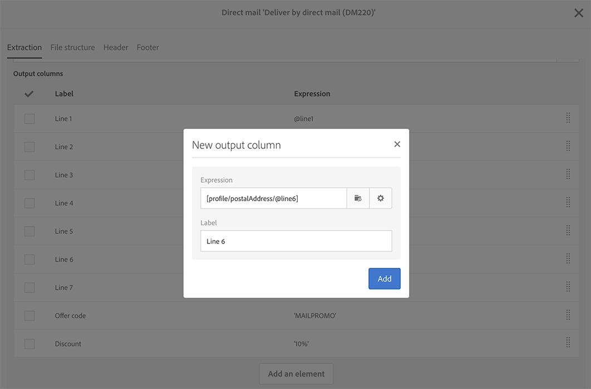

# ダイレクトメールコンテンツの定義{#defining-the-direct-mail-content}

作成ウィザードの最後の画面でコンテンツを定義するか、配信ダッシュボードの「コンテ **ンツ** 」セクションをクリックします。

定義画 **[!UICONTROL Content]** 面は、ダイレクトメールチャネルに固有の画面です。 次の4つのタブに分かれています。 **[!UICONTROL Extraction]**、 **[!UICONTROL File structure]**、 **[!UICONTROL Header]** 、 **[!UICONTROL Footer]**、

## 抽出の定義 {#defining-the-extraction}

1. まず、抽出ファイルの名前を定義します。 フィールドの右側のボタンをクリックし、 **[!UICONTROL Output file]** 目的のラベルを入力します。 パーソナライゼーションフィールド、コンテンツブロックおよび動的テキストを使用できます( [コンテンツの定義](../../designing/using/personalization.md#example-email-personalization))。 例えば、配信IDや抽出日を使用してラベルを完成させることができます。

   

1. 出力列を追加す **[!UICONTROL +]** るには、ま **[!UICONTROL Add an element]** たはボタンをクリックします。 では、 **[!UICONTROL Output columns]** 出力ファイルに書き出すプロファイル情報（列）を定義できます。

   >[!CAUTION]
   >
   >この情報はダイレクトメールプロバイダーにとって重要なものなので、プロファイルに住所が含まれていることを確認してください。 また、プロファイルの情報のボックスが **[!UICONTROL Address specified]** オンになっていることを確認します。 Recommendationsを参 [照してください](../../channels/using/about-direct-mail.md#recommendations)。

   

1. 必要な数の列を作成します。 列の式とラベルをクリックして、列を編集できます。

>[!NOTE]
>
>出力列の定義の詳細については、「ファイル抽出ワークフロー [」の節](../../automating/using/extract-file.md) を参照してください。

## ファイル構造の定義 {#defining-the-file-structure}

「フ **ァイル構造** 」タブでは、書き出すファイルの出力形式、日付形式、数値形式を設定できます。

>[!NOTE]
>
>使用可能なオプションについて詳しくは、「ファイル抽出 [ワークフロー](../../automating/using/extract-file.md) 」の節を参照してください。

## ヘッダーとフッターの定義 {#defining-the-header-and-footer}

場合によっては、抽出ファイルの先頭または末尾に情報を追加する必要があります。 この場合は、設定画面の「 **[!UICONTROL Header]** 」タブ **[!UICONTROL Footer]** と「」タブを **[!UICONTROL Content]** 使用します。

例えば、ダイレクトメールプロバイダーの場合は、ファイルのヘッダーに送信者情報を含めることができます。 フッターとヘッダーを、配信のコンテキストで利用できる情報に合わせてパーソナライズすることができます。 詳しくは、コ [ンテンツの定義を参照してくださ](../../designing/using/personalization.md#example-email-personalization)い。

送信者のアドレスは、ダイレクトメールのプ **[!UICONTROL Send]** ロパティのセクションまたはテンプレートレベルで定義されます。

