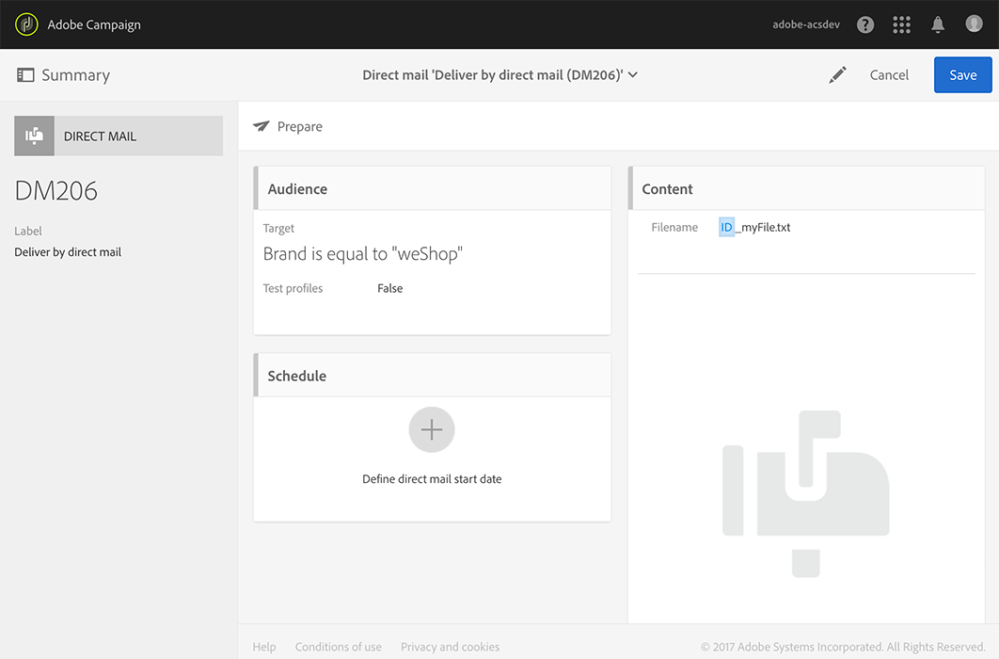

# Defining the direct mail content{#defining-the-direct-mail-content}

You can either define the content in the last screen of the creation wizard or by clicking on the **Content** section of the delivery dashboard.

**[!UICONTROL Content]** 定義画面は、ダイレクトメールチャネルに固有の画面です。It is divided into four tabs: **[!UICONTROL Extraction]**, **[!UICONTROL File structure]**, **[!UICONTROL Header]** and **[!UICONTROL Footer]**.

## Defining the extraction {#defining-the-extraction}

1. 抽出ファイルの名前を定義して開始します。**[!UICONTROL Output file]** フィールドの右側のボタンをクリックし、目的のラベルを入力します。You can use personalization fields, content blocks and dynamic text (see [Defining content](../../designing/using/example--email-personalization.md)). 例えば、配信IDまたは抽出日を使用してラベルを完成させることができます。

   

1. Click the **[!UICONTROL +]** or **[!UICONTROL Add an element]** button to add an output column. The **[!UICONTROL Output columns]** let you define the profile information (columns) to be exported into the output file.

   >[!CAUTION]
   >
   >この情報はダイレクトメールプロバイダーにとって重要なので、プロファイルに住所が含まれていることを確認してください。Also make sure you have checked the **[!UICONTROL Address specified]** box in your profiles' information. [Recommendationsを](../../channels/using/about-direct-mail.md#recommendations)参照してください。

   

1. 必要な数の列を作成します。式とラベルをクリックして、列を編集できます。

>[!NOTE]
>
>For more information on output column definition, refer to the [Extract file](../../automating/using/extract-file.md) workflow activity section.

## Defining the file structure {#defining-the-file-structure}

**「ファイル構造** 」タブでは、書き出すファイルの出力、日付および番号形式を設定できます。

>[!NOTE]
>
>The available options are detailed in the [Extract file](../../automating/using/extract-file.md) workflow activity sections.

## Defining the header and footer {#defining-the-header-and-footer}

抽出ファイルの最初または最後に情報を追加することが必要な場合があります。For this, use the **[!UICONTROL Header]** and **[!UICONTROL Footer]** tabs of the **[!UICONTROL Content]** configuration screen.

例えば、ダイレクトメールプロバイダーの場合、ファイルのヘッダーにある送信者情報を含めることができます。配信のコンテキストで利用できる情報を使用して、フッターとヘッダーをパーソナライズできます。See [Defining content](../../designing/using/example--email-personalization.md).

The sender address is defined in the **[!UICONTROL Send]** section of the direct mail properties or at the template level.

