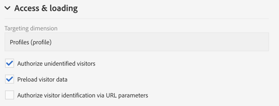

# ランディングページのデザイン{#designing-a-landing-page}

## コンテンツデザインについて {#about-content-design}

ランディングページは、マーケティングアクティビティと [して作成されま](../../start/using/marketing-activities.md#about-marketing-activities)す。

ランディングページをデザインする場合は、次の内容を定義する必要があります。

* ページ自体
* 確認ページ、
* エラーページ。

アクションバーの下の切り替えボタンを使用して、各ページを表示し、設定します。

これらのページのコンテンツは、Campaignコンテンツエディターを使用してデザインされます。 デザインコンテ [ンツを参照](../../channels/using/about-landing-page-content-design.md)。

## フォームフィールドのマッピング {#mapping-form-fields}

入力フィールドは、Campaignデータベースにデータを保存または更新するために使用します。 この場合、データベースフィールドを入力ゾーン、ラジオボタンまたはチェックボックスタイプブロックにリンクする必要があります。 手順は次のとおりです。

1. ランディングページのブロックを選択します。
1. パレットのパ **[!UICONTROL Form data]** ーツを完成させます。

   

1. 選択ゾーンのフォームフィールドとリンクするデータベースフィールドを **[!UICONTROL Field]** 選択します。

   このオプション **[!UICONTROL Mandatory]** をオンにした場合、ページは、ユーザーがこのフィールドを完了した場合にのみ送信できます。 必須フィールドが未入力の場合は、ユーザーがページを検証するときにエラーメッセージが表示されます。

   >[!NOTE]
   >
   >ランディングページはプロファイルにのみマッピング **できます**。

1. フィールドの種類を定義するには、例えば、選択 **[!UICONTROL Text]**&#x200B;領域で、 **[!UICONTROL Number]**&#x200B;または **[!UICONTROL Date]** を選択 **[!UICONTROL HTML type of the field]** します。

>[!NOTE]
>
>組み込みのランディングページのデフォルトフィールドは事前に設定されています。 必要に応じて変更できます。

## フォームの送信 {#submitting-the-form}

訪問者が送信ボタンをクリックしたときに実行するアクションを選択できます。 手順は次のとおりです。

1. ランディングページの送信ボタンを選択します。
1. 左側のパネルのドロップダウンリストでアクションを選択します。 可能なアクションは次のとおりです。(ペ **[!UICONTROL Refresh]** ージを更新する場合)と **[!UICONTROL Next page]** （確認ページを表示する場合）が表示されます。

   

また、ボタンのラベルを変更したり、特定のリンクを設定したりできます。 手順は次のとおりです。

1. 送信ボタンを選択します。
1. 左側のパネルにあ  るボタンをクリックします。
1. ボタンのラベルを入力し、リンクのタイプ、プロパティおよびターゲットを選択します。

   

## サービスへのフォームのリンク {#linking-a-form-to-a-service}

フォームをサービスにリンクして、ランディングページを検証する際にプロファイルが特定のサービスに登録できるようにすることができます。

ランディングページをリンクするパラメーターを使用すると、実行するアクションのタイプと、ランディングページが単一のサービスに具体的にリンクされているか、汎用であるかを指定できます。

リンクするサービスを選択するには、次の操作を行う必要があります。

1. ランディングページのダッシュボードのアイコンを使用し  てアクセスしたランディングページのプロパティを編集し、パラメータを表示 **[!UICONTROL Job]** します。

   

1. ドロッ **[!UICONTROL Subscription]** プダウンリスト **[!UICONTROL Specific actions]** からを選択します。

   

1. ランディング **[!UICONTROL Specific service]** ページを単一のサービスにリンクする場合に選択します。 ランディングページで複数のサービスを使用する場合は、このオプションを選択しないでください。

   このオプション **[!UICONTROL Specified service in the URL]** を使用して、ランディングページを複数のサービスで使用できるようにします。 したがって、サービスを設定する際は、ランディングページを参照する必要があります。

### ランディングページの送信の確認 {#confirm-a-landing-page-submission}

訪問者がランディングページを送信した場合、トリガーされるアクションを設定できます。 手順は次のとおりです。

1. ランディングページのダッシュボードのアイコンを使用し  てアクセスしたランディングページのプロパティを編集し、パラメータを表示 **[!UICONTROL Job]** します。

   

1. 「」セクシ **[!UICONTROL Specific actions]** ョンで、自動メ **[!UICONTROL Start sending message]** ッセージの送信を決定する場合に選択します。例えば、サービスの購読を確認します。 その後、電子メール配信テンプレートを選択する必要があります。

   確認メッセージが既にサービスレベルで設定されている場合は、この画面で確認メッセージを1つ選択しないでください。 「サービス [の設定」を参照](../../audiences/using/creating-a-service.md)。

1. ランディング **[!UICONTROL Additional data]** ページの送信時に追加のデータを保存できるように作成します。 このデータは、ページを訪問した人には表示されません。 定数値のみが考慮されます。

   

## 権限の設定とデータのプリロード {#setting-permissions-and-pre-loading-data}

ランディングページへのアクセスは、例えばキャンペーンから送信されるメッセージ内のリンクから来た、識別された訪問者に制限できます。 この場合、ランディングページでデータを事前に読み込むことができます。 手順は次のとおりです。

1. ランディングページのダッシュボードのアイコンを使用し  てアクセスしたランディングページのプロパティを編集し、パラメータを表示 **[!UICONTROL Access & loading]** します。

   

1. Select **[!UICONTROL Preload visitor data]**.

   ページの訪問者がデータベース内のプロファイルに対応する場合、そのデータはデータベースデータにマップされたフォームのフィールドに表示され、ランディングページのパーソナライゼーション要素が考慮されます。

   

また、次のこともできます。

* 次のオプションを使用して、URLパラメーターを使用して訪問者を識別 **[!UICONTROL Authorize visitor identification via URL parameters]** します。次に、読み込みキーを選択し、対応するURLのパラメーターを使用してフィルターパラメーターをマッピングする必要があります。
* このオプションを使用して、すべての訪問者がランディングページにアクセスすることを許 **[!UICONTROL Authorize unidentified visitors]** 可します。

## Google reCAPTCHAの設定 {#setting-google-recaptcha}

ランディングページにGoogle reCAPTCHA V3を設定して、ボットによるスパムや悪用からGoogle ReCAPTCHA V3を保護できます。 ランディングページでこのページを使用するには、まず外部アカウントを作成する必要があります。 設定方法の詳細については、この節を参照してく [ださい](../../administration/using/external-accounts.md#google-recaptcha-external-account)。

Google reCAPTCHA V3外部アカウントが設定されたら、それをランディングページに追加できます。

1. ランディングページを公開する前に、ランディングページのダッシュボードからアイコンを使用してアク  セスしたページのプロパティにアクセスします。

   

1. メニューを展開 **[!UICONTROL Access & loading]** します。
1. Check the **[!UICONTROL Use reCAPTCHA to protect your site from spam and abuse]** option.
1. 以前に作成したGoogle reCAPTCHA外部アカウントを選択します。

   

1. Click **[!UICONTROL Confirm]**.

これで、ランディングページがGoogle reCAPTCHAで設定され、ページの下部に表示されます。

その後、Google reCAPTCHAは、ユーザーのページでのインタラクションに基づいてスコアを返します。 スコアを確認するには、 [Google管理コンソールに接続します](https://g.co/recaptcha/admin)。
