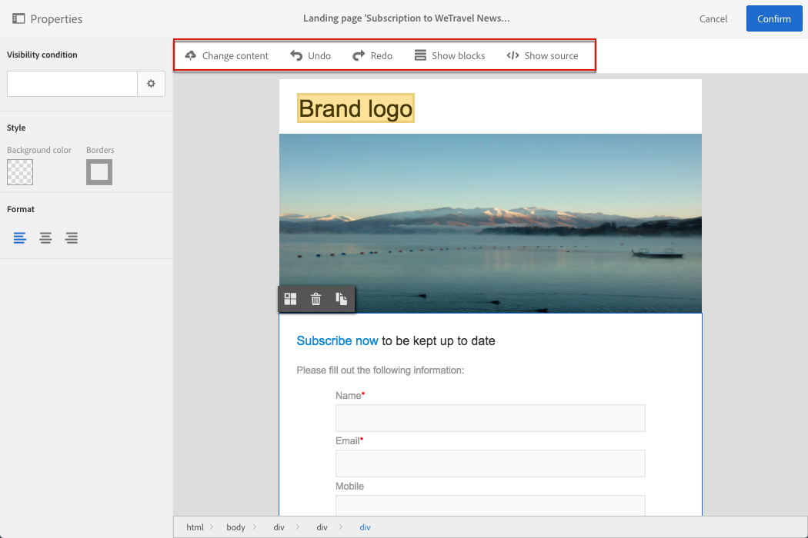

# ランディングページのデザイン{#designing-a-landing-page}

## ランディングページのコンテンツデザインのコンテンツデザインについて {#about-content-design}

ランディングページは、任意の[マーケティングアクティビティ](../../start/using/marketing-activities.md#about-marketing-activities)として作成されます。

ランディングページをデザインする場合、ページそのもの、確認ページ、エラーページのコンテンツを定義する必要があります。アクションバーの下の切り替えボタンを使用して、各ページを表示し設定します。

ランディングページのコンテンツは、Campaign コンテンツエディターでデザインします。

>[!NOTE]
>
>メールデザインについては、Adobe Campaign Standard 19.0 リリースより前にインスタンスがインストールされた場合でも、従来のメールコンテンツエディターにアクセスできます。 インターフェイス、使用上の原則、設定は、ランディングページについて以下で説明するものとほとんど同じです。ただし、19.0 リリース以降では非推奨となる、従来のメールコンテンツエディターでは、すべての機能を使用または維持できない場合があります。拡張機能を備えたドラッグ＆ドロップインターフェイスでメールコンテンツを素早く編集するには、[E メールデザイナー](../../designing/using/designing-content-in-adobe-campaign.md)を使用します。

ここでは、ランディングページコンテンツエディターに特有の事項について説明します。1 つ以上のマーケティングアクティビティに共通するアクションについて詳しくは、次の&#x200B;**メールコンテンツのデザイン**&#x200B;ガイドの節を参照してください。

* [パーソナライゼーションフィールドの挿入](../../designing/using/personalization.md#inserting-a-personalization-field)
* [コンテンツブロックの追加](../../designing/using/personalization.md#adding-a-content-block)
* [リンクの挿入](../../designing/using/links.md#inserting-a-link)
* [画像の挿入](../../designing/using/images.md)
* [コンテンツデザインの一般的なベストプラクティス](../../designing/using/designing-content-in-adobe-campaign.md#content-design-best-practices)

>[!NOTE]
>HTML 形式で既に定義済みのランディングページがある場合は、「**[!UICONTROL Change content]**」ボタンを使用して直接読み込むことができます。
>
>Adobe Campaign で HTML ページを読み込む前に、様々なブラウザーで HTML ページを開いて適切に表示されることを確認してください。HTML ページに JavaScript スクリプトが含まれている場合、エディターの外部でエラーなしで実行する必要があります。一般に、メールクライアントによって正しく処理されるように、メッセージコンテンツにはスクリプトを使用しないでください。

## ランディングページのコンテンツエディターインターフェイス{#landing-page-content-editor-interface}

ランディングページコンテンツエディターを使用すると、Adobe Campaign でコンテンツを簡単に定義、変更およびパーソナライズできます。アクセスするには、ランディングページのダッシュボードで&#x200B;**[!UICONTROL Content]**&#x200B;ブロックをクリックします。

コンテンツエディターは 3 つのセクションに分かれています。これらのセクションでは、コンテンツの表示と編集が可能です。

1. 画面の左側の&#x200B;**パレット**&#x200B;を使用すると、選択したブロックにリンクされた一般オプションを変更できます。変更できるオプションは背景色、境界線、テキストの整列、表示条件などです。[パーソナライゼーションフィールドの挿入](../../designing/using/personalization.md#inserting-a-personalization-field)を参照してください。
1. **アクションバー**&#x200B;には、ページの一般的なオプションが含まれています。テンプレートを選択し、表示モードを変更できます。
1. メイン&#x200B;**編集ゾーン**&#x200B;では、コンテキストツールバーを使用して、コンテンツを直接操作できます。画像にリンクを挿入する、フォントを変更する、フィールドを削除するなどです。

**アクションバー**&#x200B;には、作成中のコンテンツを操作するための様々なボタンが含まれています。

<table> 
 <thead> 
  <tr> 
   <th> アイコン  </th> 
   <th> ボタン名  </th> 
   <th> チャネル  </th> 
   <th> 説明  </th> 
  </tr> 
 </thead> 
 <tbody> 
  <tr> 
   <td>    </td> 
   <td> Change content   </td> 
   <td> ランディングページとメール  </td> 
   <td> 標準搭載のコンテンツを選択するか、独自の HTML コンテンツを読み込むことができます。詳しくは、<a href="../../designing/using/using-existing-content.md">既存コンテンツの読み込み</a>を参照してください。  </td> 
  </tr> 
  <tr> 
   <td>    </td> 
   <td> Undo   </td> 
   <td> すべて  </td> 
   <td> 最後に実行された操作をキャンセルします。  </td> 
  </tr> 
  <tr> 
   <td>    </td> 
   <td> Redo   </td> 
   <td> すべて  </td> 
   <td> 最後にキャンセルした操作をやり直します。  </td> 
  </tr> 
  <tr> 
   <td>    </td> 
   <td> Show blocks   </td> 
   <td> ランディングページとメール  </td> 
   <td> コンテンツブロックの周囲にボックスを表示できます（<strong>&lt;div&gt;</strong> HTML タグに対応）。  </td> 
  </tr> 
  <tr> 
   <td>    </td> 
   <td> Show source   </td> 
   <td> ランディングページとメール  </td> 
   <td> ページの HTML ソースコードを表示できます。  </td> 
  </tr> 
 </tbody> 
</table>

**ツールバー**&#x200B;はエディターインターフェイスのコンテキスト要素で、選択したゾーンに応じて様々な機能を提供します。テキストのスタイルを変更するためのアクションボタンと各ボタンが含まれています。実行された変更は、常に選択したゾーンに適用されます。ブロックを選択すると、それを削除したり、複製したりできます。ブロック内のテキストを選択した後に、そのテキストをリンクに変えたり、太字にしたりできます。

>[!IMPORTANT]
>
>特定のツールバー機能を使用すると、HTML コンテンツを書式設定できます。ただし、ページに CSS スタイルシートが含まれる場合、スタイルシートからの&#x200B;**指示**&#x200B;が、ツールバーで指定された指示よりも&#x200B;**優先**&#x200B;されることがあります。

<table> 
 <thead> 
  <tr> 
   <th> アイコン  </th> 
   <th> ボタン名  </th> 
   <th> コンテキスト  </th> 
   <th> 説明  </th> 
  </tr> 
 </thead> 
 <tbody> 
  <tr> 
   <td>    </td> 
   <td> Link to an external URL   </td> 
   <td> 任意の要素  </td> 
   <td> URL にリンクを追加できます。リンクの設定方法の詳細については、<a href="../../designing/using/links.md#inserting-a-link">リンクの挿入</a>の節を参照してください。  </td> 
  </tr> 
  <tr> 
   <td>    </td> 
   <td> Link to a landing page   </td> 
   <td> 任意の要素  </td> 
   <td> Adobe Campaign ランディングページへのアクセスを許可します。リンクの設定方法の詳細については、<a href="../../designing/using/links.md#inserting-a-link">リンクの挿入</a>の節を参照してください。  </td> 
  </tr> 
  <tr> 
   <td>    </td> 
   <td> Subscription link   </td> 
   <td> 任意の要素  </td> 
   <td> サービス購読リンクを挿入できます。リンクの設定方法の詳細については、<a href="../../designing/using/links.md#inserting-a-link">リンクの挿入</a>の節を参照してください。  </td> 
  </tr> 
  <tr> 
   <td>    </td> 
   <td> Unsubscription link   </td> 
   <td> 任意の要素  </td> 
   <td> サービス購読解除リンクを挿入できます。リンクの設定方法の詳細については、<a href="../../designing/using/links.md#inserting-a-link">リンクの挿入</a>の節を参照してください。  </td> 
  </tr> 
  <tr> 
   <td>    </td> 
   <td> Remove link   </td> 
   <td> リンク  </td> 
   <td> 確認後に、リンクおよびリンクにリンクされているすべての設定を削除できます。  </td> 
  </tr> 
  <tr> 
   <td>    </td> 
   <td> Insert a personalization field   </td> 
   <td> テキスト要素  </td> 
   <td> データベースからコンテンツにフィールドを追加できます。<a href="../../designing/using/personalization.md#inserting-a-personalization-field">パーソナライゼーションフィールドの挿入</a>を参照してください。  </td> 
  </tr> 
  <tr> 
   <td>    </td> 
   <td> Insert a content block   </td> 
   <td> テキスト要素  </td> 
   <td> コンテンツにパーソナライゼーションブロックを追加できます。<a href="../../designing/using/personalization.md#adding-a-content-block">コンテンツブロックの追加</a>を参照してください。  </td> 
  </tr> 
  <tr> 
   <td>    </td> 
   <td> Enable dynamic content   </td> 
   <td> テキスト要素  </td> 
   <td> 動的コンテンツをコンテンツに挿入できます。<a href="../../channels/using/designing-a-landing-page.md#defining-dynamic-content-in-a-landing-page">動的コンテンツの定義</a>を参照してください。  </td> 
  </tr> 
  <tr> 
   <td>    </td> 
   <td> Disable dynamic content   </td> 
   <td> テキスト要素  </td> 
   <td> 動的コンテンツを削除できます。  </td> 
  </tr> 
  <tr> 
   <td>    </td> 
   <td> Enlarge font   </td> 
   <td> テキスト要素  </td> 
   <td> 選択したテキストのサイズを拡大します（<strong>&lt;span style="font-size:"&gt;</strong> を追加します）。  </td> 
  </tr> 
  <tr> 
   <td>    </td> 
   <td> Reduce font   </td> 
   <td> テキスト要素  </td> 
   <td> 選択したテキストのサイズを縮小します（<strong>&lt;span style="font-size:"&gt;</strong> を追加します）。  </td> 
  </tr> 
  <tr> 
   <td>    </td> 
   <td> Bold   </td> 
   <td> テキスト要素  </td> 
   <td> 選択したテキストに太字スタイルを追加します（<strong>&lt;strong&gt;</strong><strong>&lt;/strong&gt;</strong> タグでテキストを囲みます）。  </td> 
  </tr> 
  <tr> 
   <td>    </td> 
   <td> Italic   </td> 
   <td> テキスト要素  </td> 
   <td> 選択したテキストに斜体スタイルを追加します（<strong>&lt;em&gt;</strong><strong>&lt;/em&gt;</strong> でテキストを囲みます）。  </td> 
  </tr> 
  <tr> 
   <td>    </td> 
   <td> Underline   </td> 
   <td> テキスト要素  </td> 
   <td> 選択したテキストに下線を付けます（<strong>&lt;span style="text-decoration: underline;"&gt;</strong> タグ）。  </td> 
  </tr> 
  <tr> 
   <td>    </td> 
   <td> Change background color   </td> 
   <td> テキスト要素  </td> 
   <td> 選択したブロックの背景色を変更できます（style="background-color: rgba(170, 86, 255, 0.87) を追加します）。  </td> 
  </tr> 
  <tr> 
   <td>    </td> 
   <td> Change font color   </td> 
   <td> テキスト要素  </td> 
   <td> ブロック内のすべてのテキストの色、またはブロック内で選択されているテキストのみの色を変更できます（<strong>&lt;span style="color: #56ff56;"&gt;</strong>）。  </td> 
  </tr> 
  <tr> 
   <td>    </td> 
   <td> Image   </td> 
   <td> 画像を含むブロック  </td> 
   <td> ローカルに保存されたファイルから画像を挿入できます。  </td> 
  </tr> 
  <tr> 
   <td>    </td> 
   <td> Delete   </td> 
   <td> 任意のブロック  </td> 
   <td> ブロックとその内容を削除します。  </td> 
  </tr> 
  <tr> 
   <td>    </td> 
   <td> Duplicate   </td> 
   <td> 任意のブロック  </td> 
   <td> リンクされているスタイルを含むブロックを複製します。  </td> 
  </tr> 
 </tbody> 
</table>

## ランディングページの構造とスタイルの管理{#managing-landing-page-structure-and-style}

### コンテンツエディターでのブロックの管理 {#managing-blocks-in-the-content-editor}

様々な HTML コンテンツ要素がブロック（**&lt;div>** **&lt;/div>** タグに対応）としてランディングページに表示されます。操作するブロックを選択します。そのブロックが青いボックスで囲まれます。

ブロックを選択した場合、対応する HTML 要素の親オブジェクトが、編集ゾーンの下部にあるパンくずリストに表示されます。

パンくず要素の 1 つにマウスを合わせると、関連する要素がハイライト表示されます。したがって、様々なブロック間を簡単に移動でき、変更する HTML 要素を正確に選択できます。

パレットとコンテキストツールバーのオプションを使用すると、ブロックの変更、削除、複製をおこなえます。

テキストを含むブロックの場合は、ブロック内を再度クリックして、テキスト編集モードを有効にします。ブロックの周りのフレームが緑色に変わります。その後、テキストを選択または入力できます。パレットとコンテキストツールバーのオプションを使用すると、リンクを追加したり、テキストの書式設定を変更したりできます。

ブロック内の要素（リンク、パーソナライゼーションフィールド、コンテンツブロックなど）に対して定義されたパラメーターは、パレットからいつでも変更できます。

### コンテンツエディターでの境界線と背景の追加 {#adding-a-border-and-a-background-in-the-content-editor}

また、チャートから色を選択することで、**背景色**&#x200B;を定義できます。この色は、選択したブロックに適用されます。

選択したブロックに&#x200B;**境界線**&#x200B;を追加できます。

### コンテンツエディターでのテキストスタイルの変更 {#changing-the-text-style-in-the-content-editor}

テキストのスタイルを変更するには、テキストブロック内をクリックする必要があります。

テキストの整列を変更するには、左側のパレットで次の 3 つのアイコンのいずれかを選択します。

* **左揃え**：選択されたブロックの左側にテキストを揃えます（style=&quot;text-align: left;&quot; を追加します）。
* **中央揃え**：選択されたブロック内のテキストを中央に配置します（style=&quot;text-align: center;&quot; を追加します）。
* **右揃え**：選択されたブロックの右側にテキストを揃えます（style=&quot;text-align: right;&quot; を追加します）。

ツールバーを使用してフォント属性を変更することもできます。フォントサイズを調整し、テキストを太字または斜体にしたり、テキストに下線を引いたり、テキストの色を変更したりします。[こちらの節](../../channels/using/designing-a-landing-page.md#landing-page-content-editor-interface)を参照してください。

### ランディングページへの画像の挿入 {#inserting-images-in-a-landing-page}

1. ランディングページコンテンツで、画像を含んだブロックを選択します。
1. 「**[!UICONTROL Insert]**」ボタンをクリックします。

   

1. コンテキストツールバーから「**[!UICONTROL Local image]**」を選択します。

   

1. ファイルを選択します。

   

1. 必要に応じて画像のプロパティを調整します。

   

## ランディングページでの動的コンテンツの定義{#defining-dynamic-content-in-a-landing-page}

ランディングページに動的コンテンツを定義するには、パンくずリストを使用するか要素を直接クリックして、ブロックを選択します。

画像などの特定のブロックは直接選択できません。その場合は、パンくずリストを使用して親ブロックを選択します。その後、この親要素に含まれるすべての要素（画像を含む）を変更できます。この条件は、親ブロック内のすべての子要素に適用されます。

パンくずリストについては、[ブロックの管理](../../channels/using/designing-a-landing-page.md#managing-landing-page-structure-and-style)の節を参照してください。

ランディングページに動的コンテンツを定義するための次の手順は、メールの場合と似ています。[こちらの節](../../designing/using/personalization.md#defining-dynamic-content-in-an-email)を参照してください。

>[!NOTE]
>
>バリエーション要素が赤でアウトライン表示されている場合は、式がまだ定義されていないことを意味します。

ブロックの様々は動的コンテンツ間を移動できます。手順は次のとおりです。

1. ブロックを選択します。

   画像の右側と左側に矢印が表示されます。

1. 右向き矢印をクリックして、使用可能な動的コンテンツを参照します。

   

   使用可能な最後の動的コンテンツに達したか、最初の動的コンテンツに達したかに応じて、片側の矢印が淡色表示されます。

   

1. ブロックに適用されたすべての条件を削除するには、そのブロックを選択し、「**[!UICONTROL Disable dynamic content]**」アイコンをクリックします。
1. 保持する動的コンテンツを選択します。

   

パレット内は次のようになります。

* 式が入力されているコンテンツは、赤くアウトライン表示されなくなり、灰色で表示されます。
* 現在選択されているコンテンツは青色で表示されます。

