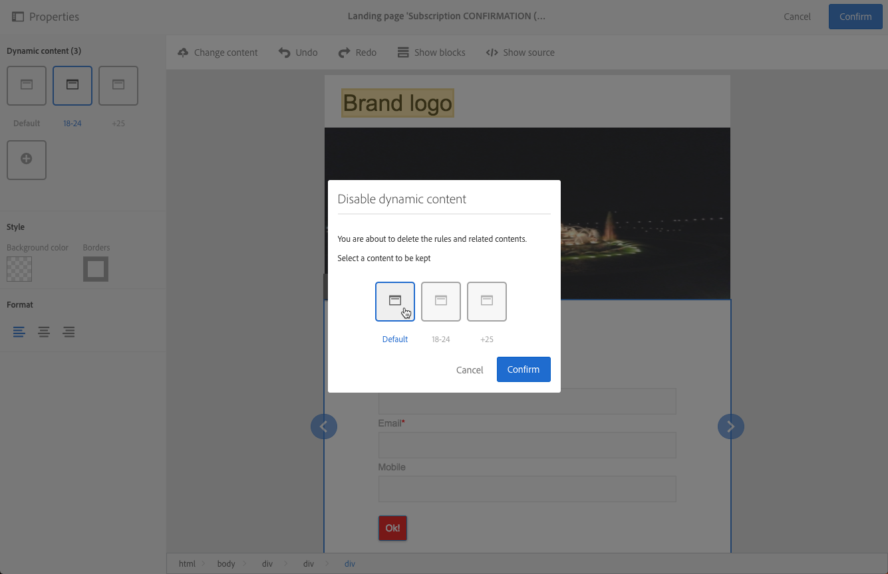

# ランディングページのデザイン{#designing-a-landing-page}

## ランディングページコンテンツデザインコンテンツデザインについて {#about-content-design}

ランディングページは、マーケティングアクティビティと [して作成されま](../../start/using/marketing-activities.md#about-marketing-activities)す。

ランディングページをデザインする場合は、ページ自体、確認ページ、エラーページのコンテンツを定義する必要があります。 アクションバーの下の切り替えボタンを使用して、各ページを表示し、設定します。

ランディングページのコンテンツは、Campaignコンテンツエディターを使用して設計されます。

>[!NOTE]
>
>Adobe Campaign Standard 19.0リリースより前にインストールしたインスタンスでも、従来の電子メールコンテンツエディターにアクセスできます。 インターフェイス、使用、設定の原則は、ランディングページの場合に以下で説明するのとほとんど同じです。 ただし、19.0リリース以降では廃止される、レガシー電子メールコンテンツエディターでは、すべての機能を使用または維持できない場合があります。 拡張機能を備えたドラッグ&amp;ドロップインターフェイスで電子メールコンテンツをすばやく編集するには、電子メールデザ [イナーを使用しま](../../designing/using/overview.md)す。

このページでは、ランディングページのコンテンツエディターの特性について説明します。 1つ以上のマーケティングアクティビティに共通するアクションについて詳しくは、「電子メールコンテンツの設計」ガイドの次の節 **を参照してくださ** い。

* [パーソナライゼーションフィールドの挿入](../../designing/using/personalization.md#inserting-a-personalization-field)
* [コンテンツブロックの追加](../../designing/using/personalization.md#adding-a-content-block)。
* [リンクの挿入](../../designing/using/links.md#inserting-a-link).
* [画像の挿入](../../designing/using/images.md).
* [コンテンツデザインの一般的なベストプラクティス](../../designing/using/overview.md#content-design-best-practices)。

>[!NOTE]
>HTML形式で既に定義済みのランディングページがある場合は、ボタンを使用して直接ランディングページを読み込むことがで **[!UICONTROL Change content]** きます。
>
>Adobe CampaignでHTMLページをインポートする前に、HTMLページが開いて様々なブラウザーで正しく表示されていることを確認してください。 HTML ページに JavaScript スクリプトが含まれている場合、エディターの外部でエラーなしで実行する必要があります。一般に、電子メールクライアントが正しく処理されるように、メッセージコンテンツにスクリプトを使用しないでください。

## ランディングページコンテンツエディターのインターフェイス{#landing-page-content-editor-interface}

ランディングページのコンテンツエディターを使用すると、Adobe Campaignでコンテンツを簡単に定義、変更およびパーソナライズできます。 このページにアクセスするには、ランディングペ **[!UICONTROL Content]** ージのダッシュボードのブロックをクリックします。

コンテンツエディターは3つのセクションに分かれています。 これらのセクションでは、コンテンツを表示および編集できます。

1. 画面 **の左側のパレット** では、選択したブロックにリンクされた一般オプションを変更できます。 変更できるオプションは次のとおりです。背景色、境界線、テキストの整列、表示条件など See [Inserting a personalization field](../../designing/using/personalization.md#inserting-a-personalization-field).
1. アクシ **ョンバーに** 、ページの一般的なオプションが表示されます。 テンプレートを選択し、表示モードを変更できます。
1. メインの編集 **ゾーンでは** 、コンテキストツールバーを使用してコンテンツを直接操作できます。画像へのリンクの挿入、フォントの変更、フィールドの削除など

アクシ **ョンバーには** 、作成中のコンテンツを操作するための様々なボタンが含まれています。

<table> 
 <thead> 
  <tr> 
   <th> アイコン  </th> 
   <th> ボタン名  </th> 
   <th> チャネル  </th> 
   <th> 説明  </th> 
  </tr> 
 </thead> 
 <tbody> 
  <tr> 
   <td>    </td> 
   <td> コンテンツの変更  </td> 
   <td> ランディングページと電子メール  </td> 
   <td> そのまま使用できるコンテンツを選択したり、独自のHTMLコンテンツを読み込んだりできます。 詳しくは、既存 <a href="../../designing/using/using-existing-content.md">のコンテンツの読み込みを参照してくださ</a>い。  </td> 
  </tr> 
  <tr> 
   <td>    </td> 
   <td> 元に戻す  </td> 
   <td> すべて  </td> 
   <td> 最後に実行された操作をキャンセルします。  </td> 
  </tr> 
  <tr> 
   <td>    </td> 
   <td> やり直し  </td> 
   <td> すべて  </td> 
   <td> 最後に取り消した操作をやり直します。  </td> 
  </tr> 
  <tr> 
   <td>    </td> 
   <td> ブロックを表示  </td> 
   <td> ランディングページと電子メール  </td> 
   <td> コンテンツブロックの周囲のボックスを表示できます( <strong>&lt;div&gt;</strong> HTMLタグに対応)。  </td> 
  </tr> 
  <tr> 
   <td>    </td> 
   <td> ソースを表示   </td> 
   <td> ランディングページと電子メール  </td> 
   <td> ページのHTMLソースコードを表示できます。  </td> 
  </tr> 
 </tbody> 
</table>

ツール **バーは** 、エディタインターフェイスのコンテキスト要素で、選択したゾーンに応じて様々な機能を提供します。 テキストのスタイルを変更できるアクションボタンとボタンが含まれます。 実行された変更は、常に選択したゾーンに適用されます。 例えば、ブロックを選択したら、そのブロックを削除または複製できます。 ブロック内のテキストを選択した後、リンクにしたり、太字にしたりできます。

>[!CAUTION]
>
>特定のツールバー機能を使用すると、HTML コンテンツを書式設定できます。However, if the page contains a CSS style sheet, the **instructions** from the style sheet may prove to take **priority** over the instructions specified via the toolbar.

<table> 
 <thead> 
  <tr> 
   <th> アイコン  </th> 
   <th> ボタン名  </th> 
   <th> コンテキスト  </th> 
   <th> 説明  </th> 
  </tr> 
 </thead> 
 <tbody> 
  <tr> 
   <td>    </td> 
   <td> 外部 URL へのリンク   </td> 
   <td> 任意の要素  </td> 
   <td> URLにリンクを追加できます。 リンクの設定方法の詳細については、「リンクの挿入」セクシ <a href="../../designing/using/links.md#inserting-a-link">ョンを参照してくださ</a> い。  </td> 
  </tr> 
  <tr> 
   <td>    </td> 
   <td> ランディングページへのリンク  </td> 
   <td> 任意の要素  </td> 
   <td> Adobe Campaignのランディングページへのアクセスを許可します。 リンクの設定方法の詳細については、「リンクの挿入」セクシ <a href="../../designing/using/links.md#inserting-a-link">ョンを参照してくださ</a> い。  </td> 
  </tr> 
  <tr> 
   <td>    </td> 
   <td> 購読リンク  </td> 
   <td> 任意の要素  </td> 
   <td> サービス購読リンクを挿入できます。 リンクの設定方法の詳細については、「リンクの挿入」セクシ <a href="../../designing/using/links.md#inserting-a-link">ョンを参照してくださ</a> い。  </td> 
  </tr> 
  <tr> 
   <td>    </td> 
   <td> 購読解除リンク   </td> 
   <td> 任意の要素  </td> 
   <td> サービスの購読解除リンクを挿入できます。 リンクの設定方法の詳細については、「リンクの挿入」セクシ <a href="../../designing/using/links.md#inserting-a-link">ョンを参照してくださ</a> い。  </td> 
  </tr> 
  <tr> 
   <td>    </td> 
   <td> リンクを削除  </td> 
   <td> リンク  </td> 
   <td> 確認後に、リンクと、そのリンクにリンクされているすべての設定を削除できます。  </td> 
  </tr> 
  <tr> 
   <td>    </td> 
   <td> パーソナライゼーションフィールドの挿入 。   </td> 
   <td> テキスト要素  </td> 
   <td> データベースからコンテンツにフィールドを追加できます。 詳しくは、パーソナ <a href="../../designing/using/personalization.md#inserting-a-personalization-field">ライゼーションフィールドの挿入を参照してくださ</a>い。  </td> 
  </tr> 
  <tr> 
   <td>    </td> 
   <td> コンテンツブロックの挿入  </td> 
   <td> テキスト要素  </td> 
   <td> コンテンツにパーソナライゼーションブロックを追加できます。 詳しくは、「コンテ <a href="../../designing/using/personalization.md#adding-a-content-block">ンツブロックの追加」を参照してくださ</a>い。  </td> 
  </tr> 
  <tr> 
   <td>    </td> 
   <td> 動的コンテンツの有効化  </td> 
   <td> テキスト要素  </td> 
   <td> 動的なコンテンツをコンテンツに挿入できます。 動的コンテンツ <a href="../../channels/using/designing-a-landing-page.md#defining-dynamic-content-in-a-landing-page">の定義を参照してください</a>。  </td> 
  </tr> 
  <tr> 
   <td>    </td> 
   <td> 動的コンテンツの無効  </td> 
   <td> テキスト要素  </td> 
   <td> 動的コンテンツを削除できます。  </td> 
  </tr> 
  <tr> 
   <td>    </td> 
   <td> フォントを拡大   </td> 
   <td> テキスト要素  </td> 
   <td> 選択したテキストのサイズを拡大します( <strong>&lt;span style="font-size:"&gt;</strong>)。  </td> 
  </tr> 
  <tr> 
   <td>    </td> 
   <td> フォントを縮小   </td> 
   <td> テキスト要素  </td> 
   <td> 選択したテキストのサイズを縮小しま <strong>す(&lt;span style="font-size:"&gt;</strong>)。  </td> 
  </tr> 
  <tr> 
   <td>    </td> 
   <td> 太字  </td> 
   <td> テキスト要素  </td> 
   <td> 選択したテキストに太字スタイルを追加します(テキストを <strong>&lt;strong&gt;</strong><strong>&lt;/strong&gt;タグで囲みます</strong> )。  </td> 
  </tr> 
  <tr> 
   <td>    </td> 
   <td> 斜体  </td> 
   <td> テキスト要素  </td> 
   <td> 選択したテキストに斜体スタイルを追加します(テキストを&lt;em&gt; <strong>&lt;/em&gt;タグで囲みます</strong><strong></strong> )。  </td> 
  </tr> 
  <tr> 
   <td>    </td> 
   <td> 下線  </td> 
   <td> テキスト要素  </td> 
   <td> 選択したテキストに下線を付けます( <strong>&lt;span style="text-decoration:underline;"&gt;</strong> tag)。  </td> 
  </tr> 
  <tr> 
   <td>    </td> 
   <td> 背景色の変更  </td> 
   <td> テキスト要素  </td> 
   <td> 選択したブロックの背景色を変更できます(style="background-color:rgba(170, 86, 255, 0.87))を参照してください。  </td> 
  </tr> 
  <tr> 
   <td>    </td> 
   <td> フォントの色の変更  </td> 
   <td> テキスト要素  </td> 
   <td> ブロック内のすべてのテキストの色、またはブロック内で選択されたテキストのみの色を変更できます(<strong>&lt;span style="color:#56ff56;"&gt;</strong>)。  </td> 
  </tr> 
  <tr> 
   <td>    </td> 
   <td> 画像  </td> 
   <td> 画像を含むブロック  </td> 
   <td> ローカルに保存されたファイルから画像を挿入できます。  </td> 
  </tr> 
  <tr> 
   <td>    </td> 
   <td> 削除  </td> 
   <td> 任意のブロック  </td> 
   <td> ブロックとその内容を削除します。  </td> 
  </tr> 
  <tr> 
   <td>    </td> 
   <td> 複製  </td> 
   <td> 任意のブロック  </td> 
   <td> リンクされたスタイルを含むブロックを複製します。  </td> 
  </tr> 
 </tbody> 
</table>

## ランディングページの構造とスタイルの管理{#managing-landing-page-structure-and-style}

### コンテンツエディタでのブロックの管理 {#managing-blocks-in-the-content-editor}

異なるHTMLコンテンツ要素は、 **&lt;div&gt;** &lt;/div&gt;タグに対応するブロックとしてランディングページに表示されます **** 。 操作するブロックを選択します。 その後、青い箱に囲まれます。

ブロックを選択すると、対応するHTML要素の親オブジェクトが、編集ゾーンの下部にあるパンくずリストに表示されます。

階層リンク要素の1つにマウスを移動すると、その要素がハイライト表示されます。 したがって、様々なブロック間を簡単に移動し、変更するHTML要素を正確に選択できます。

パレットとコンテキストツールバーのオプションを使用して、ブロックを修正、削除、複製します。

文字を含むブロックの場合は、ブロック内を再度クリックして、文字編集モードを有効にします。 ブロックの周りのフレームが緑色に変わります。 その後、テキストを選択または入力できます。 パレットとコンテキストツールバーのオプションを使用して、リンクを追加したり、テキストの形式設定を変更したりします。

ブロック内の要素（リンク、パーソナライゼーションフィールド、コンテンツブロックなど）に対して定義されたパラメーター。は、パレットからいつでも変更できます。

### コンテンツエディターでの境界線と背景の追加 {#adding-a-border-and-a-background-in-the-content-editor}

You can also define a **background color** by selecting a color from the chart. この色は選択したブロックに適用されます。

You can add a **border** to the selected block.

### コンテンツエディターでのテキストスタイルの変更 {#changing-the-text-style-in-the-content-editor}

テキストのスタイルを変更するには、テキストブロック内をクリックする必要があります。

テキストの整列方法を変更するには、左側のパレットで次の3つのアイコンのいずれかを選択します。

* **左揃え**:テキストを選択したブロックの左に揃えます(style="text-align:left;")。
* **中心**:選択したブロック内のテキストを中央揃えにします(style="text-align:center;")。
* **右揃え**:テキストを選択したブロックの右に揃えます(style="text-align:right;").

また、ツールバーを使用してフォント属性を変更することもできます。フォントサイズを調整し、テキストを太字または斜体にしたり、下線を引いたり、テキストの色を変更したりします。 [この節](../../channels/using/designing-a-landing-page.md#landing-page-content-editor-interface)を参照してください。

### ランディングページへのイメージの挿入 {#inserting-images-in-a-landing-page}

1. ランディングページのコンテンツで、画像を含むブロックを選択します。
1. ボタンを選択 **[!UICONTROL Insert]** します。

   

1. コンテキスト **[!UICONTROL Local image]** ツールバーからを選択します。

   

1. ファイルを選択します。

   

1. 必要に応じて画像のプロパティを調整します。

   

## ランディングページでの動的コンテンツの定義{#defining-dynamic-content-in-a-landing-page}

ランディングページで動的コンテンツを定義するには、階層リンクを使用するか、要素を直接クリックして、ブロックを選択します。

画像などの特定のブロックは直接選択できません。 この場合、階層リンクを使用して親ブロックを選択します。 その後、この親要素に含まれるすべての要素（画像を含む）を変更できます。 この条件は、親ブロック内のすべての子要素に適用されます。

階層リンクは「ブロックの管理」セクシ [ョンに表示され](../../channels/using/designing-a-landing-page.md#managing-landing-page-structure-and-style) ます。

ランディングページで動的コンテンツを定義する次の手順は、電子メールで実行する手順と似ています。 [この節](../../designing/using/personalization.md#defining-dynamic-content-in-an-email)を参照してください。

>[!NOTE]
>
>バリアント要素の輪郭が赤で表示されている場合は、式がまだ定義されていないことを意味します。

ブロックの異なる動的コンテンツ間を移動できます。 手順は次のとおりです。

1. ブロックを選択します。

   画像の右側と左側に矢印が表示されます。

1. 右向き矢印をクリックして、使用可能な動的コンテンツを参照します。

   

   各辺の矢印は、使用可能な動的コンテンツが最後に達したか最初に達したかに応じて暗くなります。

   

1. ブロックに適用されたすべての条件を削除するには、そのブロックを選択し、アイコンをクリック **[!UICONTROL Disable dynamic content]** します。
1. 保持する動的コンテンツを選択します。

   

パレット内：

* 入力された式の内容が赤で囲まれなくなり、灰色で表示されます。
* 現在選択されているコンテンツは青で表示されます。

