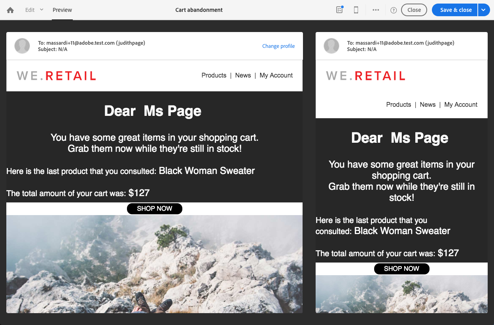

# トランザクションメッセージの編集 {#editing-transactional-message}

イベント<!--(the cart abandonment example as explained in [this section](../../channels/using/getting-started-with-transactional-msg.md#transactional-messaging-operating-principle))-->を作成して公開すると、対応するトランザクションメッセージが自動的に作成されます。

イベントを設定して公開する手順は、[トランザクションイベントの設定](../../channels/using/configuring-transactional-event.md)および[トランザクションイベントの公開](../../channels/using/publishing-transactional-event.md)の節に記載されています。

このメッセージにアクセスし、編集し、パーソナライズする手順を以下に示します。

>[!IMPORTANT]
>
>トランザクションメッセージにアクセスして編集できるのは、[管理](../../administration/using/users-management.md#functional-administrators)の役割を持つユーザーのみです。

メッセージの準備が整ったら、テストおよび公開できます。 [トランザクションメッセージ](../../channels/using/testing-transactional-message.md)および[トランザクションメッセージのライフサイクル](../../channels/using/publishing-transactional-message.md)のテストを参照してください。

## トランザクションメッセージへのアクセス {#accessing-transactional-messages}

作成したトランザクションメッセージにアクセスするには：

1. 左上隅の&#x200B;**Adobe**&#x200B;ロゴをクリックします。
1. **[!UICONTROL Marketing plans]** > **[!UICONTROL Transactional messages]** > **[!UICONTROL Transactional messages]**&#x200B;を選択します。

   

1. 任意のメッセージをクリックして編集します。

   

また、対応するイベント設定画面の左側の領域にあるリンクを使用して、トランザクションメッセージに直接アクセスすることもできます。 [イベントのプレビューと公開](../../channels/using/publishing-transactional-event.md#previewing-and-publishing-the-event)を参照してください。

## トランザクションメッセージのパーソナライズ機能 {#personalizing-a-transactional-message}

トランザクションメッセージを編集およびパーソナライズするには、次の手順に従います。

>[!NOTE]
>
>この節では、**イベントベースの**&#x200B;トランザクションメッセージを編集する方法について説明します。 **プロファイルベースの**&#x200B;トランザクションメッセージ特有の特性については、の下で詳しく説明します。
>
>イベントベースのトランザクションメッセージを作成するための設定手順については、[この節](../../channels/using/configuring-transactional-event.md#event-based-transactional-messages)を参照してください。

例えば、買い物かごに商品を追加し、購入を経ずにサイトを離れたWebサイトユーザーに通知を送信するとします。 この例は、[トランザクションメッセージの動作の仕組み](../../channels/using/getting-started-with-transactional-msg.md#transactional-messaging-operating-principle)の節に記載されています。

1. 「**[!UICONTROL Content]**」ブロックをクリックして、メッセージの件名と内容を変更します。この例では、画像とテキストを含む任意のテンプレートを選択します。Eメールコンテンツテンプレートについて詳しくは、[テンプレートを使用したEメールのデザイン](../../designing/using/using-reusable-content.md#designing-templates)を参照してください。

   

1. 件名追加を入力し、必要に応じてメッセージの内容を編集します。

   >[!NOTE]
   >
   >放棄された買い物かごへのリンクは、ユーザーを買い物かごにリダイレクトする外部 URL へのリンクです。このパラメーターは、Adobe Campaign では管理されません。

1. この例では、[イベントの作成時](../../channels/using/configuring-transactional-event.md)に定義した、次の 3 つのフィールドを追加します。最初の名前、最後に問い合わせた製品、買い物かごの総数。これをおこなうには、メッセージコンテンツに[パーソナライゼーションフィールド](../../designing/using/personalization.md#inserting-a-personalization-field)を挿入します。

1. **[!UICONTROL Context]**／**[!UICONTROL Real-time event]**／**[!UICONTROL Event context]** を順に選択して、該当するフィールドを表示します。

   

1. また、メッセージの内容をエンリッチメントすることもできます。 これをおこなうには、イベント設定にリンクしたテーブルからフィールドを追加します（[イベントのエンリッチメント](../../channels/using/configuring-transactional-event.md#enriching-the-transactional-message-content)を参照）。 この例では、 **[!UICONTROL Profile]**&#x200B;テーブルから&#x200B;**[!UICONTROL Context]** > **[!UICONTROL Real-time event]** > **[!UICONTROL Event context]**&#x200B;の順に&#x200B;**[!UICONTROL Title (salutation)]**&#x200B;フィールドを選択します。

   

1. 必要なフィールドをすべて挿入します。

   

1. このイベント用に定義したプロファイルを選択して、メッセージをプレビューします。

   メッセージをプレビューする手順について詳しくは、[メッセージのプレビュー](../../sending/using/previewing-messages.md)の節を参照してください。

   

   パーソナライゼーションフィールドがテストプロファイルに入力された情報と一致しているかどうかを確認できます。詳しくは、[特定のテストプロファイルの定義](../../channels/using/testing-transactional-message.md#defining-specific-test-profile)を参照してください。

<!--## Using product listings in a transactional message {#using-product-listings-in-a-transactional-message}

When editing the content of a transactional email, you can create product listings referencing one or more data collections. For example, in a cart abandonment email, you can include a list of all products that were in the users' carts when they left your website, with an image, the price, and a link to each product.

>[!IMPORTANT]
>
>Product listings are only available for the email channel, when editing transactional email content through the [Email Designer](../../designing/using/designing-content-in-adobe-campaign.md#email-designer-interface) interface.

To add a list of abandoned products in a transactional message, follow the steps below.

You can also watch [this set of videos](https://experienceleague.adobe.com/docs/campaign-standard-learn/tutorials/designing-content/product-listings-in-transactional-email.html?lang=en#configure-product-listings-in-transactional-emails) explaining the steps that are required to configure product listings in a transactional email.

>[!NOTE]
>
>Adobe Campaign does not support nested product listings, meaning that you cannot include a product listing inside another one.

### Defining a product listing {#defining-a-product-listing}

Before being able to use a product listing in a transactional message, you need to define at the event level the list of products and the fields for each product of the list you want to display. For more on this, see [Defining data collections](../../channels/using/configuring-transactional-event.md#defining-data-collections).

1. In the transactional message, click the **[!UICONTROL Content]** block to modify the email content.
1. Drag and drop a structure component to the workspace. For more on this, see [Defining the email structure](../../designing/using/designing-from-scratch.md#defining-the-email-structure).

   For example, select a one-column structure component and add a text component, an image component and a button component. For more on this, see [Using content components](../../designing/using/designing-from-scratch.md#about-content-components).

1. Select the structure component you just created and click the **[!UICONTROL Enable product listing]** icon from the contextual toolbar.

   

   The structure component is highlighted with an orange frame and the **[!UICONTROL Product listing]** settings are displayed in the left palette.

   

1. Select how the elements of the collection will be displayed:

    * **[!UICONTROL Row]**: horizontally, meaning each element on one row under the other.
    * **[!UICONTROL Column]**: vertically, meaning each element next to the other on the same row.

   >[!NOTE]
   >
   >The **[!UICONTROL Column]** option is only available when using a multicolumn structure component ( **[!UICONTROL 2:2 column]**, **[!UICONTROL 3:3 column]** and **[!UICONTROL 4:4 column]** ). When editing the product listing, only fill in the first column: the other columns will not be taken into account. For more on selecting structure components, see [Defining the email structure](../../designing/using/designing-from-scratch.md#defining-the-email-structure).

1. Select the data collection you created when configuring the event related to the transactional message. You can find it under the **[!UICONTROL Context]** > **[!UICONTROL Real-time event]** > **[!UICONTROL Event context]** node.

   

   For more on configuring the event, see [Defining data collections](../../channels/using/configuring-transactional-event.md#defining-data-collections).

1. Use the **[!UICONTROL First item]** drop-down list to select which element will start the list displayed in the email.

   For example, if you select 2, the first item of the collection will not be displayed in the email. The product listing will start on the second item.

1. Select the maximum number of items to display in the list.

   >[!NOTE]
   >
   >If you want the elements of your list to be displayed vertically ( **[!UICONTROL Column]** ), the maximum number of items is limited according to the selected structure component (2, 3 or 4 columns). For more on selecting structure components, see [Editing the email structure](../../designing/using/designing-from-scratch.md#defining-the-email-structure).

### Populating the product listing {#populating-the-product-listing}

To display a list of products coming from the event linked to the transactional email, follow the steps below.

For more on creating a collection and related fields when configuring the event, see [Defining data collections](../../channels/using/configuring-transactional-event.md#defining-data-collections).

1. Select the image component you inserted, select **[!UICONTROL Enable personalization]** and click the pencil in the Settings pane.

   

1. Select **[!UICONTROL Add personalization field]** in the **[!UICONTROL Image source URL]** window that opens.

   From the **[!UICONTROL Context]** > **[!UICONTROL Real-time event]** > **[!UICONTROL Event context]** node, open the node corresponding to the collection that you created (here **[!UICONTROL Product list]** ) and select the image field that you defined (here **[!UICONTROL Product image]** ). Click **[!UICONTROL Save]**.

   

   The personalization field that you selected is now displayed in the Settings pane.

1. At the desired position, select **[!UICONTROL Insert personalization field]** from the contextual toolbar.

   

1. From the **[!UICONTROL Context]** > **[!UICONTROL Real-time event]** > **[!UICONTROL Event context]** node, open the node corresponding to the collection that you created (here **[!UICONTROL Product list]** ) and select the field that you created (here **[!UICONTROL Product name]** ). Click **[!UICONTROL Confirm]**.

   

   The personalization field that you selected is now displayed at the desired position in the email content.

1. Proceed similarly to insert the price.
1. Select some text and select **[!UICONTROL Insert link]** from the contextual toolbar.

   

1. Select **[!UICONTROL Add personalization field]** in the **[!UICONTROL Insert link]** window that opens.

   From the **[!UICONTROL Context]** > **[!UICONTROL Real-time event]** > **[!UICONTROL Event context]** node, open the node corresponding to the collection that you created (here **[!UICONTROL Product list]** ) and select the URL field that you created (here **[!UICONTROL Product URL]** ). Click **[!UICONTROL Save]**.

   >[!IMPORTANT]
   >
   >For security reasons, make sure you insert the personalization field inside a link starting with a proper static domain name.

   

   The personalization field that you selected is now displayed in the Settings pane.

1. Select the structure component on which the product listing is applied and select **[!UICONTROL Show fallback]** to define a default content.

   

1. Drag one or more content components and edit them as needed.

   

   The fallback content will be displayed if the collection is empty when the event is triggered, for example if a customer has nothing in his cart.

1. From the Settings pane, edit the styles for the product listing. For more on this, see [Managing email styles](../../designing/using/styles.md).
1. Preview the email using a test profile linked to the relevant transactional event and for which you defined collection data. For example, add the following information in the **[!UICONTROL Event data]** section for the test profile you want to use:

   

   For more on defining a test profile in a transactional message, see [this section](../../channels/using/testing-transactional-message.md#defining-specific-test-profile).-->

## プロファイルベースのトランザクションメッセージ特有性 {#profile-transactional-message-specificities}

顧客マーケティングプロファイルに基づいてトランザクションメッセージを送信できます。これにより、すべてのプロファイル情報を活用して、メッセージコンテンツをパーソナライズし、購読解除リンクを使用して、[疲労ルール](../../sending/using/fatigue-rules.md)などのマーケティングタイポロジルールを適用できます。

* イベントベースのトランザクションメッセージとプロファイルベースのトランザクションメッセージの違いについて詳しくは、[この節](../../channels/using/getting-started-with-transactional-msg.md#transactional-message-types)を参照してください。

* プロファイルベースのトランザクションメッセージを作成するための設定手順について詳しくは、[この節](../../channels/using/configuring-transactional-event.md#profile-based-transactional-messages)を参照してください。

プロファイルトランザクションメッセージを作成、編集、パーソナライズする手順は、イベントトランザクションメッセージの場合とほとんど同じです。

相違点を次に示します。

1. [作成したトランザクションメッセージに移動して編集します。](#accessing-transactional-messages)
1. トランザクションメッセージで、「**[!UICONTROL Content]**」セクションをクリックします。トランザクションEメールテンプレートに加えて、**[!UICONTROL Profile]**&#x200B;リソースをターゲットとする任意のEメールテンプレートを選択することもできます。

   

1. デフォルトの E メールテンプレートを選択します。すべてのマーケティングEメールと同様に、**購読解除リンク**&#x200B;が含まれます。

   

   テンプレートについて詳しくは、[この節](../../designing/using/using-reusable-content.md#content-templates)を参照してください。

1. また、リアルタイムイベントに基づく設定とは異なり、**すべてのプロファイル情報**&#x200B;に直接アクセスしてメッセージをパーソナライズできます。 他の標準的なマーケティング電子メールと同様に、[パーソナライゼーションフィールド](../../designing/using/personalization.md#inserting-a-personalization-field)を追加できます。

1. メッセージを公開する前に変更を保存します。 詳しくは、[トランザクションメッセージの公開](../../channels/using/publishing-transactional-message.md#publishing-a-transactional-message)を参照してください。

<!--### Monitoring a profile transactional message delivery {#monitoring-a-profile-transactional-message-delivery}

Once the message is published and your site integration is done, you can monitor the delivery.

1. To view the message delivery log, click the icon at the bottom right of the **[!UICONTROL Deployment]** block.

1. Click the **[!UICONTROL Execution list]** tab.

   

1. Select the latest execution delivery.

   An **execution delivery** is a non-actionable and non-functional technical message created once a month for each transactional message, and each time a transactional message is edited and published again

1. Select the **[!UICONTROL Sending logs]** tab. In the **[!UICONTROL Status]** column, **[!UICONTROL Sent]** indicates that a profile has opted in.

   

1. Select the **[!UICONTROL Exclusions logs]** tab to view recipients who have been excluded from the message target, such as addresses on denylist.

   

>[!NOTE]
>
>For more information on accessing and using the logs, see [Monitoring a delivery](../../sending/using/monitoring-a-delivery.md).

For any profile that has opted out, the **[!UICONTROL Address on denylist]** typology rule excluded the corresponding recipient.

This rule is part of a specific typology that applies to all transactional messages based on the **[!UICONTROL Profile]** table.

**Related topics**:

* [Integrate the event triggering](../../channels/using/getting-started-with-transactional-msg.md#integrate-event-trigger)
* [About typologies and typology rules](../../sending/using/about-typology-rules.md)-->
