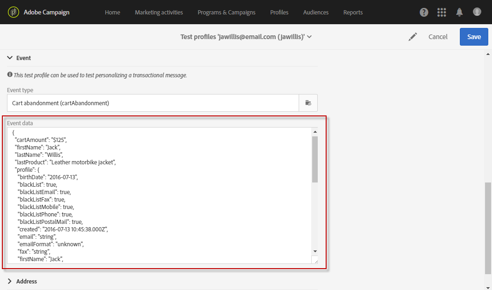

# イベントトランザクションメッセージ{#event-transactional-messages}

イベントをターゲットにしたイベントトランザクションメッセージを送信できます。この種類のトランザクションメッセージには、プロファイル情報が含まれません。配信ターゲットは、イベント自体に含まれるデータによって定義されます。

イベントを作成して公開すると（[この節](../../channels/using/getting-started-with-transactional-msg.md#transactional-messaging-operating-principle)で説明する買い物かごの放棄）、対応するトランザクションメッセージが自動的に作成されます。

設定手順は、[トランザクションメッセージを送信するためのイベントの設定](../../administration/using/configuring-transactional-messaging.md#use-case--configuring-an-event-to-send-a-transactional-message)の節に記載されています。

>[!NOTE]
>
>イベントトランザクションメッセージにはプロファイル情報が含まれないので、（プロファイルとのエンリッチメントの場合でも）疲労ルールとの互換性はありません。[疲労ルール](../../sending/using/fatigue-rules.md#choosing-the-channel)を参照してください。

イベントがトランザクションメッセージの送信をトリガーするには、メッセージをパーソナライズし、テストして公開する必要があります。

## トランザクションメッセージへのアクセス {#accessing-transactional-messages}

作成したトランザクションメッセージにアクセスするには：

1. Click the **[!UICONTROL Adobe Campaign]** logo, in the top left corner.
1. Select **[!UICONTROL Marketing plans]** > **[!UICONTROL Transactional messages]** > **[!UICONTROL Transactional messages]**.

   

1. 編集するには、選択したメッセージをクリックします。

>[!IMPORTANT]
>
>トランザクションメッセージにアクセスするには、**[!UICONTROL Administrators (all units)]**&#x200B;セキュリティグループに属している必要があります。

## トランザクションメッセージのパーソナライズ機能{#personalizing-a-transactional-message}

この例では、イベントの [作成時に定義した3つのフィールドを追加して、トランザクションメッセージをパーソナライズする方法を学習します](../../administration/using/configuring-transactional-messaging.md#use-case--configuring-an-event-to-send-a-transactional-message)。名、最後に問い合わせた製品、買い物かごの総数

To do this, you will [insert a personalization field](../../designing/using/personalization.md#inserting-a-personalization-field) in the message content.

1. 「**[!UICONTROL Content]**」ブロックをクリックして、メッセージの件名と内容を変更します。この例では、画像とテキストを含む任意のテンプレートを選択します。メールコンテンツのテンプレートについて詳しくは、[テンプレートを使用したデザイン](../../designing/using/using-reusable-content.md#designing-templates)を参照してください。

   

1. 件名追加を入力し、必要に応じてメッセージの内容を編集します。

   >[!NOTE]
   >
   >放棄された買い物かごへのリンクは、ユーザーを買い物かごにリダイレクトする外部 URL へのリンクです。このパラメーターは、Adobe Campaign では管理されません。

1. > **[!UICONTROL Context]** > **[!UICONTROL Real-time event]** >を閲覧して、パーソナライゼーションフィールド **[!UICONTROL Event context]** を取得します。名、最後に問い合わせた製品、買い物かごの総数

   

1. メッセージの内容を拡張するには、イベントをリンクしたテーブルからフィールドを選択して追加します。この例では、**[!UICONTROL Title (salutation)]**／**[!UICONTROL Profile]**／**[!UICONTROL Context]** の順に&#x200B;**[!UICONTROL Real-time event]**&#x200B;テーブル内の「**[!UICONTROL Event context]**」フィールドを選択しています。

   

1. 必要なフィールドをすべて挿入します。

   

1. このイベント用に定義したプロファイルを選択して、メッセージをプレビューします。

   メッセージをプレビューする手順について詳しくは、[メッセージのプレビュー](../../sending/using/previewing-messages.md)の節を参照してください。

   

   パーソナライゼーションフィールドがテストプロファイルに入力された情報と一致しているかどうかを確認できます。詳しくは、[トランザクションメッセージでのテストプロファイルの定義](../../channels/using/event-transactional-messages.md#defining-specific-test-profile)を参照してください。

## トランザクションメッセージでの製品リストの使用{#using-product-listings-in-a-transactional-message}

トランザクション用メールコンテンツ内の 1 つ以上のデータコレクションを参照する製品リストを作成できます。例えば、買い物かごの放棄に関するメールでは、ユーザーが Web サイトを離れたときにユーザの買い物かごに含まれていたすべての製品リストを、画像、価格、各製品へのリンクと共に含めることができます。

Learn more in [this video](https://docs.adobe.com/content/help/ja-JP/campaign-learn/campaign-standard-tutorials/designing-content/product-listings-in-transactional-email.html).

>[!IMPORTANT]
>
>製品リストは、[E メールデザイナー](../../designing/using/designing-content-in-adobe-campaign.md#email-designer-interface)インターフェイスを通じてトランザクションのメールメッセージを編集する場合にのみ使用できます。
>
>Adobe Campaign は入れ子になった製品リストをサポートしていません。つまり、別の製品リストに製品を含めることはできません。

次の例では、破棄された商品のリストをトランザクションメッセージに追加する手順を学習します。

### 手順1:製品リストの定義 {#defining-a-product-listing}

トランザクションメッセージ内の製品リストを使用する前に、表示するリストの各製品のリストとフィールドをイベントレベルで定義する必要があります。詳しくは、[データコレクションの定義](../../administration/using/configuring-transactional-messaging.md#defining-data-collections)を参照してください。

1. トランザクションメッセージで、「**[!UICONTROL Content]**」ブロックをクリックしてメールの内容を変更します。
1. 構造コンポーネントをワークスペースにドラッグ＆ドロップします。詳しくは、[メール構造の編集](../../designing/using/designing-from-scratch.md#defining-the-email-structure)を参照してください。

   例えば、1 列の構造コンポーネントを選択し、テキストコンポーネント、画像コンポーネント、ボタンコンポーネントを追加します。詳しくは、[フラグメントとコンポーネントの追加](../../designing/using/designing-from-scratch.md#defining-the-email-structure)を参照してください。

1. 先ほど作成した構造コンポーネントを選択し、コンテキストツールバーの「**[!UICONTROL Enable product listing]**」アイコンをクリックします。

   

   構造コンポーネントはオレンジ色のフレームでハイライト表示され、「**[!UICONTROL Product listing]**」設定は左側のパレットに表示されます。

   

1. コレクションの要素の表示方法を選択します。

   * **[!UICONTROL Row]**：水平方向とは、他の行の下の各要素を意味します。
   * **[!UICONTROL Column]**：垂直方向とは、同じ行で各要素が隣り合っていることを意味します。

   >[!NOTE]
   >
   >この **[!UICONTROL Column]** オプションは、複数列の構造コンポーネント（**[!UICONTROL 2:2 column]**、**[!UICONTROL 3:3 column]** および **[!UICONTROL 4:4 column]**）を使用する場合にのみ使用できます。製品リストを編集する場合は、最初の列にのみ入力します。他の列は考慮されません。構造コンポーネントの選択について詳しくは、[メール構造の編集](../../designing/using/designing-from-scratch.md#defining-the-email-structure)を参照してください。

1. トランザクションメッセージに関連するイベントを設定する際に作成したデータ収集を選択します。これは、**[!UICONTROL Context]**／**[!UICONTROL Real-time event]**／**[!UICONTROL Event context]** ノードの下にあります。

   

   イベントの設定について詳しくは、[データコレクションの定義](../../administration/using/configuring-transactional-messaging.md#defining-data-collections)を参照してください。

1. 「**[!UICONTROL First item]**」ドロップダウンリストを使用して、メールに表示されるリストを開始する要素を選択します。

   例えば、「2」を選択した場合、コレクションの最初のアイテムはメールに表示されません。2 つ目のアイテムは製品リストに開始されます。

1. リストに表示するアイテムの最大数を選択します。

   >[!NOTE]
   >
   >リストの要素を垂直に表示する場合（**[!UICONTROL Column]**）は、選択した構造コンポーネント（2、3、4 列）に応じて、アイテムの最大数が制限されます。構造コンポーネントの選択について詳しくは、[メール構造の編集](../../designing/using/designing-from-scratch.md#defining-the-email-structure)を参照してください。

### 手順2:製品リストへの入力 {#populating-the-product-listing}

トランザクションメールにリンクされたイベントからの製品のリストを表示するには、次の手順に従います。

コレクションの設定時に、イベントおよび関連するフィールドを作成する方法について詳しくは、[データコレクションの定義](../../administration/using/configuring-transactional-messaging.md#defining-data-collections)を参照してください。

1. 挿入したイメージコンポーネントを選択し、「**[!UICONTROL Enable personalization]**」を選択して設定パネルで鉛筆をクリックします。

   

1. 開いた「**[!UICONTROL Image source URL]**」ウィンドウで「**[!UICONTROL Add personalization field]**」を選択します。

   **[!UICONTROL Context]**／**[!UICONTROL Real-time event]**／**[!UICONTROL Event context]** ノードで、作成したコレクションに対応するノード（ここでは **[!UICONTROL Product list]**）を開き、定義した画像フィールド（ここでは **[!UICONTROL Product image]**）を選択します。「**[!UICONTROL Save]**」をクリックします。

   

   選択したパーソナライゼーションフィールドが設定ペインに表示されます。

1. 目的の位置で、コンテキストツールバーから「**[!UICONTROL Insert personalization field]**」を選択します。

   

1. **[!UICONTROL Context]**／**[!UICONTROL Real-time event]**／**[!UICONTROL Event context]** ノードで、作成したコレクションに対応するノード（ここでは **[!UICONTROL Product list]**）を開き、作成したフィールド（ここでは **[!UICONTROL Product name]**）を選択します。「**[!UICONTROL Confirm]**」をクリックします。

   

   選択したパーソナライゼーションフィールドがメールコンテンツ内の目的の位置に表示されます。

1. 価格を挿入する場合と同様におこないます。
1. テキストを選択し、コンテキストツールバーから「**[!UICONTROL Insert link]**」を選択します。

   

1. 開いた「**[!UICONTROL Insert link]**」ウィンドウで「**[!UICONTROL Add personalization field]**」を選択します。

   **[!UICONTROL Context]**／**[!UICONTROL Real-time event]**／**[!UICONTROL Event context]** ノードで、作成したコレクションに対応するノード（ここでは **[!UICONTROL Product list]**）を開き、作成した URL フィールド（ここでは **[!UICONTROL Product URL]**）を選択します。「**[!UICONTROL Save]**」をクリックします。

   >[!IMPORTANT]
   >
   >セキュリティ上の理由から、適切な静的ドメイン名で始まるリンク内にパーソナライゼーションフィールドを挿入してください。

   

   選択したパーソナライゼーションフィールドが設定ペインに表示されます。

1. 製品リストを適用する構造コンポーネントを選択し、デフォルトコンテンツを定義する場合に「**[!UICONTROL Show fallback]**」を選択します。

   

1. 1 つまたは複数のコンテンツコンポーネントをドラッグし、必要に応じて編集します。

   

   顧客が買い物かごに何も入れていない場合など、イベントがトリガーされたときにコレクションが空の場合、フォールバックのコンテンツが表示されます。

1. 設定ペインで、製品リストのスタイルを編集します。詳しくは、[メールスタイルの編集](../../designing/using/styles.md)を参照してください。
1. 関連するトランザクションイベントにリンクされ、収集データを定義したテストプロファイルを使用して、メールをプレビューします。例えば、使用するテストプロファイルの「**[!UICONTROL Event data]**」セクションに次の情報を追加します。

   

   トランザクションメッセージでのテストプロファイルの定義について詳しくは、[この節](../../channels/using/event-transactional-messages.md#defining-specific-test-profile)を参照してください。

## トランザクションメッセージのテスト{#testing-a-transactional-message}

まず、トランザクションメッセージを正しく確認できる特定のテストプロファイルを作成する必要があります。

### 特定のテストプロファイルの定義 {#defining-specific-test-profile}

メッセージをプレビューし、関連配達確認を送信できるように、イベントにリンクするテストプロファイルを定義します。

1. From the transactional message dashboard, click the **[!UICONTROL Create test profile]** button.

   

1. JSON 形式で送信する情報を「**[!UICONTROL Event data used for personalization]**」セクションに指定します。これは、メッセージをプレビューするとき、およびテストプロファイルが配達確認を受け取るときに使用されるコンテンツです。

   

   >[!NOTE]
   >
   >プロファイルテーブルに関連する情報を入力することもできます。詳しくは、[トランザクションメッセージコンテンツのエンリッチメント](../../administration/using/configuring-transactional-messaging.md#enriching-the-transactional-message-content)を参照してください。

1. 作成したテストプロファイルは、トランザクションメッセージで事前に指定されます。 配達確認のターゲットを確認するには、メッセージの「**[!UICONTROL Test profiles]**」ブロックをクリックします。

   

新規テストプロファイルを作成するか、既に「**[!UICONTROL Test profiles]**」メニューにあるテストを使用することもできます。手順は次のとおりです。

1. 左上隅の **[!UICONTROL Adobe Campaign]** ロゴをクリックし、**[!UICONTROL Profiles & audiences]**／**[!UICONTROL Test profiles]** を選択します。
1. セクションで、先ほど作成したイベントを選択し **[!UICONTROL Event]** ます。 この例では、「買い物かごの放棄（EVTcartAbandant）」を選択します。
1. JSON 形式で送信する情報を「**[!UICONTROL Event data]**」テキストボックスに指定します。

   

1. 変更を保存します。
1. 作成したメッセージにアクセスし、更新したテストプロファイルを選択します。

**関連トピック：**

* [テストプロファイルの管理](../../audiences/using/managing-test-profiles.md)
* [オーディエンスの定義](../../audiences/using/creating-audiences.md)

### 配達確認の送信 {#sending-proof}

1つ以上の特定のテストプロファイルを作成し、トランザクションメッセージを保存したら、配達確認を送信してテストできます。

配達確認の送信手順について詳しくは、[配達確認の送信](../../sending/using/sending-proofs.md)の節を参照してください。

## トランザクションメッセージの公開{#publishing-a-transactional-message}

トランザクションメッセージを確認したら、それを公開できます。

これで、「買い物かごの放棄」イベントがトリガーされるとすぐに、受信者のタイトルと姓、買い物かごの URL、最後に参照した製品、または製品のリスト（製品リストを定義した場合）と送信される買い物かごの総数を含むメッセージが自動的に表示されます。

トランザクションメッセージに関するレポートにアクセスするには、「**[!UICONTROL Reports]**」ボタンを使用します。[レポート](../../reporting/using/about-dynamic-reports.md)を参照してください。

### トランザクションメッセージ公開の一時停止{#suspending-a-transactional-message-publication}

トランザクションメッセージに含まれるデータを変更する場合など、「**[!UICONTROL Pause]**」ボタンを使用してメッセージの公開を中止できます。したがって、イベントは処理されず、Adobe Campaign データベースのキューに保持されます。

キューに格納されたイベントは、REST API（[REST API のドキュメント](../../api/using/get-started-apis.md)を参照）または Triggers コアサービス（Triggers コアサービスの使用（[キャンペーンと Experience Cloud Triggers の操作](../../integrating/using/about-adobe-experience-cloud-triggers.md)を参照）を使用している場合、トリガーイベントで定義された期間、保持されます。

「**[!UICONTROL Resume]**」をクリックすると、キューに格納されているすべてのイベント（期限切れでない場合）が処理されます。テンプレートのパブリケーションが停止されている間に実行されたすべての変更が含まれています。

### トランザクションメッセージの非公開{#unpublishing-a-transactional-message}

「**[!UICONTROL Unpublish]**」をクリックすると、トランザクションメッセージの公開をキャンセルするだけでなく、対応するイベントの公開もキャンセルします。これにより、REST API から、以前に作成したイベントに対応するリソースが削除されます。

これで、Web サイトを通じてイベントがトリガーされた場合でも、対応するメッセージは送信されなくなり、データベースには保存されません。

>[!NOTE]
>
>メッセージを再度公開するには、対応するイベント設定に戻り、公開してから、メッセージを公開する必要があります。詳しくは、[トランザクションメッセージの公開](#publishing-a-transactional-message)を参照してください。

一時停止したトランザクションメッセージを非公開にする場合は、再度公開するまで 24 時間待たなければならない場合があります。これは、キューに送信されたすべてのイベントを「**[!UICONTROL Database cleanup]**」ワークフローで消去するためです。

メッセージを一時停止する手順について詳しくは、[トランザクションメッセージ公開の一時停止](#suspending-a-transactional-message-publication)の節を参照してください。

毎日午前 4 時に実行される「**[!UICONTROL Database cleanup]**」ワークフローは、**[!UICONTROL Administration]**／**[!UICONTROL Application settings]**／**[!UICONTROL Workflows]** からアクセスできます。

### トランザクションメッセージの削除{#deleting-a-transactional-message}

トランザクションメッセージが非公開になっている場合、またはトランザクションメッセージがまだ公開されていない場合は、トランザクションメッセージリストから削除できます。手順は次のとおりです。

1. 左上隅の **[!UICONTROL Adobe Campaign]** ロゴをクリックし、**[!UICONTROL Marketing plans]**／**[!UICONTROL Transactional messages]**／**[!UICONTROL Transactional messages]** を選択します。
1. 選択したメッセージにマウスを合わせます。
1. 「**[!UICONTROL Delete element]**」ボタンをクリックします。

ただし、トランザクションメッセージの削除は、次の特定の状況でのみ実行できます。

* トランザクションメッセージのステータスが「**[!UICONTROL Draft]**」であることを確認してください。そうでない場合、削除できません。この「**[!UICONTROL Draft]**」ステータスは、まだ公開されていないメッセージ、または[非公開にする](#unpublishing-a-transactional-message)（または[一時停止](#suspending-a-transactional-message-publication)されていない）メッセージに適用されます。

* **トランザクションメッセージ**：対応するイベントに別のトランザクションメッセージがリンクされている場合を除き、トランザクションメッセージが非公開の場合は、イベントを正常に削除するために、トランザクションメッセージ設定も非公開にする必要があります。詳しくは、[イベントの非公開](../../administration/using/configuring-transactional-messaging.md#unpublishing-an-event)を参照してください。

   >[!IMPORTANT]
   >
   >既に通知を送信したトランザクションメッセージを削除すると、その送信およびトラッキングログも削除されます。

* **標準搭載のイベントテンプレート（内部トランザクションメッセージ）**：内部トランザクションメッセージが、対応する内部イベントに関連付けられている唯一のものである場合、削除できません。別のトランザクションメッセージを作成する場合は、まず複製するか、**[!UICONTROL Resources]**／**[!UICONTROL Templates]**／**[!UICONTROL Transactional message templates]** メニューを使用します。

## トランザクションメッセージの再試行プロセス{#transactional-message-retry-process}

一時的に配信されないトランザクションメッセージは、配信が期限切れになるまで自動再試行が実行される場合があります。配信期間について詳しくは、[有効期間パラメーター](../../administration/using/configuring-email-channel.md#validity-period-parameters)を参照してください。

トランザクションメッセージの送信に失敗した場合は、2 つの再試行システムがあります。

* トランザクションメッセージングレベルでは、トランザクションメッセージが実行配信に割り当てられる前（イベントの受信と配信の準備の間）に、イベントが失敗する可能性があります。[イベント処理の再試行プロセス](#event-processing-retry-process)を参照してください。
* 送信プロセスレベルでは、イベントが実行配信に割り当てられると、一時的なエラーが原因でトランザクションメッセージが失敗する場合があります。詳しくは、[メッセージ送信の再試行プロセス](#message-sending-retry-process)を参照してください。

### イベント処理の再試行プロセス{#event-processing-retry-process}

イベントを実行配信に割り当てられない場合、イベント処理は延期されます。再試行は、新しい実行配信に割り当てられるまで実行されます。

>[!NOTE]
>
>延期されたイベントは、まだ実行配信に割り当てられていないため、トランザクションメッセージ送信ログには表示されません。

例えば、イベントの内容が正しくない、アクセス権やブランディングに問題がある、タイポロジルールの適用時にエラーが検出されたなどの理由で、実行配信にを割り当てることができない場合があります。この場合、メッセージを一時停止し、編集して問題を修正し、再度公開できます。再試行システムは、その後、新しい実行配信に割り当てます。

### メッセージ送信の再試行プロセス{#message-sending-retry-process}

イベントが実行配信に割り当てられると、受信者のメールボックスがいっぱいになった場合など、一時的なエラーが原因でトランザクションメッセージが失敗する場合があります。詳しくは、[一時的な配信エラーの後の再試行](../../sending/using/understanding-delivery-failures.md#retries-after-a-delivery-temporary-failure)を参照してください。

>[!NOTE]
>
>イベントが実行配信に割り当てられると、そのイベントはこの実行配信の送信ログに今回のみ表示されます。The failed deliveries are displayed in the **[!UICONTROL Execution list]** tab of the transactional message sending logs.

### 再試行プロセスの制限 {#limitations}

**ログの更新を送信中**

再試行プロセスでは、新しい実行配信の送信ログは直ちに更新されません（更新はスケジュールされたワークフローを介して実行されます）。つまり、トランザクションイベントが新しい実行配信で処理されている場合でも、メッセージの「**[!UICONTROL Pending]**」ステータスが変わる可能性があります。

**失敗した実行配信**

実行配信を停止することはできません。ただし、現在の実行配信が失敗した場合、新しいイベントを受け取るとすぐに新しいイベントが作成され、すべての新しいイベントがこの新しい実行配信で処理されます。失敗した実行配信で新しいイベントが処理されることはありません。

実行配信に既に割り当てられている一部のイベントが延期され、その実行配信に失敗した場合、再試行システムは、延期されたイベントを新しい実行配信に割り当てません。これは、これらのイベントが失われたことを意味します。
