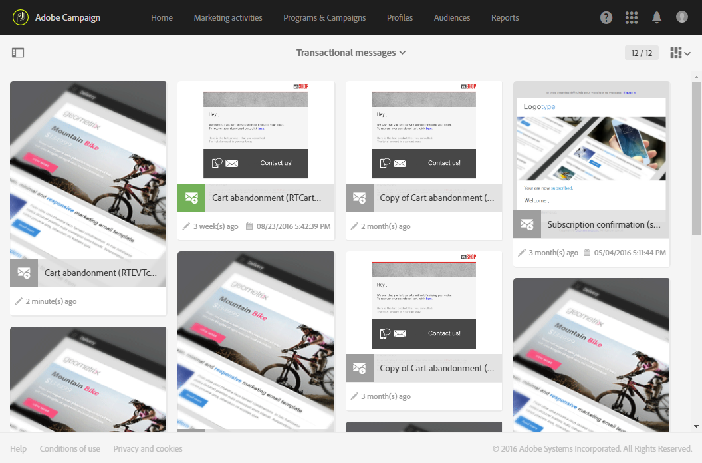
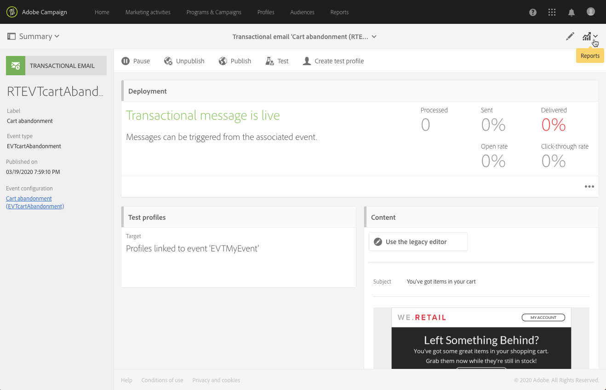

# イベントトランザクションメッセージ{#event-transactional-messages}

イベントを対象としたイベントトランザクションメッセージを送信できます。 この種類のトランザクションメッセージには、プロファイル情報が含まれていません：配信ターゲットは、イベント自体に含まれるデータによって定義されます。

イベントを作成して公開すると(このセクションで説明するカートの破棄 [)、対応するトランザクション](../../channels/using/about-transactional-messaging.md#transactional-messaging-operating-principle)·メッセージが自動的に作成されます。

構成手順は、「トランザクションメッセージ [を送信するイベントの構成」の項で説明します](../../administration/using/configuring-transactional-messaging.md#use-case--configuring-an-event-to-send-a-transactional-message) 。

イベントがトランザクション·メッセージの送信をトリガーするには、メッセージをパーソナライズし、テストして公開する必要があります。

>[!NOTE]
>
>トランザクション·メッセージにアクセスするには、管理権限を持っているか、(mcExec)セキュリ **[!UICONTROL Message Center agents]** ティ·グループに表示されている必要があります。 イベント·トランザクション·メッセージにはプロファイル情報が含まれないため、疲労ルールとの互換性はありません（プロファイルが豊富になっている場合でも）。 疲労ル [ールを参照](../../administration/using/fatigue-rules.md#choosing-the-channel)。

## トランザクション·メッセージでのテスト·プロファイルの定義 {#defining-a-test-profile-in-a-transactional-message}

適応テストプロファイルを定義します。これにより、メッセージをプレビューし、検証を送信して確認できます。

### トランザクション·メッセージ内でのテスト·プロファイルの作成 {#creating-a-test-profile-within-the-transactional-----------message}

1. 作成したメッセージにアクセスするには、左上 **[!UICONTROL Adobe Campaign]** 隅のロゴをクリックし、 &gt; &gt;を選 **[!UICONTROL Marketing plans]** 択 **[!UICONTROL Transactional messages]** します **[!UICONTROL Transactional messages]**。

   

1. イベントにリンクするテストプロファイルを作成します。

   

1. セクションでJSON形式で送信する情報を指定し **[!UICONTROL Event data used for personalization]** ます。 これは、メッセージのプレビュー時とテストプロファイルが証明を受け取ったときに使用されるコンテンツです。

   

   >[!NOTE]
   >
   >縦断テーブルに関する情報を入力することもできます。 「トランザク [ション·メッセージの内容の強化」を参照してくださ](../../administration/using/configuring-transactional-messaging.md#enriching-the-transactional-message-content)い。

1. 作成後、テストプロファイルはトランザクションメッセージで事前に指定されます。 メッセージの **[!UICONTROL Test profiles]** ブロックをクリックして、証明の対象を確認します。

   

### トランザクションメッセージの外部にテストプロファイルを作成する {#creating-a-test-profile-outside-the-transactional-----------message}

また、新しいテストプロファイルを作成したり、メニューに既に存在するテストプロファイルを使用することもで **[!UICONTROL Test profiles]** きます。

1. ロゴをク **[!UICONTROL Adobe Campaign]** リックし、左上隅で「&gt;」を選択 **[!UICONTROL Profiles & audiences]** します **[!UICONTROL Test profiles]**。
1. 選択した **[!UICONTROL Event]** テストプロファイルのページのセクションで、作成したイベントを選択します。 この例では、「Cart abbanding (EVTcartAbandanting)」を選択します。
1. JSON形式で送信する情報をテキストボックスに指 **[!UICONTROL Event data]** 定します。

   

1. 変更を保存します。

作成したメッセージにアクセスし、更新されたテストプロファイルを選択できます。

**関連トピック：**

* [テストプロファイルの管理](../../sending/using/managing-test-profiles-and-sending-proofs.md)
* [対象ユーザーの定義](../../audiences/using/creating-audiences.md)

## トランザクション·メッセージのパーソナライズ {#personalizing-a-transactional-message}

トランザクション·メッセージで個人用設定を設定するには、次の手順に従います。

1. メッセージの **[!UICONTROL Content]** 件名と内容を変更するには、ブロックをクリックします。 この例では、イメージ、スタイルシート、およびHTMLファイルを含むHTMLテンプレートを読み込みます。 HTMLテンプレートのインポートについては、「既存のコンテ [ンツの読み込み」セクションを参照し](../../designing/using/using-existing-content.md) てください。

   

1. メッセージの内容を入力します。 この例では、次の3つの個人用設定フィールドを追加しました。姓、最終案件、合計カート金額 廃車カートへのリンクは、カートにリダイレクトする外部URLへのリンクです。 このパラメータは、Adobe Campaignでは管理されません。

   イベントの作成時に定義したフィールドを追加するには(「イベ [ントの構成](../../administration/using/configuring-transactional-messaging.md#use-case--configuring-an-event-to-send-a-transactional-message)」を参照)、メッセージの内容に個人用設定フィールドを挿入します。 フィールドは、 **[!UICONTROL Transactional event]** &gt;を選択して検索できま **[!UICONTROL Event context]**&#x200B;す。

   

1. メッセージの内容を豊かにするには、イベントをリンクしたテーブルからフィールドを選択して追加します。 この例では、テーブル内のフ **[!UICONTROL Title (salutation)]** ィールドを選択 **[!UICONTROL Profile]** します。

   

   個人用設定フィールドを挿入する手順の詳細については、「個人用設定フィ [ールドの挿入](../../designing/using/personalization.md#inserting-a-personalization-field) 」を参照してください。

   

1. このイベントに対して定義したプロファイルを選択して、メッセージをプレビューします。

   メッセージをプレビューする手順の詳細は、「メッセージのプレビ [ュー](../../sending/using/preparing-the-send.md) 」を参照してください。

   

   個人用設定フィールドが、テストプロファイルに入力した情報と一致するかどうかを確認できます。 詳細は、「トランザクション·メッ [セージでのテスト·プロファイルの定義」を参照してくださ](../../channels/using/event-transactional-messages.md#defining-a-test-profile-in-a-transactional-message)い。

## トランザクションメッセージでの製品一覧の使用 {#using-product-listings-in-a-transactional-message}

トランザクション電子メールのコンテンツ内の1つ以上のデータコレクションを参照する製品リストを作成できます。 例えば、カートの廃棄時のE-メールには、Webサイトを離れたときにユーザーのカートに入っていたすべての製品のリストを、イメージ、価格、各製品へのリンクと共に含めることができます。

>[!CAUTION]
>
>製品一覧は、電子メールデザイナーインターフェイスを使用してトランザクション電子メールメッセージを編集する [場合にのみ](../../designing/using/overview.md#email-designer) 使用できます。

トランザクションメッセージに破棄された製品の一覧を追加するには、次の手順に従います。

また、トランザクション電子メールで製品リストを構成する手順を説明したビデオを一連見ることもできます。 詳細については、このページを参照し [てください](https://helpx.adobe.com/campaign/kt/acs/using/acs-product-listings-in-transactional-emails-feature-video-setup.html)。

>[!NOTE]
>
>Adobe Campaignでは、入れ子になった製品リストはサポートされていません。つまり、別の製品リストに製品リストを含めることはできません。

### 製品リストの定義 {#defining-a-product-listing}

トランザクション·メッセージで製品リストを使用する前に、イベント·レベルで、表示する製品のリストと各製品のフィールドを定義する必要があります。 詳細は、「データ·コレクションの定 [義」を参照してください](../../administration/using/configuring-transactional-messaging.md#defining-data-collections)。

1. トランザクション·メッセージで、ブロックをク **[!UICONTROL Content]** リックして電子メール·コンテンツを変更します。
1. 構造コンポーネントをワークスペースにドラッグ&amp;ドロップします。 詳細については、「電子メール構 [造の編集」を参照してください](../../designing/using/designing-from-scratch.md#defining-the-email-structure)。

   たとえば、1列の構造コンポーネントを選択し、テキストコンポーネント、イメージコンポーネント、およびボタンコンポーネントを追加します。 詳細については、「フラグメントとコンポーネ [ントを追加する」を参照してくださ](../../designing/using/designing-from-scratch.md#defining-the-email-structure)い。

1. 作成した構造コンポーネントを選択し、コンテキストツールバーの **[!UICONTROL Enable product listing]** アイコンをクリックします。

   

   構造コンポーネントがオレンジ色のフレームでハイライトされ、 **[!UICONTROL Product listing]** 左側のパレットに設定が表示されます。

   

1. コレクションの要素の表示方法を選択します。

   * **[!UICONTROL Row]**:横方向。一方の行のもう一方の行の各要素を意味します。
   * **[!UICONTROL Column]**:垂直（同じ行の他の要素の隣にある）
   >[!NOTE]
   >
   >このオ **[!UICONTROL Column]** プションは、複数列構造コンポーネント( 、 、 **[!UICONTROL 2:2 column]**)を使用する場合にのみ **[!UICONTROL 3:3 column]** 使用で **[!UICONTROL 4:4 column]** きます。 製品リストを編集する場合は、最初の列のみを入力します。他の列は考慮されません。 構造コンポーネントの選択の詳細については、「電子メール構 [造の編集」を参照してくださ](../../designing/using/designing-from-scratch.md#defining-the-email-structure)い。

1. トランザクション·メッセージに関連するイベントの構成時に作成したデータ·コレクションを選択します。 &gt; &gt;ノードの下にあ **[!UICONTROL Context]** りま **[!UICONTROL Real-time event]** す **[!UICONTROL Event context]** 。

   

   イベントの構成の詳細は、「データ·コレクションの定 [義」を参照してください](../../administration/using/configuring-transactional-messaging.md#defining-data-collections)。

1. ドロップダウ **[!UICONTROL First item]** ンリストを使用して、電子メールに表示されるリストを開始する要素を選択します。

   たとえば、[2]を選択した場合、コレクションの最初の項目は電子メールに表示されません。 製品リストは2番目の品目から始まります。

1. リストに表示するアイテムの最大数を選択します。

   >[!NOTE]
   >
   >リストの要素を垂直に表示する場合( **[!UICONTROL Column]** )、選択した構造コンポーネント（2、3、4列）に応じて、アイテムの最大数が制限されます。 構造コンポーネントの選択の詳細については、「電子メール構 [造の編集」を参照してくださ](../../designing/using/designing-from-scratch.md#defining-the-email-structure)い。

### 製品リストの作成 {#populating-the-product-listing}

トランザクション電子メールにリンクされたイベントからの製品の一覧を表示するには、次の手順に従います。

イベントの構成時にコレクションと関連するフィールドを作成する方法の詳細は、「データ·コレクションの定 [義」を参照してくださ](../../administration/using/configuring-transactional-messaging.md#defining-data-collections)い。

1. 挿入したイメージコンポーネントを選択し、を選 **[!UICONTROL Enable personalization]** 択して、[設定]ペインで鉛筆をクリックします。

   

1. 開くウ **[!UICONTROL Add personalization field]** ィンドウ **[!UICONTROL Image source URL]** でを選択します。

   &gt; **[!UICONTROL Context]** &gt;ノー **[!UICONTROL Real-time event]** ドで、作成したコレクションに対応するノード(ここ **[!UICONTROL Event context]** )を開き、定義したイメージフィールド(ここ **[!UICONTROL Product list]****[!UICONTROL Product image]** )を選択します。 Click **[!UICONTROL Save]**.

   

   選択した個人用設定フィールドが[設定]ペインに表示されます。

1. 目的の位置で、コンテキストツール **[!UICONTROL Insert personalization field]** バーからを選択します。

   

1. &gt; **[!UICONTROL Context]** &gt;ノー **[!UICONTROL Real-time event]** ドで、作成したコレクションに対応するノード(ここ **[!UICONTROL Event context]** )を開き、作成したフィールド(ここ **[!UICONTROL Product list]****[!UICONTROL Product name]** )を選択します。 Click **[!UICONTROL Confirm]**.

   

   選択した個人用設定フィールドが、電子メールコンテンツ内の目的の位置に表示されます。

1. 同様に価格を挿入します。
1. テキストを選択し、コンテキストツ **[!UICONTROL Insert link]** ールバーから選択します。

   

1. 開くウ **[!UICONTROL Add personalization field]** ィンドウ **[!UICONTROL Insert link]** でを選択します。

   &gt; &gt;ノード **[!UICONTROL Context]** から、作成したコレクションに対応するノード(ここ **[!UICONTROL Real-time event]** )を開き、作成したURLフィールド(ここ **[!UICONTROL Event context]****[!UICONTROL Product list]****[!UICONTROL Product URL]** )を選択します。 Click **[!UICONTROL Save]**.

   >[!CAUTION]
   >
   >セキュリティ上の理由から、適切な静的ドメイン名で始まるリンク内にパーソナライズフィールドを挿入してください。

   

   選択した個人用設定フィールドが[設定]ペインに表示されます。

1. 製品リストが適用される構造コンポーネントを選択し、デフォルトのコンテ **[!UICONTROL Show fallback]** ンツを定義する場合に選択します。

   

1. 1つまたは複数のコンテンツコンポーネントをドラッグし、必要に応じて編集します。

   

   イベントが発生したときにコレクションが空の場合、たとえば、お客様がカートに何も入っていない場合など、フォールバックコンテンツが表示されます。

1. [設定]ペインで、製品リストのスタイルを編集します。 詳細については、「電子メールのスタイルを編 [集する」を参照してくださ](../../designing/using/styles.md)い。
1. 関連するトランザクション·イベントにリンクされ、収集データを定義したテスト·プロファイルを使用して、電子メールをプレビューします。 たとえば、使用するテストプロファイルのセ **[!UICONTROL Event data]** クションに次の情報を追加します。

   

   トランザクション·メッセージでのテスト·プロファイルの定義の詳細は、このセクションを参 [照してくださ](../../channels/using/event-transactional-messages.md#defining-a-test-profile-in-a-transactional-message)い。

## トランザクションメッセージのテスト {#testing-a-transactional-message}

トランザクションメッセージを保存したら、テスト用の証明を送信できます。

証明を送信する手順の詳細は、「証明の送信」 [の項を参照](../../sending/using/managing-test-profiles-and-sending-proofs.md#sending-proofs) 。

## トランザクションメッセージの公開 {#publishing-a-transactional-message}

トランザクションメッセージを確認したら、そのメッセージを公開できます。

「Cart Abbondaint」イベントが発生すると、受信者の役職と姓、カートのURL、最後に参照した製品、または製品リストを定義した場合の製品のリスト、および送信するカートの合計量を含むメッセージが自動的に表示されます。

トランザクション·メッセージに関するレポートにアクセスするには、ボタンを使 **[!UICONTROL Reports]** 用します。 「レポー [ト」を参照](../../reporting/using/about-dynamic-reports.md)。

## トランザクションメッセージパブリケーションの中断 {#suspending-a-transactional-message-publication}

メッセージに含まれるデータを変更するなど、 **[!UICONTROL Pause]** ボタンを使用してトランザクションメッセージの発行を中断できます。 そのため、イベントは処理されなくなり、Adobe Campaignデータベースのキューに保持されます。

キューに入れられたイベントは、REST API( [REST APIのドキュメントを参照)で定義された期間中、またはトリガーコアサービスを使用している場合はトリガーイベント内に保持されます(](https://docs.campaign.adobe.com/doc/standard/en/api/ACS_API.html)Working with Campaign and Experience Cloud Triggers )。

をクリックす **[!UICONTROL Resume]**&#x200B;ると、（期限切れでない場合は）キューに入れられたすべてのイベントが処理されます。 これで、テンプレートパブリケーションが中断されている間に実行されたすべての変更が含まれます。

## トランザクションメッセージの公開を取り消す {#unpublishing-a-transactional-message}

をクリ **[!UICONTROL Unpublish]** ックすると、トランザクションメッセージパブリケーションを取り消すことができますが、対応するイベントのパブリケーションも取り消すことができます。このイベントは、前に作成したイベントに対応するリソースをREST APIから削除します。 これで、Webサイトを通じてイベントがトリガーされても、対応するメッセージは送信されなくなり、データベースに保存されなくなります。

>[!NOTE]
>
>メッセージを再度発行するには、対応するイベント設定に戻り、発行してから、メッセージを発行する必要があります。 詳細については、「トランザクションメッ [セージを発行する」を参照してくださ](../../channels/using/event-transactional-messages.md#publishing-a-transactional-message)い。

一時停止したトランザクションメッセージの発行を取り消す場合は、再発行する前に24時間まで待つ必要がある場合があります。 これは、キューに送信され **[!UICONTROL Database cleanup]** たすべてのイベントをワークフローがクリーンアップするためです。 メッセージを一時停止する手順の詳細については、「トランザクショ [ンメッセージの発行を中断する](../../channels/using/event-transactional-messages.md#suspending-a-transactional-message-publication) 」を参照してください。

毎日 **[!UICONTROL Database cleanup]** 午前4時に実行されるワークフローは、 &gt; **[!UICONTROL Administration]** &gt;からアクセスできま **[!UICONTROL Application settings]****[!UICONTROL Workflows]**&#x200B;す。

## トランザクションメッセージの削除 {#deleting-a-transactional-message}

トランザクションメッセージを選択すると、既に発行済みの場合でも、ボ **[!UICONTROL Delete element]** タンを使用してメッセージを削除できます。 ただし、トランザクション·メッセージの削除は、特定の条件でのみ実行できます。

* **トランザクションメッセージ**:トランザクションメッセージを削除するには、メッセージを一時停止せずに未発行にする必要があります。

   トランザクションメッセージが未公開の場合は、別のトランザクションメッセージが対応するイベントにリンクされていない限り、トランザクションメッセージを正常に削除するために、イベント構成も未公開にする必要があります。 トランザクションメッセージの公開を取り消す方法の詳細については、このセクションを参照して [くださ](../../channels/using/event-transactional-messages.md#unpublishing-a-transactional-message)い。

   >[!CAUTION]
   >
   >既に通知を送信したトランザクションメッセージを削除すると、送信ログと追跡ログも削除されます。

* **既存のイベント·テンプレートからのトランザクション·メッセージ（内部トランザクション·メッセージ）**:内部トランザクションメッセージを削除するには、メッセージを一時停止せずに未発行にする必要があります。

   また、イベント内で唯一のトランザクションメッセージではなく、他のメッセージを対応するイベントにリンクする必要があります。

## トランザクションメッセージの再試行プロセス {#transactional-message-retry-process}

一時的に配信されないトランザクションメッセージは、配信が期限切れになるまで自動再試行が行われる場合があります。 搬送期間の詳細は、「有効期間パラメータ」を [参照してください](../../administration/using/configuring-email-channel.md#validity-period-parameters)。

トランザクション·メッセージの送信に失敗した場合、2つのリトライ·システムが存在します。

* トランザクション·メッセージ·レベルでは、イベントが実行配信に割り当てられる前に、イベント受信と配信準備の間で、トランザクション·メッセージが失敗する場合があります。 「イベント [処理の再試行プロセス」を参照](../../channels/using/event-transactional-messages.md#event-processing-retry-process)。
* 送信プロセスレベルでは、イベントが実行配信に割り当てられると、一時的なエラーが発生してトランザクションメッセージが失敗する場合があります。 「メッセージ [送信の再試行プロセス」を参照](../../channels/using/event-transactional-messages.md#message-sending-retry-process)。

### イベント処理の再試行プロセス {#event-processing-retry-process}

イベントを実行配信に割り当てられない場合、イベント処理は延期されます。 再試行は、新しい実行配信に割り当てられるまで実行されます。

>[!NOTE]
>
>延期されたイベントは、実行配信に割り当てられていないため、ログを送信するトランザクションメッセージには表示されません。

たとえば、イベントの内容が正しくなかったか、アクセス権やブランド化に問題があったか、類型規則の適用時にエラーが検出されたため、実行配信に割り当てられませんでした。 この場合、メッセージを一時停止し、編集して問題を解決し、再度発行できます。 再試行システムは、新しい実行配信に割り当てます。

### メッセージ送信の再試行プロセス {#message-sending-retry-process}

イベントが実行配信に割り当てられると、受信者のメールボックスがいっぱいになった場合など、一時的なエラーが発生してトランザクションメッセージが失敗する場合があります。 詳細については、「配信の一時的な [失敗後の再試行」を参照してください](../../sending/using/understanding-delivery-failures.md#retries-after-a-delivery-temporary-failure)。

>[!NOTE]
>
>イベントが実行配信に割り当てられると、この実行配信の送信ログにそのイベントが表示され、この時点でのみ表示されます。 失敗した配信は、トランザクション·メッ **[!UICONTROL Execution list]** セージのタブに表示されます。

### 制限事項 {#limitations}

**ログの更新を送信しています**

再試行プロセスでは、新しい実行配信の送信ログは直ちに更新されません（更新はスケジュールされたワークフローを通じて実行されます）。 つまり、トランザクション·イベントが新しい実行配 **[!UICONTROL Pending]** 信によって処理された場合でも、メッセージがステータスになる可能性があります。

**実行の配信に失敗しました**

実行の配信を停止することはできません。 ただし、現在の実行配信が失敗した場合、新しいイベントが受け取られるとすぐに新しいイベントが作成され、新しいイベントはすべてこの新しい実行配信によって処理されます。 失敗した実行配信で処理される新しいイベントはありません。

実行配信に割り当て済みのイベントが延期され、その実行配信に失敗した場合、再試行システムは、延期されたイベントを新しい実行配信に割り当てず、これらのイベントは失われます。
