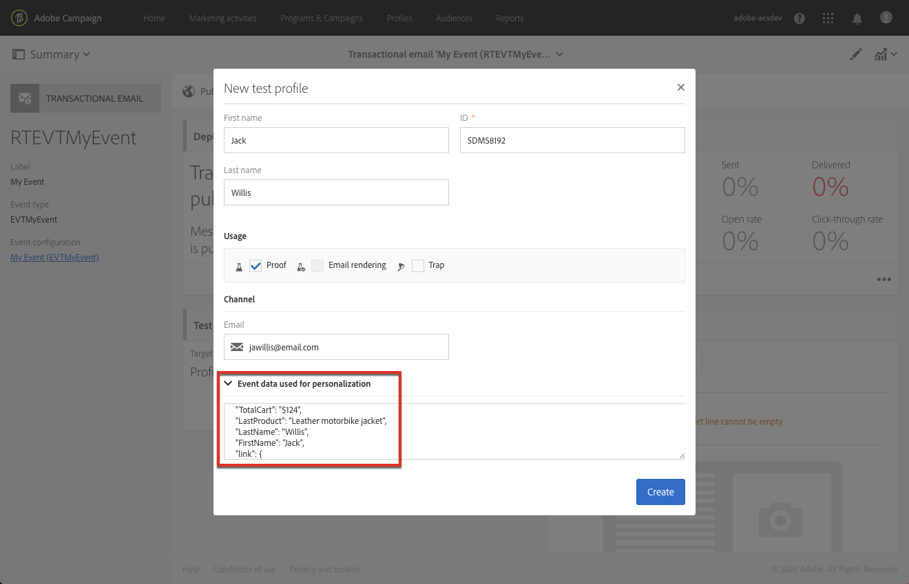

# イベントトランザクションメッセージ{#event-transactional-messages}

イベントをターゲットにしたイベントトランザクションメッセージを送信できます。 この種類のトランザクションメッセージには、次のプロファイル情報は含まれません。配信ターゲットは、イベント自体に含まれるデータによって定義されます。

イベントを作成して公開すると(この節で説明する買い物かごの中断 [)、対応するトランザクション](../../channels/using/about-transactional-messaging.md#transactional-messaging-operating-principle)メッセージが自動的に作成されます。

設定手順は、「トランザクションメッセージを送信 [するためのイベントの設定」の節に記載されていま](../../administration/using/configuring-transactional-messaging.md#use-case--configuring-an-event-to-send-a-transactional-message) す。

イベントがトランザクションメッセージの送信をトリガーするには、メッセージをパーソナライズし、テストして公開する必要があります。

>[!NOTE]
>
>トランザクションメッセージにアクセスするには、セキュリティグループに属してい **[!UICONTROL Administrators (all units)]** る必要があります。
>
>イベントトランザクションメッセージにはプロファイル情報が含まれないので、（プロファイルを含むエンリッチメントの場合でも）疲労ルールとの互換性がありません。 疲労ル [ールを参照](../../administration/using/fatigue-rules.md#choosing-the-channel)。

## トランザクションメッセージでのテストプロファイルの定義 {#defining-a-test-profile-in-a-transactional-message}

メッセージをプレビューし、確認のための証明を送信できる、適合したテストプロファイルを定義します。

### トランザクションメッセージ内でのテストプロファイルの作成 {#creating-a-test-profile-within-the-transactional-----------message}

1. 作成したメッセージにアクセスするには、左上 **[!UICONTROL Adobe Campaign]** 隅のロゴをクリックし、//を **[!UICONTROL Marketing plans]** 選択 **[!UICONTROL Transactional messages]** します **[!UICONTROL Transactional messages]**。

   

1. イベントにリンクするテストプロファイルを作成します。

   

1. JSON形式で送信する情報をセクションに指定し **[!UICONTROL Event data used for personalization]** ます。 これは、メッセージをプレビューする際、およびテストプロファイルが校正を受け取る際に使用されるコンテンツです。

   

   >[!NOTE]
   >
   >また、プロファイルテーブルに関する情報を入力することもできます。 詳しくは、ト [ランザクションメッセージコンテンツの強化を参照してくださ](../../administration/using/configuring-transactional-messaging.md#enriching-the-transactional-message-content)い。

1. 作成後、テストプロファイルはトランザクションメッセージで事前に指定されます。 メッセージ **[!UICONTROL Test profiles]** のブロックをクリックして、校正のターゲットを確認します。

   

### トランザクションメッセージの外部でのテストプロファイルの作成 {#creating-a-test-profile-outside-the-transactional-----------message}

また、新しいテストプロファイルを作成したり、メニューに既に存在するテストプロファイルを使用したりすることも **[!UICONTROL Test profiles]** できます。

1. 左上隅 **[!UICONTROL Adobe Campaign]** のロゴをクリックし、/を選択し **[!UICONTROL Profiles & audiences]** ます **[!UICONTROL Test profiles]**。
1. 選択し **[!UICONTROL Event]** たテストプロファイルのページのセクションで、作成したイベントを選択します。 この例では、「買い物かごの放棄(EVTcartAbaund)」を選択します。
1. JSON形式で送信する情報をテキストボックスに指 **[!UICONTROL Event data]** 定します。

   

1. 変更を保存します。

作成したメッセージにアクセスし、更新したテストプロファイルを選択できます。

**関連トピック：**

* [テストプロファイルの管理](../../sending/using/managing-test-profiles-and-sending-proofs.md)
* [オーディエンスの定義](../../audiences/using/creating-audiences.md)

## トランザクションメッセージのパーソナライズ {#personalizing-a-transactional-message}

トランザクションメッセージでパーソナライゼーションを設定するには、次の手順に従います。

1. ブロックをク **[!UICONTROL Content]** リックして、メッセージの件名と内容を変更します。 この例では、画像とテキストを含む任意のテンプレートを選択します。 電子メールコンテンツテンプレートについて詳しくは、「テンプレートを使用 [したデザイン」を参照してくださ](../../designing/using/using-reusable-content.md#designing-templates)い。

   

1. 件名を追加し、必要に応じてメッセージの内容を編集します。

   >[メモ]
   >
   >放棄された買い物かごへのリンクは、その人を買い物かごにリダイレクトする外部URLへのリンクです。 このパラメーターは、Adobe Campaignでは管理されません。

1. この例では、イベントの作成時に定義した3つのフィールドを追 [加します](../../administration/using/configuring-transactional-messaging.md#use-case--configuring-an-event-to-send-a-transactional-message)。名前、最後に問い合わせた製品、買い物かごの合計金額。 これを行うには、メッセージ [コンテンツにパーソナライゼーション](../../designing/using/personalization.md#inserting-a-personalization-field) フィールドを挿入します。

1. &gt; &gt;の順に選択して、該当するフ **[!UICONTROL Context]** ィールド **[!UICONTROL Real-time event]** を探しま **[!UICONTROL Event context]**&#x200B;す。

   

1. メッセージの内容を拡張するには、イベントをリンクした表からフィールドを選択して追加します。 この例では、&gt; &gt;の順にテー **[!UICONTROL Title (salutation)]** ブル内のフィー **[!UICONTROL Profile]** ルドを **[!UICONTROL Context]** 選択し **[!UICONTROL Real-time event]** ます **[!UICONTROL Event context]**。

   

1. 必要なすべてのフィールドを挿入します。

   

1. このイベント用に定義したプロファイルを選択して、メッセージをプレビューします。

   メッセージをプレビューする手順について詳しくは、「メッセージのプレビ [ュー](../../sending/using/previewing-messages.md) 」を参照してください。

   

   パーソナライゼーションフィールドが、テストプロファイルに入力された情報と一致することを確認できます。 詳しくは、トランザクションメッセージで [のテストプロファイルの定義を参照してください](#defining-a-test-profile-in-a-transactional-message)。

## トランザクションメッセージでの製品リストの使用 {#using-product-listings-in-a-transactional-message}

トランザクション電子メールのコンテンツ内の1つ以上のデータコレクションを参照する製品リストを作成できます。 例えば、買い物かごの放棄の電子メールには、ユーザがWebサイトを離れた際に買い物かごに含まれていたすべての製品のリストを、画像、価格、各製品へのリンクと共に含めることができます。

>[!CAUTION]
>
>製品リストは、 [Email Designerインターフェイスを使用してトランザクション用の電子メールメッセージを編集する場合にのみ使用できます](../../designing/using/overview.md#email-designer) 。

破棄された製品のリストをトランザクションメッセージに追加するには、次の手順に従います。

また、トランザクション用の電子メールで製品リストを設定するために必要な手順を説明する一連のビデオを視聴することもできます。 詳しくは、このページを参照し [てください](https://helpx.adobe.com/campaign/kt/acs/using/acs-product-listings-in-transactional-emails-feature-video-setup.html)。

>[!NOTE]
>
>Adobe Campaignは、製品リストの入れ子をサポートしていません。つまり、別の製品リストの中に製品リストを含めることはできません。

### 製品リストの定義 {#defining-a-product-listing}

トランザクションメッセージで商品リストを使用する前に、イベントレベルで、表示する商品のリストと各商品のフィールドを定義する必要があります。 詳しくは、データコレクションの定 [義を参照してください](../../administration/using/configuring-transactional-messaging.md#defining-data-collections)。

1. トランザクションメッセージで、ブロックをク **[!UICONTROL Content]** リックして電子メールコンテンツを変更します。
1. 構造コンポーネントをワークスペースにドラッグ&amp;ドロップします。 詳しくは、「電子メール構造の [編集」を参照してください](../../designing/using/designing-from-scratch.md#defining-the-email-structure)。

   例えば、1列の構造コンポーネントを選択し、テキストコンポーネント、画像コンポーネント、ボタンコンポーネントを追加します。 詳しくは、フラグメントとコンポーネ [ントの追加を参照してください](../../designing/using/designing-from-scratch.md#defining-the-email-structure)。

1. 先ほど作成した構造コンポーネントを選択し、コンテキストツールバー **[!UICONTROL Enable product listing]** からアイコンをクリックします。

   

   構造コンポーネントがオレンジ色のフレームでハイライトされ、 **[!UICONTROL Product listing]** 左側のパレットに設定が表示されます。

   

1. コレクションの要素の表示方法を選択します。

   * **[!UICONTROL Row]**:horizontallyを指定します。これは、一方の行の他方の行の各要素を意味します。
   * **[!UICONTROL Column]**:垂直方向（同じ行の他の要素の隣にある要素を意味）。
   >[!NOTE]
   >
   >このオ **[!UICONTROL Column]** プションは、複数列の構造コンポーネント（、および）を使用する **[!UICONTROL 2:2 column]**&#x200B;場合に **[!UICONTROL 3:3 column]** のみ使用で **[!UICONTROL 4:4 column]** きます。 製品リストを編集する場合は、最初の列にのみ入力します。他の列は考慮されません。 構造コンポーネントの選択について詳しくは、電子メール構 [造の編集を参照してください](../../designing/using/designing-from-scratch.md#defining-the-email-structure)。

1. トランザクションメッセージに関連するイベントを設定する際に作成したデータ収集を選択します。 これは、 &gt; &gt; **[!UICONTROL Context]** nodeの下にあ **[!UICONTROL Real-time event]** り **[!UICONTROL Event context]** ます。

   

   イベントの設定について詳しくは、データコレクションの [定義を参照してください](../../administration/using/configuring-transactional-messaging.md#defining-data-collections)。

1. ドロップダウ **[!UICONTROL First item]** ンリストを使用して、電子メールに表示されるリストを開始する要素を選択します。

   例えば、「2」を選択した場合、コレクションの最初のアイテムは電子メールに表示されません。 製品リストは2番目の品目から始まります。

1. リストに表示する項目の最大数を選択します。

   >[!NOTE]
   >
   >リストの要素を垂直方向( **[!UICONTROL Column]** )に表示する場合は、選択した構造コンポーネント（2列、3列、4列）に応じて、項目の最大数が制限されます。 構造コンポーネントの選択について詳しくは、電子メール構 [造の編集を参照してください](../../designing/using/designing-from-scratch.md#defining-the-email-structure)。

### 製品リストへの入力 {#populating-the-product-listing}

イベントからの製品のリストをトランザクション電子メールにリンクして表示するには、次の手順に従います。

イベントの設定時にコレクションと関連フィールドを作成する方法について詳しくは、データコレクションの [定義を参照してくださ](../../administration/using/configuring-transactional-messaging.md#defining-data-collections)い。

1. 挿入したイメージコンポーネントを選択し、設定 **[!UICONTROL Enable personalization]** パネルで鉛筆を選択してクリックします。

   

1. 開いた **[!UICONTROL Add personalization field]** ウィンドウ **[!UICONTROL Image source URL]** でを選択します。

   &gt; **[!UICONTROL Context]** &gt; **[!UICONTROL Real-time event]** nodeで、作成したコレクションに対応するノード(ここ **[!UICONTROL Event context]** )を開き、定義した画像フィールド(ここ **[!UICONTROL Product list]****[!UICONTROL Product image]** )を選択します。 Click **[!UICONTROL Save]**.

   

   選択したパーソナライゼーションフィールドが設定ペインに表示されます。

1. 目的の位置で、コンテキストツールバー **[!UICONTROL Insert personalization field]** からを選択します。

   

1. &gt; **[!UICONTROL Context]** &gt; **[!UICONTROL Real-time event]** nodeで、作成したコレクションに対応するノード(ここ **[!UICONTROL Event context]** )を開き、作成したフィールド(ここ **[!UICONTROL Product list]****[!UICONTROL Product name]** )を選択します。 Click **[!UICONTROL Confirm]**.

   

   選択したパーソナライゼーションフィールドが電子メールコンテンツ内の目的の位置に表示されます。

1. 同様にして価格を挿入します。
1. テキストを選択し、コンテキストツ **[!UICONTROL Insert link]** ールバーからを選択します。

   

1. 開いた **[!UICONTROL Add personalization field]** ウィンドウ **[!UICONTROL Insert link]** でを選択します。

   &gt; **[!UICONTROL Context]** &gt; **[!UICONTROL Real-time event]** nodeで、作成したコレクションに対応するノード(ここ **[!UICONTROL Event context]** )を開き、作成したURLフィールド(ここ **[!UICONTROL Product list]****[!UICONTROL Product URL]** )を選択します。 Click **[!UICONTROL Save]**.

   >[!CAUTION]
   >
   >セキュリティ上の理由から、パーソナライゼーションフィールドは、適切な静的ドメイン名で始まるリンク内に挿入してください。

   

   選択したパーソナライゼーションフィールドが設定ペインに表示されます。

1. 製品リストを適用する構造コンポーネントを選択し、デフォルトコンテ **[!UICONTROL Show fallback]** ンツを定義する場合に選択します。

   

1. 1つ以上のコンテンツコンポーネントをドラッグし、必要に応じて編集します。

   

   イベントがトリガーされたときにコレクションが空の場合（例えば、顧客が買い物かごに何も入れていない場合）、フォールバックコンテンツが表示されます。

1. [設定]ペインで、製品リストのスタイルを編集します。 For more on this, see [Editing email styles](../../designing/using/styles.md).
1. 関連するトランザクションイベントにリンクされ、収集データを定義したテストプロファイルを使用して電子メールをプレビューします。 例えば、使用するテストプロファイルのセ **[!UICONTROL Event data]** クションに次の情報を追加します。

   

   トランザクションメッセージでのテストプロファイルの定義について詳しくは、この節を参 [照してくださ](#defining-a-test-profile-in-a-transactional-message)い。

## トランザクションメッセージのテスト {#testing-a-transactional-message}

トランザクションメッセージを保存した後、証明書を送信してテストできるようになりました。

配達確認を送信する手順について詳しくは、「配達確認の送信」 [の節を参照してください](../../sending/using/managing-test-profiles-and-sending-proofs.md#sending-proofs) 。

## トランザクションメッセージの公開 {#publishing-a-transactional-message}

トランザクションメッセージを確認したら、それを公開できます。

現在は、「買い物かごの放棄」イベントがトリガーされるとすぐに、受信者の役職と姓、買い物かごのURL、最後に問い合わされた製品、または製品リストを定義した場合の製品のリスト、送信される合計買い物かごの金額を含むメッセージが自動的に表示されます。

トランザクションメッセージに関するレポートにアクセスするには、ボタンを使 **[!UICONTROL Reports]** 用します。 「レポート [」を参照](../../reporting/using/about-dynamic-reports.md)。

## トランザクションメッセージパブリケーションの中断 {#suspending-a-transactional-message-publication}

例えば、メッセージに含まれるデータを変更するためのボタ **[!UICONTROL Pause]** ンを使用して、トランザクションメッセージの公開を中止できます。 そのため、イベントは処理されず、代わりにAdobe Campaignデータベースのキューに保持されます。

キューに登録されたイベントは、REST API( [REST APIドキュメントを参照](https://final-docs.campaign.adobe.com/doc/standard/en/api/ACS_API.html))で定義された期間中、またはTriggersコアサービスを使用している場合はトリガーイベント(「 [CampaignとExperience Cloud Triggersの操作](../../integrating/using/about-adobe-experience-cloud-triggers.md)」を参照)で保持されます。

をクリックす **[!UICONTROL Resume]**&#x200B;ると、キューに登録されたすべてのイベント（期限切れでない場合）が処理されます。 テンプレートの発行が中断されている間に行われたすべての変更が含まれるようになりました。

## トランザクションメッセージの非公開 {#unpublishing-a-transactional-message}

をクリ **[!UICONTROL Unpublish]** ックすると、トランザクションメッセージの発行をキャンセルできますが、対応するイベントの発行もキャンセルできます。これにより、REST APIから、以前に作成したイベントに対応するリソースが削除されます。 現在は、Webサイトを通じてイベントがトリガーされても、対応するメッセージは送信されず、データベースに保存されません。

>[!NOTE]
>
>メッセージを再度発行するには、対応するイベント設定に戻って発行し、メッセージを発行する必要があります。 詳しくは、トランザクションメッセージの [公開を参照してください](#publishing-a-transactional-message)。

一時停止したトランザクションメッセージの公開を取り消す場合は、再度公開するまでに最大24時間待たなければならない場合があります。 これは、キューに送信されたす **[!UICONTROL Database cleanup]** べてのイベントをワークフローでクリーンアップするためです。 メッセージを一時停止する手順について詳しくは、「トランザクションメッセ [ージの発行の停止](#suspending-a-transactional-message-publication) 」を参照してください。

毎日 **[!UICONTROL Database cleanup]** 午前4時に実行されるワークフローは、 &gt; &gt;からアクセ **[!UICONTROL Administration]** スで **[!UICONTROL Application settings]** きます **[!UICONTROL Workflows]**。

## トランザクションメッセージの削除 {#deleting-a-transactional-message}

トランザクションメッセージを選択すると、既に公開済みであって **[!UICONTROL Delete element]** も、ボタンを使用して削除できます。 ただし、トランザクションメッセージの削除は、次の特定の状況でのみ実行できます。

* **トランザクションメッセージ**:トランザクションメッセージを削除するには、メッセージを一時停止せずに非公開にする必要があります。

   トランザクションメッセージが未公開の場合は、別のトランザクションメッセージが対応するイベントにリンクされていない限り、トランザクションメッセージを正常に削除するために、イベント設定も非公開にする必要があります。 For more information on how to unpublish a transactional message, refer to this [section](#unpublishing-a-transactional-message).

   >[!CAUTION]
   >
   >既に通知を送信したトランザクションメッセージを削除すると、その送信ログと追跡ログも削除されます。

* **標準搭載のイベントテンプレートからのトランザクションメッセージ（内部トランザクションメッセージ）**:内部トランザクションメッセージを削除するには、メッセージを一時停止せずに非公開にする必要があります。

   また、イベント内で唯一のトランザクションメッセージではなく、他のメッセージを対応するイベントにリンクする必要があります。

## トランザクションメッセージの再試行プロセス {#transactional-message-retry-process}

一時的に配信されないトランザクションメッセージは、配信の期限が切れるまで実行される自動再試行の対象となります。 配信期間について詳しくは、有効期間パラメー [ターを参照してください](../../administration/using/configuring-email-channel.md#validity-period-parameters)。

トランザクションメッセージの送信に失敗した場合は、2つの再試行システムがあります。

* トランザクションメッセージングレベルでは、イベントが実行配信に割り当てられる前（つまり、イベント受信と配信準備との間）に、トランザクションメッセージが失敗する可能性があります。 イベント処 [理の再試行プロセスを参照してくださ](#event-processing-retry-process)い。
* 送信プロセスレベルでは、イベントが実行配信に割り当てられると、一時的なエラーが原因でトランザクションメッセージが失敗する場合があります。 詳しくは、メ [ッセージ送信再試行プロセスを参照してくださ](#message-sending-retry-process)い。

### イベント処理の再試行プロセス {#event-processing-retry-process}

イベントを実行配信に割り当てることができない場合、イベント処理は延期されます。 再試行は、新しい実行配信に割り当てられるまで実行されます。

>[!NOTE]
>
>延期されたイベントは、まだ実行配信に割り当てられていないので、トランザクションメッセージ送信ログには表示されません。

例えば、コンテンツが正しくない、アクセス権やブランドに問題があった、タイポロジルールの適用時にエラーが検出されたなどの理由で、イベントを実行配信に割り当てることができませんでした。 この場合、メッセージを一時停止し、編集して問題を修正し、再度公開できます。 再試行システムは、その後、新しい実行配信に割り当てます。

### メッセージ送信再試行プロセス {#message-sending-retry-process}

イベントが実行配信に割り当てられると、受信者のメールボックスがいっぱいになった場合など、一時的なエラーが原因でトランザクションメッセージが失敗する可能性があります。 詳しくは、配信の一時的な失敗後 [の再試行を参照してください](../../sending/using/understanding-delivery-failures.md#retries-after-a-delivery-temporary-failure)。

>[!NOTE]
>
>実行配信にイベントが割り当てられると、そのイベントは、この実行配信の送信ログに表示され、現時点でのみ表示されます。 失敗した配信は、トランザクションメッ **[!UICONTROL Execution list]** セージのタブに表示されます。

### 制限事項 {#limitations}

**ログの更新を送信しています**

再試行プロセスでは、新しい実行配信の送信ログは直ちに更新されません（更新はスケジュールされたワークフローを通じて実行されます）。 つまり、トランザクションイベントが新しい実行配信で **[!UICONTROL Pending]** 処理されている場合でも、メッセージがステータスになる可能性があります。

**配信の失敗**

実行配信を停止することはできません。 ただし、現在の実行配信が失敗した場合、新しいイベントを受け取るとすぐに新しいイベントが作成され、新しいイベントはすべてこの新しい実行配信で処理されます。 失敗した実行配信によって新しいイベントは処理されません。

実行配信に既に割り当てられている一部のイベントが延期され、その実行配信が失敗した場合、再試行システムは、延期されたイベントを新しい実行配信に割り当てません。つまり、これらのイベントは失われます。
