# フォローアップメッセージ {#follow-up-messages}

フォローアップメッセージとは、ワークフローで使用できる、事前定義されたマーケティング配信テンプレートです。このテンプレートを使用して、特定のトランザクションメッセージの受信者に別のコミュニケーションを送信できます。

「[&#x200B; トランザクションメッセージの操作原則](../../channels/using/getting-started-with-transactional-msg.md#transactional-messaging-operating-principle)」の節で説明した例を再利用してみましょう。カート放棄メールは、カートに商品を追加したものの、購入を完了せずにサイトを離れたweb サイトのユーザーに送信されます。

カート放棄通知を受け取ったものの、3日後に開封しなかったすべての顧客に、リマインダーを送信する必要があります。 最初のメールで使用したのと同じデータにもとづくフォローアップメッセージが送信されます。

## フォローアップメッセージを送信するためのイベントの設定 {#configuring-an-event-to-send-a-follow-up-message}

フォローアップメッセージを送信するには、まず、既に受信したトランザクションメッセージに対応するイベントを設定する必要があります。

1. 作成したのと同じイベント設定を使用して、イベントトランザクションメッセージを送信します。 [&#x200B; トランザクションイベントの設定](../../channels/using/configuring-transactional-event.md)を参照してください。
1. イベントを設定する際は、イベントを公開する前に&#x200B;**[!UICONTROL Create follow-up delivery template for this event]** ボックスをオンにします。

   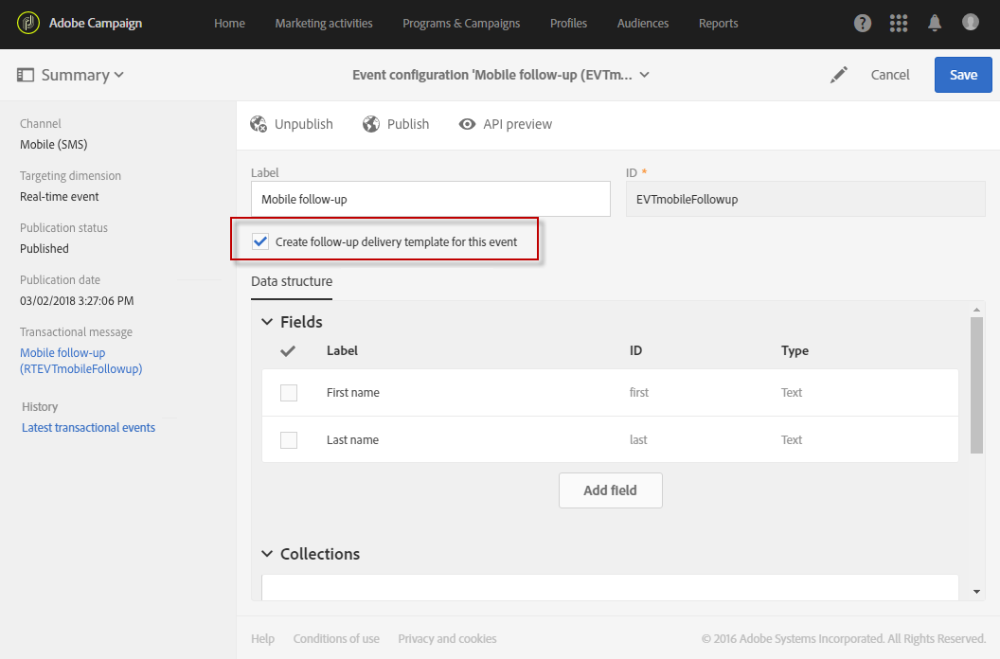

1. [&#x200B; イベントをプレビューして公開](../../channels/using/publishing-transactional-event.md#previewing-and-publishing-the-event)。

イベントが公開されると、新しいイベントにリンクされたトランザクションメッセージとフォローアップ配信テンプレートが自動的に作成されます。 フォローアップメッセージを送信する手順について詳しくは、[この節](#sending-a-follow-up-message)を参照してください。

## フォローアップメッセージへのアクセス {#accessing-the-follow-up-messages}

ワークフロー内のイベントを処理するには、配信テンプレートが必要です。 ただし、イベントを公開する場合、作成された[&#x200B; トランザクションメッセージ &#x200B;](../../channels/using/editing-transactional-message.md)をテンプレートとして使用することはできません。 そのため、このイベントタイプをサポートし、ワークフローのテンプレートとして使用できるように設計された、特定のフォローアップ配信テンプレートを作成する必要があります。

このテンプレートにアクセスするには：

1. 左上隅の&#x200B;**Adobe** ロゴをクリックします。
1. **[!UICONTROL Resources]** > **[!UICONTROL Templates]** > **[!UICONTROL Delivery templates]**&#x200B;を選択します。
1. 左側のペインの「**[!UICONTROL Follow-up messages]**」ボックスをオンにします。

   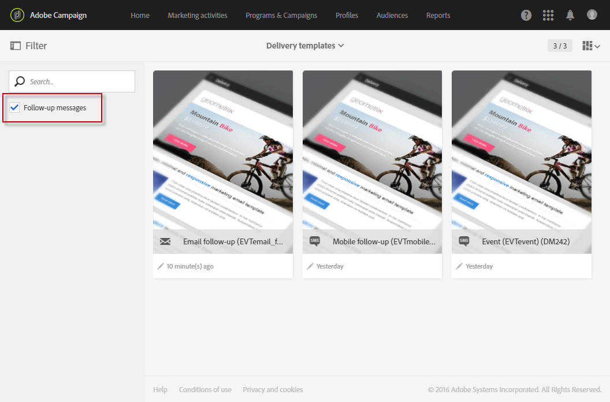

フォローアップメッセージのみが表示されます。

>[!IMPORTANT]
>
>トランザクション メッセージにアクセスして編集できるのは、[管理](../../administration/using/users-management.md#functional-administrators)の役割を持つユーザーのみです。

## フォローアップメッセージの送信 {#sending-a-follow-up-message}

フォローアップ配信テンプレートを作成したら、ワークフローで使用してフォローアップメッセージを送信できます。

<!--You need to set up a workflow targeting the event corresponding to the transactional message that was already received.-->

1. マーケティングアクティビティリストにアクセスし、新しいワークフローを作成します。

   [&#x200B; ワークフローの作成](../../automating/using/building-a-workflow.md#creating-a-workflow)を参照してください。

1. ワークフローに&#x200B;**[!UICONTROL Scheduler]** アクティビティをドラッグ&amp;ドロップして開きます。 実行頻度を1日1回に設定します。

   スケジューラーアクティビティは、[&#x200B; スケジューラー](../../automating/using/scheduler.md) セクションに表示されます。

1. ワークフローに&#x200B;**[!UICONTROL Query]** アクティビティをドラッグ&amp;ドロップして開きます。

   クエリ アクティビティは、[&#x200B; クエリ &#x200B;](../../automating/using/query.md) セクションに表示されます。

1. プロファイルリソース以外のリソースでクエリを実行するには、アクティビティの&#x200B;**[!UICONTROL Properties]** タブに移動し、**[!UICONTROL Resource]** ドロップダウンリストをクリックします。

   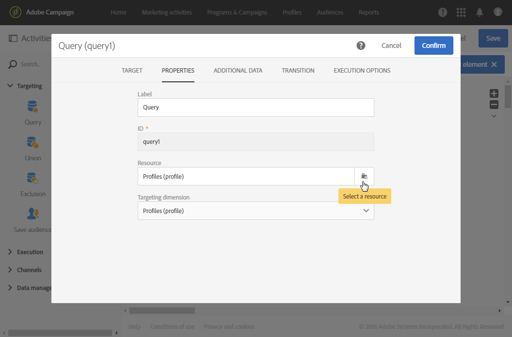

   >[!NOTE]
   >
   >デフォルトでは、このアクティビティはプロファイルを検索するように事前設定されています。

1. ターゲットにするイベントを選択して、このイベントのデータのみにアクセスできるようにします。

   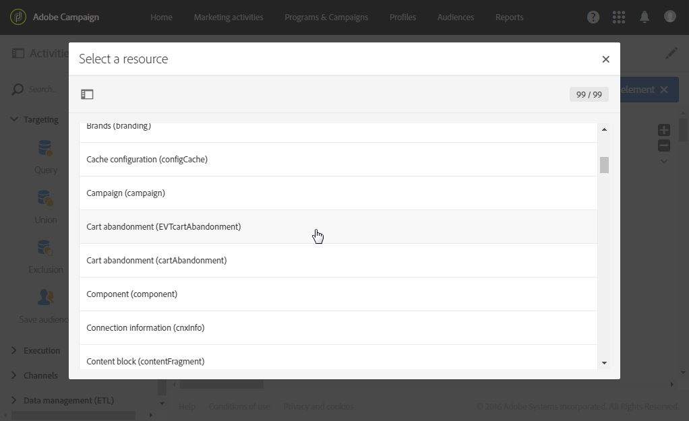

1. アクティビティの&#x200B;**[!UICONTROL Target]** タブに移動し、パレットから&#x200B;**[!UICONTROL Delivery logs (logs)]**&#x200B;要素をワークスペースにドラッグ&amp;ドロップします。

   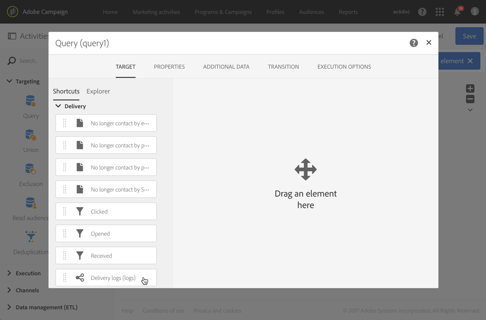

   **[!UICONTROL Exists]**&#x200B;を選択して、メールを受信したすべての顧客をターゲットにします。

   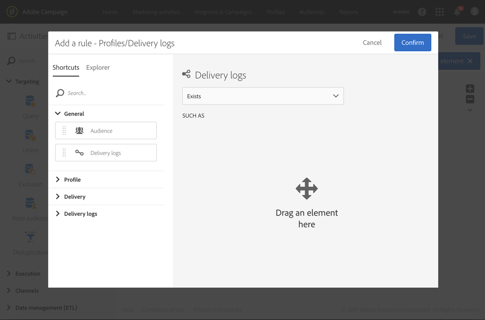

1. パレットからワークスペースに&#x200B;**[!UICONTROL Tracking logs (tracking)]**&#x200B;要素を移動し、**[!UICONTROL Does not exist]**&#x200B;を選択して、電子メールを開いていないすべての顧客をターゲットにします。

   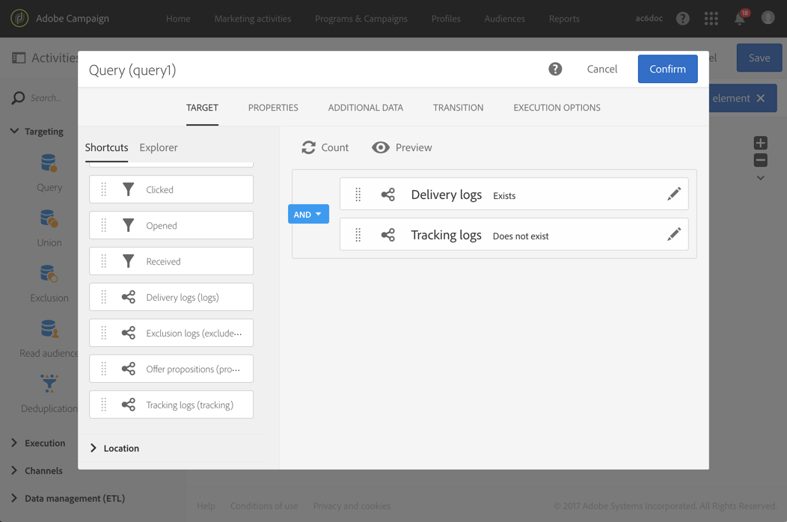

1. ターゲットとするイベント（**買い物かごの放棄**）をパレットからワークスペースにドラッグ&amp;ドロップします。 そして、3日前に送信されたすべてのメッセージをターゲットにするルールを定義します。

   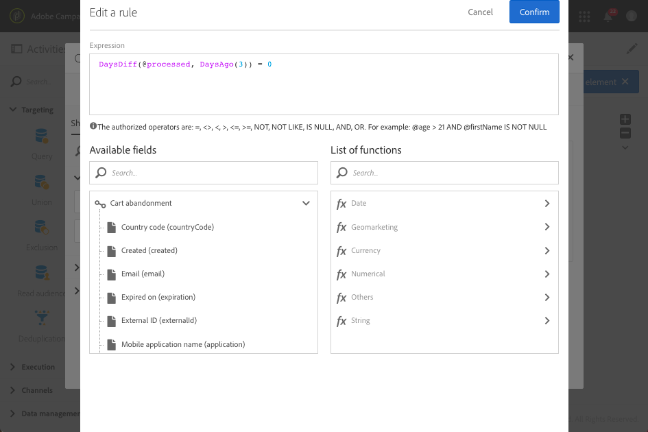

   つまり、ワークフローの実行の3日前にトランザクションメッセージを受信し、まだ開いていないすべての受信者がターゲットになります。

   クエリを保存するには、**[!UICONTROL Confirm]**&#x200B;をクリックします。

1. **メール配信** アクティビティをワークフローにドラッグ&amp;ドロップします。

   メール配信アクティビティは、[&#x200B; メール配信](../../automating/using/email-delivery.md) セクションに表示されます。

   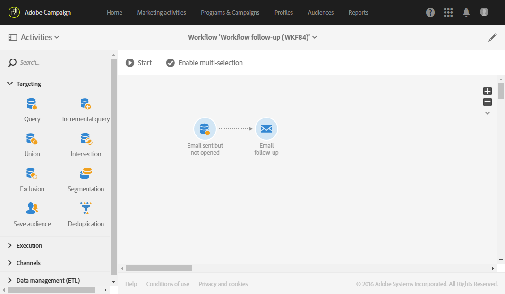

   [SMS配信](../../automating/using/sms-delivery.md)または[&#x200B; プッシュ通知配信](../../automating/using/push-notification-delivery.md) アクティビティを使用することもできます。 この場合、イベント設定を作成する際は、必ず&#x200B;**[!UICONTROL Mobile (SMS)]**&#x200B;または&#x200B;**[!UICONTROL Mobile application]** チャネルを選択してください。 詳しくは、[イベントの作成](../../channels/using/configuring-transactional-event.md#creating-an-event)を参照してください。

1. **メール配信** アクティビティを開きます。 作成ウィザードで、**[!UICONTROL Follow-up messages]** ボックスにチェックを入れ、イベントの公開後に作成されたフォローアップ配信テンプレートを選択します。

   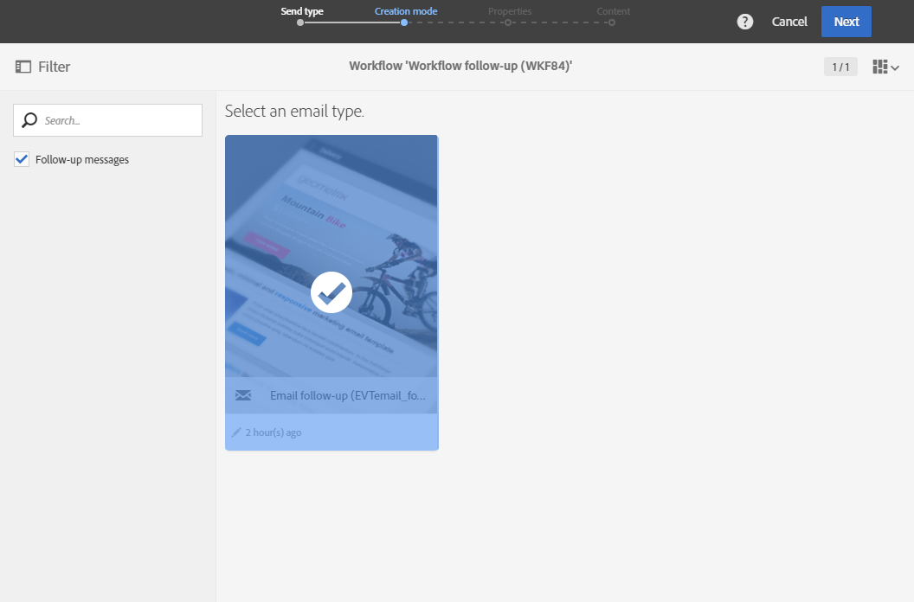

1. フォローアップメッセージのコンテンツでは、パーソナライゼーションフィールドを追加することで、イベントのコンテンツを活用できます。

   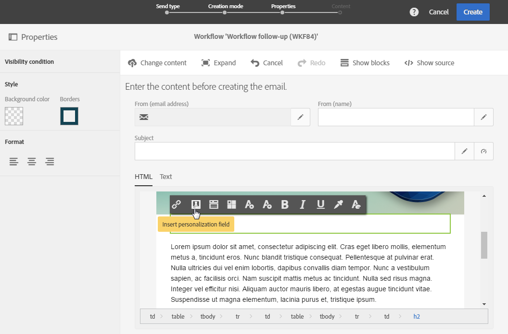

1. イベントの作成時に定義したフィールドを検索するには、**[!UICONTROL Context]** > **[!UICONTROL Real-time event]** > **[!UICONTROL Event context]**&#x200B;を選択します。 [&#x200B; トランザクションメッセージのパーソナライズ &#x200B;](../../channels/using/editing-transactional-message.md#personalizing-a-transactional-message)を参照してください。

   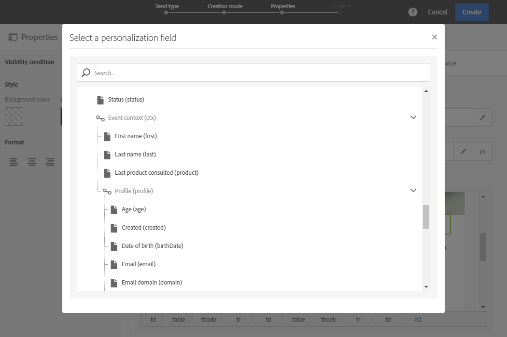

   つまり、イベントが初めて送信されたときに使用された、エンリッチメントデータを含む同じコンテンツを活用して、パーソナライズされたフレンドリーなリマインダーを作成できます。

1. アクティビティを保存し、ワークフローを開始します。

ワークフローを開始すると、3日前にカート放棄通知を受け取ったものの、開封しなかったすべての顧客に、同じデータに基づくフォローアップメッセージが送信されます。

>[!NOTE]
>
>イベント設定の作成時に&#x200B;**[!UICONTROL Profile]** ターゲティングディメンションを選択した場合、フォローアップメッセージはAdobe Campaign マーケティングデータベースも活用します。 [プロファイルトランザクションメッセージ](../../channels/using/editing-transactional-message.md#profile-transactional-message-specificities)を参照してください。
