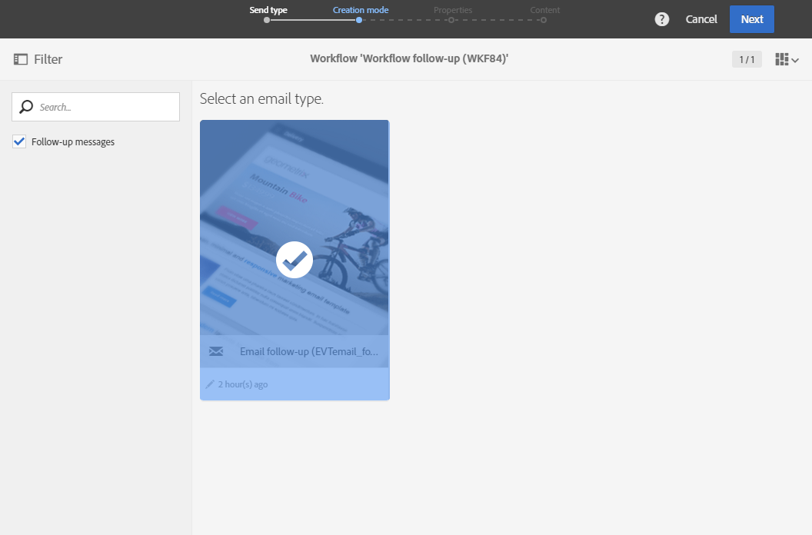

# フォローアップメッセージ{#follow-up-messages}

特定のトランザクションメッセージを受け取った顧客に、フォローアップメッセージを送信できます。 これを行うには、対応するイベントをターゲットにしたワークフローを設定する必要があります。

トランザクションメッセージングの動作原則の節で説明し [た例を再利用します](../../channels/using/about-transactional-messaging.md#transactional-messaging-operating-principle) 。買い物かごの放棄の電子メールは、商品を買い物かごに追加したが、購入を経験せずにサイトを離れたWebサイトユーザに送信されます。

買い物かごの放棄通知を受け取ったが、3日後に開かなかった顧客全員に、わかりやすいリマインダーを送信したい。

その後、関係する各顧客に、最初に送信された電子メールで使用されたのと同じデータに基づくフォローアップメッセージが届きます。

## フォローアップメッセージへのアクセス {#accessing-the-follow-up-messages}

イベントを作成して発行すると(上の例に従って買い物かごの中断が発生し [ました](../../channels/using/about-transactional-messaging.md#transactional-messaging-operating-principle) )、対応するトランザクションメッセージとフォローアップメッセージが自動的に作成されます。

設定手順は、「イベントを設定し [てフォローアップメッセージを送信する」の節に示されます](../../administration/using/configuring-transactional-messaging.md#use-case--configuring-an-event-to-send-a-transactional-message) 。

ワークフロー内のイベントを処理するには、配信テンプレートが必要です。 ただし、イベントを公開する場合、作成され [たトランザクション](../../channels/using/event-transactional-messages.md) ・メッセージをテンプレートとして使用することはできません。 したがって、このイベントタイプをサポートし、ワークフローでテンプレートとして使用するために、特定のフォローアップ配信テンプレートを作成する必要があります。

このテンプレートにアクセスするには：

1. 左上隅 **[!UICONTROL Adobe Campaign]** にあるロゴをクリックします。
1. Select **[!UICONTROL Resources]** &gt; **[!UICONTROL Templates]** &gt; **[!UICONTROL Delivery templates]**.
1. 左側のペイン **[!UICONTROL Follow-up messages]** のチェックボックスをオンにします。

   

フォローアップメッセージのみが表示されます。

>[!NOTE]
>
>トランザクションメッセージにアクセスするには、管理権限を持っているか、(mcExec)セキュリティグル **[!UICONTROL Message Center agents]** ープに表示されている必要があります。

## フォローアップメッセージの送信 {#sending-a-follow-up-message}

フォローアップ配信テンプレートを作成したら、それをワークフローで使用して、フォローアップメッセージを送信できます。

1. マーケティングアクティビティリストにアクセスし、新しいワークフローを作成します。

   詳しくは、 [ワークフローの作成を参照してください](../../automating/using/building-a-workflow.md#creating-a-workflow)。

1. Drag and drop a **[!UICONTROL Scheduler]** activity into your workflow and open it. 実行頻度を1日に1回に設定します。

   スケジューラーアクティビティは「スケジューラー  」セクションに表示されます。

1. Drag and drop a **[!UICONTROL Query]** activity into your workflow and open it.

   Queryアクティビティが「 [Query](../../automating/using/query.md) 」セクションに表示されます。

1. プロファイルリソース以外のリソースに対してクエリーを実行するには、アクティビティのタブに移動し、ド **[!UICONTROL Properties]** ロップダウンリスト **[!UICONTROL Resource]** をクリックします。

   

   >[!NOTE]
   >
   >デフォルトでは、アクティビティはプロファイルを検索するように事前設定されています。

1. このイベントのデータにのみアクセスできるように、ターゲットにするイベントを選択します。

   

1. アクティビティのタブに移動し、セ **[!UICONTROL Target]** クションから要素をワー **[!UICONTROL Delivery logs (logs)]** クスペースにドラ **[!UICONTROL Email]** ッグ&amp;ドロップします。

   

   電子メ **[!UICONTROL Exists]** ールを受け取ったすべての顧客をターゲットにする場合に選択します。

   

1. 要素をパレ **[!UICONTROL Tracking logs (tracking)]** ットからワークスペースに移動し、電子メールを開 **[!UICONTROL Does not exist]** かなかった顧客をすべてターゲットにするように選択します。

   

1. ターゲットにするイベント(この例では&#x200B;**買い物かごの中断** )をセクションからワークスペース **[!UICONTROL Email]** にドラッグ&amp;ドロップします。 次に、3日前に送信されたすべてのメッセージをターゲットにするルールを定義します。

   

   つまり、ワークフローの実行の3日前にトランザクションメッセージを受信し、まだ開いていない受信者はすべてターゲットになります。

   をクリック **[!UICONTROL Confirm]** して、クエリを保存します。

1. 電子メール配信アクティビティ **をワークフロー** にドラッグ&amp;ドロップします。

   電子メール配信アクティビティは、「電子メール配信」セク [ションに表示され](../../automating/using/email-delivery.md) ます。

   

   また、 [SMS配信またはモバイルアプリ配信](../../automating/using/sms-delivery.md) アクティビティ [も使用できます](../../automating/using/push-notification-delivery.md) 。 この場合、イベント設定を作成する際に、または **[!UICONTROL Mobile (SMS)]** チャネル **[!UICONTROL Mobile application]** を選択していることを確認します。 イベント [の作成を参照してください](../../administration/using/configuring-transactional-messaging.md#creating-an-event)。

1. Open the **Email delivery** activity. 作成ウィザードで、このボックスにチェック **[!UICONTROL Follow-up messages]** を付け、イベントの発行後に作成されたフォローアップ配信テンプレートを選択します。

   

1. フォローアップメッセージのコンテンツでは、パーソナライゼーションフィールドを追加することで、イベントのコンテンツを利用できます。

   

1. イベントの作成時に定義したフィールドを探すには、//を **[!UICONTROL Context]** 選択 **[!UICONTROL Real-time event]** しま **[!UICONTROL Event context]**&#x200B;す。 詳しくは、ト [ランザクションメッセージのパーソナライズを参照してくださ](../../channels/using/event-transactional-messages.md#personalizing-a-transactional-message)い。

   

   つまり、イベントの初回送信時に使用したリッチデータを含む同じコンテンツを利用して、パーソナライズされたわかりやすいリマインダーを作成できます。

1. アクティビティを保存し、ワークフローを開始します。

ワークフローが開始されると、3日前に買い物かごの中断通知を受け取ったが開かなかったすべての顧客に、同じデータに基づくフォローアップメッセージが届きます。

>[!NOTE]
>
>イベント設定の作成時にタ **[!UICONTROL Profile]** ーゲティングディメンションを選択した場合、フォローアップメッセージでもAdobe Campaignマーケティングデータベースが利用されます。 詳しくは、プロフ [ァイルトランザクションメッセージを参照してくださ](../../channels/using/profile-transactional-messages.md)い。

