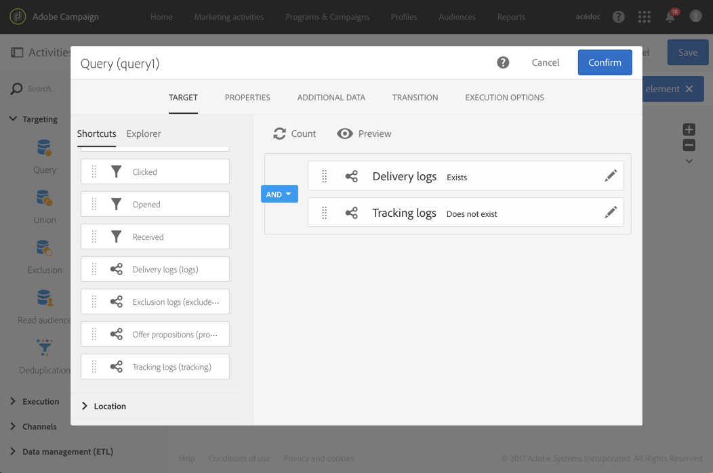

# フォローアップメッセージ {#follow-up-messages}

フォローアップメッセージは、事前に定義されたマーケティング配信テンプレートで、ワークフロー内で使用して、特定のトランザクションメッセージの受信者に別のコミュニケーションを送信できます。

次に示す例を再利用します： [トランザクションメッセージの動作原則](../../channels/using/getting-started-with-transactional-msg.md#transactional-messaging-operating-principle) セクション：買い物かごの放棄に関する電子メールが、買い物かごに製品を追加したが、購入を経ずにサイトを離れたユーザーに送信されます。

買い物かごの放棄通知を受け取ったが 3 日後に開封しなかったすべての顧客に、わかりやすいリマインダーを送信する場合。 受信者には、最初に送信された E メールと同じデータに基づいて、フォローアップメッセージが届きます。

## フォローアップメッセージを送信するためのイベントの設定 {#configuring-an-event-to-send-a-follow-up-message}

フォローアップメッセージを送信するには、まず、既に受信したトランザクションメッセージに対応するイベントを適切に設定する必要があります。

1. イベントトランザクションメッセージを送信するために作成したのと同じイベント設定を使用します。 詳しくは、 [トランザクションイベントの設定](../../channels/using/configuring-transactional-event.md).
1. イベントを設定する際に、 **[!UICONTROL Create follow-up delivery template for this event]** ボックスを使用して、イベントを公開する必要があります。

   

1. [イベントをプレビューして公開します。](../../channels/using/publishing-transactional-event.md#previewing-and-publishing-the-event).

イベントが公開されると、新しいイベントにリンクされたトランザクションメッセージとフォローアップ配信テンプレートが自動的に作成されます。 フォローアップメッセージを送信する手順について詳しくは、 [この節](#sending-a-follow-up-message).

## フォローアップメッセージへのアクセス {#accessing-the-follow-up-messages}

ワークフローでイベントを処理するには、配信テンプレートが必要です。 ただし、イベントを公開する際に、 [トランザクションメッセージ](../../channels/using/editing-transactional-message.md) 作成されたはテンプレートとして使用できません。 したがって、このイベントタイプをサポートし、ワークフローのテンプレートとして使用するように設計された、特定のフォローアップ配信テンプレートを作成する必要があります。

このテンプレートにアクセスするには：

1. 次をクリック： **Adobe** ロゴ（左上隅）
1. 選択 **[!UICONTROL Resources]** > **[!UICONTROL Templates]** > **[!UICONTROL Delivery templates]**.
1. 次を確認します。 **[!UICONTROL Follow-up messages]** 」ボックスを左側のウィンドウに表示します。

   

フォローアップメッセージのみが表示されます。

>[!IMPORTANT]
>
>次の条件を満たすユーザーのみ： [管理](../../administration/using/users-management.md#functional-administrators) ロールは、トランザクションメッセージにアクセスして編集できます。

## フォローアップメッセージの送信 {#sending-a-follow-up-message}

フォローアップ配信テンプレートを作成したら、それをワークフローで使用して、フォローアップメッセージを送信できます。

<!--You need to set up a workflow targeting the event corresponding to the transactional message that was already received.-->

1. マーケティングアクティビティリストにアクセスし、新しいワークフローを作成します。

   詳しくは、 [ワークフローの作成](../../automating/using/building-a-workflow.md#creating-a-workflow).

1. ドラッグ&amp;ドロップ **[!UICONTROL Scheduler]** アクティビティをワークフローに追加して開きます。 実行頻度を 1 日に 1 回に設定します。

   スケジューラーアクティビティについて詳しくは、 [スケジューラ](../../automating/using/scheduler.md) 」セクションに入力します。

1. ドラッグ&amp;ドロップ **[!UICONTROL Query]** アクティビティをワークフローに追加して開きます。

   クエリアクティビティについて詳しくは、 [クエリ](../../automating/using/query.md) 」セクションに入力します。

1. プロファイルリソース以外のリソースに対してクエリを実行するには、アクティビティの **[!UICONTROL Properties]** 」タブで、 **[!UICONTROL Resource]** 」ドロップダウンリストから選択できます。

   

   >[!NOTE]
   >
   >デフォルトでは、このアクティビティはプロファイルを検索するように事前設定されています。

1. このイベントのデータにのみアクセスできるように、ターゲットにするイベントを選択します。

   

1. アクティビティの **[!UICONTROL Target]** 「 」タブをクリックし、「 」をドラッグ&amp;ドロップします。 **[!UICONTROL Delivery logs (logs)]** 要素をパレットからワークスペースに追加します。

   

   選択 **[!UICONTROL Exists]** をクリックして、E メールを受信したすべての顧客をターゲットにします。

   

1. を **[!UICONTROL Tracking logs (tracking)]** 要素をパレットからワークスペースに移動し、「 」を選択します。 **[!UICONTROL Does not exist]** をクリックして、e メールを開封しなかったすべての顧客をターゲットにします。

   

1. ターゲットとするイベント (**買い物かごの放棄** （この例では）パレットからワークスペースに移動します。 次に、3 日前に送信されたすべてのメッセージをターゲットにするルールを定義します。

   

   つまり、ワークフローの実行の 3 日前にトランザクションメッセージを受け取り、まだ開いていないすべての受信者がターゲットになります。

   クリック **[!UICONTROL Confirm]** をクリックしてクエリを保存します。

1. ドラッグ&amp;ドロップ **E メール配信** アクティビティをワークフローに追加します。

   E メール配信アクティビティについて詳しくは、 [E メール配信](../../automating/using/email-delivery.md) 」セクションに入力します。

   

   また、 [SMS 配信](../../automating/using/sms-delivery.md) または [プッシュ通知配信](../../automating/using/push-notification-delivery.md) アクティビティ。 この場合、必ず **[!UICONTROL Mobile (SMS)]** または **[!UICONTROL Mobile application]** チャネルでイベント設定を作成する際に使用します。 詳しくは、[イベントの作成](../../channels/using/configuring-transactional-event.md#creating-an-event)を参照してください。

1. を開きます。 **E メール配信** アクティビティ。 作成ウィザードで、 **[!UICONTROL Follow-up messages]** 」ボックスを選択し、イベントの公開後に作成したフォローアップ配信テンプレートを選択します。

   

1. フォローアップメッセージのコンテンツでは、パーソナライゼーションフィールドを追加して、イベントのコンテンツを活用できます。

   

1. イベントを作成する際に定義したフィールドを見つけるには、「 **[!UICONTROL Context]** > **[!UICONTROL Real-time event]** > **[!UICONTROL Event context]**. 詳しくは、 [トランザクションメッセージのパーソナライズ](../../channels/using/editing-transactional-message.md#personalizing-a-transactional-message).

   

   つまり、イベントの初回送信時に使用したエンリッチメントされたデータを含む同じコンテンツを活用して、パーソナライズされたわかりやすいリマインダーを作成できます。

1. アクティビティを保存し、ワークフローを開始します。

ワークフローが開始されると、3 日前に買い物かごの放棄通知を受け取ったが開いていないすべての顧客に、同じデータに基づくフォローアップメッセージが表示されます。

>[!NOTE]
>
>選択した **[!UICONTROL Profile]** ターゲティングディメンションは、イベント設定を作成する際に、フォローアップメッセージとしてAdobe Campaignマーケティングデータベースも利用します。 [プロファイルトランザクションメッセージ](../../channels/using/editing-transactional-message.md#profile-transactional-message-specificities)を参照してください。
