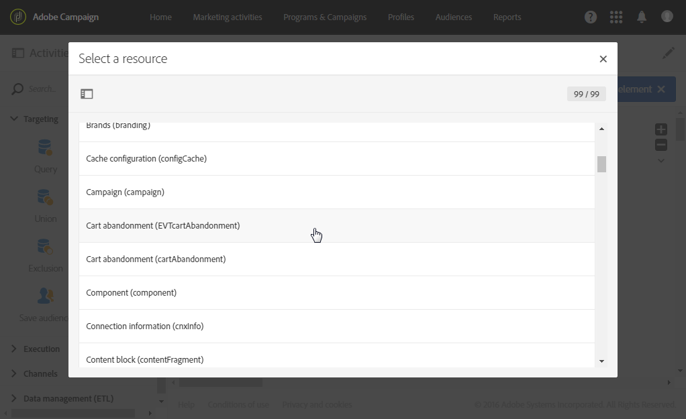

# Follow-up messages{#follow-up-messages}

特定のトランザクションメッセージを受け取った顧客にフォローアップメッセージを送信できます。これを行うには、対応するイベントをターゲット設定するワークフローを設定する必要があります。

[「トランザクションメッセージングのオペレーティングプリンシパル](../../channels/using/about-transactional-messaging.md#transactional-messaging-operating-principle) 」セクションで説明した例を再利用してみましょう。買い物かごへの放棄電子メールは、買い物かごに製品を追加したが、購入を待たずにサイトを離脱したWebサイトユーザに送信されます。

買い物かごの放棄通知を受信したが、3日後に開かなかったユーザーに対して、わかりやすいリマインダーを送信する場合。

各関係者は、送信された最初の電子メールで使用されたデータと同じデータに基づいてフォローアップメッセージを受け取ります。

## Accessing the follow-up messages {#accessing-the-follow-up-messages}

Once you have created and published an event (the cart abandonment as per the [example](../../channels/using/about-transactional-messaging.md#transactional-messaging-operating-principle) above), the corresponding transactional message and follow-up message are created automatically.

The configuration steps are presented in the [Configuring an event to send a follow-up message](../../administration/using/configuring-transactional-messaging.md#use-case--configuring-an-event-to-send-a-transactional-message) section.

ワークフローでイベントを処理するには、配信テンプレートが必要です。However, when publishing the event, the [transactional message](../../channels/using/event-transactional-messages.md) that is created cannot be used as a template. したがって、このイベントタイプをサポートするように設計された特定のフォローアップ配信テンプレートを作成し、ワークフローでテンプレートとして使用する必要があります。

このテンプレートにアクセスするには:

1. Click the **[!UICONTROL Adobe Campaign]** logo, in the top left corner.
1. Select **[!UICONTROL Resources]** &gt; **[!UICONTROL Templates]** &gt; **[!UICONTROL Delivery templates]**.
1. Check the **[!UICONTROL Follow-up messages]** box in the left pane.

   

フォローアップメッセージのみが表示されます。

>[!NOTE]
>
>To access the transactional messages, you must have administration rights or appear in the **[!UICONTROL Message Center agents]** (mcExec) security group.

## Sending a follow-up message {#sending-a-follow-up-message}

フォローアップ配信テンプレートを作成したら、ワークフローでそれを使用してフォローアップメッセージを送信できます。

1. マーケティングアクティビティリストにアクセスして、新しいワークフローを作成します。

   See [Creating a workflow](../../automating/using/building-a-workflow.md#creating-a-workflow).

1. Drag and drop a **[!UICONTROL Scheduler]** activity into your workflow and open it. 実行頻度を1日に1度設定します。

   The Scheduler activity is presented in the [Scheduler](../../automating/using/scheduler.md) section.

1. Drag and drop a **[!UICONTROL Query]** activity into your workflow and open it.

   The Query activity is presented in the [Query](../../automating/using/query.md) section.

1. To run the query on a resource other than the profile resource, go to the activity's **[!UICONTROL Properties]** tab and click the **[!UICONTROL Resource]** drop-down list.

   

   >[!NOTE]
   >
   >デフォルトでは、プロファイルを検索するためにアクティビティが事前設定されています。

1. このイベントからのみデータにアクセスできるように、ターゲットにするイベントを選択します。

   

1. Go to the activity's **[!UICONTROL Target]** tab and drag and drop the **[!UICONTROL Delivery logs (logs)]** element from the **[!UICONTROL Email]** section into the workspace.

   

   Select **[!UICONTROL Exists]** to target all of the customers who received the email.

   

1. Move the **[!UICONTROL Tracking logs (tracking)]** element from the palette to the workspace and select **[!UICONTROL Does not exist]** to target all of the customers who did not open the email.

   

1. Drag and drop the event that you are targeting (**Cart abandonment** in this example) from the **[!UICONTROL Email]** section into the workspace. 次に、3日前に送信されたすべてのメッセージをターゲットにするルールを定義します。

   

   つまり、ワークフローの実行から3日前にトランザクションメッセージを受け取った受信者はすべてターゲット設定されていません。

   Click **[!UICONTROL Confirm]** to save the query.

1. **電子メール配信** アクティビティをワークフローにドラッグ&amp;ドロップします。

   The Email delivery activity is presented in the [Email delivery](../../automating/using/email-delivery.md) section.

   

   [SMS配信](../../automating/using/sms-delivery.md) または [モバイルアプリ配信](../../automating/using/push-notification-delivery.md) アクティビティも使用できます。In this case, make sure you select the **[!UICONTROL Mobile (SMS)]** or **[!UICONTROL Mobile application]** channel when creating your event configuration. See [Creating an event](../../administration/using/configuring-transactional-messaging.md#creating-an-event).

1. **電子メール配信** アクティビティを開きます。In the creation wizard, check the **[!UICONTROL Follow-up messages]** box and select the follow-up delivery template that was created after publishing the event.

   

1. フォローアップメッセージのコンテンツでは、パーソナライゼーションフィールドを追加してイベントのコンテンツを利用できます。

   

1. Find the fields that you defined when creating your event by selecting **[!UICONTROL Transactional event]** &gt; **[!UICONTROL Event context]**. See [Personalizing a transactional message](../../channels/using/event-transactional-messages.md#personalizing-a-transactional-message).

   

   これは、イベントが送信された最初の時点で使用された、パーソナライズされたフレンドリリマインダーを作成するために使用された、リッチデータなどの同じコンテンツを活用できることを意味します。

1. アクティビティを保存してワークフローを開始します。

ワークフローが開始されると、買い物かごの放棄通知を受信したすべての顧客が3日前に表示されますが、開かなかったので、同じデータに基づいてフォローアップメッセージが届きます。

>[!NOTE]
>
>If you selected the **[!UICONTROL Profile]** targeting dimension when creating the event configuration, the follow-up message will also leverage the Adobe Campaign marketing database. See [Profile transactional messages](../../channels/using/profile-transactional-messages.md).

