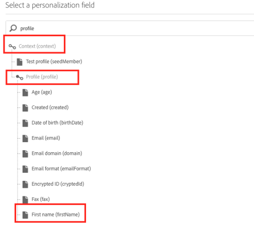

# 多言語プッシュ通知用の CSV ファイルの生成{#generating-csv-multilingual-push}

配信用のコンテンツを生成するためのCSV ファイルのアップロードは、多言語プッシュ通知をサポートするために使用される機能です。 CSV ファイルの形式は、ファイルのアップロードを成功させ、結果として配信を作成できるようにするために、特定のガイドラインに準拠する必要があります。 次の節では、ファイル形式とその考慮事項について説明します。

## ファイル形式 {#file-format}

多言語プッシュには、CSV ファイルに14列が必要です。

1. タイトル
1. messageBody
1. サウンド
1. adge
1. deeplinkURI
1. カテゴリー
1. iosMediaAttachmentURL
1. androidMediaAttachmentURL
1. isContentAvailable
1. isMutableContent
1. customFields
1. ロケール
1. language
1. silentPush

**[!UICONTROL Manage Content Variants]** ウィンドウの&#x200B;**[!UICONTROL Download a sample file]**&#x200B;をクリックして、CSV サンプルを確認します。 詳しくは、この[ セクション ](../../channels/using/creating-a-multilingual-push-notification.md)を参照してください。

* **title, messageBody, sound, badge, deeplinkURI, category, iosMediaAttachmentURL, androidMediaAttachmentURL**：通常のプッシュペイロードのコンテンツ。 プッシュ配信を作成する場合と同様に、この情報を提供する必要があります。
* **カスタムフィールド**：カスタムフィールドにJSON形式（例：`{"key1":"value1","key2":"value2"}`）を使用します。 カスタムフィールドの例については、上記のサンプルファイルを参照してください。
* **isContentAvailable**: コンテンツ使用可能チェックのフラグ、値1はtrueを示し、値0はfalseを示します。 デフォルト値は0です。 この列を空白のままにすると、値は0とみなされます。
* **isMutableContent**：可変コンテンツのフラグ、値1はtrueを意味し、値0はfalseを意味します。 デフォルト値は0です。 この列を空白のままにすると、値は0とみなされます。
* **locale**: localeは言語バリアントのフィールドです。例えば、US-Englishでは「en_us」、France-Frenchでは「fr_fr」です。
* **言語**: ロケールに関連付けられている言語の名前。 例えば、ロケールが「en_us」の場合、言語の名前は「English-United States」になります。
* **silentPush**: プッシュ通知タイプのフラグ。 通常のプッシュ通知の場合、値は0にする必要があります。 サイレントプッシュの場合、値は1になります。 デフォルト値は0です。 この列を空白のままにすると、値は0とみなされます。

## csv ファイルの作成に関する制約とガイドライン {#constraints-guideline-csv}

**各列の名前は固定されています**。
CSV ファイルに各列の名前を含める必要があります。コンテンツに列を使用しない場合は、空白のままにします。

**「ロケール」列と「言語」列は必須であり、値は各行で一意です。**
この列の値が空白の場合、ファイルのアップロードに失敗します。

**列の順序**。 アップロードしたファイルの列の順序は、サンプルファイルと同じ形式にする必要があります。

**見積列の内容**。 これはCSV （コンマ区切り値を表す）ファイルなので、コンマ（,）を含む列コンテンツは引用符で囲む必要があります。 例えば、「こんにちは、トム！」とします。

国際文字には&#x200B;**UTF-8 エンコーディングが必要です。**

**プレーンテキストでファイルを生成する場合は、各列を「,」で区切ります。**

**バリアントが一致しません。** コンテンツブロックやターゲットオーディエンスを特定の言語で使用する場合は、CSV ファイル内のすべてのターゲット言語をリストする必要があります。そうしないと、配信の送信時にエラーが発生します。

## Csv ファイルへのパーソナライゼーションフィールドの挿入 {#personalization-field-csv}

パーソナライゼーションフィールドを使用する場合は、ファイルに<span> タグを含める必要があります。

messageBodyに「firstName」パーソナライゼーションフィールドを挿入するには、メッセージが次のようになる必要があります。

```
 "Hello <span class="nl-dce-field nl-dce-done"  data-nl-expr="/context/profile/firstName">First name</span>, this is message".
```

「firstName」フィールドは次のように表されます。

```
 <span class="nl-dce-field nl-dce-done" data-nl-expr="/context/profile/firstName">First name</span>
```

スパンには、次の2つの必須属性があります。

* ひとつは静的なクラスです。 使用するパーソナライゼーションフィールドはどれでも、class=&quot;nl-dce-field nl-dce-done&quot;になります。

* もうひとつは、パーソナライゼーションフィールドのパスであるdata-nl-exprです。 例えば、UIから「firstName」パーソナライゼーションフィールドを挿入した場合、ナビゲーションパスは&#x200B;**[!UICONTROL Context (context)]** > **[!UICONTROL Profile (profile)]** > **[!UICONTROL First name (firstName)]**&#x200B;になります（下図を参照）。 この場合、経路は

  ```
  /context/profile/firstName. data-nl-expr="/context/profile/firstName".
  ```



## ロケール名と言語名 {#locale-language-names}

次の言語がサポートされています。

| ロケール | language |
|:-:|:-:|
| af_za | アフリカ – 南アフリカ |
| sq_al | アルバニア語 – アルバニア |
| ar_dz | アラビア語 – アルジェリア |
| ar_bh | アラビア語 – バーレーン |
| ar_iq | アラビア語 – イラク |
| ar_il | アラビア語 – イスラエル |
| ar_jo | アラビア語 – ヨルダン |
| ar_kw | アラビア語 – クウェート |
| ar_lb | アラビア語 – レバノン |
| ar_ma | アラビア語 – モロッコ |
| ar_om | アラビア語 – オマーン |
| ar_qa | アラビア語 – カタール |
| ar_sa | アラビア語 – サウジアラビア |
| ar_sy | アラビア語 – シリア |
| ar_tn | アラビア語 – チュニジア |
| ar_ae | アラビア語 – アラブ首長国連邦 |
| ar_ye | アラビア語 – イエメン |
| hy_am | アルメニア語 – アルメニア |
| az_az | アゼルバイジャン – アゼルバイジャン |
| be_by | ベラルーシ語 – ベラルーシ |
| bs_ba | ボスニア語 – ボスニア |
| bg_bg | ブルガリア語 – ブルガリア |
| ca_es | カタルーニャ語 – スペイン |
| zh_cn | 中国語（簡体字） – 中国 |
| zh_sg | 中国語（簡体字） – シンガポール |
| zh_hk | 中国語（繁体字） – 中国香港特別行政区 |
| zh_tw | 中国語（繁体字） – 台湾地域 |
| hr_hr | クロアチア語 – クロアチア |
| cs_cz | チェコ語 – チェコ |
| da_dk | デンマーク語 – デンマーク |
| nl_be | オランダ語 – ベルギー |
| nl_nl | オランダ語 – オランダ |
| en_au | 英語 – オーストラリア |
| en_bz | 英語 – ベリーズ |
| en_ca | 英語 – カナダ |
| en_in | 英語 – インド |
| en_ie | 英語 – アイルランド |
| en_jm | 英語 – ジャマイカ |
| en_nz | 英語 – ニュージーランド |
| en_ph | 英語 – フィリピン |
| en_za | 英語 – 南アフリカ |
| en_tt | 英語 – トリニダード・トバゴ |
| en_gb | 英語 – 英国 |
| en_us | 英語 – 米国 |
| en_zw | 英語 – ジンバブエ |
| et_ee | エストニア語 – エストニア |
| fi_fi | フィンランド語 – フィンランド |
| fr_be | フランス語 – ベルギー |
| fr_ca | フランス語 – カナダ |
| fr_fr | フランス語 – フランス |
| fr_lu | フランス語 – ルクセンブルク |
| fr_ch | フランス語 – スイス |
| de_at | ドイツ語 – オーストリア |
| de_de | ドイツ語 – ドイツ |
| de_lu | ドイツ語 – ルクセンブルク |
| de_ch | ドイツ語 – スイス |
| el_cy | ギリシャ語 – キプロス |
| el_gr | ギリシャ – ギリシャ |
| gu_in | グジャラート語 – インド |
| he_il | ヘブライ語 – イスラエル |
| hi_in | ヒンディー語 – インド |
| hu_hu | ハンガリー語 – ハンガリー |
| is_is | アイスランド語 – アイスランド |
| id_id | インドネシア語 – インドネシア |
| it_it | イタリア語 – イタリア |
| it_ch | イタリア語 – スイス |
| ja_jp | 日本語 – 日本 |
| kn_in | カンナダ語 – インド |
| kk_kz | カザフ語 – カザフスタン |
| ko_kr | 韓国語 – 韓国 |
| lv_lv | ラトビア語 – ラトビア |
| lt_lt | リトアニア – リトアニア |
| mk_mk | マケドニア語 – マケドニア |
| ms_my | マレー語 – マレーシア |
| mr_in | マラーティー語 – インド |
| no_no | ノルウェー語 – ノルウェー |
| pl_pl | ポーランド語 – ポーランド |
| pt_br | ポルトガル語 – ブラジル |
| pt_pt | ポルトガル語 – ポルトガル |
| pa_in | パンジャビ – インド |
| ro_md | ルーマニア語 – モルドバ |
| ro_ro | ルーマニア – ルーマニア |
| ru_kz | ロシア語 – カザフスタン |
| ru_ru | ロシア語 – ロシア |
| ru_ua | ロシア語 – ウクライナ |
| a_in | サンスクリット語 – インド |
| sr_ba | セルビア語 – ボスニア |
| sr_rs | セルビア語 – セルビア |
| sk_sk | スロバキア – スロバキア |
| sl_si | スロベニア語 – スロベニア |
| es_ar | スペイン語 – アルゼンチン |
| es_bo | スペイン語 – ボリビア |
| es_cl | スペイン語 – チリ |
| es_co | スペイン語 – コロンビア |
| es_cr | スペイン語 – コスタリカ |
| es_do | スペイン語 – ドミニカ共和国 |
| es_ec | スペイン語 – エクアドル |
| es_sv | スペイン語 – エルサルバドル |
| es_gt | スペイン語 – グアテマラ |
| es_hn | スペイン語 – ホンジュラス |
| es_mx | スペイン語 – メキシコ |
| es_ni | スペイン語 – ニカラグア |
| es_pa | スペイン語 – パナマ |
| es_py | スペイン語 – パラグアイ |
| es_pe | スペイン語 – ペルー |
| es_pr | スペイン語 – プエルトリコ |
| es_es | スペイン語 – スペイン |
| es_uy | スペイン語 – ウルグアイ |
| es_ve | スペイン語 – ベネズエラ |
| sw_ke | スワヒリ語 – ケニア |
| sv_fi | スウェーデン語 – フィンランド |
| sv_se | スウェーデン語 – スウェーデン |
| ta_in | タミル語 – インド |
| tt_ru | タタール語 – ロシア語 |
| te_in | テルグ語 – インド |
| th_th | タイ語 – タイ |
| tr_cy | トルコ語 – キプロス |
| tr_tr | トルコ語 – トルコ |
| uk_ua | ウクライナ語 – ウクライナ |
| ur_in | ウルドゥー語 – インド |
| ur_pk | ウルドゥー語 – パキスタン |
| vi_vn | ベトナム語 – ベトナム |
