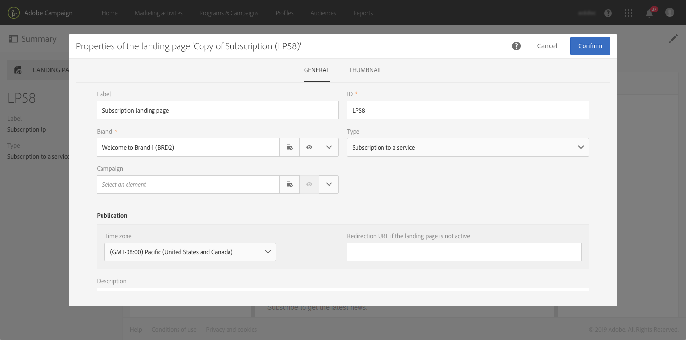

# ランディングページの概要 {#getting-started-with-landing-pages}

## ランディングページについて {#about-landing-pages}

キャンペーンには、オーディエンス上の情報の取得、サービスへのオファー購読、データの表示、データベースの拡張に使用できるWebフォームのランディングページが付属しています。 ランディングページは、既存のユーザーの取得や更新にも使用できます。

ランディングページを使用して、重複のオプトインメカニズムを設定し、間違った電子メールアドレスや無効な電子メールアドレス、スパンボットからプラットフォームを保護することもできます。 For more on this, refer to the [dedicated use case](../../channels/using/setting-up-a-double-opt-in-process.md).

ランディングページを設定する主な手順は次のとおりです。

このページでは、これらの各手順に関する情報と、詳細についての専用ドキュメントの参照を示します。

**関連トピック：**

* [ランディングページチュートリアルビデオの作成](https://docs.adobe.com/content/help/en/campaign-learn/campaign-standard-tutorials/communication-channels/landing-pages/landing-page-create-and-edit.html) （英語）
* [サービスの作成](../../audiences/using/creating-a-service.md)
* [ダブルオプトインプロセスの設定](setting-up-a-double-opt-in-process.md)

## ランディングページ制限{#landing-page-limitations}

以下の節では、リストを設定する前に注意が必要な制限について説明します。ランディングページの設定

**データの書き込みと更新**

* ランディングページは、およびのリ **[!UICONTROL Profile]** ソースに **[!UICONTROL Subscription]** のみ制限されます。 レコードは、から保存および更新で **[!UICONTROL Profile]** き、に購読/購読解除を追加できま **[!UICONTROL Service]**す。
リソースの設定について詳しくは、「リソースの [データ構造の設定」を参照してください](../../developing/using/configuring-the-resource-s-data-structure.md)。

>[!CAUTION]
>
>ランディングページは、および以外のリソースのデータを表示または更新することは **[!UICONTROL Profile]** できませ **[!UICONTROL Subscription]**&#x200B;ん。

**プリロード**

* ランディングページは、レコードのリストを自動的に表示することはできません。また、既にリストが登録しているプロファイルサービスも表示できません。 For more information on services, refer to this [page](../../audiences/using/creating-a-service.md).

* ランディングページには、事前入力済みのフォーム（データがページと共にプリロードされる）が含まれている場合は、データの電子メールからのみアクセスできます。Adobe Campaignの電子メール Webサイトページからは、このようなフォームにアクセスできません。

**紐付け**

* 調整の動作は次のとおりです。一致が見つかると、調整プロセスが停止します。 つまり、調整は1つのプロファイルレコードでのみ行え、複数のレコードでは行えません(重複がある場合)。

例えば、次のダウンロード計測用ランディングページをプロファイルに送信し、キャンペーンデータベースをプロファイルの携帯電話番号で更新するとします。

プロファイルの1人が新しい情報をランディングページに入力し、既にプロファイルが重複している場合、プロファイルは作成日のみに基づいて優先されるので、作成日が最も古いプロファイルとの照合情報が更新されます。

ここでは最古のプロファイルであったので、最初のエントリのみが更新された。

**テストランディングページ**

* ランディングページはプロファイルでのみ機能し、テストプロファイルでは機能しません。つまり、ランディングページは電子メール配達確認の一部としてテストできません。

## 手順1 — テンプレートのランディングページ設定 {#configure-the-landing-page-template}

ランディングページを設定する前に、まずニーズに合ったランディングページテンプレートを設定します。 テンプレートの準備が整うと、それに基づくすべてのランディングページが、必要なパラメーターで事前設定されます。

1. 詳細メニューのAdobe Campaignロゴから、 **[!UICONTROL Resources]** / **[!UICONTROL Templates]** /を選 **[!UICONTROL Landing page templates]**&#x200B;択し、使用する重複を選択します。
1. テンプレートのプロパティで、テンプレートに共通する必要のあるすべてのランディングページを指定します。 例：ターゲティングディメンション、識別された訪問者または識別されなかった訪問者のページアクセスパラメータ、によるフォーム検証に固有のアクション、コンテンツで使用するブランド/ロゴなど。 ランディングページのプロパティについて詳しくは、この節を参照し [てください。](../../channels/using/configuring-landing-page.md)
1. 変更を保存します。

For more on landing page templates, refer to [this section](../../channels/using/getting-started-with-landing-pages.md).

## 手順2 -ランディングページの作成と設定 {#create-and-configure-the-landing-page}

前の手順で定義したテンプレートから、新しいランディングページをプログラムまたはキャンペーンで作成します。

1. 目的のランディングページに基づいてテンプレートを作成します。
1. ランディングページ（ラベル、説明など）の一般的なパラメータを入力します。
1. その後、このランディングページダッシュボード 必要に応じて、ランディングページのプロパティを編集します( [ランディングページの設定](../../channels/using/configuring-landing-page.md))。 デフォルトでは、プロパティはテンプレートテンプレートで設定されたランディングページです。
セキュリティ上の理由とプラットフォームパフォーマンスのため、有効期限はプラットフォームのプロパティで設定することを強くランディングページします。 完了すると、ランディングページは選択した日付に自動的に非公開になります。 For more on validity parameters, refer to [this section](../../channels/using/testing-publishing-landing-page.md#setting-up-validity-parameters).

   

   >[!NOTE]
   >
   >変更は、編集中のランディングページに対してのみ有効です。 これらの変更を他のランディングページに適用する場合は、専用のテンプレートで実行し、そのテンプレートから他のランディングページを作成します。

## 手順3 -ランディングページ {#design-the-landing-page}

これで、ユーザーのコンテンツを定義できるようになりました。ランディングページ デフォルトでは、ランディングページには、スクロール矢印を使用してアクセスできる3つのページが含まれています。メインコンテンツページ、確認ページおよびエラーページ。

各ページでは、デフォルトで複数のフィールドが設定されています。 必要に応じて、プロパティとマッピングを編集できます。

また、プロファイルがクリックした確認ボタンの動作を設定し、必要に応じてコンテンツをパーソナライズ(画像、パーソナライゼーションフィールドなど)することもできます。 例えば、プロファイルの名前を登録の確認ページに挿入し、登録に対するお礼を言うことができます。

ランディングページの設計について詳しくは、この節を参照 [してください](../../channels/using/designing-a-landing-page.md)。

## 手順4 -ランディングページ {#test-the-landing-page}

ランディングページを定義したら、オンラインでの実行方法や動作をシミュレートできます。

>[!CAUTION]
>
>ランディングページテストは、テストプロファイルでのみ実行でき、テストプロファイルでは実行できません。 フォームの送信中に、選択したプロファイルのデータが実際に更新されます。 実際の顧客の変更を避けるには、偽のプロファイルプロファイルを使用します。

ランディングページの動作に満足した場合は、公開してオンラインで利用できるようにします。

ランディングページのテスト方法の詳細は、この節を参照し [てください](../../channels/using/testing-publishing-landing-page.md#testing-the-landing-page-)。

## 手順5 -ランディングページを公開 {#publish-the-landing-page}

テストが正常に完了したら、ランディングページのアクションバーのボ **[!UICONTROL Publish]** タンを使用してダッシュボードを公開します。 監視ブロックは、パブリケーションの進行状況とステータスを示します。

公開すると、ランディングページにオンラインでアクセスできます。 公開後は、いつでも更新できます。これを行うには、各変更後に再公開する必要があります。 また、いつでもランディングページの公開を取り消して、使用できなくすることもできます。

公開したランディングページは使用できます。 その後、様々なメカニズムを導入して、データベース内の新しいプロファイルを取得したり、既存のプロファイルに関する追加情報を取得したりできます。

ランディングページの公開について詳しくは、この節を参照 [してください](../../channels/using/testing-publishing-landing-page.md#publishing-a-landing-page)。
