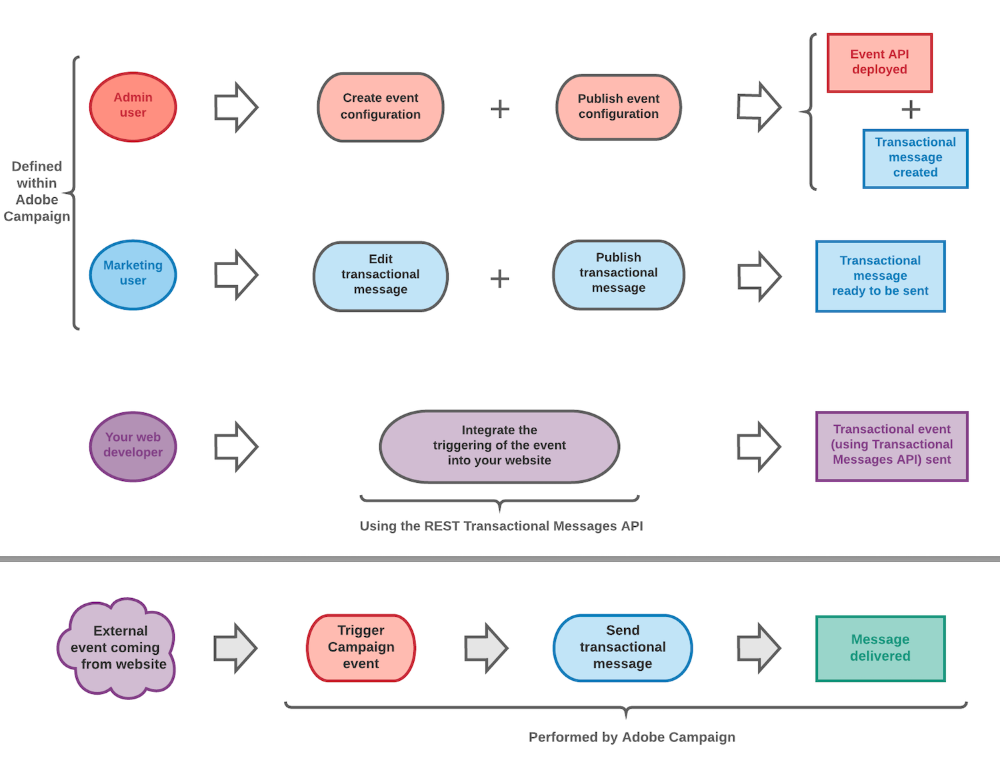

# トランザクションメッセージの基本を学ぶ {#getting-started-with-transactional-messaging}

トランザクションメッセージは web サイトなどのプロバイダーがリアルタイムに送信する、個々に向けたユニークなコミュニケーションです。 受信者が確認したい重要な情報が含まれているので、早い送信が特に期待されます。

* **期限はいつですか？** このメッセージには重要な情報が含まれているため、ユーザーはリアルタイムで送信されることを期待しています。 そのため、イベントがトリガーされてからメッセージが届くまでの時間を、非常に短縮する必要があります。

* **なぜそれが重要なのですか？** 一般的に、トランザクションメッセージの開封率は高くなります。 顧客との関係を定め、顧客の行動に強い影響を与える可能性があるので、慎重に設計する必要があります。

* **例：?** アカウント作成後のウェルカムメッセージ、注文の発送確認、請求書、パスワード変更の確認メッセージ、web サイトの閲覧後の通知など、さまざまなタイプのメッセージが考えられます。

Adobe Campaignでは、この機能を、カスタムトランザクションメッセージに変換するイベントを送信する情報システムと統合できます。

トランザクションメッセージは、オプションに応じて、電子メール、SMS、または[ プッシュ通知](../../channels/using/transactional-push-notifications.md)で送信できます。 使用許諾契約書を確認してください。

>[!NOTE]
>
>Adobe Campaign は、トランザクションメッセージの処理を他のどの配信よりも優先します。

<!--Guidelines to implement transactional messaging capabilities in your website are detailed in [this section](../../api/using/managing-transactional-messages.md).-->

トランザクションメッセージを開始する前に、対応する[ ベストプラクティスと制限事項](../../channels/using/transactional-messaging-limitations.md)を必ずお読みください。

## トランザクションメッセージの動作原理 {#transactional-messaging-operating-principle}

トランザクションメッセージの全体的なプロセスは、次のように記述できます。

例えば、顧客が製品を購入できる ｗeb サイトを持つ会社の例で考えてみます。

Adobe Campaign を使用すると、買い物かごに製品を追加した顧客に通知メールを送信できます。 Web サイトを訪れた人が購入せずにサイトを離れると（キャンペーンイベントをトリガーする外部イベント）、買い物かごの放棄に伴うメールを自動的に送信できます（トランザクションメッセージ配信）。

これを実現する主な手順は、[この節](#key-steps)で説明します。

## トランザクションメッセージタイプ {#transactional-message-types}

Adobe Campaignでは、2種類のトランザクションメッセージを利用できます。

イベント自体に含まれる&#x200B;**イベントトランザクションメッセージ** ターゲットデータ。 メッセージ：
* プロファイル情報を含めないでください。そのため、購読解除リンクを含めることはできません。
* 疲労ルールと互換性がありません（プロファイルを使用したエンリッチメントの場合でも）。
* イベント自体に含まれるデータによって配信ターゲットを定義します。

例えば、忘れたパスワードを取得する必要がある顧客や、注文を確認する必要がある顧客に、イベントのトランザクションメッセージを送信する場合があります。 実際、受信者がこの種類のコミュニケーションの購読を解除することを望んでいません。また、この通知は、疲労ルールの一部としてマーケティングメッセージのカウンターに追加しないでください。

Campaign マーケティングデータベースから&#x200B;**トランザクションメッセージをプロファイル**&#x200B;のターゲットプロファイルに割り当てます。 この種類のメッセージを使用すると、次のことが可能になります。
* Adobe Campaignデータベースに含まれるデータを活用。
* イベント設定に[ エンリッチメント ](../../channels/using/configuring-transactional-event.md#enriching-the-transactional-message-content)を追加して、プロファイル情報を使用してメッセージをパーソナライズします。
* [ マーケティングタイポロジルール ](../../sending/using/managing-typology-rules.md)または[疲労ルール ](../../sending/using/fatigue-rules.md)を適用します。
* メッセージ内に購読解除リンクを含める。
* グローバル配信レポートにトランザクションメッセージを追加する。
* カスタマージャーニーでトランザクションメッセージを活用する。

たとえば、web サイトでカートを放棄した顧客に連絡する際に、このタイプのメッセージを利用することで、購入を促すことができます。 これにより、プロファイルデータベースのあらゆる情報に直接アクセスできるメッセージを、より簡単にパーソナライズして、マーケティングルールを適用し、このメッセージをグローバルカスタマージャーニーとレポートに含めることで、顧客行動をより詳細に把握することができます。

メッセージタイプは、トランザクションメッセージに変換されるイベントを設定する際に定義されます。 [ イベントベースのトランザクションメッセージ ](../../channels/using/configuring-transactional-event.md#event-based-transactional-messages)および[ プロファイルベースのトランザクションメッセージ ](../../channels/using/configuring-transactional-event.md#profile-based-transactional-messages)の設定の節を参照してください。

## 主な手順 {#key-steps}

Adobe Campaignでパーソナライズされたトランザクションメッセージを作成および管理する際の主な手順を以下のスキーマにまとめます。

以下では、それぞれの手順について詳しく説明します。

>[!IMPORTANT]
>
>トランザクション イベントを設定し、トランザクション メッセージにアクセスできるのは、[管理](../../administration/using/users-management.md#functional-administrators)の役割を持つユーザーのみです。

### 手順1 - イベント設定を作成して公開する {#create-event-configuration}

<!---->

| イベントの作成 | ユーザー | アクション | 結果 |
| --- |--- |--- |--- |
|  | この手順は、[管理権限](../../administration/using/users-management.md#functional-administrators)を持つ管理者が実行する必要があります。 | 「カート放棄」という名前のイベントを設定し、このイベント設定を公開します。 | Web サイト開発者が使用するAPIがデプロイされ、トランザクションメッセージが自動的に作成されます。 |

イベントの作成と公開については、[ トランザクションイベントの設定](../../channels/using/configuring-transactional-event.md)および[ トランザクションイベントの公開](../../channels/using/publishing-transactional-event.md)の節を参照してください。

### 手順2 - トランザクションメッセージの編集と公開 {#create-transactional-message}

<!---->

| メッセージの編集 | ユーザー | アクション | 結果 |
| --- |--- |--- |--- |
|  | この手順は、[管理権限](../../administration/using/users-management.md#functional-administrators)を持つマーケティングユーザーが実行できます。 | トランザクションメッセージを編集およびパーソナライズし、テストしてから公開します。 | トランザクションメッセージを送信する準備が整います。 |

トランザクションメッセージの編集と公開について詳しくは、[ トランザクションメッセージの編集](../../channels/using/editing-transactional-message.md)および[ トランザクションメッセージライフサイクル ](../../channels/using/publishing-transactional-message.md)を参照してください。

### 手順3 - イベントトリガーの統合 {#integrate-event-trigger}

<!---->

イベントを作成したら、このイベントのトリガーをweb サイトに統合する必要があります。<!--In this example, you want a "Cart abandonment" event to be triggered whenever one of your clients leaves your website before purchasing the products in their cart.--> これを行うには、web サイトのweb デベロッパーが&#x200B;**Adobe Campaign Standard REST API**&#x200B;を使用する必要があります。

| トリガーの実装 | ユーザー | アクション | 結果 |
| --- |--- |--- |--- |
|  | この手順は、web サイトの開発者によって実行されます。 | REST トランザクションメッセージ APIを使用して、イベントをweb サイトに統合します。 | このイベントは、顧客がカートを放棄したときにトリガーされます。 |

Campaign REST APIを使用してトランザクションメッセージを管理する方法について詳しくは、[REST API ドキュメント ](../../api/using/managing-transactional-messages.md)を参照してください。

### ステップ 4 - メッセージ配信 {#message-delivery}

<!---->

上記のすべての手順が実行されると、メッセージを配信できます。

| メッセージの配信 | ユーザー | アクション | 結果 |
| --- |--- |--- |--- |
|  | このステップは、web サイトにアクセスした顧客が実行します。 | 利用者がカートに商品を追加することなくサイトを離れるとすぐに、対応するCampaign イベントがトリガーされます。 | ユーザーは自動的に通知メールを受信します。 |

## 関連トピック

* [メッセージを送信するための主な手順](../../channels/using/key-steps-to-send-a-message.md)
* [コミュニケーションチャネルの概要](../../channels/using/get-started-communication-channels.md)
* [トランザクションプッシュ通知](../../channels/using/transactional-push-notifications.md)
* [フォローアップメッセージ](../../channels/using/follow-up-messages.md)
