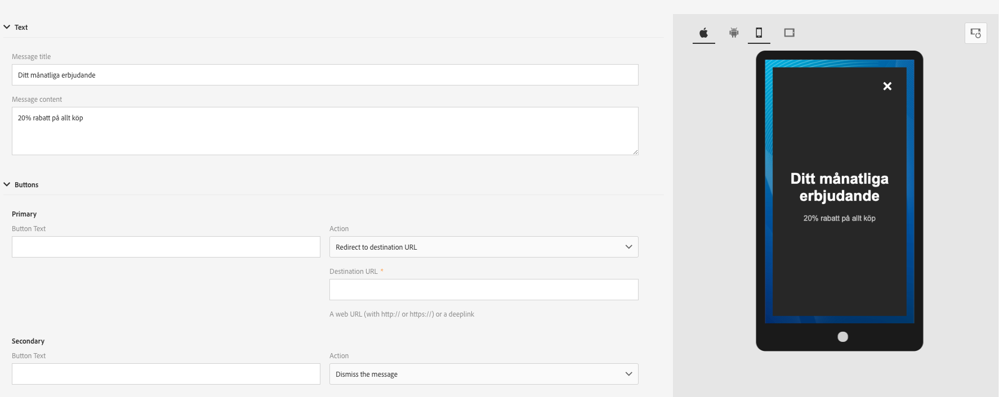

# アプリ内 FAQ {#in-app-faq}

## Adobe Campaign Standardのアプリ内チャネルについて詳しく知るための便利なリソースの推奨事項は何ですか？ {#resources-inapp}

以下のリソースをご覧ください。

* [ビデオチュートリアル](https://experienceleague.adobe.com/docs/campaign-standard-learn/tutorials/communication-channels/mobile/in-app/in-app-message-overview.html?lang=ja)
* [ブログ投稿](https://theblog.adobe.com/get-more-out-of-the-new-in-app-message-channel-from-adobe-campaign/)
* [コミュニティページ](https://experienceleaguecommunities.adobe.com/t5/adobe-campaign-standard/ct-p/adobe-campaign-standard-community?profile.language=ja)

## Campaign拡張機能API setLinkageFieldとresetLinkageFieldの目的は何ですか？ {#extensions-apis}

アプリ内メッセージはCampaignからSDKによって取得されるため、PII データを含むアプリ内メッセージが悪意のある手に渡らないように、安全な仕組みを提供する必要があります。 そのため、デバイスへのメッセージの安全な配信を確保するために、次のメカニズムが導入されています。

* 顧客は、この特定の情報を安全に配信したいのであれば、モバイルプロファイルフィールド（appSubscriberRcp テーブル）を「個人」フィールドおよび「機密」フィールドとしてマークします。
* そのようにマークされたフィールドは、追加のセキュリティメカニズムが組み込まれているプロファイルテンプレート（appSubscriber テンプレートまたはBroadcast テンプレートではなく）でのみ使用できます。
* プロファイルテンプレートを使用して作成されたメッセージは、ユーザーがアプリにログインした場合にのみ配信できます。
* この安全なハンドシェイクを容易にするために、モバイルアプリ開発者はsetLinkageField APIを使用して追加の認証の詳細を渡す必要があります。 リンクフィールドは、appSubscriberRcp テーブルを拡張する際に、モバイルプロファイルとCRM プロファイル間のリンクとして識別されるリンクフィールドです。
* デバイスに保存されているアプリ内メッセージをフラッシュし、ユーザーがresetLinkageFieldを使用してアプリからログアウトしたときにresetLinkagefieldsをフラッシュする必要があります。 これにより、別のユーザーがアプリにログインしても、以前のユーザー向けのメッセージが表示されなくなります。
* このセキュリティメカニズムをクライアントサイドで実装するには、[&#x200B; モバイルSDK API](https://developer.adobe.com/client-sdks/documentation/adobe-campaign-standard/api-reference/)を参照してください。

## Campaignでアプリ内レポートを有効にするには、どうすればよいですか？ {#enable-inapp-reporting}

アプリ内トラッキングのポストバックを設定する必要があります。 手順は[こちら](../../administration/using/configuring-rules-launch.md#inapp-tracking-postback)にあります。

ローカル通知トラッキングを実装するには、この[&#x200B; ページ &#x200B;](../../administration/using/local-tracking.md)を参照してください。

## アプリ内チャネルで使用できるレポートはどれですか？ {#report-inapp}

Adobe Campaignのアプリ内チャネルでは、すぐに利用できるレポートを利用できます。 この[&#x200B; ドキュメント &#x200B;](../../reporting/using/in-app-report.md)を参照してください。

各アプリ内指標の計算方法については、この[&#x200B; ページ &#x200B;](../../reporting/using/indicator-calculation.md#in-app-delivery)を参照してください。

## プッシュ通知と同様に、アプリ内で多言語コンテンツのバリエーションをサポートしていますか？ {#multilingual-inapp}

アプリ内メッセージで使用できる多言語テンプレートは現在利用できません。

ただし、目的が英語以外の言語でアプリ内メッセージを送信する場合は、コンテンツを使用可能なテキストボックスに直接貼り付けることができます。

## Campaign パーソナライゼーションフィールドをカスタム HTMLに追加できますか？ {#custom-html-inapp}

いいえ、これはまだサポートされていません。

## アラートメッセージを設定しましたが、デバイスに表示されません。 {#alert-message}

アラートメッセージの場合、少なくとも1つの却下ボタン（プライマリまたはセカンダリにはアクションの却下が必要）が必要です。 それ以外の場合は、メッセージを保存できますが、受信できません。

## ローカル通知iOSのカスタムサウンドが再生されない場合、デフォルトのサウンドが代わりに再生されますか？ {#local-notification-sound}

IOSでカスタムサウンドを作成する場合、ローカル通知（sound.cafなど）を作成する際に、拡張子の付いたファイル名を指定する必要があります。 この拡張機能が指定されていない場合は、デフォルトのサウンドが使用されます。

## アプリ内メッセージでディープリンクはサポートされていますか？ {#inapp-deeplinks}

はい、アプリ内メッセージではディープリンクがサポートされています。 ディープリンクには次のものが含まれます。

* ディープリンクを機能させるには、配信トラッキングを無効にする必要があることを示す言語。
* AppsflyerとBranchをパートナーとして使用して、ディープリンクの追跡を行うことができます。 分岐とAdobe Campaign Standardの統合について詳しくは、この[&#x200B; ページ &#x200B;](https://help.branch.io/using-branch/docs/adobe-campaign-standard-1)を参照してください。

## ユーザーがプッシュ通知からアプリを起動したときに、アプリ内メッセージをトリガーできますか？ {#inapp-push-trigger}

はい、これらのメッセージはデイジーチェーンメッセージとも呼ばれます。 以下の手順に従います。

1. アプリ内メッセージの作成。

1. カスタムイベントを定義し、このIAMのイベントトリガーとして選択します（例：「秋のプレビュープッシュからのトリガー」）。

1. プッシュメッセージをオーサリングする際に、値をIAMのトリガーに使用するイベントとして設定できるカスタム変数を定義します（例：Key = &quot;inappkey&quot;、value = &quot;秋のプレビュープッシュからのトリガー&quot;）。

1. モバイルアプリコードで、イベントトリガーを次のように実装します。

   
