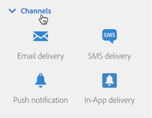
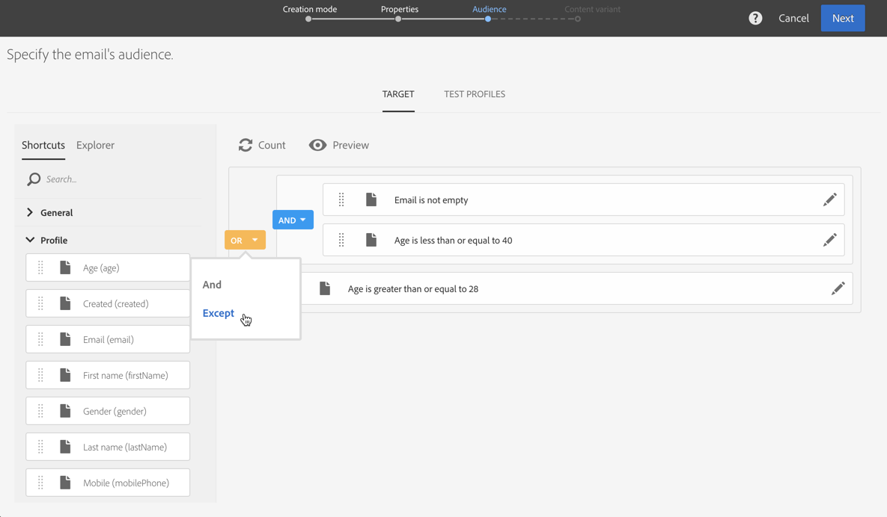
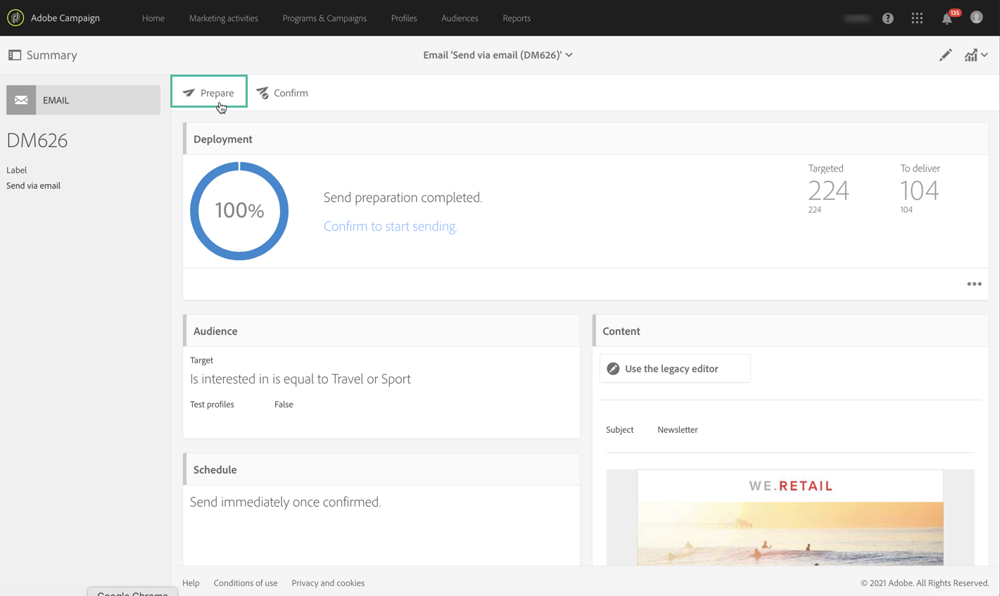

# メッセージを送信するための主な手順{#key-steps-to-send-a-message}

ここでは、Adobe Campaign Standardを使用して、ターゲットオーディエンスにパーソナライズされたメッセージを作成し、送信する方法を説明します。

各コミュニケーション チャネルの作成および設定方法に関する具体的な情報については、次の節を参照してください。

* [メールの作成](../../channels/using/creating-an-email.md)
* [SMSの作成](../../channels/using/creating-an-sms-message.md)
* [ダイレクトメール配信の作成](../../channels/using/creating-the-direct-mail.md)
* [ プッシュ通知の作成](../../channels/using/preparing-and-sending-a-push-notification.md)。
* [アプリ内メッセージの準備と送信](../../channels/using/preparing-and-sending-an-in-app-message.md)

配信のベストプラクティスについては、[配信のベストプラクティス ](../../sending/using/delivery-best-practices.md)の節を参照してください。

## メッセージの構築

Campaign Standard [ マーケティング活動](../../start/using/marketing-activities.md)を活用して、電子メール、SMS、ダイレクトメール、プッシュ通知またはアプリ内メッセージを作成します。

メッセージは、マーケティングアクティビティリストから、または[専用アクティビティ ](../../automating/using/about-channel-activities.md)を使用するワークフローから作成できます。

## オーディエンスを定義

メッセージの受信者を定義します。 これを行うには、左側のペインの[ クエリエディター](../../automating/using/editing-queries.md)を使用して、データベースに含まれるデータをフィルタリングし、オーディエンスをターゲットとするルールを構築します。

オーディエンスにはいくつかの種類があります。

* **[!UICONTROL Target]**&#x200B;はあなたのメールの主なターゲットです，
* **[!UICONTROL Test profiles]**&#x200B;は、電子メールのテストと検証に使用されるプロファイルです（[ テストプロファイルの管理](../../audiences/using/managing-test-profiles.md)を参照）。

## コンテンツのデザインとパーソナライゼーション

**[!UICONTROL Content]** ブロックで、データベースのフィールドを使用して、メッセージのコンテンツをデザインおよびパーソナライズします。 特定のチャネルのコンテンツをデザインする方法について詳しくは、このページの上部に記載されているセクションを参照してください。

## 準備とテスト

メッセージを[準備](../../sending/using/preparing-the-send.md)します。 このプロセスでは、ターゲット母集団を計算し、パーソナライズされたメッセージを準備します。

**プレビュー、電子メールのレンダリング、プルーフなど、Campaign Standard機能を使用してメッセージを送信する前に、** メッセージを確認してテストします。詳しくは、[このセクション ](../../sending/using/previewing-messages.md)を参照してください。

**[!UICONTROL Schedule]** ブロックを使用して、メッセージを送信するタイミングを定義します（[ メッセージのスケジュール設定](../../sending/using/about-scheduling-messages.md)を参照）。

## 送信と追跡

メッセージの準備が整ったら、送信を確認できます。 **[!UICONTROL Deployment]** ブロックには、送信の進行状況と結果が表示されます。

メッセージの配信を監視するのに役立つログがいくつか用意されています（[配信の監視](../../sending/using/monitoring-a-delivery.md)を参照）。 Campaign Standardの[ トラッキング機能](../../sending/using/tracking-messages.md)により、配信受信者の動作をトラッキングすることもできます。

様々な指標とチャートを通じて、メッセージの効果や、送信とキャンペーンの進化を測定します（[ レポートへのアクセス ](../../reporting/using/about-dynamic-reports.md)を参照）。

