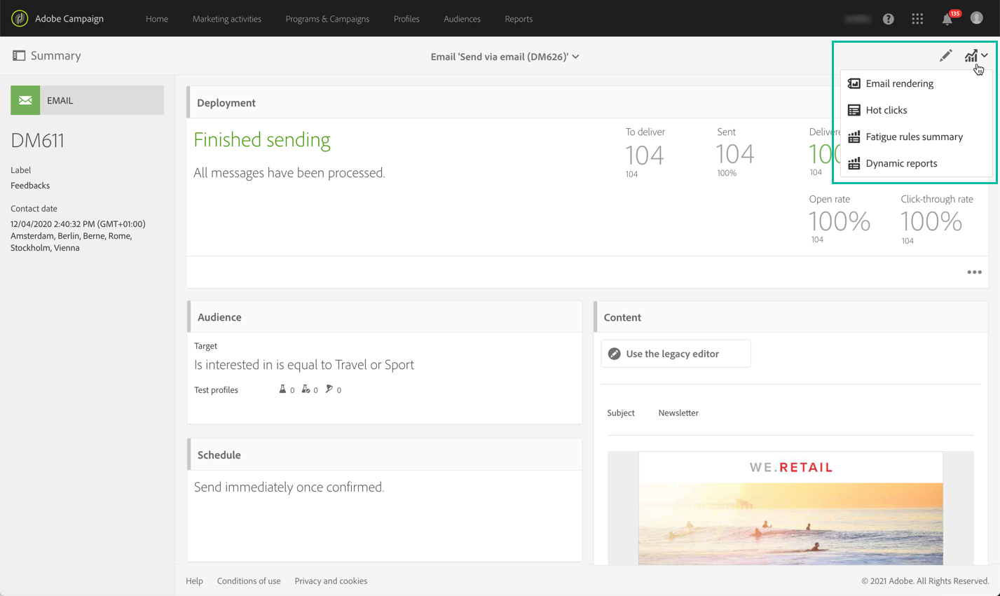

# メッセージを送信するための主な手順{#key-steps-to-send-a-message}

この節では、Adobe Campaign Standardを使用してパーソナライズされたメッセージを作成し、ターゲットオーディエンスに送信する方法について説明します。

各通信チャネルの作成および設定方法に関する具体的な情報は、次の節で確認できます。

* [E メールの作成](../../channels/using/creating-an-email.md)
* [SMS の作成](../../channels/using/creating-an-sms-message.md)
* [ダイレクトメール配信の作成](../../channels/using/creating-the-direct-mail.md)
* [プッシュ通知の作成](../../channels/using/preparing-and-sending-a-push-notification.md).
* [アプリ内メッセージの準備と送信](../../channels/using/preparing-and-sending-an-in-app-message.md)

配信のベストプラクティスについては、 [配信のベストプラクティス](../../sending/using/delivery-best-practices.md) 」セクションに入力します。

## メッセージを作成

活用Campaign Standard [マーケティング活動](../../start/using/marketing-activities.md) 電子メール、SMS、ダイレクトメール、プッシュ通知、アプリ内メッセージを作成する場合。

メッセージは、マーケティングアクティビティリストから、または [専用のアクティビティ](../../automating/using/about-channel-activities.md).

## オーディエンスを定義

メッセージの受信者を定義します。 これをおこなうには、 [クエリエディター](../../automating/using/editing-queries.md) を左側のペインからクリックして、データベースに含まれるデータをフィルタリングし、ルールを作成して、オーディエンスをターゲットにします。

オーディエンスには、次のようなタイプがあります。

* **[!UICONTROL Target]** は、E メールのメインターゲットです。
* **[!UICONTROL Test profiles]** は、e メールのテストと検証に使用するプロファイルです ( [テストプロファイルの管理](../../audiences/using/managing-test-profiles.md)) をクリックします。

## コンテンツの設計とパーソナライズ

Adobe Analytics の **[!UICONTROL Content]** データベースのフィールドを使用して、メッセージのコンテンツをブロック、デザインおよびパーソナライズします。 特定のチャネルのコンテンツをデザインする方法について詳しくは、このページの上部にあるセクションを参照してください。

## 準備とテスト

[準備](../../sending/using/preparing-the-send.md) メッセージ。 このプロセスでは、ターゲット母集団を計算し、パーソナライズされたメッセージを準備します。

**メッセージを確認してテストします** 送信前に、Campaign Standard機能（プレビュー、E メールのレンダリング、校正など）を使用して送信します。 詳しくは、[この節](../../sending/using/previewing-messages.md)を参照してください。

以下を使用します。 **[!UICONTROL Schedule]** ブロック：メッセージを送信するタイミングを定義します ( [メッセージのスケジュール](../../sending/using/about-scheduling-messages.md)) をクリックします。

## 送信と追跡

メッセージの準備が整ったら、送信を確認できます。 The **[!UICONTROL Deployment]** ブロックは、送信の進行状況と結果を表示します。

メッセージの配信を監視するのに役立つログがいくつか用意されています ( [配信の監視](../../sending/using/monitoring-a-delivery.md)) をクリックします。 配信受信者の行動をトラッキングするには、Campaign Standardの [トラッキング機能](../../sending/using/tracking-messages.md).

様々な指標やグラフを使用して、メッセージの効果と、送信やキャンペーンの変化を測定します ( [レポートへのアクセス](../../reporting/using/about-dynamic-reports.md)) をクリックします。

