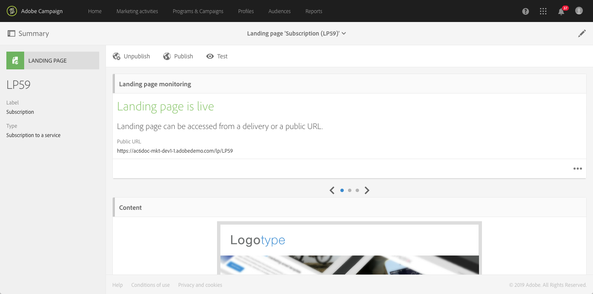

# ランディングページを設定するための主な手順 {#main-steps-create-a-landing-page}

## ランディングページの作成について

ランディングページを設定する際の主な手順は次のとおりです。

このページでは、これらの各手順に関する情報と、詳細についての専用ドキュメントへの参照を示します。

## ランディングページテンプレートの設定 {#configure-the-landing-page-template}

ランディングページを設定する前に、最初の手順は、ニーズに対応したランディングページテンプレートを設定することです。 テンプレートの準備が整うと、それに基づくすべてのランディングページが、必要なパラメーターで事前設定されます。

1. 詳細メニューのAdobe Campaignロゴで、 **[!UICONTROL Resources]** / **[!UICONTROL Templates]** /を選択 **[!UICONTROL Landing page templates]**&#x200B;し、使用するテンプレートを複製します。
1. テンプレートプロパティで、ランディングページに共通する必要のあるすべてのパラメーターを指定します。 例：ターゲットディメンション、識別された訪問者または識別されなかった訪問者のページアクセスパラメーター、訪問者によるフォーム検証に固有のアクション、コンテンツで使用するブランド/ロゴなど。
1. 変更を保存します。

For more on landing page templates, refer to [this section](../../channels/using/about-landing-pages.md).

## ランディングページの作成と設定 {#create-and-configure-the-landing-page}

前の手順で定義したテンプレートから、プログラムまたはキャンペーンに新しいランディングページを作成します。

1. 目的のテンプレートに基づいてランディングページを作成します。
1. ランディングページの一般的なパラメータ（ラベル、説明など）を入力します。
1. その後、ランディングページのダッシュボードにアクセスします。 必要に応じて、ランディングページのプロパティを編集します。 デフォルトでは、プロパティはランディングページテンプレートで設定されたプロパティです。
セキュリティ上の理由とプラットフォームパフォーマンス上の理由から、ランディングページのプロパティに有効期限を設定することを強くお勧めします。 完了すると、ランディングページは選択した日付に自動的に非公開になります。 For more on validity parameters, refer to [this section](../../channels/using/sharing-a-landing-page.md#setting-up-validity-parameters).

   

   >[!NOTE]
   >
   >変更は、編集中のランディングページに対してのみ有効です。 これらの変更を他のランディングページに適用する場合は、専用のテンプレートで実行し、そのテンプレートから他のランディングページを作成できます。

## ランディングページの設計 {#design-the-landing-page}

これで、ランディングページのコンテンツを定義できます。 デフォルトでは、ランディングページには、スクロール矢印を使用してアクセスできる3つのページが含まれています。メインコンテンツページ、確認ページおよびエラーページ。

各ページには、デフォルトで複数のフィールドが設定されています。 必要に応じて、プロパティとマッピングを編集できます。

また、プロファイルが確認ボタンをクリックした場合の動作を設定し、必要に応じてコンテンツをパーソナライズする（画像、パーソナライゼーションフィールドなど）こともできます。 例えば、プロファイルの名をランディングページの確認ページに挿入し、登録に対する感謝の意を表すことができます。

ランディングページのデザインについて詳しくは、この節を参 [照してくださ](../../channels/using/designing-a-landing-page.md)い。

## ランディングページのテスト {#test-the-landing-page}

ランディングページを定義したら、オンラインで利用できる場合の実行方法や動作をシミュレートできます。

>[!CAUTION]
>
>ランディングページのテストは、プロファイルでのみ実行でき、テストプロファイルでは実行できません。 フォームの送信中に、選択したプロファイルのデータが実際に更新されます。 実際のプロファイルの変更を避けるには、偽の顧客プロファイルを使用します。

ランディングページの動作に満足した場合は、ランディングページを公開してオンラインで利用できるようにします。

ランディングページのテスト方法の詳細については、この節を参照 [してください](../../channels/using/sharing-a-landing-page.md#testing-the-landing-page-)。

## ランディングページの公開 {#publish-the-landing-page}

テストが正常に完了したら、ダッシュボードのアクションバーのボタンを使用してラ **[!UICONTROL Publish]** ンディングページを公開できます。 監視ブロックは、パブリケーションの進行状況とステータスを示します。

ランディングページを公開すると、オンラインでアクセスできるようになります。 公開後は、いつでも更新できます。これを行うには、各変更後に再公開する必要があります。 また、ランディングページをいつでも非公開にして、使用できなくすることもできます。

公開したランディングページを使用する準備が整います。 その後、様々なメカニズムを導入して、データベース内の新しいプロファイルを取得したり、既存のプロファイルに関する追加情報を取得したりできます。

ランディングページの投稿の詳細については、この節を参 [照してください](../../channels/using/sharing-a-landing-page.md#publishing-a-landing-page)。
