# 受信 SMS の管理{#managing-incoming-sms}

## Stop SMSの管理 {#managing-stop-sms}

Campaignを介して送信されたSMS メッセージに対してプロファイルが返信する場合、自動的に返信されるメッセージと、実行するアクションを設定できます。

この設定は、[SMS ルーティング外部アカウント ](../../administration/using/configuring-sms-channel.md#defining-an-sms-routing)の&#x200B;**[!UICONTROL Automatic reply sent to the MO]** セクションで定義されています。 MOは「Mobile Originated」を表します。つまり、SMSを送信したモバイルに自動返信を設定できます。

それには、次の手順に従います。

1. 詳細設定メニューから、Adobe Campaign ロゴを使用して、**[!UICONTROL Administration > Application settings > External accounts]**&#x200B;を選択し、**[!UICONTROL SMS routing via SMPP]**&#x200B;外部アカウントを選択します。
1. **[!UICONTROL Automatic reply sent to the MO]** カテゴリで、**[!UICONTROL Create element]**&#x200B;をクリックして、自動返信の設定を開始します。

   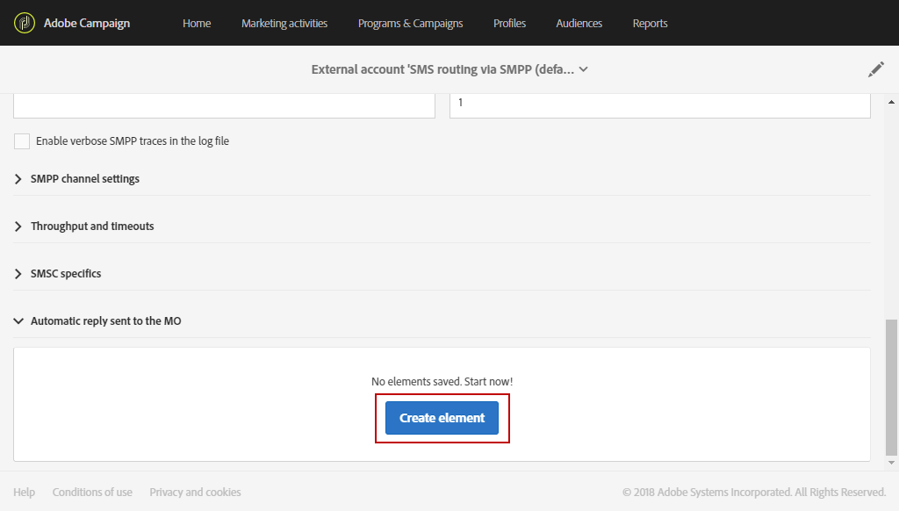

1. この自動返信をトリガーするキーワードを選んでください。 キーワードは大文字と小文字が区別されません。 例えば、受信者が「STOP」というキーワードを送信すると、自動返信が送信されます。

   キーワードが何であっても同じ返信を送信する場合は、この列を空のままにします。

   >[!IMPORTANT]
   >
   >英数字のみ使用できます。

   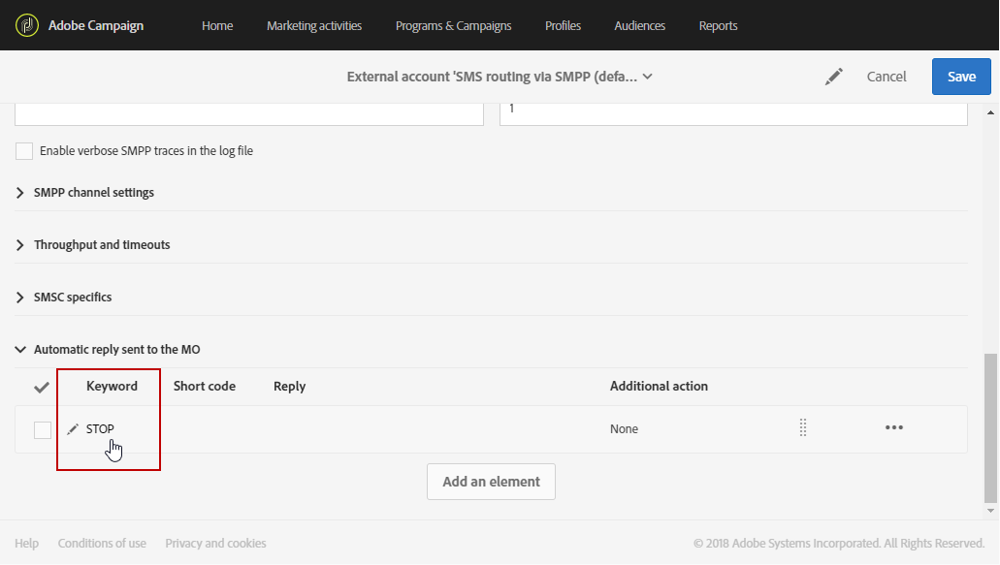

1. 「**[!UICONTROL Short code]**」フィールドに、通常は配信の送信に使用され、送信者名として機能する番号を指定します。 また、**[!UICONTROL Short code]**&#x200B;列を空のままにして、短いコードに関係なく同じ返信を送信することもできます。

   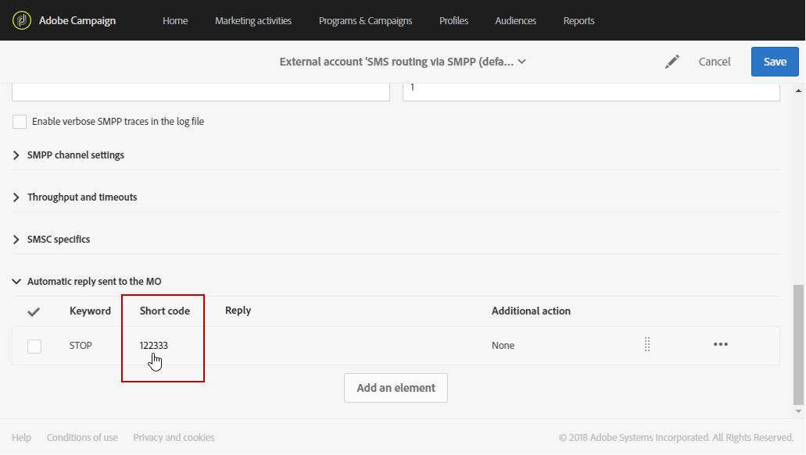

1. 受信者に送信する回答をフィールド **[!UICONTROL Reply]**&#x200B;に入力します。

   返信を送信せずにアクションを実行するには、**[!UICONTROL Reply]**&#x200B;列を空のままにします。 例えば、「STOP」以外のメッセージで返信するユーザーの電話番号を強制隔離から削除できます。

   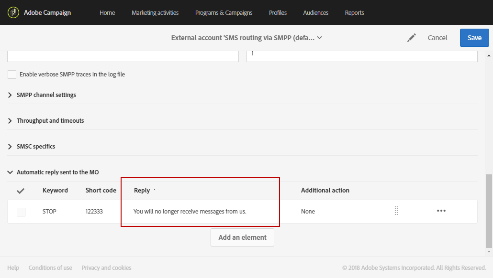

1. **[!UICONTROL Additional action]** フィールドで、アクションを自動返信にリンクします。

   * **[!UICONTROL Send to quarantine]** アクションは、プロファイルの電話番号を自動的に強制隔離します。
   * **[!UICONTROL Remove from quarantine]** アクションにより、プロファイルの電話番号が強制隔離から削除されます。
   * **[!UICONTROL None]** アクションを使用すると、アクションを実行せずに受信者にのみメッセージを送信できます。

   例えば、以下の設定では、受信者が「STOP」というキーワードを送信すると、購読解除の確認が自動的に受信され、電話番号は&#x200B;**[!UICONTROL On denylist]** ステータスの強制隔離に送信されます。 このステータスは電話番号のみを参照し、プロファイルはユーザーが引き続きメールメッセージを受信するようにします。

   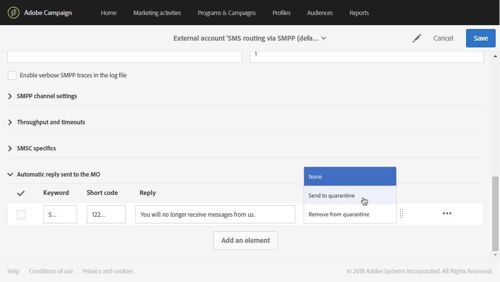

1. 「**[!UICONTROL Save]**」をクリックします。

1. SMS配信&#x200B;**[!UICONTROL Properties]**&#x200B;の&#x200B;**[!UICONTROL Advanced parameters]**&#x200B;から、オプトアウトした受信者を自動的に除外するように、特定の&#x200B;**[!UICONTROL Short code]**&#x200B;を設定できます。 詳しくは、[このセクション ](../../administration/using/configuring-sms-channel.md#configuring-sms-properties)を参照してください。

受信者は、メッセージの購読を自動的に解除し、この自動返信を使用して強制隔離に送信できるようになります。 強制隔離された受信者は、**[!UICONTROL Administration]** > **[!UICONTROL Channels]** > **[!UICONTROL Quarantines]** メニューを通じて利用できる&#x200B;**[!UICONTROL Addresses]** テーブルに一覧表示されます。 強制隔離について詳しくは、この[ セクション ](../../sending/using/understanding-quarantine-management.md)を参照してください。

これらの受信SMSは、必要に応じて保存できます。 詳しくは、この[ セクション ](#storing-incoming-sms)を参照してください。

## 受信SMSの保存 {#storing-incoming-sms}

**[!UICONTROL SMS routing via SMPP]**&#x200B;外部アカウントでは、受信者がSMS メッセージに「STOP」と返信して受信者リストから削除する場合など、受信メッセージを保存するように選択できます。

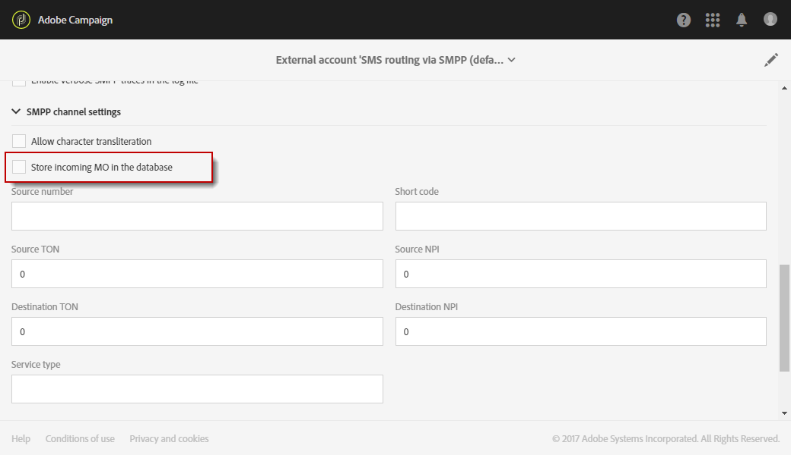

**[!UICONTROL SMPP channel settings]** カテゴリの&#x200B;**[!UICONTROL Store incoming MO in the database]**&#x200B;を確認すると、すべてのSMSはinSMS テーブルに保存され、ワークフローのクエリアクティビティを介して取得できます。

それには、次の手順に従います。

1. **[!UICONTROL SMPP channel settings]** フィールドで、**[!UICONTROL Store incoming MO in the database]**&#x200B;を確認します。

   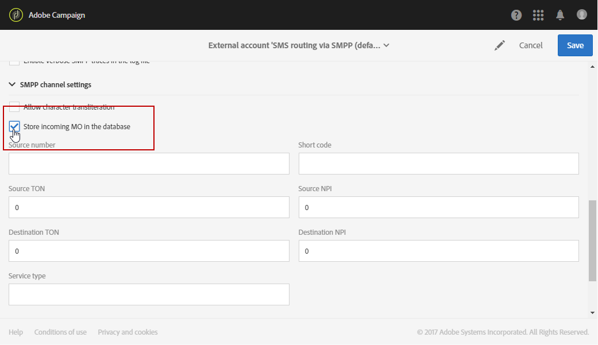

1. 「**[!UICONTROL Marketing activities]**」タブで「**[!UICONTROL Create]**」をクリックし、「**[!UICONTROL Workflow]**」を選択します。

   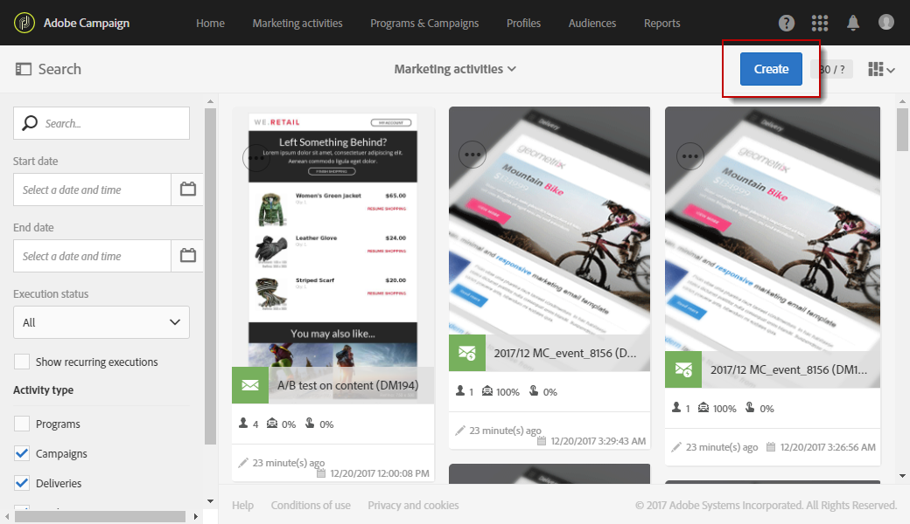

1. ワークフロータイプを選択します。
1. ワークフローのプロパティを編集し、**[!UICONTROL Create]**&#x200B;をクリックします。 ワークフローの作成について詳しくは、この[ セクション ](../../automating/using/building-a-workflow.md)を参照してください。
1. **[!UICONTROL Query]** アクティビティをドラッグ&amp;ドロップし、アクティビティをダブルクリックします。
1. クエリの「**[!UICONTROL Properties]**」タブで、**[!UICONTROL Resource]** フィールドの「**[!UICONTROL Incoming SMS (inSMS)]**」を選択します。

   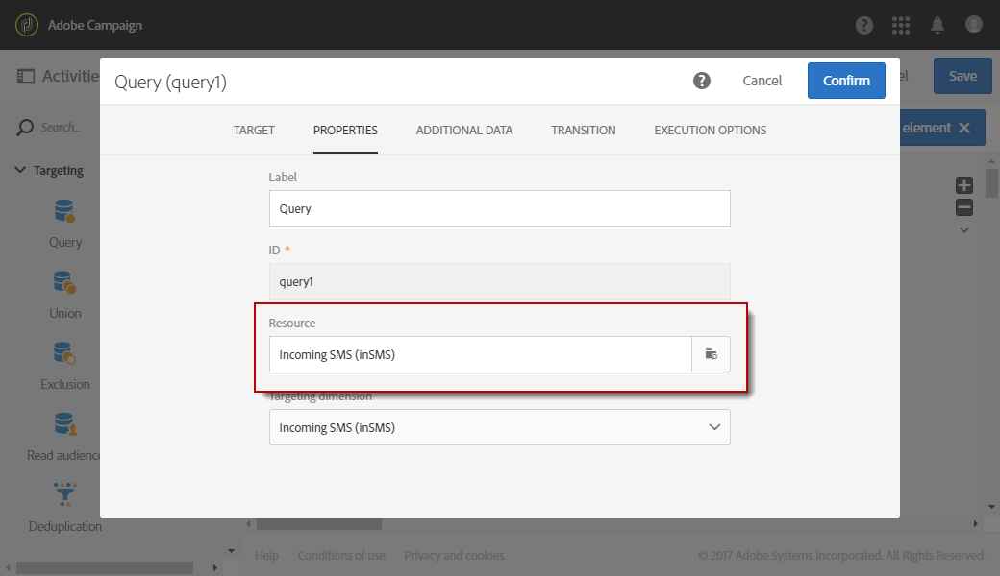

1. 次に、**[!UICONTROL Target]** タブで、**[!UICONTROL Incoming SMS attributes]** ルールをドラッグ&amp;ドロップします。

   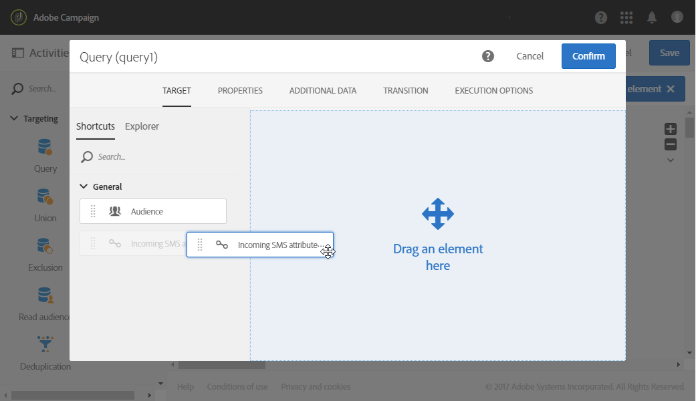

1. ここでは、前日に届いたあらゆるメッセージをターゲットにしたい。 **[!UICONTROL Field]** カテゴリで、**[!UICONTROL Creation date (created)]**&#x200B;を選択します。
1. **[!UICONTROL Filter type]**&#x200B;で「**[!UICONTROL Relative]**」を選択し、**[!UICONTROL Level of precision]**&#x200B;で「**[!UICONTROL Day]**」を選択します。

   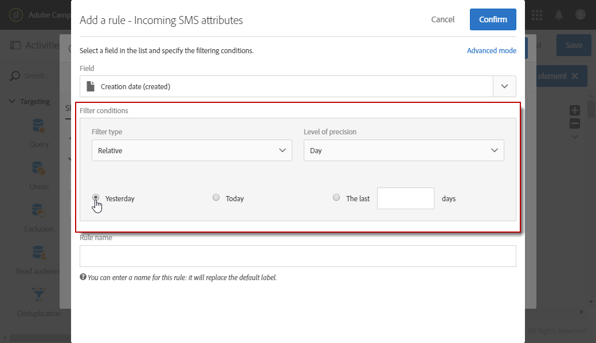

1. 次に、今日、前日、または過去数日間のデータを取得するように選択できます。 クエリが設定されたら、**[!UICONTROL Confirm]**&#x200B;をクリックします。

このクエリは、選択した時間範囲に応じて、受信したすべてのSTOP メッセージを取得します。

このアクティビティを使用すると、例えば母集団を作成し、配信をより適切にパーソナライズできます。
