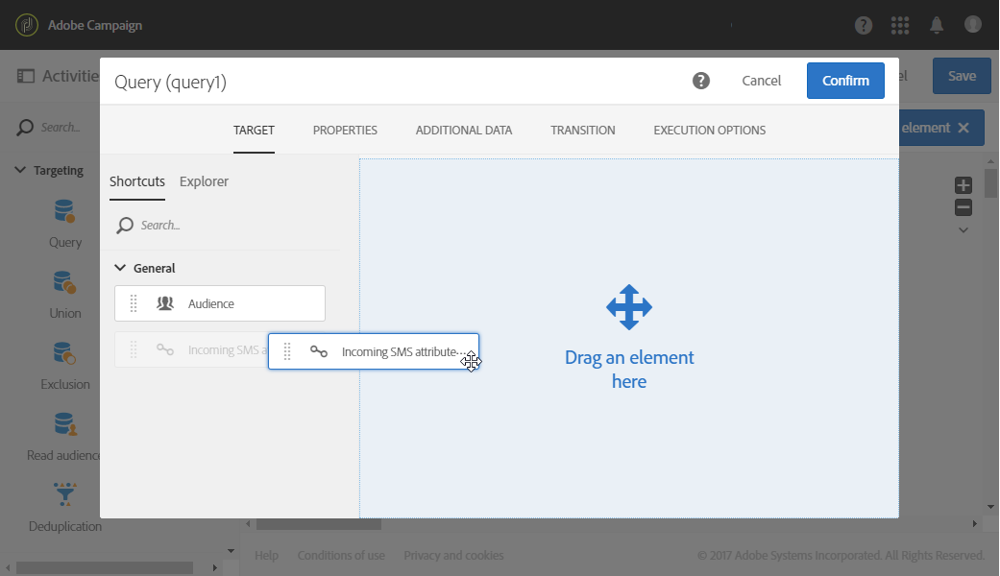

# 受信SMSの管理{#managing-incoming-sms}

## 停止SMSの管理 {#managing-stop-sms}

プロファイルがキャンペーン経由で送信されたSMSメッセージに返信する場合は、自動的に返信されるメッセージや、実行するアクションを設定できます。

この設定は、 **[!UICONTROL Automatic reply sent to the MO]** SMS Routing外部アカウントのセク [ションで](../../administration/using/configuring-sms-channel.md#defining-an-sms-routing)定義されます。 MOは「Mobile Originated」の略で、SMSを送信したモバイルに対する自動応答を設定できます。

これをおこなうには：

1. アドバンスメニューで、Adobe Campaignロゴを使用して、外部アカウ **[!UICONTROL Administration > Application settings > External accounts]** ントを選 **[!UICONTROL SMS routing via SMPP]** 択します。
1. カテゴリの **[!UICONTROL Automatic reply sent to the MO]** 下のをクリックし **[!UICONTROL Create element]** て、自動返信の設定を開始します。

   

1. この自動返信をトリガーするキーワードを選択します。 キーワードは大文字と小文字が区別されません。例えば、ここで受信者がキーワード「STOP」を送信すると、受信者は自動返信を受け取ります。

   キーワードが何であっても同じ返信を送信する場合は、この列を空のままにします。

   

1. このフィ **[!UICONTROL Short code]** ールドで、通常配信の送信に使用され、送信者名として使用される番号を指定します。 また、短いコードが何であっても同じ **[!UICONTROL Short code]** 返信を送信するように、列を空のままにすることもできます。

   

1. 受信者に送信する回答をフィールドに入力します **[!UICONTROL Reply]**。

   To carry out an action without sending a reply, leave the **[!UICONTROL Reply]** column empty. 例えば、「STOP」以外のメッセージで返信するユーザーの電話番号を検疫から削除できます。

   

1. このフィールド **[!UICONTROL Additional action]** で、自動返信にアクションをリンクさせます。

   * この操作 **[!UICONTROL Send to quarantine]** により、プロファイルの電話番号が自動的に検疫されます。
   * この操作 **[!UICONTROL Remove from quarantine]** により、検疫からプロファイルの電話番号が削除されます。
   * このア **[!UICONTROL None]** クションを使用すると、アクションを実行せずに、受信者にのみメッセージを送信できます。
   例えば、以下の設定では、受信者がキーワード「STOP」を送信すると、自動的に購読解除の確認が送信され、その電話番号がステータスの検疫のために送信さ **[!UICONTROL Blacklisted]** れます。 このステータスは電話番号のみを表し、プロファイルはブラックリストに記載されていないので、ユーザーは電子メールメッセージを引き続き受信します。

   

受信者は、自動的にメッセージの購読を解除し、この自動応答を使用して検疫に送信できるようになりました。 検疫済みの受信者は、//メニュ **[!UICONTROL Addresses]** ーで表示される表 **[!UICONTROL Administration]** に一覧 **[!UICONTROL Channels]** 表示され **[!UICONTROL Quarantines]** ます。 For more information on quarantines, refer to this [section](../../sending/using/understanding-quarantine-management.md).

これらの受信SMSは、必要に応じて保存できます。 For more information on this, refer to this [section](#storing-incoming-sms).

## 受信SMSの保存 {#storing-incoming-sms}

外部アカウ **[!UICONTROL SMS routing via SMPP]** ントでは、受信者が受信者リストから削除するためにSMSメッセージに「STOP」と返信する場合など、受信メッセージを保存するように選択できます。

カテゴリ **[!UICONTROL Store incoming MO in the database]** をチェック **[!UICONTROL SMPP channel settings]** すると、すべてのSMSがinSMSテーブルに保存され、ワークフローのクエリアクティビティを通じて取得できます。

これをおこなうには：

1. フィールドで、 **[!UICONTROL SMPP channel settings]** チェックを入れま **[!UICONTROL Store incoming MO in the database]**&#x200B;す。

   

1. タブでをク **[!UICONTROL Marketing activities]** リックし、を **[!UICONTROL Create]** 選択しま **[!UICONTROL Workflow]**&#x200B;す。

   

1. ワークフローのタイプを選択します。
1. ワークフローのプロパティを編集し、をクリックしま **[!UICONTROL Create]**&#x200B;す。 ワークフローの作成について詳しくは、この節を参照して [ください](../../automating/using/building-a-workflow.md)。
1. アクティビティをドラッグ&amp;ドロ **[!UICONTROL Query]** ップし、アクティビティをダブルクリックします。
1. クエリの **[!UICONTROL Properties]** タブで、フィールド内 **[!UICONTROL Incoming SMS (inSMS)]** を選択し **[!UICONTROL Resource]** ます。

   

1. 次に、タブでル **[!UICONTROL Target]** ールをドラッグ&amp;ドロップ **[!UICONTROL Incoming SMS attributes]** します。

   

1. ここでは、前日からのすべての受信メッセージをターゲットにします。 カテゴリ **[!UICONTROL Field]** で、を選択しま **[!UICONTROL Creation date (created)]**&#x200B;す。
1. でを選 **[!UICONTROL Filter type]**&#x200B;択し、でを **[!UICONTROL Relative]** 選択 **[!UICONTROL Level of precision]**&#x200B;してを選択しま **[!UICONTROL Day]**&#x200B;す。

   

1. その後、今日、前日、または最近の数日からデータを取得するように選択できます。 クエリ **[!UICONTROL Confirm]** ーを設定したら、をクリックします。

このクエリは、選択した時間範囲に応じて、受け取ったすべてのSTOPメッセージを取得します。

このアクティビティを使用すると、例えば訪問者を作成し、配信をよりパーソナライズできます。
