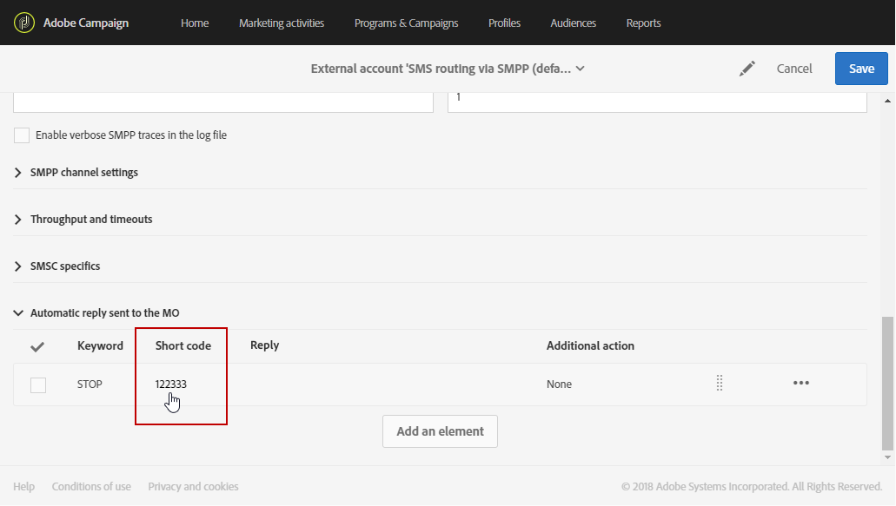

# Managing incoming SMS{#managing-incoming-sms}

## Managing STOP SMS {#managing-stop-sms}

キャンペーンを介して送信されたSMSメッセージにプロファイルを返信すると、実行するアクションと実行するアクションを設定できます。

This configuration is defined in the **[!UICONTROL Automatic reply sent to the MO]** section of the [SMS Routing external account](../../administration/using/configuring-sms-channel.md#defining-an-sms-routing). MOは「モバイル由来」を表し、SMSを送信したモバイルに自動返信を設定できることを意味します。

そのためには、次の手順を実行します。

1. From the advanced menu, via the Adobe Campaign logo, select **[!UICONTROL Administration > Application settings > External accounts]** then the **[!UICONTROL SMS routing via SMPP]** external account.
1. Under the **[!UICONTROL Automatic reply sent to the MO]** category, click **[!UICONTROL Create element]** to start configuring your automatic reply.

   

1. この自動返信をトリガーするキーワードを選択します。キーワードでは大文字と小文字が区別されません。例えば、受信者がキーワード"STOP"を送信すると、自動的に返信が送信されます。

   キーワードが何かにかかわらず、同じ返信を送信する場合は、この列を空のままにします。

   

1. **[!UICONTROL Short code]** フィールドに、配信の送信に通常使用される数値を指定し、送信者名として指定します。You can also decide to leave the **[!UICONTROL Short code]** column empty, to send the same reply no matter what the short code.

   

1. Type in the answer you want to send to your recipients in the field **[!UICONTROL Reply]**.

   To carry out an action without sending a reply, leave the **[!UICONTROL Reply]** column empty. 例えば、"STOP"以外のメッセージと返信するユーザーの電話番号を強制的に隔離できます。

   

1. **[!UICONTROL Additional action]** フィールドで、アクションを自動返信にリンクします。

   * **[!UICONTROL Send to quarantine]** アクションは、プロファイル電話番号を自動的に隔離します。
   * **[!UICONTROL Remove from quarantine]** このアクションによって、プロファイル電話番号が強制隔離から削除されます。
   * **[!UICONTROL None]** アクションを使用すると、アクションを実行せずに、受信者にメッセージを送信できます。
   For example, in the configuration below, if recipients send the keyword "STOP", they will automatically receive an unsubscription confirmation and their phone number will be sent to quarantine with the **[!UICONTROL Blacklisted]** status. このステータスは電話番号のみを指し、プロファイルはブラックリストに記載されておらず、ユーザーは電子メールメッセージの受信を継続します。

   

受信者は自動的にメッセージに登録解除され、この自動返信で強制隔離されるようになります。The quarantined recipients are listed in the **[!UICONTROL Addresses]** table available through the **[!UICONTROL Administration]** &gt; **[!UICONTROL Channels]** &gt; **[!UICONTROL Quarantines]** menu. For more information on quarantines, refer to this [section](../../sending/using/understanding-quarantine-management.md).

これらの着信SMSは、必要に応じて保存できます。For more information on this, refer to this [section](../../channels/using/managing-incoming-sms.md#storing-incoming-sms).

## Storing incoming SMS {#storing-incoming-sms}

**[!UICONTROL SMS routing via SMPP]** 外部アカウントでは、受信者が受信者リストから削除するために、受信者がSMSメッセージに"STOP"を返信したときに、受信メッセージを保存するよう選択できます。

By checking **[!UICONTROL Store incoming MO in the database]** in the **[!UICONTROL SMPP channel settings]** category, all SMS will be stored in the inSMS table and can be retrieved via a query activity in a workflow.

そのためには、次の手順を実行します。

1. **[!UICONTROL SMPP channel settings]** フィールドにチェック **[!UICONTROL Store incoming MO in the database]**&#x200B;マークを付けます。

   

1. **[!UICONTROL Marketing activities]** タブで、をクリック **[!UICONTROL Create]****[!UICONTROL Workflow]**&#x200B;します。

   

1. ワークフローのタイプを選択します。
1. Edit the properties of your workflow, then click **[!UICONTROL Create]**. For more on workflows creation, refer to this [section](../../automating/using/building-a-workflow.md).
1. Drag and drop a **[!UICONTROL Query]** activity and double-click the activity.
1. In the **[!UICONTROL Properties]** tab of the query, choose **[!UICONTROL Incoming SMS (inSMS)]** in the **[!UICONTROL Resource]** field.

   

1. Then, in the **[!UICONTROL Target]** tab, drag and drop the **[!UICONTROL Incoming SMS attributes]** rule.

   

1. ここでは、前の日からの着信メッセージごとにターゲットを設定します。**[!UICONTROL Field]** カテゴリで、を選択 **[!UICONTROL Creation date (created)]**&#x200B;します。
1. In **[!UICONTROL Filter type]**, select **[!UICONTROL Relative]** then in **[!UICONTROL Level of precision]**, choose **[!UICONTROL Day]**.

   

1. その後、今日から数日間前または数日間のデータを取得できます。Click **[!UICONTROL Confirm]** when your query is configured.

このクエリは、選択した期間に応じて受け取ったすべての停止メッセージを取得します。

このアクティビティにより、例えば、訪問者を構築して配信をパーソナライズすることができます。
