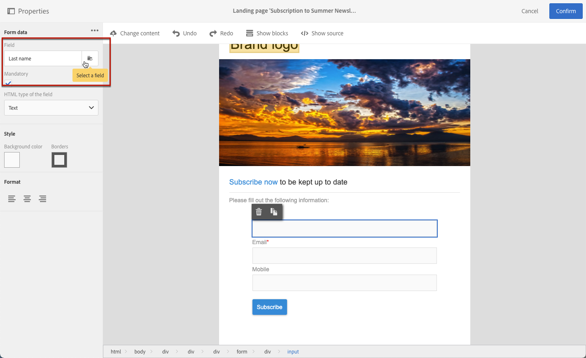
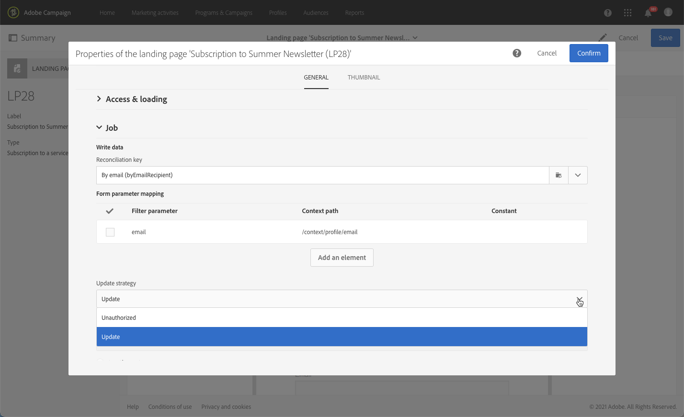
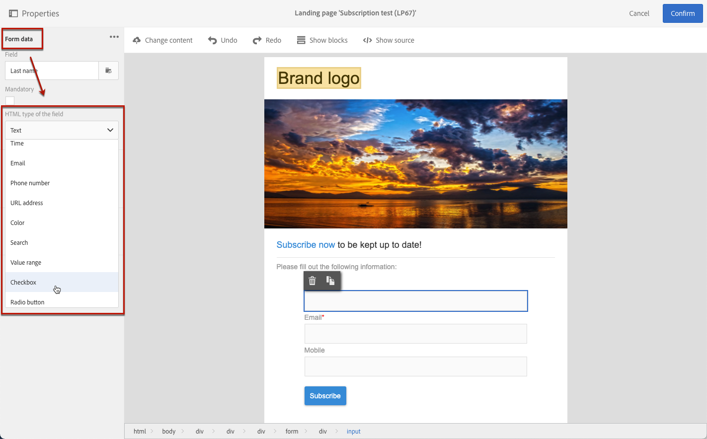
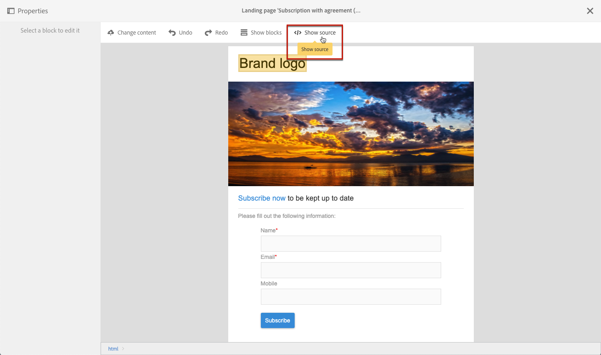
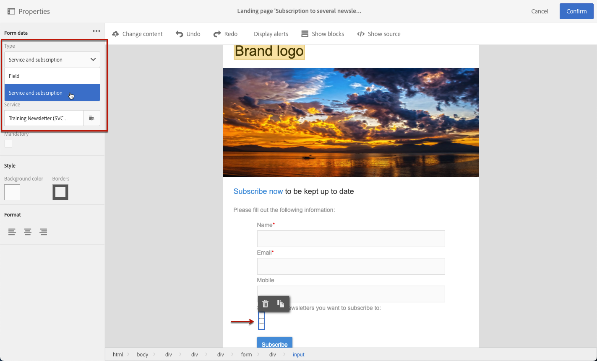
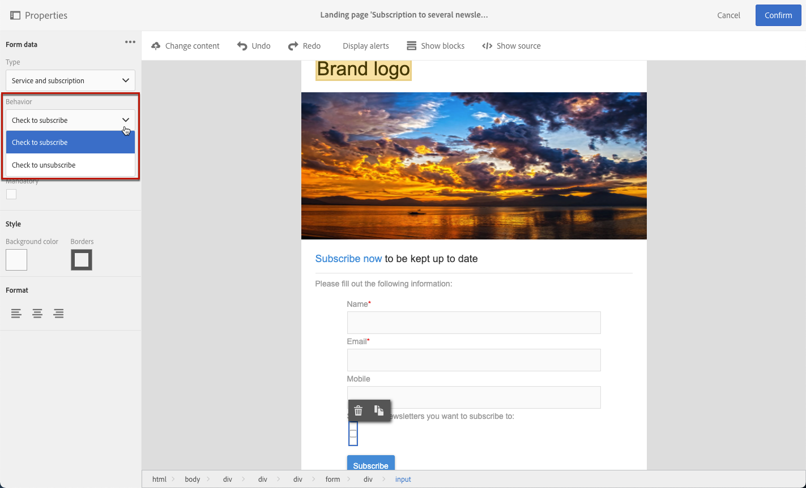
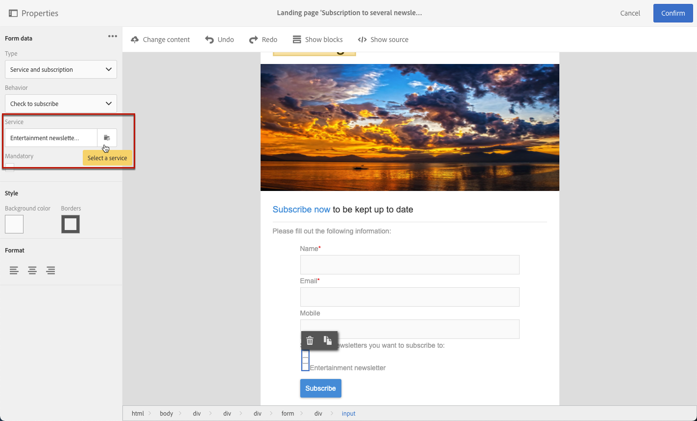
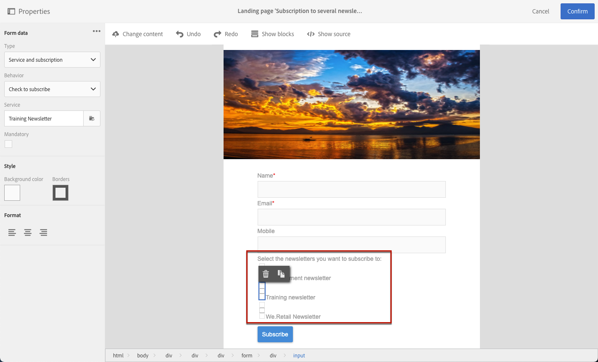
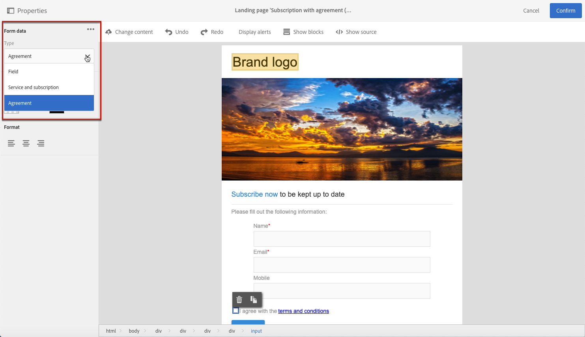
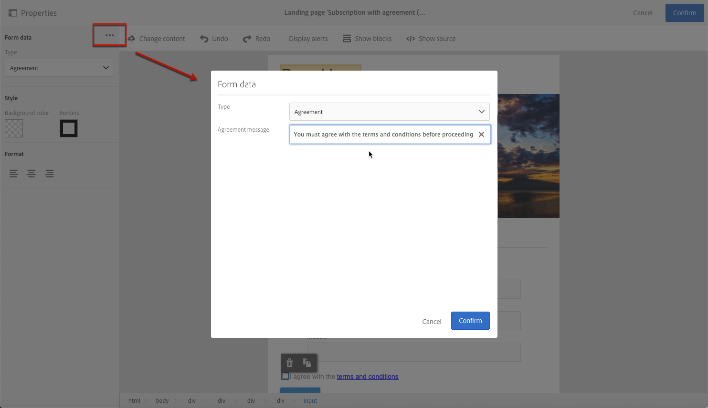

# ランディングページフォームデータの管理{#managing-landing-page-form-data}

ランディングページのコンテンツでは、入力フィールドを使用して、Campaign データベースのデータを保存または更新します。

これを行うには、これらのフィールドをデータベースフィールドにマッピングする必要があります。

マッピングは、左側のパレットの「**[!UICONTROL Form data]**」セクションで定義および管理できます。

## フォームフィールドのマッピング {#mapping-form-fields}

必要に応じてCampaign データベースを更新するには、関連するデータベースフィールドをランディングページの入力ゾーン、ラジオボタン、またはチェックボックスタイプブロックにリンクします。

これを行うには、次の手順に従います。

1. ランディングページのコンテンツでブロックを選択します。

   >[!NOTE]
   >
   >ビルトインのランディングページのデフォルトのフィールドは事前に設定されています。必要に応じて変更できます。

1. 左側のパレットの&#x200B;**[!UICONTROL Form data]** セクションにアクセスします。

1. フィールドタイプを変更するには、**[!UICONTROL HTML type of the field]** ドロップダウンリストから値を選択します。

   

   >[!NOTE]
   >
   >ランディングページでチェックボックスタイプを使用する方法について詳しくは、[複数のサービスのサブスクリプションを更新](#multiple-subscriptions)および[契約書のチェックボックス &#x200B;](#agreement-checkbox)の節を参照してください。

1. 現在&#x200B;**[!UICONTROL Field]** ゾーンで選択されているデータベースフィールドと互換性のないフィールドタイプを選択すると、警告メッセージが表示されます。 最適なマッピングを行うには、適切な値を選択します。

   

1. **[!UICONTROL Field]** ゾーンを使用して、フォームフィールドにリンクするデータベースフィールドを選択します。

   

   >[!NOTE]
   >
   >ランディングページは、**[!UICONTROL Profiles]**&#x200B;または&#x200B;**[!UICONTROL Service]** リソースでのみマッピングできます。

   この例では、ランディングページの&#x200B;**Name** フィールドを&#x200B;**[!UICONTROL Last name]** リソースの&#x200B;**[!UICONTROL Profiles]** フィールドにマッピングします。

   

1. 必要に応じて、「**[!UICONTROL Mandatory]**」オプションを選択します。その場合、ランディングページは、ユーザーがこのフィールドに入力した場合にのみ送信できます。

   

   必須フィールドが未入力の場合、ユーザーがページを送信するとエラーメッセージが表示されます。

1. **[!UICONTROL Confirm]**&#x200B;をクリックして変更を保存します。

<!--If you choose a mandatory **[!UICONTROL Checkbox]**, make sure that it is of **[!UICONTROL Field]** type.-->

## データの保存と調整{#data-storage-and-reconciliation}

データ紐付けパラメーターを使用すると、ランディングページに入力されたデータが送信された後の管理方法を定義できます。

手順は次のとおりです。

1. ランディングページダッシュボードの  アイコンを使用してアクセスするランディングページのプロパティを編集し、「**[!UICONTROL Job]**」パラメーターを表示します。

   

1. 「**[!UICONTROL Reconciliation key]**」を選択します。このデータベースフィールドは、訪問者がAdobe Campaign データベースですでに既知のプロファイルを持っているかどうかを判断するために使用されます。 電子メール、名、姓などの名前を指定できます。 紐付けキーを使用すると、以下に定義する&#x200B;**[!UICONTROL Update strategy]** パラメーターに従って、プロファイルを更新または作成できます。

1. **[!UICONTROL Form parameter mapping]** を定義：このセクションでは、ランディングページフィールドのパラメーターと、紐付けキーで使用するパラメーターをマップできます。

1. **[!UICONTROL Update strategy]**&#x200B;を選択します。紐付けキーが既存のデータベースプロファイルを復元する場合は、このプロファイルをフォームに入力されたデータで更新するか、代わりにこの更新を防止するかを選択できます。

   

## 複数のサービスサブスクリプション {#multiple-subscriptions}

1つのランディングページで複数のチェックボックスを使用して、ユーザーが複数のサービスを購読または購読解除できるようにすることができます。

これを行うには、次の手順に従います。

1. ランディングページのデザイン時：

   * ブロックを選択し、**[!UICONTROL Form data]** セクションから、フィールドタイプとして&#x200B;**[!UICONTROL Checkbox]**&#x200B;を選択します。

     

   * HTMLに精通している場合は、**[!UICONTROL Show source]** ボタンを使用してチェックボックスを手動で挿入することもできます。

     

     これにより、ページ上の任意の場所にチェックボックスを挿入できます。

     

1. コンテンツでチェックボックスが選択されていることを確認します。 **[!UICONTROL Type]** ドロップダウンリストは、左側のパレットの&#x200B;**[!UICONTROL Form data]** セクションに表示されます。 リストから&#x200B;**[!UICONTROL Service and subscription]**&#x200B;を選択します。

   

1. **[!UICONTROL Behavior]** ドロップダウンリストからオプションを選択します。

   

1. 対応するリストから[&#x200B; サービス &#x200B;](../../audiences/using/creating-a-service.md)を選択します。

   

1. 「**[!UICONTROL Mandatory]**」オプションがオフになっていることを確認します。 そうでない場合、ユーザーは選択の余地がありません。

   

1. 他のサービスへの登録を可能にするチェックボックスをさらに追加するには、必要に応じて上記の手順を繰り返します。

   

ランディングページが公開されたら、ユーザーは複数のチェックボックスを選択して、同じページから複数のニュースレターを購読できます。

## 「契約書」チェックボックス {#agreement-checkbox}

ランディングページを送信する前にプロファイルが確認する必要があるチェックボックスを追加できます。

例えば、オーディエンスがフォームを送信する前に、プライバシーポリシーに関する同意を求めたり、利用規約に同意してもらったりできます。

>[!IMPORTANT]
>
>このチェックボックスを選択することは、ユーザーにとって必須です。 選択しない場合、ランディングページを送信することはできません。

このチェックボックスを挿入して設定するには、次の操作を行います。

1. ランディングページのデザイン時：

   * ブロックを選択し、**[!UICONTROL Form data]** セクションから、フィールドタイプとして&#x200B;**[!UICONTROL Checkbox]**&#x200B;を選択します。

     

   * HTMLに精通している場合は、**[!UICONTROL Show source]** ボタンを使用してチェックボックスを手動で挿入することもできます。

     

     <!--
      Manually insert a checkbox, such as in the example below:

      Click **[!UICONTROL Hide source]**.
      -->

1. チェックボックスが選択されていることを確認します。

   

1. **[!UICONTROL Type]** ドロップダウンリストは、左側のパレットの&#x200B;**[!UICONTROL Form data]** セクションに表示されます。 リストから&#x200B;**[!UICONTROL Agreement]**&#x200B;を選択します。

   

   >[!NOTE]
   >
   >**[!UICONTROL Agreement]**&#x200B;要素は、Campaign データベースのフィールドにマッピングされていません。

1. の横にある&#x200B;**[!UICONTROL Form data]** アイコンをクリックして、チェックボックスの詳細プロパティにアクセスします。

1. 必要に応じてメッセージを編集できます。

   

   このテキストは、ユーザーがフォームを送信する前にチェックボックスを選択しない場合、警告として表示されます。

   >[!NOTE]
   >
   >このアクションはデフォルトで必須であり、変更できません。

1. 「**[!UICONTROL Confirm]**」をクリックします。

これで、ランディングページが表示されるたびに、ユーザーはフォームを送信する前にこのチェックボックスを選択する必要があります。 そうでない場合は、警告が表示され、チェックボックスがアクティブになるまでユーザーはフォームを送信できません。