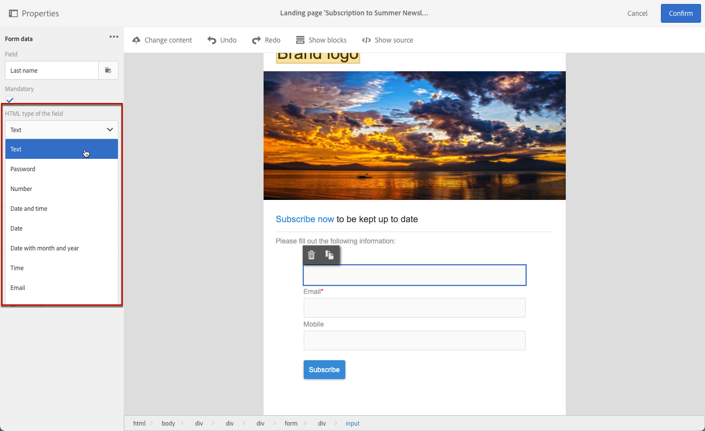

# ランディングページフォームデータの管理{#managing-landing-page-form-data}

ランディングページのコンテンツでは、入力フィールドを使用してCampaignデータベースのデータを保存または更新します。

これをおこなうには、これらのフィールドをデータベースフィールドにマッピングする必要があります。

マッピングの定義と管理は、左側のパレットの&#x200B;**[!UICONTROL Form data]**&#x200B;セクションでおこなえます。

## フォームフィールドのマッピング {#mapping-form-fields}

必要に応じてCampaignデータベースを更新するには、ランディングページの入力ゾーン、ラジオボタンまたはチェックボックスタイプのブロックに、関連するデータベースフィールドをリンクします。

これは、次の手順に従って行います。

1. ランディングページコンテンツのブロックを選択します。

   >[!NOTE]
   >
   >組み込みランディングページのデフォルトのフィールドは事前に設定されています。必要に応じて変更できます。

1. 左側のパレットの&#x200B;**[!UICONTROL Form data]**&#x200B;セクションにアクセスします。

1. フィールドタイプを変更するには、**[!UICONTROL HTML type of the field]**&#x200B;ドロップダウンリストから値を選択します。

   

   >[!NOTE]
   >
   >ランディングページでのチェックボックスタイプの使用について詳しくは、「[複数のサービス購読](#multiple-subscriptions)および[契約チェックボックス](#agreement-checkbox)の更新」の節を参照してください。

1. **[!UICONTROL Field]**&#x200B;ゾーンで現在選択されているデータベースフィールドと互換性のないフィールドタイプを選択すると、警告メッセージが表示されます。 最適なマッピングを行うには、適切な値を選択します。

   

1. **[!UICONTROL Field]**&#x200B;ゾーンを使用して、フォームフィールドにリンクするデータベースフィールドを選択します。

   

   >[!NOTE]
   >
   >ランディングページは、**[!UICONTROL Profiles]**&#x200B;または&#x200B;**[!UICONTROL Service]**&#x200B;リソースとのみマッピングできます。

   この例では、ランディングページの&#x200B;**名前**&#x200B;フィールドを&#x200B;**[!UICONTROL Profiles]**&#x200B;リソースの&#x200B;**[!UICONTROL Last name]**&#x200B;フィールドにマッピングします。

   

1. 必要に応じて、「**[!UICONTROL Mandatory]**」オプションを選択します。その場合、ランディングページは、ユーザーがこのフィールドに入力した場合にのみ送信できます。

   

   必須フィールドに値が入力されていない場合は、ユーザーがページを送信したときにエラーメッセージが表示されます。

1. **[!UICONTROL Confirm]**&#x200B;をクリックして変更を保存します。

<!--If you choose a mandatory **[!UICONTROL Checkbox]**, make sure that it is of **[!UICONTROL Field]** type.-->

## データのストレージと紐付け{#data-storage-and-reconciliation}

データ紐付けパラメーターを使用すると、ランディングページに入力されたデータが送信された後の管理方法を定義できます。

手順は次のとおりです。

1. ランディングページダッシュボードの  アイコンを使用してアクセスするランディングページのプロパティを編集し、「**[!UICONTROL Job]**」パラメーターを表示します。

   

1. **[!UICONTROL Reconciliation key]**&#x200B;を選択します。このデータベースフィールドは、Adobe Campaignデータベース内に訪問者のプロファイルが既に存在するかどうかを判断するために使用されます。 例えば、Eメール、名、姓を指定できます。 紐付けキーを使用すると、以下に定義する&#x200B;**[!UICONTROL Update strategy]**&#x200B;パラメーターに従って、プロファイルを更新または作成できます。

1. **[!UICONTROL Form parameter mapping]** を定義：このセクションでは、ランディングページフィールドのパラメーターと、紐付けキーで使用するパラメーターをマップできます。

1. **[!UICONTROL Update strategy]**&#x200B;を選択します。紐付けキーが既存のデータベースプロファイルを回復した場合、フォームに入力されたデータを使用してこのプロファイルを更新するか、この更新を実行しないかを選択できます。

   

## 複数のサービスサブスクリプション {#multiple-subscriptions}

単一のランディングページで複数のチェックボックスを使用して、ユーザーが複数のサービスを購読または購読解除できるようにします。

これは、次の手順に従って行います。

1. ランディングページをデザインする場合：

   * ブロックを選択し、**[!UICONTROL Form data]**&#x200B;セクションからフィールドタイプとして&#x200B;**[!UICONTROL Checkbox]**&#x200B;を選択します。

      

   * HTMLに詳しい方は、**[!UICONTROL Show source]**&#x200B;ボタンを使用して手動でチェックボックスを挿入することもできます。

      

      これにより、ページ上の任意の場所にチェックボックスを挿入できます。

      

1. コンテンツでチェックボックスが選択されていることを確認します。 **[!UICONTROL Type]**&#x200B;ドロップダウンリストが左側のパレットの&#x200B;**[!UICONTROL Form data]**&#x200B;セクションに表示されます。 リストから&#x200B;**[!UICONTROL Service and subscription]**&#x200B;を選択します。

   

1. **[!UICONTROL Behavior]**&#x200B;ドロップダウンリストからオプションを選択します。

   

1. 対応するリストから[サービス](../../audiences/using/creating-a-service.md)を選択します。

   

1. **[!UICONTROL Mandatory]**&#x200B;オプションがオフになっていることを確認します。 そうしないと、ユーザーは選択肢を持ちません。

   

1. 他のサービスの購読を有効にするチェックボックスをさらに追加するには、上記の手順を必要な回数だけ繰り返します。

   

ランディングページが公開されると、ユーザーは複数のチェックボックスをオンにして、同じページから複数のニュースレターを購読できます。

## 契約チェックボックス {#agreement-checkbox}

ランディングページを送信する前にプロファイルが確認する必要があるチェックボックスを追加できます。

例えば、ユーザーがフォームを送信する前に、プライバシーポリシーに対する同意を要求したり、ユーザーが利用条件を承諾するように設定したりできます。

>[!IMPORTANT]
>
>このチェックボックスの選択は、ユーザーに必須です。 選択しないと、ランディングページを送信できなくなります。

このチェックボックスを挿入して設定するには、次の操作を行います。

1. ランディングページをデザインする場合：

   * ブロックを選択し、**[!UICONTROL Form data]**&#x200B;セクションからフィールドタイプとして&#x200B;**[!UICONTROL Checkbox]**&#x200B;を選択します。

      

   * HTMLに詳しい方は、**[!UICONTROL Show source]**&#x200B;ボタンを使用して手動でチェックボックスを挿入することもできます。

      

      <!--Manually insert a checkbox, such as in the example below:

      <!--Click **[!UICONTROL Hide source]**.-->

1. チェックボックスが選択されていることを確認します。

   

1. **[!UICONTROL Type]**&#x200B;ドロップダウンリストが左側のパレットの&#x200B;**[!UICONTROL Form data]**&#x200B;セクションに表示されます。 リストから&#x200B;**[!UICONTROL Agreement]**&#x200B;を選択します。

   

   >[!NOTE]
   >
   >**[!UICONTROL Agreement]**&#x200B;要素がCampaignデータベースのフィールドにマッピングされていません。

1. **[!UICONTROL Form data]**&#x200B;の横にあるアイコンをクリックして、チェックボックスの詳細設定プロパティにアクセスします。

1. 必要に応じて、メッセージを編集できます。

   

   このテキストは、ユーザーがフォームを送信する前にチェックボックスを選択していない場合に、警告として表示されます。

   >[!NOTE]
   >
   >このアクションはデフォルトで必須で、変更できません。

1. 「**[!UICONTROL Confirm]**」をクリックします。

これで、ランディングページが表示されるたびに、フォームを送信する前に、このチェックボックスをオンにする必要があります。 そうでない場合、警告が表示され、チェックボックスが有効になるまでフォームを送信できません。